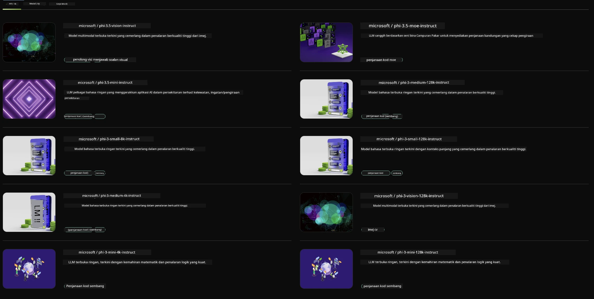

<!--
CO_OP_TRANSLATOR_METADATA:
{
  "original_hash": "7b08e277df2a9307f861ae54bc30c772",
  "translation_date": "2025-07-16T19:38:37+00:00",
  "source_file": "md/01.Introduction/02/06.NVIDIA.md",
  "language_code": "ms"
}
-->
## Keluarga Phi dalam NVIDIA NIM

NVIDIA NIM adalah satu set mikroservis yang mudah digunakan yang direka untuk mempercepatkan penyebaran model AI generatif merentasi awan, pusat data, dan stesen kerja. NIM dikategorikan mengikut keluarga model dan berdasarkan setiap model. Contohnya, NVIDIA NIM untuk model bahasa besar (LLM) membawa kuasa model LLM terkini ke aplikasi perusahaan, menyediakan keupayaan pemprosesan dan pemahaman bahasa semula jadi yang tiada tandingan.

NIM memudahkan pasukan IT dan DevOps untuk menghoskan sendiri model bahasa besar (LLM) dalam persekitaran yang mereka uruskan sambil masih menyediakan pembangun dengan API standard industri yang membolehkan mereka membina copilots, chatbot, dan pembantu AI yang berkuasa yang boleh mengubah perniagaan mereka. Dengan memanfaatkan pecutan GPU terkini dari NVIDIA dan penyebaran yang boleh diskalakan, NIM menawarkan laluan terpantas ke inferens dengan prestasi yang tiada tandingan.

Anda boleh menggunakan NVIDIA NIM untuk inferens Model Keluarga Phi



### **Contoh - Phi-3-Vision dalam NVIDIA NIM**

Bayangkan anda mempunyai imej (`demo.png`) dan anda ingin menjana kod Python yang memproses imej ini dan menyimpan versi baru daripadanya (`phi-3-vision.jpg`).

Kod di atas mengautomasikan proses ini dengan:

1. Menyediakan persekitaran dan konfigurasi yang diperlukan.
2. Membuat arahan (prompt) yang mengarahkan model untuk menjana kod Python yang diperlukan.
3. Menghantar arahan kepada model dan mengumpul kod yang dijana.
4. Mengekstrak dan menjalankan kod yang dijana.
5. Memaparkan imej asal dan imej yang telah diproses.

Pendekatan ini memanfaatkan kuasa AI untuk mengautomasikan tugasan pemprosesan imej, menjadikannya lebih mudah dan pantas untuk mencapai matlamat anda.

[Contoh Penyelesaian Kod](../../../../../code/06.E2E/E2E_Nvidia_NIM_Phi3_Vision.ipynb)

Mari kita huraikan apa yang dilakukan oleh keseluruhan kod langkah demi langkah:

1. **Pasang Pakej Diperlukan**:
    ```python
    !pip install langchain_nvidia_ai_endpoints -U
    ```  
    Arahan ini memasang pakej `langchain_nvidia_ai_endpoints`, memastikan ia versi terkini.

2. **Import Modul Diperlukan**:
    ```python
    from langchain_nvidia_ai_endpoints import ChatNVIDIA
    import getpass
    import os
    import base64
    ```  
    Import ini membawa masuk modul yang diperlukan untuk berinteraksi dengan titik akhir AI NVIDIA, mengendalikan kata laluan dengan selamat, berinteraksi dengan sistem operasi, dan mengekod/mendekod data dalam format base64.

3. **Sediakan Kunci API**:
    ```python
    if not os.getenv("NVIDIA_API_KEY"):
        os.environ["NVIDIA_API_KEY"] = getpass.getpass("Enter your NVIDIA API key: ")
    ```  
    Kod ini memeriksa sama ada pembolehubah persekitaran `NVIDIA_API_KEY` telah ditetapkan. Jika tidak, ia meminta pengguna memasukkan kunci API mereka dengan selamat.

4. **Tentukan Model dan Laluan Imej**:
    ```python
    model = 'microsoft/phi-3-vision-128k-instruct'
    chat = ChatNVIDIA(model=model)
    img_path = './imgs/demo.png'
    ```  
    Ini menetapkan model yang akan digunakan, mencipta instans `ChatNVIDIA` dengan model yang ditetapkan, dan menentukan laluan ke fail imej.

5. **Buat Arahan Teks**:
    ```python
    text = "Please create Python code for image, and use plt to save the new picture under imgs/ and name it phi-3-vision.jpg."
    ```  
    Ini mentakrifkan arahan teks yang mengarahkan model untuk menjana kod Python bagi memproses imej.

6. **Ngekod Imej dalam Base64**:
    ```python
    with open(img_path, "rb") as f:
        image_b64 = base64.b64encode(f.read()).decode()
    image = f''
    ```  
    Kod ini membaca fail imej, mengekodnya dalam base64, dan mencipta tag imej HTML dengan data yang telah dienkod.

7. **Gabungkan Teks dan Imej ke dalam Arahan**:
    ```python
    prompt = f"{text} {image}"
    ```  
    Ini menggabungkan arahan teks dan tag imej HTML ke dalam satu rentetan.

8. **Jana Kod Menggunakan ChatNVIDIA**:
    ```python
    code = ""
    for chunk in chat.stream(prompt):
        print(chunk.content, end="")
        code += chunk.content
    ```  
    Kod ini menghantar arahan kepada model `ChatNVIDIA` dan mengumpul kod yang dijana secara berperingkat, mencetak dan menambah setiap bahagian ke dalam rentetan `code`.

9. **Ekstrak Kod Python dari Kandungan yang Dijana**:
    ```python
    begin = code.index('```python') + 9  
    code = code[begin:]  
    end = code.index('```')
    code = code[:end]
    ```  
    Ini mengekstrak kod Python sebenar daripada kandungan yang dijana dengan membuang format markdown.

10. **Jalankan Kod yang Dijana**:
    ```python
    import subprocess
    result = subprocess.run(["python", "-c", code], capture_output=True)
    ```  
    Ini menjalankan kod Python yang diekstrak sebagai proses anak dan menangkap outputnya.

11. **Paparkan Imej**:
    ```python
    from IPython.display import Image, display
    display(Image(filename='./imgs/phi-3-vision.jpg'))
    display(Image(filename='./imgs/demo.png'))
    ```  
    Baris ini memaparkan imej menggunakan modul `IPython.display`.

**Penafian**:  
Dokumen ini telah diterjemahkan menggunakan perkhidmatan terjemahan AI [Co-op Translator](https://github.com/Azure/co-op-translator). Walaupun kami berusaha untuk ketepatan, sila ambil maklum bahawa terjemahan automatik mungkin mengandungi kesilapan atau ketidaktepatan. Dokumen asal dalam bahasa asalnya harus dianggap sebagai sumber yang sahih. Untuk maklumat penting, terjemahan profesional oleh manusia adalah disyorkan. Kami tidak bertanggungjawab atas sebarang salah faham atau salah tafsir yang timbul daripada penggunaan terjemahan ini.