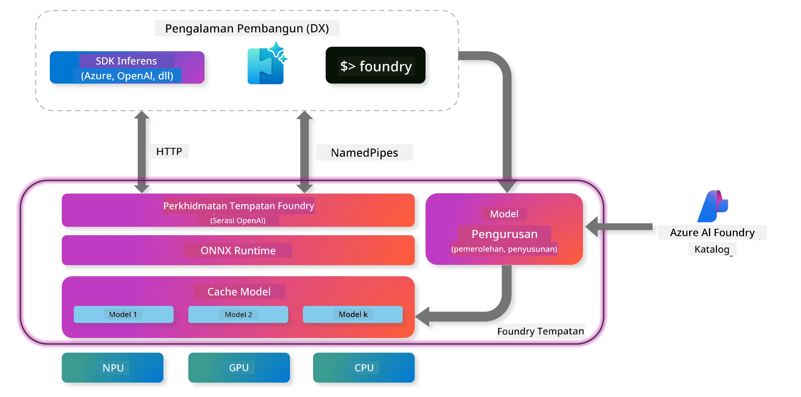
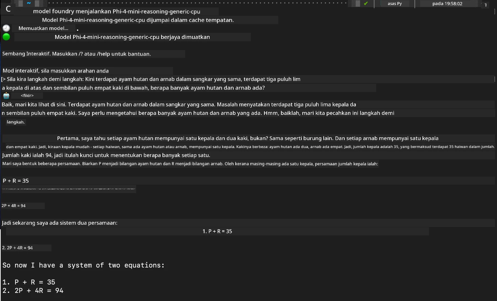

## Memulakan dengan Model Phi-Family dalam Foundry Local

### Pengenalan kepada Foundry Local

Foundry Local adalah penyelesaian inferens AI yang berkuasa terus pada peranti, membawa keupayaan AI setaraf perusahaan terus ke perkakasan tempatan anda. Tutorial ini akan membimbing anda dalam menyediakan dan menggunakan model Phi-Family dengan Foundry Local, memberikan kawalan penuh ke atas beban kerja AI anda sambil mengekalkan privasi dan mengurangkan kos.

Foundry Local menawarkan kelebihan dari segi prestasi, privasi, penyesuaian, dan kos dengan menjalankan model AI secara tempatan pada peranti anda. Ia berintegrasi dengan lancar ke dalam aliran kerja dan aplikasi sedia ada melalui CLI, SDK, dan REST API yang intuitif.




### Kenapa Memilih Foundry Local?

Memahami manfaat Foundry Local akan membantu anda membuat keputusan yang tepat mengenai strategi pelaksanaan AI anda:

- **Inferens Pada Peranti:** Jalankan model secara tempatan pada perkakasan anda sendiri, mengurangkan kos sambil memastikan semua data kekal pada peranti anda.

- **Penyesuaian Model:** Pilih daripada model sedia ada atau gunakan model anda sendiri untuk memenuhi keperluan dan kes penggunaan tertentu.

- **Kecekapan Kos:** Hilangkan kos perkhidmatan awan berulang dengan menggunakan perkakasan sedia ada, menjadikan AI lebih mudah diakses.

- **Integrasi Lancar:** Sambungkan dengan aplikasi anda melalui SDK, titik akhir API, atau CLI, dengan kemudahan skala ke Azure AI Foundry apabila keperluan anda berkembang.

> **Nota Memulakan:** Tutorial ini memfokuskan pada penggunaan Foundry Local melalui antara muka CLI dan SDK. Anda akan mempelajari kedua-dua pendekatan untuk membantu memilih kaedah terbaik bagi kes penggunaan anda.

## Bahagian 1: Menyediakan Foundry Local CLI

### Langkah 1: Pemasangan

Foundry Local CLI adalah pintu masuk anda untuk mengurus dan menjalankan model AI secara tempatan. Mari mulakan dengan memasangnya pada sistem anda.

**Platform Disokong:** Windows dan macOS

Untuk arahan pemasangan terperinci, sila rujuk [dokumentasi rasmi Foundry Local](https://github.com/microsoft/Foundry-Local/blob/main/README.md).

### Langkah 2: Meneroka Model Tersedia

Setelah Foundry Local CLI dipasang, anda boleh mengetahui model apa yang tersedia untuk kes penggunaan anda. Perintah ini akan menunjukkan semua model yang disokong:


```bash
foundry model list
```

### Langkah 3: Memahami Model Phi Family

Phi Family menawarkan pelbagai model yang dioptimumkan untuk pelbagai kes penggunaan dan konfigurasi perkakasan. Berikut adalah model Phi yang tersedia dalam Foundry Local:

**Model Phi Tersedia:** 

- **phi-3.5-mini** - Model kompak untuk tugasan asas
- **phi-3-mini-128k** - Versi konteks lanjutan untuk perbualan lebih panjang
- **phi-3-mini-4k** - Model konteks standard untuk kegunaan umum
- **phi-4** - Model maju dengan keupayaan yang dipertingkatkan
- **phi-4-mini** - Versi ringan bagi Phi-4
- **phi-4-mini-reasoning** - Khusus untuk tugasan penaakulan kompleks

> **Keserasian Perkakasan:** Setiap model boleh dikonfigurasikan untuk pecutan perkakasan berbeza (CPU, GPU) bergantung pada keupayaan sistem anda.

### Langkah 4: Menjalankan Model Phi Pertama Anda

Mari mulakan dengan contoh praktikal. Kita akan menjalankan model `phi-4-mini-reasoning`, yang cemerlang dalam menyelesaikan masalah kompleks secara langkah demi langkah.


**Perintah untuk menjalankan model:**

```bash
foundry model run Phi-4-mini-reasoning-generic-cpu
```

> **Persediaan Kali Pertama:** Apabila menjalankan model buat kali pertama, Foundry Local akan memuat turun model tersebut ke peranti tempatan anda secara automatik. Masa muat turun bergantung pada kelajuan rangkaian anda, jadi harap bersabar semasa persediaan awal.

### Langkah 5: Menguji Model dengan Masalah Sebenar

Sekarang mari uji model kita dengan masalah logik klasik untuk melihat bagaimana ia melaksanakan penaakulan langkah demi langkah:

**Contoh Masalah:**

```txt
Please calculate the following step by step: Now there are pheasants and rabbits in the same cage, there are thirty-five heads on top and ninety-four legs on the bottom, how many pheasants and rabbits are there?
```

**Tingkah Laku Dijangka:** Model sepatutnya memecahkan masalah ini kepada langkah logik, menggunakan fakta bahawa pheasant mempunyai 2 kaki dan arnab mempunyai 4 kaki untuk menyelesaikan sistem persamaan.

**Keputusan:**



## Bahagian 2: Membangun Aplikasi dengan Foundry Local SDK

### Kenapa Menggunakan SDK?

Walaupun CLI sesuai untuk ujian dan interaksi pantas, SDK membolehkan anda mengintegrasikan Foundry Local ke dalam aplikasi anda secara programatik. Ini membuka peluang untuk:

- Membangun aplikasi berkuasa AI tersuai
- Mewujudkan aliran kerja automatik
- Mengintegrasikan keupayaan AI ke dalam sistem sedia ada
- Membangunkan chatbot dan alat interaktif

### Bahasa Pengaturcaraan Disokong

Foundry Local menyediakan sokongan SDK untuk pelbagai bahasa pengaturcaraan mengikut keselesaan pembangunan anda:

**📦 SDK Tersedia:**

- **C# (.NET):** [Dokumentasi & Contoh SDK](https://github.com/microsoft/Foundry-Local/tree/main/sdk/cs)
- **Python:** [Dokumentasi & Contoh SDK](https://github.com/microsoft/Foundry-Local/tree/main/sdk/python)
- **JavaScript:** [Dokumentasi & Contoh SDK](https://github.com/microsoft/Foundry-Local/tree/main/sdk/js)
- **Rust:** [Dokumentasi & Contoh SDK](https://github.com/microsoft/Foundry-Local/tree/main/sdk/rust)

### Langkah Seterusnya

1. **Pilih SDK pilihan anda** berdasarkan persekitaran pembangunan
2. **Ikuti dokumentasi khusus SDK** untuk panduan pelaksanaan terperinci
3. **Mulakan dengan contoh mudah** sebelum membina aplikasi kompleks
4. **Terokai kod contoh** yang disediakan dalam setiap repositori SDK

## Kesimpulan

Anda kini telah mempelajari cara untuk:
- ✅ Memasang dan menyediakan Foundry Local CLI
- ✅ Meneroka dan menjalankan model Phi Family
- ✅ Menguji model dengan masalah dunia sebenar
- ✅ Memahami pilihan SDK untuk pembangunan aplikasi

Foundry Local menyediakan asas yang kukuh untuk membawa keupayaan AI terus ke persekitaran tempatan anda, memberikan kawalan ke atas prestasi, privasi, dan kos sambil mengekalkan fleksibiliti untuk skala ke penyelesaian awan apabila diperlukan.

**Penafian**:  
Dokumen ini telah diterjemahkan menggunakan perkhidmatan terjemahan AI [Co-op Translator](https://github.com/Azure/co-op-translator). Walaupun kami berusaha untuk ketepatan, sila ambil perhatian bahawa terjemahan automatik mungkin mengandungi kesilapan atau ketidaktepatan. Dokumen asal dalam bahasa asalnya harus dianggap sebagai sumber yang sahih. Untuk maklumat penting, terjemahan profesional oleh manusia adalah disyorkan. Kami tidak bertanggungjawab atas sebarang salah faham atau salah tafsir yang timbul daripada penggunaan terjemahan ini.