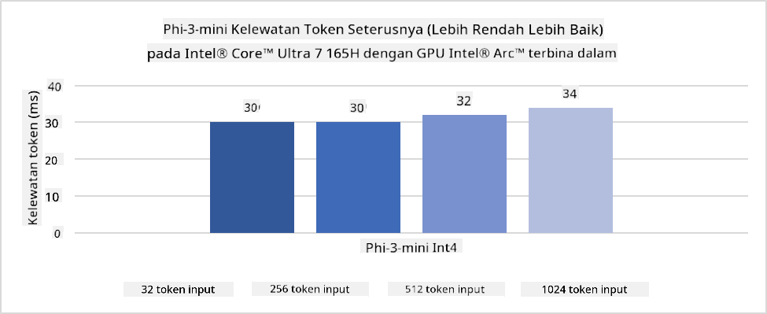
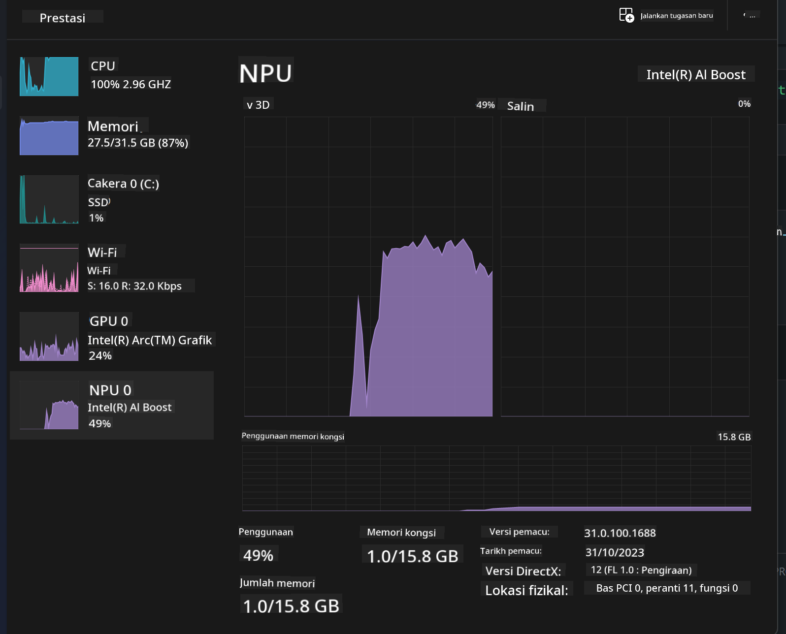
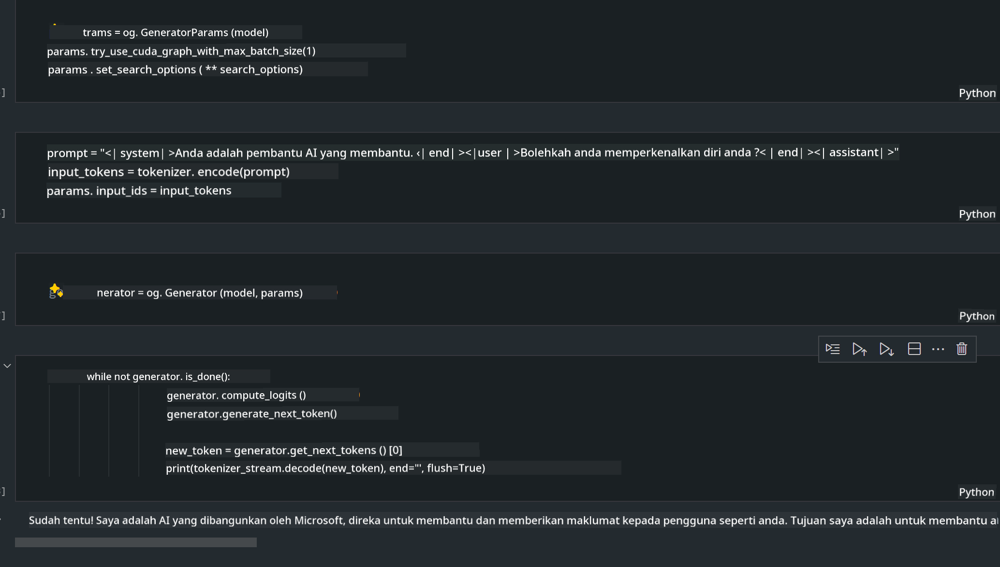
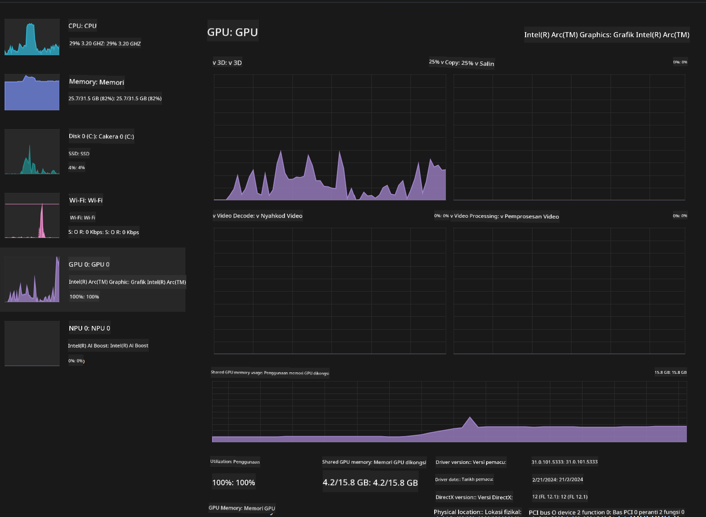

<!--
CO_OP_TRANSLATOR_METADATA:
{
  "original_hash": "e08ce816e23ad813244a09ca34ebb8ac",
  "translation_date": "2025-07-16T20:05:16+00:00",
  "source_file": "md/01.Introduction/03/AIPC_Inference.md",
  "language_code": "ms"
}
-->
# **Inferens Phi-3 dalam AI PC**

Dengan kemajuan AI generatif dan peningkatan keupayaan perkakasan peranti edge, semakin banyak model AI generatif kini boleh diintegrasikan ke dalam peranti Bring Your Own Device (BYOD) pengguna. AI PC adalah antara model-model ini. Bermula pada tahun 2024, Intel, AMD, dan Qualcomm telah bekerjasama dengan pengeluar PC untuk memperkenalkan AI PC yang memudahkan penyebaran model AI generatif tempatan melalui pengubahsuaian perkakasan. Dalam perbincangan ini, kita akan fokus pada Intel AI PC dan meneroka cara untuk menyebarkan Phi-3 pada Intel AI PC.

### Apa itu NPU

NPU (Neural Processing Unit) adalah pemproses khusus atau unit pemprosesan dalam SoC yang lebih besar yang direka khas untuk mempercepatkan operasi rangkaian neural dan tugasan AI. Berbeza dengan CPU dan GPU am, NPU dioptimumkan untuk pengkomputeran selari berasaskan data, menjadikannya sangat cekap dalam memproses data multimedia besar seperti video dan imej serta memproses data untuk rangkaian neural. Ia sangat mahir dalam mengendalikan tugasan berkaitan AI, seperti pengecaman suara, kabur latar belakang dalam panggilan video, dan proses penyuntingan foto atau video seperti pengesanan objek.

## NPU vs GPU

Walaupun banyak beban kerja AI dan pembelajaran mesin dijalankan pada GPU, terdapat perbezaan penting antara GPU dan NPU.  
GPU terkenal dengan keupayaan pengkomputeran selari mereka, tetapi tidak semua GPU sama cekap dalam memproses selain grafik. Sebaliknya, NPU dibina khusus untuk pengiraan kompleks yang terlibat dalam operasi rangkaian neural, menjadikannya sangat berkesan untuk tugasan AI.

Secara ringkas, NPU adalah pakar matematik yang mempercepatkan pengiraan AI, dan mereka memainkan peranan penting dalam era AI PC yang sedang muncul!

***Contoh ini berdasarkan Pemproses Intel Core Ultra terkini dari Intel***

## **1. Gunakan NPU untuk menjalankan model Phi-3**

Peranti Intel® NPU adalah pemecut inferens AI yang diintegrasikan dengan CPU klien Intel, bermula dari generasi CPU Intel® Core™ Ultra (dahulunya dikenali sebagai Meteor Lake). Ia membolehkan pelaksanaan tugas rangkaian neural buatan dengan cekap tenaga.




**Perpustakaan Pemecutan Intel NPU**

Perpustakaan Pemecutan Intel NPU [https://github.com/intel/intel-npu-acceleration-library](https://github.com/intel/intel-npu-acceleration-library) adalah perpustakaan Python yang direka untuk meningkatkan kecekapan aplikasi anda dengan memanfaatkan kuasa Intel Neural Processing Unit (NPU) untuk melakukan pengiraan berkelajuan tinggi pada perkakasan yang serasi.

Contoh Phi-3-mini pada AI PC yang dikuasakan oleh pemproses Intel® Core™ Ultra.


Pasang Perpustakaan Python menggunakan pip

```bash

   pip install intel-npu-acceleration-library

```

***Nota*** Projek ini masih dalam pembangunan, tetapi model rujukan sudah sangat lengkap.

### **Menjalankan Phi-3 dengan Perpustakaan Pemecutan Intel NPU**

Dengan menggunakan pemecutan Intel NPU, perpustakaan ini tidak menjejaskan proses pengekodan tradisional. Anda hanya perlu menggunakan perpustakaan ini untuk mengkuantifikasi model Phi-3 asal, seperti FP16, INT8, INT4, contohnya

```python
from transformers import AutoTokenizer, pipeline,TextStreamer
from intel_npu_acceleration_library import NPUModelForCausalLM, int4
from intel_npu_acceleration_library.compiler import CompilerConfig
import warnings

model_id = "microsoft/Phi-3-mini-4k-instruct"

compiler_conf = CompilerConfig(dtype=int4)
model = NPUModelForCausalLM.from_pretrained(
    model_id, use_cache=True, config=compiler_conf, attn_implementation="sdpa"
).eval()

tokenizer = AutoTokenizer.from_pretrained(model_id)

text_streamer = TextStreamer(tokenizer, skip_prompt=True)
```

Setelah kuantifikasi berjaya, teruskan pelaksanaan untuk memanggil NPU menjalankan model Phi-3.

```python
generation_args = {
   "max_new_tokens": 1024,
   "return_full_text": False,
   "temperature": 0.3,
   "do_sample": False,
   "streamer": text_streamer,
}

pipe = pipeline(
   "text-generation",
   model=model,
   tokenizer=tokenizer,
)

query = "<|system|>You are a helpful AI assistant.<|end|><|user|>Can you introduce yourself?<|end|><|assistant|>"

with warnings.catch_warnings():
    warnings.simplefilter("ignore")
    pipe(query, **generation_args)
```

Semasa menjalankan kod, kita boleh melihat status operasi NPU melalui Pengurus Tugas



***Contoh*** : [AIPC_NPU_DEMO.ipynb](../../../../../code/03.Inference/AIPC/AIPC_NPU_DEMO.ipynb)

## **2. Gunakan DirectML + ONNX Runtime untuk menjalankan Model Phi-3**

### **Apa itu DirectML**

[DirectML](https://github.com/microsoft/DirectML) adalah perpustakaan DirectX 12 berprestasi tinggi yang dipercepatkan oleh perkakasan untuk pembelajaran mesin. DirectML menyediakan pemecutan GPU untuk tugasan pembelajaran mesin biasa merentasi pelbagai perkakasan dan pemacu yang disokong, termasuk semua GPU yang menyokong DirectX 12 dari vendor seperti AMD, Intel, NVIDIA, dan Qualcomm.

Apabila digunakan secara berdiri sendiri, API DirectML adalah perpustakaan DirectX 12 tahap rendah dan sesuai untuk aplikasi berprestasi tinggi dan latensi rendah seperti rangka kerja, permainan, dan aplikasi masa nyata lain. Interoperabiliti lancar DirectML dengan Direct3D 12 serta overhead rendah dan kesesuaian merentasi perkakasan menjadikan DirectML ideal untuk mempercepat pembelajaran mesin apabila prestasi tinggi diingini, dan kebolehpercayaan serta kebolehramalan keputusan merentasi perkakasan adalah kritikal.

***Nota*** : DirectML terkini sudah menyokong NPU (https://devblogs.microsoft.com/directx/introducing-neural-processor-unit-npu-support-in-directml-developer-preview/)

### DirectML dan CUDA dari segi keupayaan dan prestasi:

**DirectML** adalah perpustakaan pembelajaran mesin yang dibangunkan oleh Microsoft. Ia direka untuk mempercepat beban kerja pembelajaran mesin pada peranti Windows, termasuk desktop, komputer riba, dan peranti edge.  
- Berasaskan DX12: DirectML dibina di atas DirectX 12 (DX12), yang menyediakan sokongan perkakasan yang luas merentasi GPU, termasuk NVIDIA dan AMD.  
- Sokongan Lebih Luas: Oleh kerana menggunakan DX12, DirectML boleh berfungsi dengan mana-mana GPU yang menyokong DX12, termasuk GPU terintegrasi.  
- Pemprosesan Imej: DirectML memproses imej dan data lain menggunakan rangkaian neural, sesuai untuk tugasan seperti pengecaman imej, pengesanan objek, dan lain-lain.  
- Mudah Dipasang: Pemasangan DirectML mudah dan tidak memerlukan SDK atau perpustakaan khusus dari pengeluar GPU.  
- Prestasi: Dalam beberapa kes, DirectML berprestasi baik dan boleh lebih pantas daripada CUDA, terutamanya untuk beban kerja tertentu.  
- Had: Namun, terdapat situasi di mana DirectML mungkin lebih perlahan, terutamanya untuk saiz batch besar float16.

**CUDA** adalah platform pengkomputeran selari dan model pengaturcaraan NVIDIA. Ia membolehkan pembangun memanfaatkan kuasa GPU NVIDIA untuk pengkomputeran tujuan umum, termasuk pembelajaran mesin dan simulasi saintifik.  
- Khusus NVIDIA: CUDA diintegrasikan rapat dengan GPU NVIDIA dan direka khusus untuknya.  
- Sangat Dioptimumkan: Ia menyediakan prestasi cemerlang untuk tugasan dipercepatkan GPU, terutamanya menggunakan GPU NVIDIA.  
- Digunakan Secara Meluas: Banyak rangka kerja dan perpustakaan pembelajaran mesin (seperti TensorFlow dan PyTorch) menyokong CUDA.  
- Penyesuaian: Pembangun boleh melaras tetapan CUDA untuk tugasan tertentu, yang boleh membawa kepada prestasi optimum.  
- Had: Walau bagaimanapun, kebergantungan CUDA pada perkakasan NVIDIA boleh menjadi had jika anda mahukan keserasian lebih luas merentasi GPU berbeza.

### Memilih Antara DirectML dan CUDA

Pilihan antara DirectML dan CUDA bergantung pada kes penggunaan khusus anda, ketersediaan perkakasan, dan keutamaan.  
Jika anda mencari keserasian lebih luas dan kemudahan pemasangan, DirectML mungkin pilihan yang baik. Namun, jika anda mempunyai GPU NVIDIA dan memerlukan prestasi yang sangat dioptimumkan, CUDA kekal sebagai pilihan kukuh. Secara ringkas, kedua-dua DirectML dan CUDA mempunyai kelebihan dan kekurangan masing-masing, jadi pertimbangkan keperluan dan perkakasan yang ada sebelum membuat keputusan.

### **AI Generatif dengan ONNX Runtime**

Dalam era AI, kebolehpindahan model AI sangat penting. ONNX Runtime memudahkan penyebaran model terlatih ke pelbagai peranti. Pembangun tidak perlu risau tentang rangka kerja inferens dan boleh menggunakan API seragam untuk melengkapkan inferens model. Dalam era AI generatif, ONNX Runtime juga telah melakukan pengoptimuman kod (https://onnxruntime.ai/docs/genai/). Melalui ONNX Runtime yang dioptimumkan, model AI generatif yang telah dikuantifikasi boleh dijalankan pada pelbagai terminal. Dalam AI Generatif dengan ONNX Runtime, anda boleh menggunakan API model AI melalui Python, C#, C / C++. Sudah tentu, penyebaran pada iPhone boleh memanfaatkan API AI Generatif ONNX Runtime dalam C++.

[Contoh Kod](https://github.com/Azure-Samples/Phi-3MiniSamples/tree/main/onnx)

***Menyusun perpustakaan AI generatif dengan ONNX Runtime***

```bash

winget install --id=Kitware.CMake  -e

git clone https://github.com/microsoft/onnxruntime.git

cd .\onnxruntime\

./build.bat --build_shared_lib --skip_tests --parallel --use_dml --config Release

cd ../

git clone https://github.com/microsoft/onnxruntime-genai.git

cd .\onnxruntime-genai\

mkdir ort

cd ort

mkdir include

mkdir lib

copy ..\onnxruntime\include\onnxruntime\core\providers\dml\dml_provider_factory.h ort\include

copy ..\onnxruntime\include\onnxruntime\core\session\onnxruntime_c_api.h ort\include

copy ..\onnxruntime\build\Windows\Release\Release\*.dll ort\lib

copy ..\onnxruntime\build\Windows\Release\Release\onnxruntime.lib ort\lib

python build.py --use_dml


```

**Pasang perpustakaan**

```bash

pip install .\onnxruntime_genai_directml-0.3.0.dev0-cp310-cp310-win_amd64.whl

```

Ini adalah hasil pelaksanaan



***Contoh*** : [AIPC_DirectML_DEMO.ipynb](../../../../../code/03.Inference/AIPC/AIPC_DirectML_DEMO.ipynb)

## **3. Gunakan Intel OpenVino untuk menjalankan Model Phi-3**

### **Apa itu OpenVINO**

[OpenVINO](https://github.com/openvinotoolkit/openvino) adalah toolkit sumber terbuka untuk mengoptimum dan menyebarkan model pembelajaran mendalam. Ia menyediakan prestasi pembelajaran mendalam yang dipertingkatkan untuk model penglihatan, audio, dan bahasa dari rangka kerja popular seperti TensorFlow, PyTorch, dan lain-lain. Mulakan dengan OpenVINO. OpenVINO juga boleh digunakan bersama CPU dan GPU untuk menjalankan model Phi-3.

***Nota***: Pada masa ini, OpenVINO tidak menyokong NPU.

### **Pasang Perpustakaan OpenVINO**

```bash

 pip install git+https://github.com/huggingface/optimum-intel.git

 pip install git+https://github.com/openvinotoolkit/nncf.git

 pip install openvino-nightly

```

### **Menjalankan Phi-3 dengan OpenVINO**

Seperti NPU, OpenVINO melengkapkan panggilan model AI generatif dengan menjalankan model kuantitatif. Kita perlu mengkuantifikasi model Phi-3 terlebih dahulu dan melengkapkan kuantifikasi model melalui baris arahan menggunakan optimum-cli

**INT4**

```bash

optimum-cli export openvino --model "microsoft/Phi-3-mini-4k-instruct" --task text-generation-with-past --weight-format int4 --group-size 128 --ratio 0.6  --sym  --trust-remote-code ./openvinomodel/phi3/int4

```

**FP16**

```bash

optimum-cli export openvino --model "microsoft/Phi-3-mini-4k-instruct" --task text-generation-with-past --weight-format fp16 --trust-remote-code ./openvinomodel/phi3/fp16

```

format yang ditukar, seperti ini


Muatkan laluan model (model_dir), konfigurasi berkaitan (ov_config = {"PERFORMANCE_HINT": "LATENCY", "NUM_STREAMS": "1", "CACHE_DIR": ""}), dan peranti dipercepatkan perkakasan (GPU.0) melalui OVModelForCausalLM

```python

ov_model = OVModelForCausalLM.from_pretrained(
     model_dir,
     device='GPU.0',
     ov_config=ov_config,
     config=AutoConfig.from_pretrained(model_dir, trust_remote_code=True),
     trust_remote_code=True,
)

```

Semasa menjalankan kod, kita boleh melihat status operasi GPU melalui Pengurus Tugas



***Contoh*** : [AIPC_OpenVino_Demo.ipynb](../../../../../code/03.Inference/AIPC/AIPC_OpenVino_Demo.ipynb)

### ***Nota*** : Ketiga-tiga kaedah di atas mempunyai kelebihan masing-masing, tetapi disyorkan menggunakan pemecutan NPU untuk inferens AI PC.

**Penafian**:  
Dokumen ini telah diterjemahkan menggunakan perkhidmatan terjemahan AI [Co-op Translator](https://github.com/Azure/co-op-translator). Walaupun kami berusaha untuk ketepatan, sila ambil maklum bahawa terjemahan automatik mungkin mengandungi kesilapan atau ketidaktepatan. Dokumen asal dalam bahasa asalnya harus dianggap sebagai sumber yang sahih. Untuk maklumat penting, terjemahan profesional oleh manusia adalah disyorkan. Kami tidak bertanggungjawab atas sebarang salah faham atau salah tafsir yang timbul daripada penggunaan terjemahan ini.