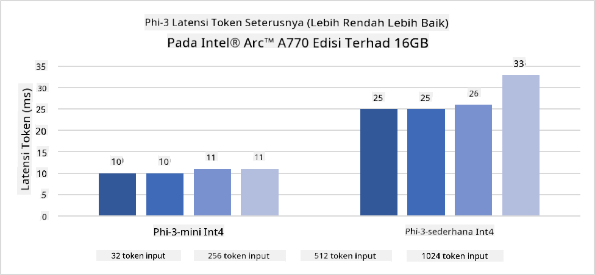
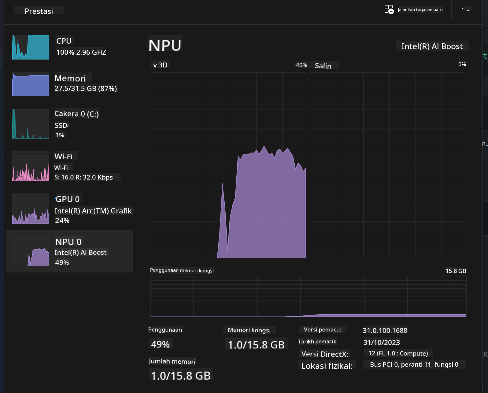
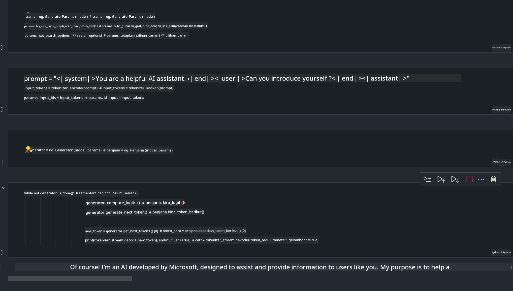
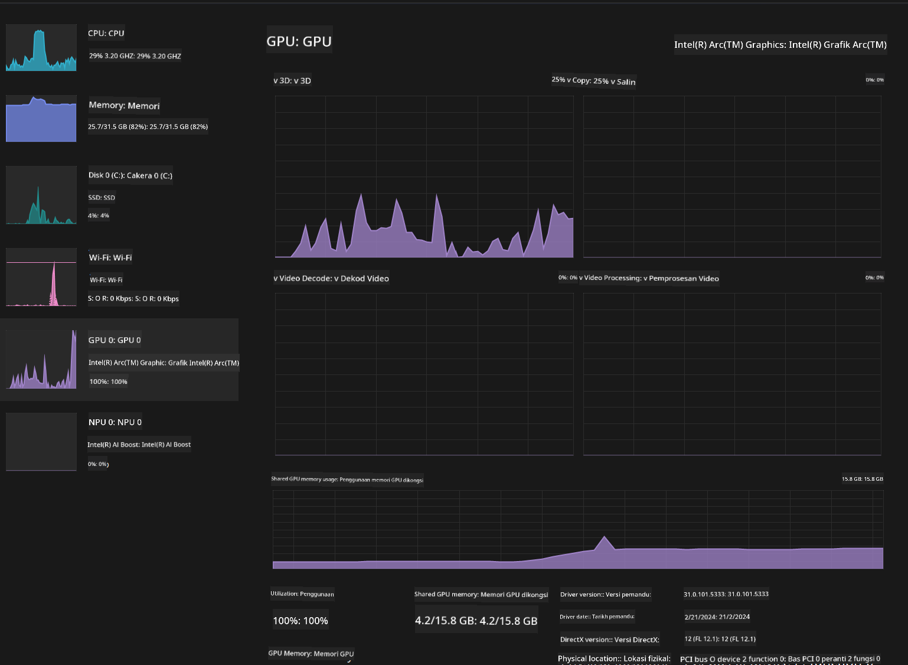

<!--
CO_OP_TRANSLATOR_METADATA:
{
  "original_hash": "e08ce816e23ad813244a09ca34ebb8ac",
  "translation_date": "2025-05-09T10:28:53+00:00",
  "source_file": "md/01.Introduction/03/AIPC_Inference.md",
  "language_code": "ms"
}
-->
# **استدلال Phi-3 در کامپیوتر هوش مصنوعی**

با پیشرفت هوش مصنوعی مولد و بهبود قابلیت‌های سخت‌افزاری دستگاه‌های لبه‌ای، تعداد بیشتری از مدل‌های هوش مصنوعی مولد اکنون می‌توانند در دستگاه‌های Bring Your Own Device (BYOD) کاربران ادغام شوند. کامپیوترهای هوش مصنوعی از جمله این مدل‌ها هستند. از سال ۲۰۲۴، شرکت‌های Intel، AMD و Qualcomm با تولیدکنندگان کامپیوتر همکاری کرده‌اند تا کامپیوترهای هوش مصنوعی را معرفی کنند که از طریق تغییرات سخت‌افزاری، استقرار مدل‌های مولد هوش مصنوعی محلی را تسهیل می‌کنند. در این بحث، تمرکز ما بر روی کامپیوترهای هوش مصنوعی Intel است و نحوه استقرار Phi-3 روی این کامپیوترها را بررسی می‌کنیم.

### NPU چیست

NPU (واحد پردازش عصبی) یک پردازنده یا واحد پردازش اختصاصی در یک SoC بزرگ‌تر است که به طور خاص برای تسریع عملیات شبکه‌های عصبی و وظایف هوش مصنوعی طراحی شده است. برخلاف CPU و GPUهای عمومی، NPUها برای محاسبات موازی مبتنی بر داده بهینه شده‌اند و در پردازش حجم عظیمی از داده‌های چندرسانه‌ای مانند ویدیوها و تصاویر و همچنین داده‌های شبکه‌های عصبی بسیار کارآمد هستند. آن‌ها به خصوص در انجام وظایف مرتبط با هوش مصنوعی مانند تشخیص گفتار، تار کردن پس‌زمینه در تماس‌های ویدیویی و فرآیندهای ویرایش عکس یا ویدیو مانند شناسایی اشیاء مهارت دارند.

## تفاوت NPU و GPU

اگرچه بسیاری از بارهای کاری هوش مصنوعی و یادگیری ماشین روی GPU اجرا می‌شوند، تفاوت مهمی بین GPU و NPU وجود دارد.
GPUها به دلیل قابلیت‌های محاسبات موازی شناخته شده‌اند، اما همه GPUها در پردازش فراتر از گرافیک به یک اندازه کارآمد نیستند. از طرف دیگر، NPUها به طور خاص برای محاسبات پیچیده مرتبط با عملیات شبکه‌های عصبی ساخته شده‌اند که آن‌ها را برای وظایف هوش مصنوعی بسیار مؤثر می‌کند.

خلاصه اینکه، NPUها نابغه‌های ریاضی هستند که سرعت محاسبات هوش مصنوعی را افزایش می‌دهند و نقش کلیدی در عصر نوظهور کامپیوترهای هوش مصنوعی ایفا می‌کنند!

***این مثال بر اساس جدیدترین پردازنده Intel Core Ultra اینتل است***

## **۱. استفاده از NPU برای اجرای مدل Phi-3**

دستگاه Intel® NPU یک شتاب‌دهنده استنتاج هوش مصنوعی است که در CPUهای کلاینت اینتل، از نسل Intel® Core™ Ultra (که قبلاً به نام Meteor Lake شناخته می‌شد) یکپارچه شده است. این دستگاه اجرای انرژی‌موثر وظایف شبکه عصبی مصنوعی را ممکن می‌سازد.




**کتابخانه شتاب‌دهنده Intel NPU**

کتابخانه شتاب‌دهنده Intel NPU [https://github.com/intel/intel-npu-acceleration-library](https://github.com/intel/intel-npu-acceleration-library) یک کتابخانه پایتون است که برای افزایش کارایی برنامه‌های شما با استفاده از قدرت واحد پردازش عصبی اینتل (NPU) جهت انجام محاسبات با سرعت بالا روی سخت‌افزارهای سازگار طراحی شده است.

مثال Phi-3-mini روی کامپیوتر هوش مصنوعی مجهز به پردازنده‌های Intel® Core™ Ultra.


نصب کتابخانه پایتون با pip

```bash

   pip install intel-npu-acceleration-library

```

***توجه*** پروژه هنوز در حال توسعه است، اما مدل مرجع در حال حاضر بسیار کامل است.

### **اجرای Phi-3 با کتابخانه شتاب‌دهنده Intel NPU**

با استفاده از شتاب‌دهی Intel NPU، این کتابخانه فرآیند کدگذاری سنتی را تحت تأثیر قرار نمی‌دهد. شما تنها نیاز دارید مدل اصلی Phi-3 را با این کتابخانه کم‌حجم (quantize) کنید، مانند FP16، INT8، INT4، به صورت زیر:

```python
from transformers import AutoTokenizer, pipeline,TextStreamer
from intel_npu_acceleration_library import NPUModelForCausalLM, int4
from intel_npu_acceleration_library.compiler import CompilerConfig
import warnings

model_id = "microsoft/Phi-3-mini-4k-instruct"

compiler_conf = CompilerConfig(dtype=int4)
model = NPUModelForCausalLM.from_pretrained(
    model_id, use_cache=True, config=compiler_conf, attn_implementation="sdpa"
).eval()

tokenizer = AutoTokenizer.from_pretrained(model_id)

text_streamer = TextStreamer(tokenizer, skip_prompt=True)
```

پس از موفقیت در کم‌حجمی، اجرای ادامه دهید تا NPU را برای اجرای مدل Phi-3 فراخوانی کنید.

```python
generation_args = {
   "max_new_tokens": 1024,
   "return_full_text": False,
   "temperature": 0.3,
   "do_sample": False,
   "streamer": text_streamer,
}

pipe = pipeline(
   "text-generation",
   model=model,
   tokenizer=tokenizer,
)

query = "<|system|>You are a helpful AI assistant.<|end|><|user|>Can you introduce yourself?<|end|><|assistant|>"

with warnings.catch_warnings():
    warnings.simplefilter("ignore")
    pipe(query, **generation_args)
```

هنگام اجرای کد، می‌توانید وضعیت اجرای NPU را از طریق Task Manager مشاهده کنید.



***نمونه‌ها*** : [AIPC_NPU_DEMO.ipynb](../../../../../code/03.Inference/AIPC/AIPC_NPU_DEMO.ipynb)

## **۲. استفاده از DirectML + ONNX Runtime برای اجرای مدل Phi-3**

### **DirectML چیست**

[DirectML](https://github.com/microsoft/DirectML) یک کتابخانه DirectX 12 با عملکرد بالا و شتاب سخت‌افزاری برای یادگیری ماشین است. DirectML شتاب GPU را برای وظایف رایج یادگیری ماشین در طیف گسترده‌ای از سخت‌افزارها و درایورها فراهم می‌کند، از جمله تمام GPUهای سازگار با DirectX 12 از سازندگانی مانند AMD، Intel، NVIDIA و Qualcomm.

وقتی به صورت مستقل استفاده شود، API DirectML یک کتابخانه سطح پایین DirectX 12 است و برای برنامه‌های با عملکرد بالا و تأخیر کم مانند فریم‌ورک‌ها، بازی‌ها و برنامه‌های زمان واقعی مناسب است. همکاری بی‌وقفه DirectML با Direct3D 12 و همچنین سربار کم و تطابق آن در سخت‌افزارها، DirectML را برای تسریع یادگیری ماشین ایده‌آل می‌کند، زمانی که هم عملکرد بالا مورد نظر است و هم قابلیت اطمینان و پیش‌بینی‌پذیری نتایج در سخت‌افزارهای مختلف اهمیت دارد.

***توجه*** : جدیدترین نسخه DirectML هم اکنون از NPU پشتیبانی می‌کند (https://devblogs.microsoft.com/directx/introducing-neural-processor-unit-npu-support-in-directml-developer-preview/)

### مقایسه DirectML و CUDA از نظر قابلیت‌ها و عملکرد:

**DirectML** کتابخانه یادگیری ماشینی است که توسط مایکروسافت توسعه یافته است. این کتابخانه برای تسریع بارهای کاری یادگیری ماشین روی دستگاه‌های ویندوزی از جمله دسکتاپ، لپ‌تاپ و دستگاه‌های لبه‌ای طراحی شده است.
- مبتنی بر DX12: DirectML بر پایه DirectX 12 ساخته شده که پشتیبانی سخت‌افزاری گسترده‌ای روی GPUها از جمله NVIDIA و AMD فراهم می‌کند.
- پشتیبانی گسترده‌تر: چون از DX12 استفاده می‌کند، DirectML می‌تواند با هر GPU که از DX12 پشتیبانی می‌کند، حتی GPUهای مجتمع کار کند.
- پردازش تصویر: DirectML تصاویر و داده‌های دیگر را با استفاده از شبکه‌های عصبی پردازش می‌کند، که آن را برای وظایفی مانند شناسایی تصویر، تشخیص اشیاء و غیره مناسب می‌کند.
- سهولت راه‌اندازی: راه‌اندازی DirectML ساده است و نیازی به SDK یا کتابخانه‌های خاص از سازندگان GPU ندارد.
- عملکرد: در برخی موارد، DirectML عملکرد خوبی دارد و می‌تواند سریع‌تر از CUDA باشد، به خصوص برای برخی بارهای کاری خاص.
- محدودیت‌ها: با این حال، مواردی وجود دارد که DirectML ممکن است کندتر باشد، به ویژه برای اندازه دسته‌های بزرگ float16.

**CUDA** پلتفرم محاسبات موازی و مدل برنامه‌نویسی NVIDIA است. این پلتفرم به توسعه‌دهندگان اجازه می‌دهد تا قدرت GPUهای NVIDIA را برای محاسبات عمومی، از جمله یادگیری ماشین و شبیه‌سازی‌های علمی به کار گیرند.
- اختصاصی NVIDIA: CUDA به طور کامل با GPUهای NVIDIA یکپارچه شده و مخصوص آن‌ها طراحی شده است.
- بهینه‌سازی بالا: برای وظایف شتاب‌یافته GPU به خصوص روی GPUهای NVIDIA عملکرد عالی ارائه می‌دهد.
- استفاده گسترده: بسیاری از فریم‌ورک‌ها و کتابخانه‌های یادگیری ماشین (مانند TensorFlow و PyTorch) از CUDA پشتیبانی می‌کنند.
- قابلیت سفارشی‌سازی: توسعه‌دهندگان می‌توانند تنظیمات CUDA را برای وظایف خاص بهینه کنند که منجر به عملکرد بهتر می‌شود.
- محدودیت‌ها: وابستگی CUDA به سخت‌افزار NVIDIA می‌تواند محدودکننده باشد اگر بخواهید سازگاری گسترده‌تری با GPUهای مختلف داشته باشید.

### انتخاب بین DirectML و CUDA

انتخاب بین DirectML و CUDA بستگی به کاربرد خاص شما، سخت‌افزار موجود و ترجیحات شما دارد.
اگر به دنبال سازگاری گسترده‌تر و راه‌اندازی آسان هستید، DirectML گزینه خوبی است. اما اگر GPUهای NVIDIA دارید و به عملکرد بهینه شده بالا نیاز دارید، CUDA همچنان گزینه قوی‌ای است. خلاصه اینکه هر دو DirectML و CUDA نقاط قوت و ضعف خود را دارند، بنابراین هنگام تصمیم‌گیری نیازها و سخت‌افزار موجود خود را در نظر بگیرید.

### **هوش مصنوعی مولد با ONNX Runtime**

در عصر هوش مصنوعی، قابلیت انتقال مدل‌های هوش مصنوعی بسیار مهم است. ONNX Runtime به سادگی امکان استقرار مدل‌های آموزش‌دیده روی دستگاه‌های مختلف را فراهم می‌کند. توسعه‌دهندگان نیازی به توجه به چارچوب استنتاج ندارند و با استفاده از یک API یکپارچه، استنتاج مدل را انجام می‌دهند. در عصر هوش مصنوعی مولد، ONNX Runtime همچنین بهینه‌سازی کد انجام داده است (https://onnxruntime.ai/docs/genai/). از طریق ONNX Runtime بهینه‌شده، مدل‌های هوش مصنوعی مولد کم‌حجم شده می‌توانند روی دستگاه‌های مختلف استنتاج شوند. در Generative AI with ONNX Runtime، می‌توانید API مدل هوش مصنوعی را از طریق پایتون، C#، C / C++ فراخوانی کنید. البته، استقرار روی آیفون می‌تواند از API Generative AI with ONNX Runtime با C++ بهره ببرد.

[نمونه کد](https://github.com/Azure-Samples/Phi-3MiniSamples/tree/main/onnx)

***کامپایل کتابخانه هوش مصنوعی مولد با ONNX Runtime***

```bash

winget install --id=Kitware.CMake  -e

git clone https://github.com/microsoft/onnxruntime.git

cd .\onnxruntime\

./build.bat --build_shared_lib --skip_tests --parallel --use_dml --config Release

cd ../

git clone https://github.com/microsoft/onnxruntime-genai.git

cd .\onnxruntime-genai\

mkdir ort

cd ort

mkdir include

mkdir lib

copy ..\onnxruntime\include\onnxruntime\core\providers\dml\dml_provider_factory.h ort\include

copy ..\onnxruntime\include\onnxruntime\core\session\onnxruntime_c_api.h ort\include

copy ..\onnxruntime\build\Windows\Release\Release\*.dll ort\lib

copy ..\onnxruntime\build\Windows\Release\Release\onnxruntime.lib ort\lib

python build.py --use_dml


```

**نصب کتابخانه**

```bash

pip install .\onnxruntime_genai_directml-0.3.0.dev0-cp310-cp310-win_amd64.whl

```

این نتیجه اجرای آن است



***نمونه‌ها*** : [AIPC_DirectML_DEMO.ipynb](../../../../../code/03.Inference/AIPC/AIPC_DirectML_DEMO.ipynb)

## **۳. استفاده از Intel OpenVino برای اجرای مدل Phi-3**

### **OpenVINO چیست**

[OpenVINO](https://github.com/openvinotoolkit/openvino) یک کیت ابزار متن‌باز برای بهینه‌سازی و استقرار مدل‌های یادگیری عمیق است. این کیت عملکرد یادگیری عمیق را برای مدل‌های بینایی، صوت و زبان از فریم‌ورک‌های محبوب مانند TensorFlow، PyTorch و غیره افزایش می‌دهد. با OpenVINO شروع کنید. OpenVINO همچنین می‌تواند در ترکیب با CPU و GPU برای اجرای مدل Phi-3 استفاده شود.

***توجه***: در حال حاضر OpenVINO از NPU پشتیبانی نمی‌کند.

### **نصب کتابخانه OpenVINO**

```bash

 pip install git+https://github.com/huggingface/optimum-intel.git

 pip install git+https://github.com/openvinotoolkit/nncf.git

 pip install openvino-nightly

```

### **اجرای Phi-3 با OpenVINO**

مانند NPU، OpenVINO با اجرای مدل‌های کم‌حجم شده مدل‌های هوش مصنوعی مولد را فراخوانی می‌کند. ابتدا باید مدل Phi-3 را کم‌حجم (quantize) کنیم و کم‌حجمی مدل را از طریق خط فرمان با optimum-cli انجام دهیم.

**INT4**

```bash

optimum-cli export openvino --model "microsoft/Phi-3-mini-4k-instruct" --task text-generation-with-past --weight-format int4 --group-size 128 --ratio 0.6  --sym  --trust-remote-code ./openvinomodel/phi3/int4

```

**FP16**

```bash

optimum-cli export openvino --model "microsoft/Phi-3-mini-4k-instruct" --task text-generation-with-past --weight-format fp16 --trust-remote-code ./openvinomodel/phi3/fp16

```

فرمت تبدیل شده به شکل زیر است


مسیر مدل‌ها (model_dir)، پیکربندی‌های مرتبط (ov_config = {"PERFORMANCE_HINT": "LATENCY", "NUM_STREAMS": "1", "CACHE_DIR": ""}) و دستگاه‌های شتاب‌دهنده سخت‌افزاری (GPU.0) را از طریق OVModelForCausalLM بارگذاری کنید.

```python

ov_model = OVModelForCausalLM.from_pretrained(
     model_dir,
     device='GPU.0',
     ov_config=ov_config,
     config=AutoConfig.from_pretrained(model_dir, trust_remote_code=True),
     trust_remote_code=True,
)

```

هنگام اجرای کد، می‌توانید وضعیت اجرای GPU را از طریق Task Manager مشاهده کنید.



***نمونه‌ها*** : [AIPC_OpenVino_Demo.ipynb](../../../../../code/03.Inference/AIPC/AIPC_OpenVino_Demo.ipynb)

### ***توجه*** : هر سه روش بالا مزایای خود را دارند، اما توصیه می‌شود برای استنتاج در کامپیوتر هوش مصنوعی از شتاب‌دهی NPU استفاده شود.

**Penafian**:  
Dokumen ini telah diterjemahkan menggunakan perkhidmatan terjemahan AI [Co-op Translator](https://github.com/Azure/co-op-translator). Walaupun kami berusaha untuk ketepatan, sila ambil maklum bahawa terjemahan automatik mungkin mengandungi kesilapan atau ketidaktepatan. Dokumen asal dalam bahasa asalnya harus dianggap sebagai sumber yang sahih. Untuk maklumat penting, terjemahan profesional oleh manusia adalah disyorkan. Kami tidak bertanggungjawab terhadap sebarang salah faham atau salah tafsir yang timbul daripada penggunaan terjemahan ini.