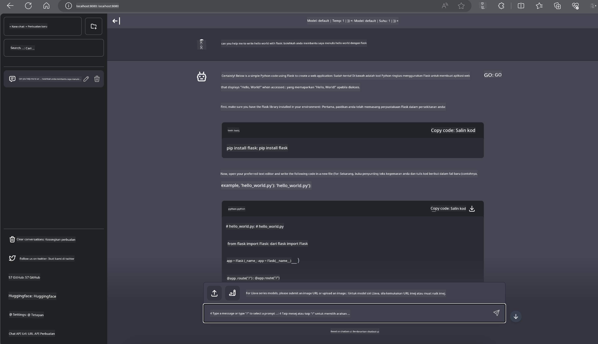

<!--
CO_OP_TRANSLATOR_METADATA:
{
  "original_hash": "be4101a30d98e95a71d42c276e8bcd37",
  "translation_date": "2025-05-09T11:42:20+00:00",
  "source_file": "md/01.Introduction/03/Jetson_Inference.md",
  "language_code": "ms"
}
-->
# **Inference Phi-3 in Nvidia Jetson**

Nvidia Jetson هو سلسلة من لوحات الحوسبة المدمجة من Nvidia. طرازات Jetson TK1 و TX1 و TX2 جميعها مزودة بمعالج Tegra (أو SoC) من Nvidia يدمج وحدة معالجة مركزية (CPU) بمعمارية ARM. Jetson هو نظام منخفض الطاقة ومصمم لتسريع تطبيقات تعلم الآلة. يستخدم Nvidia Jetson من قبل المطورين المحترفين لإنشاء منتجات ذكاء اصطناعي رائدة في جميع الصناعات، ومن قبل الطلاب والهواة للتعلم العملي للذكاء الاصطناعي وصنع مشاريع مذهلة. يتم نشر SLM في أجهزة الحافة مثل Jetson، مما سيمكن من تنفيذ أفضل لسيناريوهات تطبيقات الذكاء الاصطناعي التوليدي الصناعية.

## النشر على NVIDIA Jetson:
يمكن للمطورين العاملين في مجال الروبوتات الذاتية والأجهزة المدمجة الاستفادة من Phi-3 Mini. الحجم الصغير نسبيًا لـ Phi-3 يجعله مثاليًا للنشر على الحافة. تم ضبط المعلمات بعناية خلال التدريب، مما يضمن دقة عالية في الاستجابات.

### تحسين TensorRT-LLM:
مكتبة [TensorRT-LLM من NVIDIA](https://github.com/NVIDIA/TensorRT-LLM?WT.mc_id=aiml-138114-kinfeylo) تقوم بتحسين استدلال نماذج اللغة الكبيرة. تدعم نافذة السياق الطويلة لـ Phi-3 Mini، مما يعزز كل من الإنتاجية والكمون. تشمل التحسينات تقنيات مثل LongRoPE و FP8 و inflight batching.

### التوفر والنشر:
يمكن للمطورين استكشاف Phi-3 Mini مع نافذة سياق 128K على [NVIDIA's AI](https://www.nvidia.com/en-us/ai-data-science/generative-ai/). يتم تعبئته كـ NVIDIA NIM، وهو خدمة مصغرة بواجهة API قياسية يمكن نشرها في أي مكان. بالإضافة إلى ذلك، تتوفر [تنفيذات TensorRT-LLM على GitHub](https://github.com/NVIDIA/TensorRT-LLM).

## **1. التحضير**

a. Jetson Orin NX / Jetson NX

b. JetPack 5.1.2+

c. Cuda 11.8

d. Python 3.8+

## **2. تشغيل Phi-3 في Jetson**

يمكننا اختيار [Ollama](https://ollama.com) أو [LlamaEdge](https://llamaedge.com)

إذا كنت ترغب في استخدام gguf في السحابة وأجهزة الحافة في نفس الوقت، يمكن فهم LlamaEdge كـ WasmEdge (WasmEdge هو بيئة تشغيل WebAssembly خفيفة الوزن وعالية الأداء وقابلة للتوسع، مناسبة للتطبيقات السحابية الأصلية والحافة والتطبيقات اللامركزية. تدعم التطبيقات بدون خادم، الوظائف المدمجة، الخدمات المصغرة، العقود الذكية وأجهزة إنترنت الأشياء. يمكنك نشر نموذج gguf الكمي على أجهزة الحافة والسحابة من خلال LlamaEdge.


فيما يلي خطوات الاستخدام

1. تثبيت وتنزيل المكتبات والملفات المتعلقة

```bash

curl -sSf https://raw.githubusercontent.com/WasmEdge/WasmEdge/master/utils/install.sh | bash -s -- --plugin wasi_nn-ggml

curl -LO https://github.com/LlamaEdge/LlamaEdge/releases/latest/download/llama-api-server.wasm

curl -LO https://github.com/LlamaEdge/chatbot-ui/releases/latest/download/chatbot-ui.tar.gz

tar xzf chatbot-ui.tar.gz

```

**ملاحظة**: يجب أن يكون كل من llama-api-server.wasm و chatbot-ui في نفس المجلد

2. تشغيل السكربتات في الطرفية

```bash

wasmedge --dir .:. --nn-preload default:GGML:AUTO:{Your gguf path} llama-api-server.wasm -p phi-3-chat

```

إليك نتيجة التشغيل



***كود تجريبي*** [Phi-3 mini WASM Notebook Sample](https://github.com/Azure-Samples/Phi-3MiniSamples/tree/main/wasm)

باختصار، يمثل Phi-3 Mini قفزة نوعية في نمذجة اللغة، حيث يجمع بين الكفاءة والوعي بالسياق وقوة تحسينات NVIDIA. سواء كنت تبني روبوتات أو تطبيقات على الحافة، فإن Phi-3 Mini هو أداة قوية يجب معرفتها.

**Penafian**:  
Dokumen ini telah diterjemahkan menggunakan perkhidmatan terjemahan AI [Co-op Translator](https://github.com/Azure/co-op-translator). Walaupun kami berusaha untuk ketepatan, sila ambil maklum bahawa terjemahan automatik mungkin mengandungi kesilapan atau ketidaktepatan. Dokumen asal dalam bahasa asalnya harus dianggap sebagai sumber yang sahih. Untuk maklumat penting, terjemahan profesional oleh manusia adalah disyorkan. Kami tidak bertanggungjawab atas sebarang salah faham atau tafsiran yang salah yang timbul daripada penggunaan terjemahan ini.