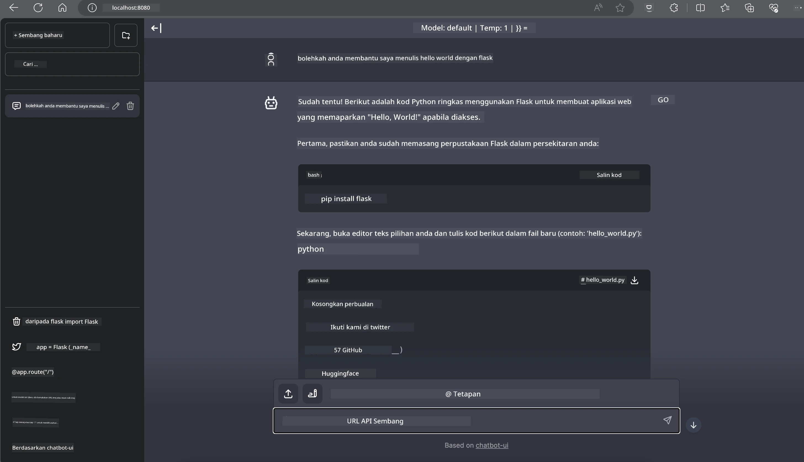

<!--
CO_OP_TRANSLATOR_METADATA:
{
  "original_hash": "be4101a30d98e95a71d42c276e8bcd37",
  "translation_date": "2025-07-16T20:44:10+00:00",
  "source_file": "md/01.Introduction/03/Jetson_Inference.md",
  "language_code": "ms"
}
-->
# **Inferens Phi-3 di Nvidia Jetson**

Nvidia Jetson adalah siri papan pengkomputeran terbenam daripada Nvidia. Model Jetson TK1, TX1 dan TX2 semuanya menggunakan pemproses Tegra (atau SoC) dari Nvidia yang menggabungkan unit pemprosesan pusat (CPU) berasaskan seni bina ARM. Jetson adalah sistem berkuasa rendah dan direka untuk mempercepatkan aplikasi pembelajaran mesin. Nvidia Jetson digunakan oleh pembangun profesional untuk mencipta produk AI terobosan dalam pelbagai industri, serta oleh pelajar dan peminat untuk pembelajaran AI secara praktikal dan menghasilkan projek yang menakjubkan. SLM digunakan dalam peranti edge seperti Jetson, yang membolehkan pelaksanaan yang lebih baik bagi senario aplikasi AI generatif industri.

## Penyebaran pada NVIDIA Jetson:
Pembangun yang bekerja pada robotik autonomi dan peranti terbenam boleh memanfaatkan Phi-3 Mini. Saiz Phi-3 yang agak kecil menjadikannya sesuai untuk penyebaran edge. Parameter telah disesuaikan dengan teliti semasa latihan, memastikan ketepatan tinggi dalam respons.

### Pengoptimuman TensorRT-LLM:
[Perpustakaan TensorRT-LLM](https://github.com/NVIDIA/TensorRT-LLM?WT.mc_id=aiml-138114-kinfeylo) daripada NVIDIA mengoptimumkan inferens model bahasa besar. Ia menyokong tetingkap konteks panjang Phi-3 Mini, meningkatkan kedua-dua kelajuan pemprosesan dan latensi. Pengoptimuman termasuk teknik seperti LongRoPE, FP8, dan inflight batching.

### Ketersediaan dan Penyebaran:
Pembangun boleh meneroka Phi-3 Mini dengan tetingkap konteks 128K di [NVIDIA's AI](https://www.nvidia.com/en-us/ai-data-science/generative-ai/). Ia dibungkus sebagai NVIDIA NIM, satu mikroservis dengan API standard yang boleh disebarkan di mana-mana. Selain itu, [pelaksanaan TensorRT-LLM di GitHub](https://github.com/NVIDIA/TensorRT-LLM).

## **1. Persediaan**

a. Jetson Orin NX / Jetson NX

b. JetPack 5.1.2+

c. Cuda 11.8

d. Python 3.8+

## **2. Menjalankan Phi-3 di Jetson**

Kita boleh memilih [Ollama](https://ollama.com) atau [LlamaEdge](https://llamaedge.com)

Jika anda ingin menggunakan gguf di awan dan peranti edge pada masa yang sama, LlamaEdge boleh difahami sebagai WasmEdge (WasmEdge adalah runtime WebAssembly yang ringan, berprestasi tinggi dan boleh diskalakan sesuai untuk aplikasi asli awan, edge dan terdesentralisasi. Ia menyokong aplikasi tanpa pelayan, fungsi terbenam, mikroservis, kontrak pintar dan peranti IoT). Anda boleh menyebarkan model kuantitatif gguf ke peranti edge dan awan melalui LlamaEdge.


Berikut adalah langkah-langkah untuk menggunakan

1. Pasang dan muat turun perpustakaan dan fail berkaitan

```bash

curl -sSf https://raw.githubusercontent.com/WasmEdge/WasmEdge/master/utils/install.sh | bash -s -- --plugin wasi_nn-ggml

curl -LO https://github.com/LlamaEdge/LlamaEdge/releases/latest/download/llama-api-server.wasm

curl -LO https://github.com/LlamaEdge/chatbot-ui/releases/latest/download/chatbot-ui.tar.gz

tar xzf chatbot-ui.tar.gz

```

**Nota**: llama-api-server.wasm dan chatbot-ui perlu berada dalam direktori yang sama

2. Jalankan skrip di terminal

```bash

wasmedge --dir .:. --nn-preload default:GGML:AUTO:{Your gguf path} llama-api-server.wasm -p phi-3-chat

```

Ini adalah hasil pelaksanaan



***Kod contoh*** [Phi-3 mini WASM Notebook Sample](https://github.com/Azure-Samples/Phi-3MiniSamples/tree/main/wasm)

Secara ringkas, Phi-3 Mini mewakili lonjakan dalam pemodelan bahasa, menggabungkan kecekapan, kesedaran konteks, dan kepakaran pengoptimuman NVIDIA. Sama ada anda membina robot atau aplikasi edge, Phi-3 Mini adalah alat yang kuat untuk diketahui.

**Penafian**:  
Dokumen ini telah diterjemahkan menggunakan perkhidmatan terjemahan AI [Co-op Translator](https://github.com/Azure/co-op-translator). Walaupun kami berusaha untuk ketepatan, sila ambil maklum bahawa terjemahan automatik mungkin mengandungi kesilapan atau ketidaktepatan. Dokumen asal dalam bahasa asalnya harus dianggap sebagai sumber yang sahih. Untuk maklumat penting, terjemahan profesional oleh manusia adalah disyorkan. Kami tidak bertanggungjawab atas sebarang salah faham atau salah tafsir yang timbul daripada penggunaan terjemahan ini.