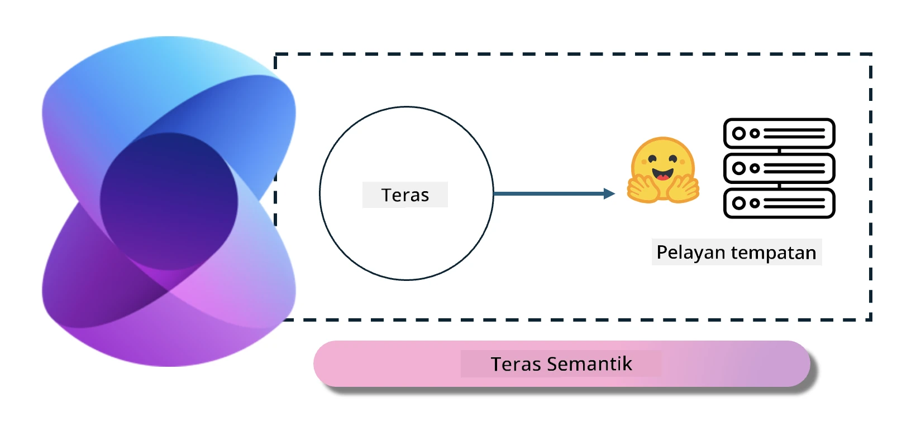

<!--
CO_OP_TRANSLATOR_METADATA:
{
  "original_hash": "bcf5dd7031db0031abdb9dd0c05ba118",
  "translation_date": "2025-07-16T20:58:29+00:00",
  "source_file": "md/01.Introduction/03/Local_Server_Inference.md",
  "language_code": "ms"
}
-->
# **Inferens Phi-3 di Pelayan Tempatan**

Kita boleh melaksanakan Phi-3 pada pelayan tempatan. Pengguna boleh memilih penyelesaian [Ollama](https://ollama.com) atau [LM Studio](https://llamaedge.com), atau mereka boleh menulis kod mereka sendiri. Anda boleh menyambungkan perkhidmatan tempatan Phi-3 melalui [Semantic Kernel](https://github.com/microsoft/semantic-kernel?WT.mc_id=aiml-138114-kinfeylo) atau [Langchain](https://www.langchain.com/) untuk membina aplikasi Copilot.

## **Gunakan Semantic Kernel untuk mengakses Phi-3-mini**

Dalam aplikasi Copilot, kita mencipta aplikasi melalui Semantic Kernel / LangChain. Rangka kerja aplikasi jenis ini biasanya serasi dengan Azure OpenAI Service / model OpenAI, dan juga boleh menyokong model sumber terbuka di Hugging Face serta model tempatan. Apa yang perlu kita lakukan jika mahu menggunakan Semantic Kernel untuk mengakses Phi-3-mini? Menggunakan .NET sebagai contoh, kita boleh menggabungkannya dengan Hugging Face Connector dalam Semantic Kernel. Secara lalai, ia boleh merujuk kepada model id di Hugging Face (pertama kali anda menggunakannya, model akan dimuat turun dari Hugging Face, yang mengambil masa agak lama). Anda juga boleh menyambung ke perkhidmatan tempatan yang dibina sendiri. Berbanding kedua-duanya, kami mengesyorkan menggunakan yang terakhir kerana ia mempunyai tahap autonomi yang lebih tinggi, terutamanya dalam aplikasi perusahaan.

Daripada gambar tersebut, mengakses perkhidmatan tempatan melalui Semantic Kernel boleh dengan mudah menyambung ke pelayan model Phi-3-mini yang dibina sendiri. Berikut adalah hasil pelaksanaan

***Kod Contoh*** https://github.com/kinfey/Phi3MiniSamples/tree/main/semantickernel

**Penafian**:  
Dokumen ini telah diterjemahkan menggunakan perkhidmatan terjemahan AI [Co-op Translator](https://github.com/Azure/co-op-translator). Walaupun kami berusaha untuk ketepatan, sila ambil maklum bahawa terjemahan automatik mungkin mengandungi kesilapan atau ketidaktepatan. Dokumen asal dalam bahasa asalnya harus dianggap sebagai sumber yang sahih. Untuk maklumat penting, terjemahan profesional oleh manusia adalah disyorkan. Kami tidak bertanggungjawab atas sebarang salah faham atau salah tafsir yang timbul daripada penggunaan terjemahan ini.