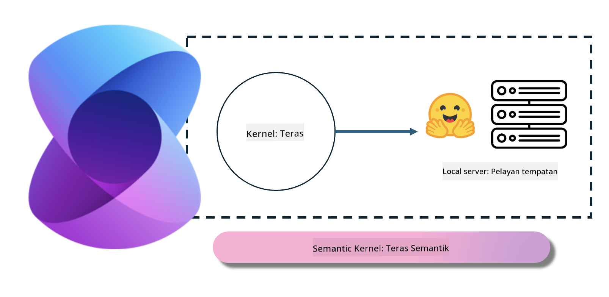
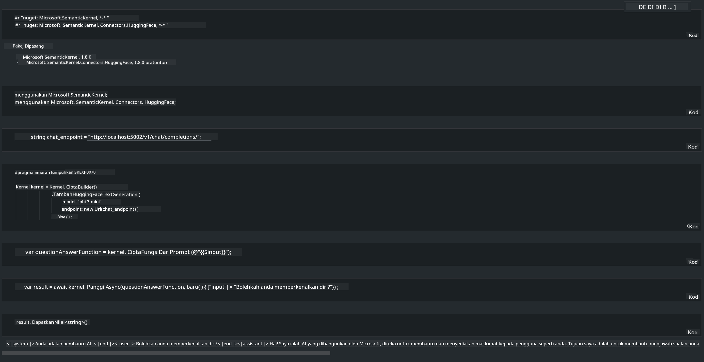

<!--
CO_OP_TRANSLATOR_METADATA:
{
  "original_hash": "bcf5dd7031db0031abdb9dd0c05ba118",
  "translation_date": "2025-05-09T12:07:06+00:00",
  "source_file": "md/01.Introduction/03/Local_Server_Inference.md",
  "language_code": "ms"
}
-->
# **Inference Phi-3 בשרת מקומי**

אפשר לפרוס את Phi-3 על שרת מקומי. משתמשים יכולים לבחור בפתרונות כמו [Ollama](https://ollama.com) או [LM Studio](https://llamaedge.com), או לכתוב קוד משלהם. ניתן לחבר את שירותי Phi-3 המקומיים דרך [Semantic Kernel](https://github.com/microsoft/semantic-kernel?WT.mc_id=aiml-138114-kinfeylo) או [Langchain](https://www.langchain.com/) כדי לבנות אפליקציות Copilot.

## **שימוש ב-Semantic Kernel לגישה ל-Phi-3-mini**

באפליקציית Copilot, אנו יוצרים אפליקציות דרך Semantic Kernel / LangChain. מסגרת אפליקציה מסוג זה בדרך כלל תואמת ל-Azure OpenAI Service / מודלים של OpenAI, ויכולה גם לתמוך במודלים בקוד פתוח ב-Hugging Face ובמודלים מקומיים. מה נעשה אם נרצה להשתמש ב-Semantic Kernel כדי לגשת ל-Phi-3-mini? בדוגמת .NET, אפשר לשלב זאת עם Hugging Face Connector ב-Semantic Kernel. כברירת מחדל, הוא מתאים למזהה המודל ב-Hugging Face (בפעם הראשונה שמשתמשים בו, המודל יורד מ-Hugging Face, וזה לוקח זמן). ניתן גם להתחבר לשירות המקומי שנבנה. בהשוואה בין השניים, מומלץ להשתמש בשירות המקומי כי יש לו רמת אוטונומיה גבוהה יותר, במיוחד באפליקציות ארגוניות.

מהתמונה, גישה לשירותים מקומיים דרך Semantic Kernel מאפשרת חיבור קל לשרת המודל Phi-3-mini שבנינו בעצמנו. הנה תוצאת הריצה:

***Sample Code*** https://github.com/kinfey/Phi3MiniSamples/tree/main/semantickernel

**Penafian**:  
Dokumen ini telah diterjemahkan menggunakan perkhidmatan terjemahan AI [Co-op Translator](https://github.com/Azure/co-op-translator). Walaupun kami berusaha untuk ketepatan, sila maklum bahawa terjemahan automatik mungkin mengandungi kesilapan atau ketidaktepatan. Dokumen asal dalam bahasa asalnya harus dianggap sebagai sumber yang sahih. Untuk maklumat penting, terjemahan profesional oleh manusia adalah disyorkan. Kami tidak bertanggungjawab atas sebarang salah faham atau salah tafsir yang timbul daripada penggunaan terjemahan ini.