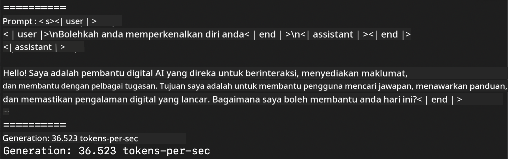
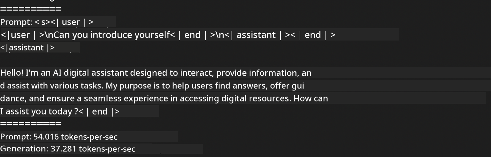
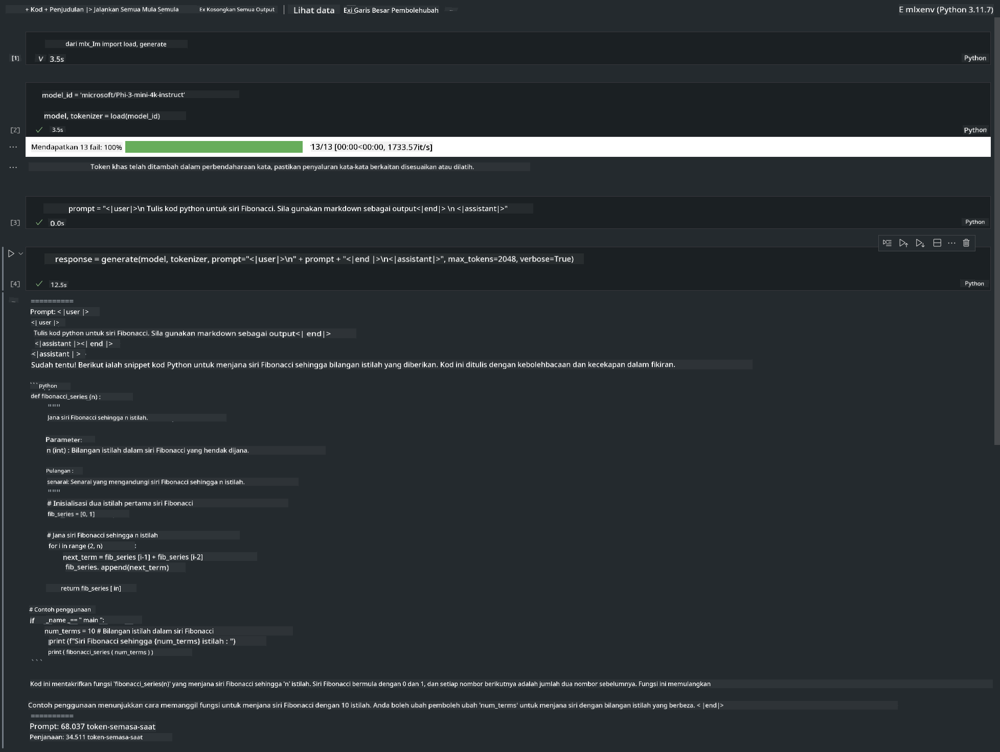

<!--
CO_OP_TRANSLATOR_METADATA:
{
  "original_hash": "dcb656f3d206fc4968e236deec5d4384",
  "translation_date": "2025-05-09T12:17:14+00:00",
  "source_file": "md/01.Introduction/03/MLX_Inference.md",
  "language_code": "ms"
}
-->
# **استدلال Phi-3 با چارچوب Apple MLX**

## **چارچوب MLX چیست**

MLX یک چارچوب آرایه‌ای برای پژوهش‌های یادگیری ماشین روی پردازنده‌های Apple silicon است که توسط تیم پژوهش یادگیری ماشین اپل توسعه یافته است.

MLX توسط پژوهشگران یادگیری ماشین برای پژوهشگران یادگیری ماشین طراحی شده است. این چارچوب به گونه‌ای طراحی شده که کاربرپسند باشد، اما در عین حال برای آموزش و اجرای مدل‌ها بهینه و کارآمد باشد. طراحی خود چارچوب نیز از نظر مفهومی ساده است. هدف ما این است که پژوهشگران بتوانند به راحتی MLX را توسعه داده و بهبود دهند تا ایده‌های جدید را سریع‌تر بررسی کنند.

مدل‌های زبانی بزرگ (LLM) می‌توانند روی دستگاه‌های Apple Silicon با کمک MLX سرعت بگیرند و مدل‌ها به صورت محلی و بسیار راحت اجرا شوند.

## **استفاده از MLX برای استدلال Phi-3-mini**

### **1. راه‌اندازی محیط MLX**

1. Python 3.11.x
2. نصب کتابخانه MLX


```bash

pip install mlx-lm

```

### **2. اجرای Phi-3-mini در ترمینال با MLX**


```bash

python -m mlx_lm.generate --model microsoft/Phi-3-mini-4k-instruct --max-token 2048 --prompt  "<|user|>\nCan you introduce yourself<|end|>\n<|assistant|>"

```

نتیجه (محیط من Apple M1 Max با 64 گیگابایت رم است):



### **3. کوانتیزه کردن Phi-3-mini با MLX در ترمینال**


```bash

python -m mlx_lm.convert --hf-path microsoft/Phi-3-mini-4k-instruct

```

***Note：*** مدل را می‌توان با استفاده از mlx_lm.convert کوانتیزه کرد و کوانتیزاسیون پیش‌فرض INT4 است. این مثال Phi-3-mini را به INT4 کوانتیزه می‌کند.

مدل را می‌توان با mlx_lm.convert کوانتیزه کرد و کوانتیزاسیون پیش‌فرض INT4 است. در این مثال، Phi-3-mini به INT4 کوانتیزه می‌شود. پس از کوانتیزه کردن، مدل در مسیر پیش‌فرض ./mlx_model ذخیره خواهد شد.

می‌توانیم مدل کوانتیزه شده با MLX را از طریق ترمینال تست کنیم.


```bash

python -m mlx_lm.generate --model ./mlx_model/ --max-token 2048 --prompt  "<|user|>\nCan you introduce yourself<|end|>\n<|assistant|>"

```

نتیجه به شکل زیر است:




### **4. اجرای Phi-3-mini با MLX در Jupyter Notebook**




***Note:*** لطفاً این نمونه را مطالعه کنید [click this link](../../../../../code/03.Inference/MLX/MLX_DEMO.ipynb)


## **منابع**

1. آشنایی با چارچوب Apple MLX [https://ml-explore.github.io](https://ml-explore.github.io/mlx/build/html/index.html)

2. مخزن GitHub اپل MLX [https://github.com/ml-explore](https://github.com/ml-explore)

**Penafian**:  
Dokumen ini telah diterjemahkan menggunakan perkhidmatan terjemahan AI [Co-op Translator](https://github.com/Azure/co-op-translator). Walaupun kami berusaha untuk ketepatan, sila ambil maklum bahawa terjemahan automatik mungkin mengandungi kesilapan atau ketidaktepatan. Dokumen asal dalam bahasa asalnya harus dianggap sebagai sumber yang sahih. Untuk maklumat penting, terjemahan profesional oleh manusia adalah disyorkan. Kami tidak bertanggungjawab atas sebarang salah faham atau salah tafsir yang timbul daripada penggunaan terjemahan ini.