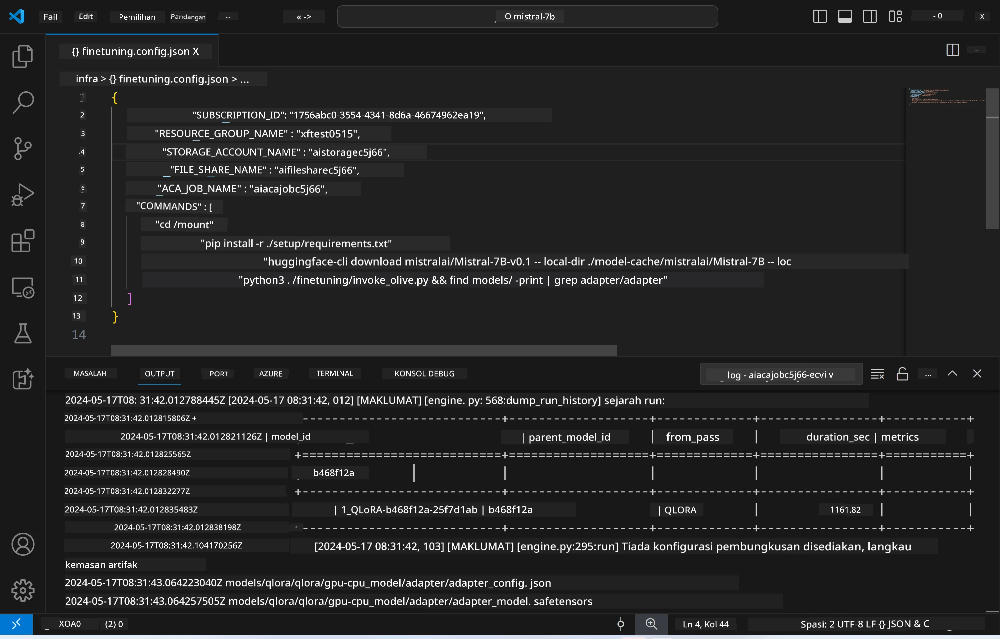
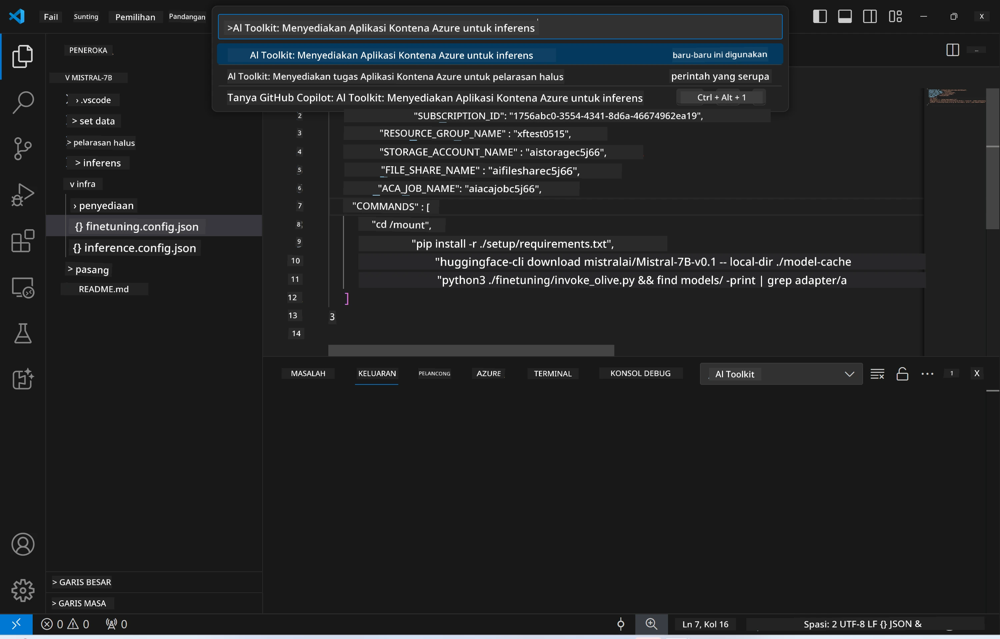
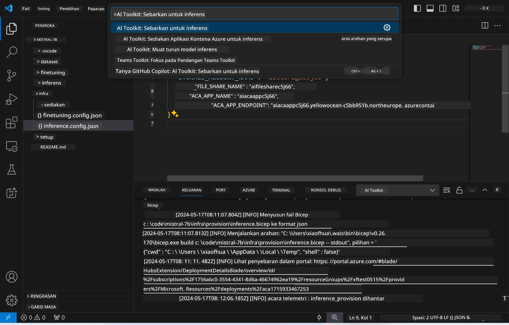
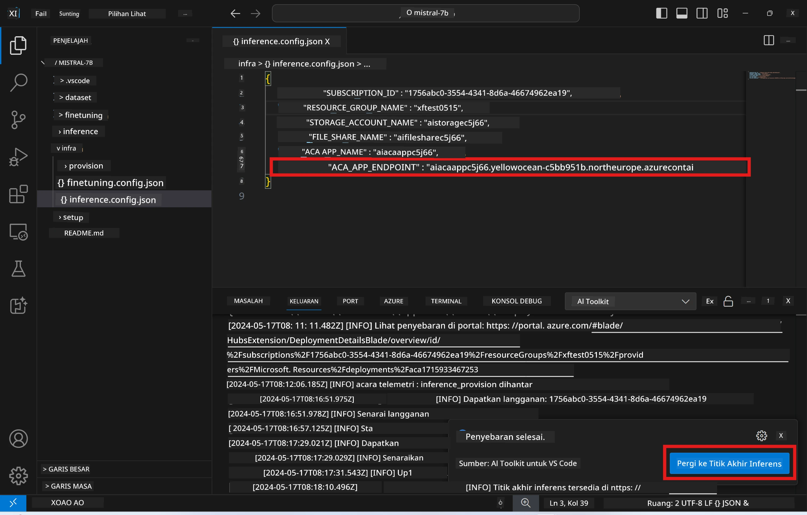

# Inferens Jauh dengan model yang telah disesuaikan

Selepas penyesuaian adapter dilakukan dalam persekitaran jauh, gunakan aplikasi Gradio yang ringkas untuk berinteraksi dengan model.



### Menyediakan Sumber Azure  
Anda perlu menyediakan Sumber Azure untuk inferens jauh dengan menjalankan `AI Toolkit: Provision Azure Container Apps for inference` dari palet arahan. Semasa penyediaan ini, anda akan diminta untuk memilih Langganan Azure dan kumpulan sumber anda.  

   
Secara lalai, langganan dan kumpulan sumber untuk inferens harus sama dengan yang digunakan untuk penyesuaian. Inferens akan menggunakan Persekitaran Azure Container App yang sama dan mengakses model serta adapter model yang disimpan dalam Azure Files, yang dihasilkan semasa langkah penyesuaian. 

## Menggunakan AI Toolkit 

### Penyebaran untuk Inferens  
Jika anda ingin mengubah kod inferens atau memuat semula model inferens, sila jalankan arahan `AI Toolkit: Deploy for inference`. Ini akan menyelaraskan kod terkini anda dengan ACA dan memulakan semula replika.  



Selepas penyebaran berjaya, model kini sedia untuk dinilai menggunakan titik akhir ini.

### Mengakses API Inferens

Anda boleh mengakses API inferens dengan mengklik butang "*Go to Inference Endpoint*" yang dipaparkan dalam notifikasi VSCode. Sebagai alternatif, titik akhir web API boleh didapati di bawah `ACA_APP_ENDPOINT` dalam `./infra/inference.config.json` dan dalam panel output.



> **Note:** Titik akhir inferens mungkin memerlukan beberapa minit untuk beroperasi sepenuhnya.

## Komponen Inferens yang Termasuk dalam Templat
 
| Folder | Kandungan |
| ------ |--------- |
| `infra` | Mengandungi semua konfigurasi yang diperlukan untuk operasi jauh. |
| `infra/provision/inference.parameters.json` | Memegang parameter untuk templat bicep, digunakan untuk penyediaan sumber Azure bagi inferens. |
| `infra/provision/inference.bicep` | Mengandungi templat untuk penyediaan sumber Azure bagi inferens. |
| `infra/inference.config.json` | Fail konfigurasi, dijana oleh arahan `AI Toolkit: Provision Azure Container Apps for inference`. Ia digunakan sebagai input untuk palet arahan jauh yang lain. |

### Menggunakan AI Toolkit untuk mengkonfigurasi Penyediaan Sumber Azure  
Konfigurasikan [AI Toolkit](https://marketplace.visualstudio.com/items?itemName=ms-windows-ai-studio.windows-ai-studio)

Jalankan arahan `Provision Azure Container Apps for inference`.

Anda boleh dapati parameter konfigurasi dalam fail `./infra/provision/inference.parameters.json`. Berikut adalah butirannya:
| Parameter | Penerangan |
| --------- |------------ |
| `defaultCommands` | Ini adalah arahan untuk memulakan web API. |
| `maximumInstanceCount` | Parameter ini menetapkan kapasiti maksimum instans GPU. |
| `location` | Lokasi di mana sumber Azure disediakan. Nilai lalai adalah sama dengan lokasi kumpulan sumber yang dipilih. |
| `storageAccountName`, `fileShareName`, `acaEnvironmentName`, `acaEnvironmentStorageName`, `acaAppName`,  `acaLogAnalyticsName` | Parameter ini digunakan untuk menamakan sumber Azure yang akan disediakan. Secara lalai, ia akan sama dengan nama sumber penyesuaian. Anda boleh masukkan nama sumber baru yang belum digunakan untuk mencipta sumber dengan nama tersendiri, atau masukkan nama sumber Azure yang sudah wujud jika anda ingin menggunakannya. Untuk maklumat lanjut, rujuk bahagian [Menggunakan Sumber Azure yang sedia ada](../../../../../md/01.Introduction/03). |

### Menggunakan Sumber Azure yang Sedia Ada

Secara lalai, penyediaan inferens menggunakan Persekitaran Azure Container App, Akaun Penyimpanan, Azure File Share, dan Azure Log Analytics yang sama seperti yang digunakan untuk penyesuaian. Satu Azure Container App yang berasingan dicipta khusus untuk API inferens. 

Jika anda telah mengubah suai sumber Azure semasa langkah penyesuaian atau ingin menggunakan sumber Azure sedia ada anda untuk inferens, nyatakan nama mereka dalam fail `./infra/inference.parameters.json`. Kemudian, jalankan arahan `AI Toolkit: Provision Azure Container Apps for inference` dari palet arahan. Ini akan mengemas kini mana-mana sumber yang ditentukan dan mencipta mana-mana yang belum ada.

Sebagai contoh, jika anda mempunyai persekitaran kontena Azure yang sedia ada, fail `./infra/finetuning.parameters.json` anda harus kelihatan seperti ini:

```json
{
    "$schema": "https://schema.management.azure.com/schemas/2019-04-01/deploymentParameters.json#",
    "contentVersion": "1.0.0.0",
    "parameters": {
      ...
      "acaEnvironmentName": {
        "value": "<your-aca-env-name>"
      },
      "acaEnvironmentStorageName": {
        "value": null
      },
      ...
    }
  }
```

### Penyediaan Manual  
Jika anda lebih suka mengkonfigurasi sumber Azure secara manual, anda boleh menggunakan fail bicep yang disediakan dalam folder `./infra/provision`. Jika anda sudah menyediakan dan mengkonfigurasi semua sumber Azure tanpa menggunakan palet arahan AI Toolkit, anda hanya perlu masukkan nama sumber dalam fail `inference.config.json`.

Sebagai contoh:

```json
{
  "SUBSCRIPTION_ID": "<your-subscription-id>",
  "RESOURCE_GROUP_NAME": "<your-resource-group-name>",
  "STORAGE_ACCOUNT_NAME": "<your-storage-account-name>",
  "FILE_SHARE_NAME": "<your-file-share-name>",
  "ACA_APP_NAME": "<your-aca-name>",
  "ACA_APP_ENDPOINT": "<your-aca-endpoint>"
}
```

**Penafian**:  
Dokumen ini telah diterjemahkan menggunakan perkhidmatan terjemahan AI [Co-op Translator](https://github.com/Azure/co-op-translator). Walaupun kami berusaha untuk ketepatan, sila ambil maklum bahawa terjemahan automatik mungkin mengandungi kesilapan atau ketidaktepatan. Dokumen asal dalam bahasa asalnya harus dianggap sebagai sumber yang sahih. Untuk maklumat penting, terjemahan profesional oleh manusia adalah disyorkan. Kami tidak bertanggungjawab atas sebarang salah faham atau salah tafsir yang timbul daripada penggunaan terjemahan ini.