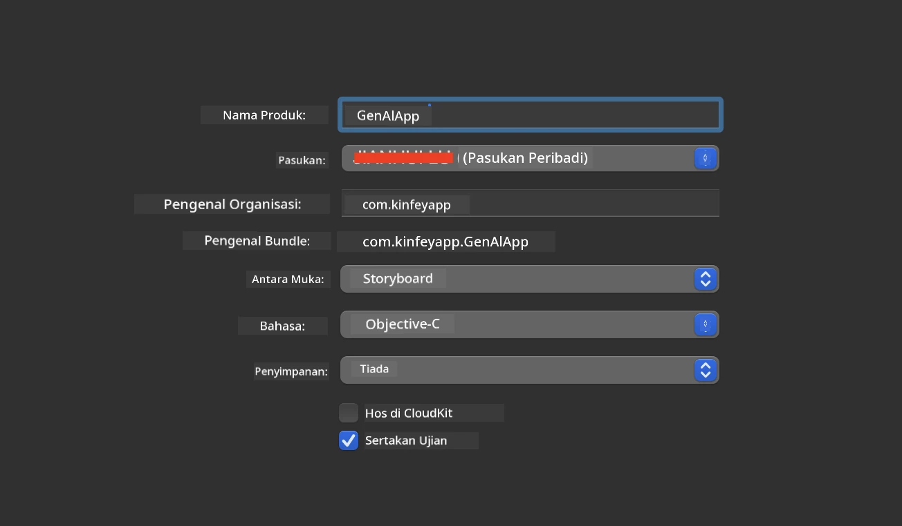
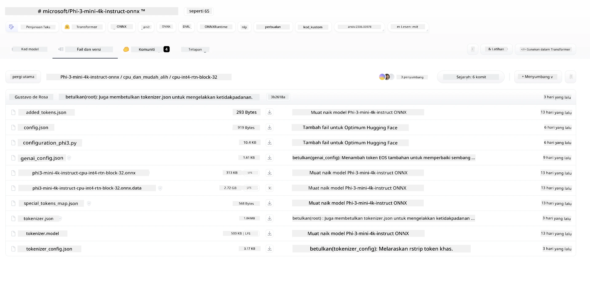
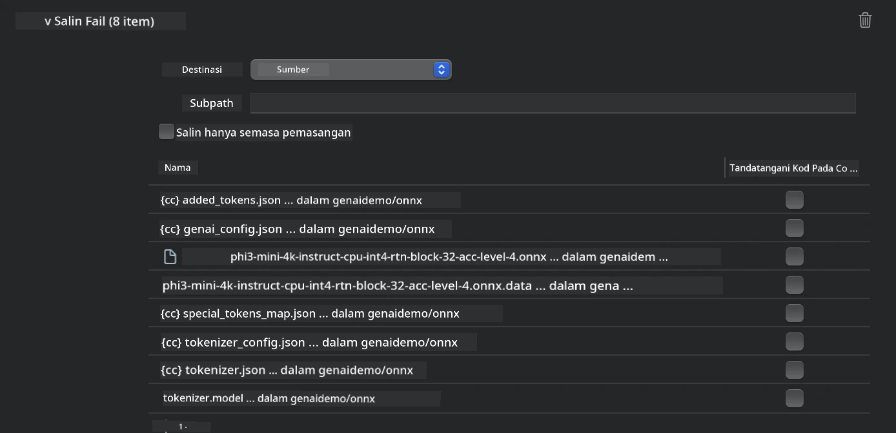
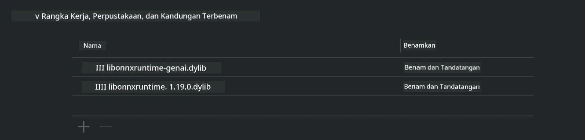
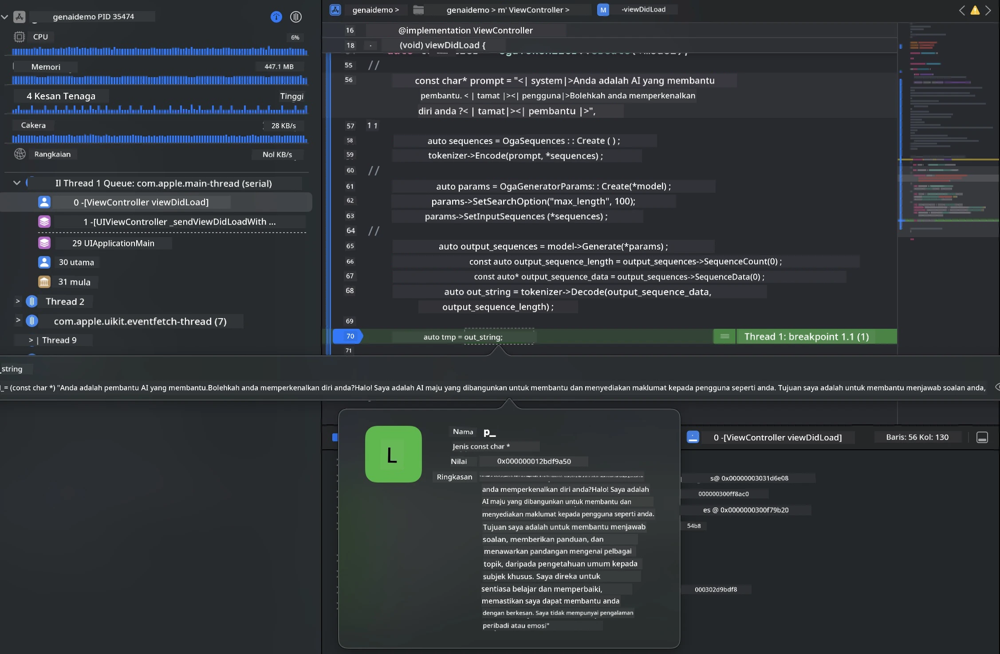

# **Inferens Phi-3 dalam iOS**

Phi-3-mini adalah siri model baru dari Microsoft yang membolehkan penyebaran Large Language Models (LLMs) pada peranti edge dan peranti IoT. Phi-3-mini tersedia untuk penyebaran iOS, Android, dan Peranti Edge, membolehkan AI generatif digunakan dalam persekitaran BYOD. Contoh berikut menunjukkan cara menyebarkan Phi-3-mini pada iOS.

## **1. Persediaan**

- **a.** macOS 14+
- **b.** Xcode 15+
- **c.** iOS SDK 17.x (iPhone 14 A16 atau lebih tinggi)
- **d.** Pasang Python 3.10+ (Conda disyorkan)
- **e.** Pasang perpustakaan Python: `python-flatbuffers`
- **f.** Pasang CMake

### Semantic Kernel dan Inferens

Semantic Kernel adalah rangka kerja aplikasi yang membolehkan anda mencipta aplikasi yang serasi dengan Azure OpenAI Service, model OpenAI, dan juga model tempatan. Mengakses perkhidmatan tempatan melalui Semantic Kernel memudahkan integrasi dengan pelayan model Phi-3-mini yang anda hoskan sendiri.

### Memanggil Model Quantized dengan Ollama atau LlamaEdge

Ramai pengguna lebih suka menggunakan model quantized untuk menjalankan model secara tempatan. [Ollama](https://ollama.com) dan [LlamaEdge](https://llamaedge.com) membolehkan pengguna memanggil pelbagai model quantized:

#### **Ollama**

Anda boleh menjalankan `ollama run phi3` secara langsung atau mengkonfigurasikannya secara offline. Cipta Modelfile dengan laluan ke fail `gguf` anda. Kod contoh untuk menjalankan model Phi-3-mini quantized:

```gguf
FROM {Add your gguf file path}
TEMPLATE \"\"\"<|user|> .Prompt<|end|> <|assistant|>\"\"\"
PARAMETER stop <|end|>
PARAMETER num_ctx 4096
```

#### **LlamaEdge**

Jika anda ingin menggunakan `gguf` pada kedua-dua peranti awan dan edge secara serentak, LlamaEdge adalah pilihan yang baik.

## **2. Menyusun ONNX Runtime untuk iOS**

```bash

git clone https://github.com/microsoft/onnxruntime.git

cd onnxruntime

./build.sh --build_shared_lib --ios --skip_tests --parallel --build_dir ./build_ios --ios --apple_sysroot iphoneos --osx_arch arm64 --apple_deploy_target 17.5 --cmake_generator Xcode --config Release

cd ../

```

### **Notis**

- **a.** Sebelum menyusun, pastikan Xcode dikonfigurasikan dengan betul dan tetapkan sebagai direktori pembangun aktif dalam terminal:

    ```bash
    sudo xcode-select -switch /Applications/Xcode.app/Contents/Developer
    ```

- **b.** ONNX Runtime perlu disusun untuk platform yang berbeza. Untuk iOS, anda boleh menyusun untuk `arm64` atau `x86_64`.

- **c.** Disyorkan menggunakan SDK iOS terkini untuk penyusunan. Namun, anda juga boleh menggunakan versi lama jika memerlukan keserasian dengan SDK terdahulu.

## **3. Menyusun Generative AI dengan ONNX Runtime untuk iOS**

> **Note:** Kerana Generative AI dengan ONNX Runtime masih dalam pratonton, sila maklum tentang kemungkinan perubahan.

```bash

git clone https://github.com/microsoft/onnxruntime-genai
 
cd onnxruntime-genai
 
mkdir ort
 
cd ort
 
mkdir include
 
mkdir lib
 
cd ../
 
cp ../onnxruntime/include/onnxruntime/core/session/onnxruntime_c_api.h ort/include
 
cp ../onnxruntime/build_ios/Release/Release-iphoneos/libonnxruntime*.dylib* ort/lib
 
export OPENCV_SKIP_XCODEBUILD_FORCE_TRYCOMPILE_DEBUG=1
 
python3 build.py --parallel --build_dir ./build_ios --ios --ios_sysroot iphoneos --ios_arch arm64 --ios_deployment_target 17.5 --cmake_generator Xcode --cmake_extra_defines CMAKE_XCODE_ATTRIBUTE_CODE_SIGNING_ALLOWED=NO

```

## **4. Cipta aplikasi App dalam Xcode**

Saya memilih Objective-C sebagai kaedah pembangunan App, kerana menggunakan Generative AI dengan ONNX Runtime C++ API, Objective-C lebih serasi. Sudah tentu, anda juga boleh melengkapkan panggilan berkaitan melalui penghubung Swift.



## **5. Salin model ONNX quantized INT4 ke projek aplikasi App**

Kita perlu mengimport model quantization INT4 dalam format ONNX, yang perlu dimuat turun terlebih dahulu



Selepas memuat turun, anda perlu menambahkannya ke direktori Resources projek dalam Xcode.



## **6. Menambah API C++ dalam ViewControllers**

> **Notis:**

- **a.** Tambah fail header C++ yang berkaitan ke dalam projek.

  

- **b.** Sertakan perpustakaan dinamik `onnxruntime-genai` dalam Xcode.

  

- **c.** Gunakan kod sampel C untuk ujian. Anda juga boleh menambah ciri tambahan seperti ChatUI untuk fungsi lebih lanjut.

- **d.** Oleh kerana anda perlu menggunakan C++ dalam projek, tukar nama `ViewController.m` kepada `ViewController.mm` untuk mengaktifkan sokongan Objective-C++.

```objc

    NSString *llmPath = [[NSBundle mainBundle] resourcePath];
    char const *modelPath = llmPath.cString;

    auto model =  OgaModel::Create(modelPath);

    auto tokenizer = OgaTokenizer::Create(*model);

    const char* prompt = "<|system|>You are a helpful AI assistant.<|end|><|user|>Can you introduce yourself?<|end|><|assistant|>";

    auto sequences = OgaSequences::Create();
    tokenizer->Encode(prompt, *sequences);

    auto params = OgaGeneratorParams::Create(*model);
    params->SetSearchOption("max_length", 100);
    params->SetInputSequences(*sequences);

    auto output_sequences = model->Generate(*params);
    const auto output_sequence_length = output_sequences->SequenceCount(0);
    const auto* output_sequence_data = output_sequences->SequenceData(0);
    auto out_string = tokenizer->Decode(output_sequence_data, output_sequence_length);
    
    auto tmp = out_string;

```

## **7. Menjalankan Aplikasi**

Setelah persediaan selesai, anda boleh menjalankan aplikasi untuk melihat hasil inferens model Phi-3-mini.



Untuk lebih banyak kod sampel dan arahan terperinci, lawati [Phi-3 Mini Samples repository](https://github.com/Azure-Samples/Phi-3MiniSamples/tree/main/ios).

**Penafian**:  
Dokumen ini telah diterjemahkan menggunakan perkhidmatan terjemahan AI [Co-op Translator](https://github.com/Azure/co-op-translator). Walaupun kami berusaha untuk ketepatan, sila ambil maklum bahawa terjemahan automatik mungkin mengandungi kesilapan atau ketidaktepatan. Dokumen asal dalam bahasa asalnya harus dianggap sebagai sumber yang sahih. Untuk maklumat penting, terjemahan profesional oleh manusia adalah disyorkan. Kami tidak bertanggungjawab atas sebarang salah faham atau salah tafsir yang timbul daripada penggunaan terjemahan ini.