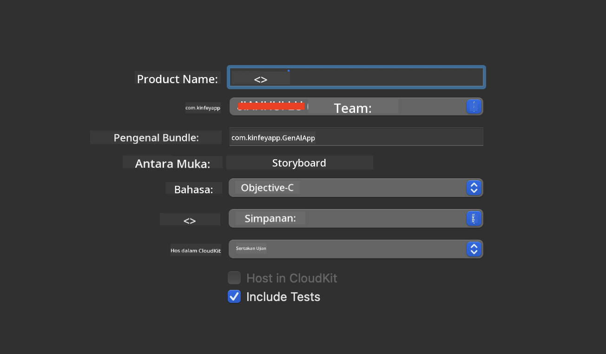
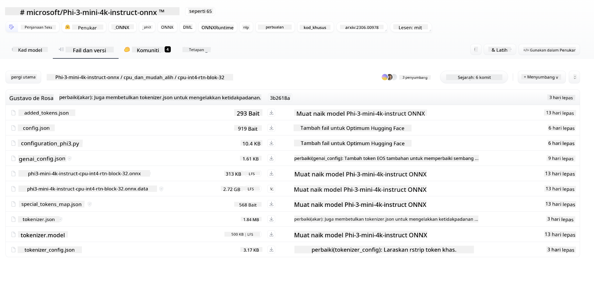
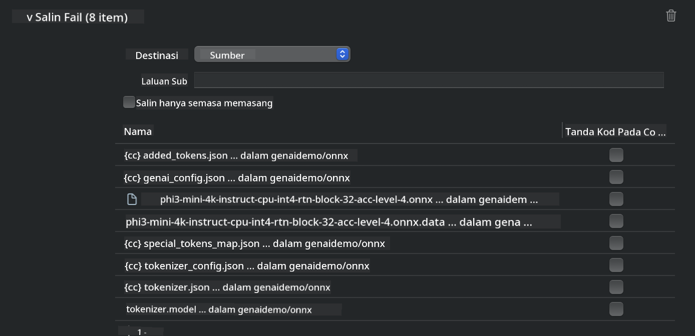
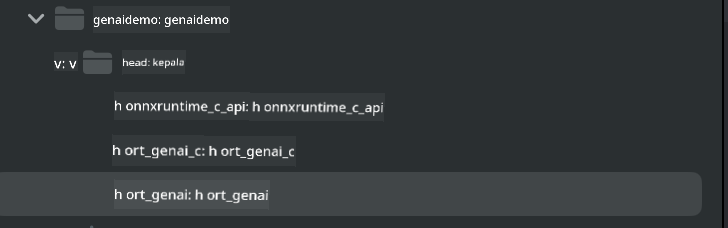
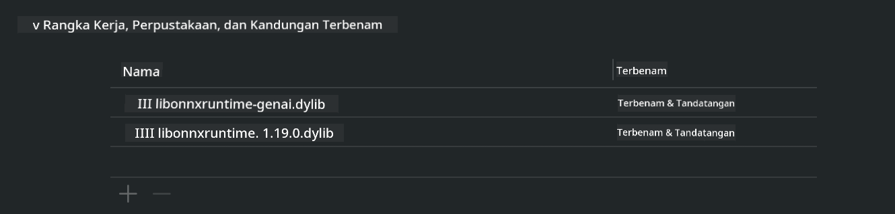
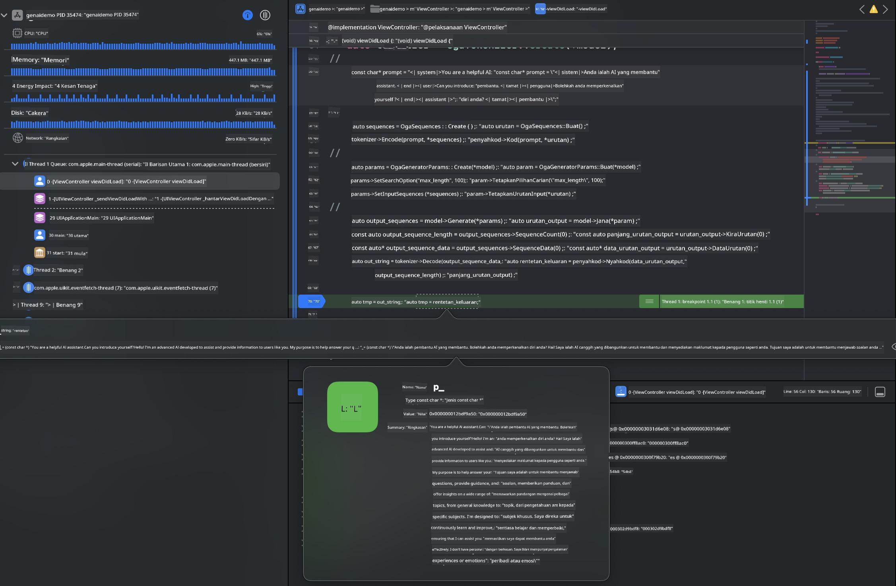

<!--
CO_OP_TRANSLATOR_METADATA:
{
  "original_hash": "82af197df38d25346a98f1f0e84d1698",
  "translation_date": "2025-05-09T11:02:58+00:00",
  "source_file": "md/01.Introduction/03/iOS_Inference.md",
  "language_code": "ms"
}
-->
# **استنتاج Phi-3 في iOS**

Phi-3-mini هي سلسلة جديدة من النماذج من Microsoft تتيح نشر نماذج اللغة الكبيرة (LLMs) على الأجهزة الطرفية وأجهزة إنترنت الأشياء. يتوفر Phi-3-mini لنشره على iOS وAndroid وأجهزة الحافة، مما يسمح بنشر الذكاء الاصطناعي التوليدي في بيئات BYOD. المثال التالي يوضح كيفية نشر Phi-3-mini على iOS.

## **1. التحضير**

- **أ.** macOS 14+
- **ب.** Xcode 15+
- **ج.** iOS SDK 17.x (iPhone 14 A16 أو أحدث)
- **د.** تثبيت Python 3.10+ (يفضل Conda)
- **هـ.** تثبيت مكتبة Python: `python-flatbuffers`
- **و.** تثبيت CMake

### Semantic Kernel والاستنتاج

Semantic Kernel هو إطار عمل تطبيقي يتيح لك إنشاء تطبيقات متوافقة مع Azure OpenAI Service ونماذج OpenAI وحتى النماذج المحلية. الوصول إلى الخدمات المحلية عبر Semantic Kernel يسهل التكامل مع خادم نموذج Phi-3-mini المستضاف ذاتيًا.

### استدعاء النماذج المحوَّلة باستخدام Ollama أو LlamaEdge

يفضل العديد من المستخدمين استخدام النماذج المحوَّلة لتشغيل النماذج محليًا. تتيح [Ollama](https://ollama.com) و[LlamaEdge](https://llamaedge.com) للمستخدمين استدعاء نماذج محوَّلة مختلفة:

#### **Ollama**

يمكنك تشغيل `ollama run phi3` مباشرة أو تكوينه في وضع عدم الاتصال. أنشئ ملف Modelfile مع مسار ملف `gguf` الخاص بك. مثال على كود تشغيل نموذج Phi-3-mini المحوَّل:

```gguf
FROM {Add your gguf file path}
TEMPLATE \"\"\"<|user|> .Prompt<|end|> <|assistant|>\"\"\"
PARAMETER stop <|end|>
PARAMETER num_ctx 4096
```

#### **LlamaEdge**

إذا كنت ترغب في استخدام `gguf` في السحابة وأجهزة الحافة في نفس الوقت، فإن LlamaEdge خيار ممتاز.

## **2. تجميع ONNX Runtime لـ iOS**

```bash

git clone https://github.com/microsoft/onnxruntime.git

cd onnxruntime

./build.sh --build_shared_lib --ios --skip_tests --parallel --build_dir ./build_ios --ios --apple_sysroot iphoneos --osx_arch arm64 --apple_deploy_target 17.5 --cmake_generator Xcode --config Release

cd ../

```

### **ملاحظة**

- **أ.** قبل التجميع، تأكد من تكوين Xcode بشكل صحيح وتعيينه كمجلد المطور النشط في الطرفية:

    ```bash
    sudo xcode-select -switch /Applications/Xcode.app/Contents/Developer
    ```

- **ب.** يجب تجميع ONNX Runtime لأنظمة تشغيل مختلفة. بالنسبة لـ iOS، يمكنك التجميع لـ `arm64` or `x86_64`.

- **ج.** يُنصح باستخدام أحدث إصدار من iOS SDK للتجميع. ومع ذلك، يمكنك استخدام إصدار أقدم إذا كنت بحاجة إلى التوافق مع SDKs سابقة.

## **3. تجميع الذكاء الاصطناعي التوليدي مع ONNX Runtime لـ iOS**

> **ملاحظة:** نظرًا لأن الذكاء الاصطناعي التوليدي مع ONNX Runtime في مرحلة المعاينة، يرجى مراعاة احتمال وجود تغييرات.

```bash

git clone https://github.com/microsoft/onnxruntime-genai
 
cd onnxruntime-genai
 
mkdir ort
 
cd ort
 
mkdir include
 
mkdir lib
 
cd ../
 
cp ../onnxruntime/include/onnxruntime/core/session/onnxruntime_c_api.h ort/include
 
cp ../onnxruntime/build_ios/Release/Release-iphoneos/libonnxruntime*.dylib* ort/lib
 
export OPENCV_SKIP_XCODEBUILD_FORCE_TRYCOMPILE_DEBUG=1
 
python3 build.py --parallel --build_dir ./build_ios --ios --ios_sysroot iphoneos --ios_arch arm64 --ios_deployment_target 17.5 --cmake_generator Xcode --cmake_extra_defines CMAKE_XCODE_ATTRIBUTE_CODE_SIGNING_ALLOWED=NO

```

## **4. إنشاء تطبيق App في Xcode**

اخترت Objective-C كطريقة تطوير التطبيق، لأن استخدام الذكاء الاصطناعي التوليدي مع ONNX Runtime API الخاص بـ C++ يجعل Objective-C أكثر توافقًا. بالطبع، يمكنك أيضًا إتمام الاستدعاءات ذات الصلة عبر جسر Swift.



## **5. نسخ نموذج ONNX المحوَّل INT4 إلى مشروع تطبيق App**

نحتاج إلى استيراد نموذج الكمون INT4 بتنسيق ONNX، والذي يجب تنزيله أولاً.



بعد التنزيل، تحتاج إلى إضافته إلى مجلد Resources الخاص بالمشروع في Xcode.



## **6. إضافة API C++ في ViewControllers**

> **ملاحظة:**

- **أ.** أضف ملفات رأس C++ المناسبة إلى المشروع.

  

- **ب.** قم بتضمين `onnxruntime-genai` dynamic library in Xcode.

  

- **c.** Use the C Samples code for testing. You can also add additional features like ChatUI for more functionality.

- **d.** Since you need to use C++ in your project, rename `ViewController.m` to `ViewController.mm` لتمكين دعم Objective-C++.

```objc

    NSString *llmPath = [[NSBundle mainBundle] resourcePath];
    char const *modelPath = llmPath.cString;

    auto model =  OgaModel::Create(modelPath);

    auto tokenizer = OgaTokenizer::Create(*model);

    const char* prompt = "<|system|>You are a helpful AI assistant.<|end|><|user|>Can you introduce yourself?<|end|><|assistant|>";

    auto sequences = OgaSequences::Create();
    tokenizer->Encode(prompt, *sequences);

    auto params = OgaGeneratorParams::Create(*model);
    params->SetSearchOption("max_length", 100);
    params->SetInputSequences(*sequences);

    auto output_sequences = model->Generate(*params);
    const auto output_sequence_length = output_sequences->SequenceCount(0);
    const auto* output_sequence_data = output_sequences->SequenceData(0);
    auto out_string = tokenizer->Decode(output_sequence_data, output_sequence_length);
    
    auto tmp = out_string;

```

## **7. تشغيل التطبيق**

بمجرد الانتهاء من الإعداد، يمكنك تشغيل التطبيق لمشاهدة نتائج استنتاج نموذج Phi-3-mini.



لمزيد من الأمثلة البرمجية والتعليمات التفصيلية، قم بزيارة [مستودع عينات Phi-3 Mini](https://github.com/Azure-Samples/Phi-3MiniSamples/tree/main/ios).

**Penafian**:  
Dokumen ini telah diterjemahkan menggunakan perkhidmatan terjemahan AI [Co-op Translator](https://github.com/Azure/co-op-translator). Walaupun kami berusaha untuk ketepatan, sila ambil perhatian bahawa terjemahan automatik mungkin mengandungi kesilapan atau ketidaktepatan. Dokumen asal dalam bahasa asalnya harus dianggap sebagai sumber yang sah. Untuk maklumat penting, terjemahan profesional oleh manusia adalah disyorkan. Kami tidak bertanggungjawab atas sebarang salah faham atau salah tafsir yang timbul daripada penggunaan terjemahan ini.