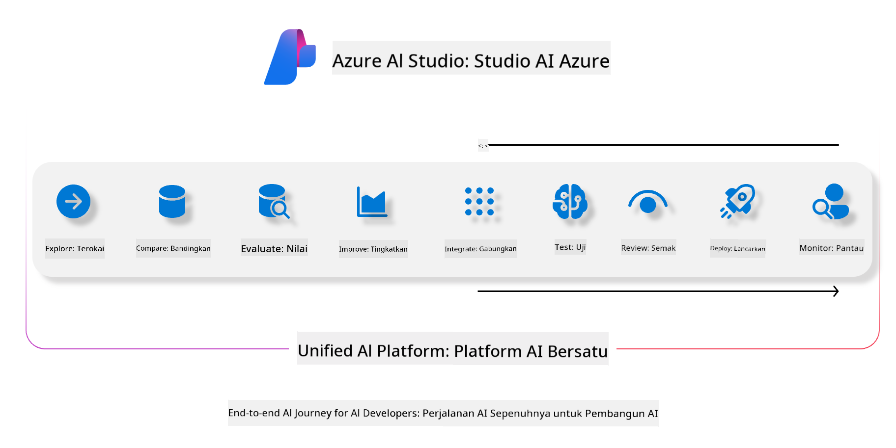

<!--
CO_OP_TRANSLATOR_METADATA:
{
  "original_hash": "7b4235159486df4000e16b7b46ddfec3",
  "translation_date": "2025-07-16T22:32:48+00:00",
  "source_file": "md/01.Introduction/05/AIFoundry.md",
  "language_code": "ms"
}
-->
# **Menggunakan Azure AI Foundry untuk penilaian**

Cara menilai aplikasi AI generatif anda menggunakan [Azure AI Foundry](https://ai.azure.com?WT.mc_id=aiml-138114-kinfeylo). Sama ada anda menilai perbualan satu pusingan atau berbilang pusingan, Azure AI Foundry menyediakan alat untuk menilai prestasi dan keselamatan model.

## Cara menilai aplikasi AI generatif dengan Azure AI Foundry
Untuk arahan lebih terperinci, lihat [Dokumentasi Azure AI Foundry](https://learn.microsoft.com/azure/ai-studio/how-to/evaluate-generative-ai-app?WT.mc_id=aiml-138114-kinfeylo)

Berikut adalah langkah-langkah untuk memulakan:

## Menilai Model AI Generatif dalam Azure AI Foundry

**Prasyarat**

- Set data ujian dalam format CSV atau JSON.
- Model AI generatif yang telah dideploy (seperti Phi-3, GPT 3.5, GPT 4, atau model Davinci).
- Runtime dengan instance pengkomputeran untuk menjalankan penilaian.

## Metrik Penilaian Terbina Dalam

Azure AI Foundry membolehkan anda menilai perbualan satu pusingan dan juga perbualan kompleks berbilang pusingan.  
Untuk senario Retrieval Augmented Generation (RAG), di mana model berasaskan data tertentu, anda boleh menilai prestasi menggunakan metrik penilaian terbina dalam.  
Selain itu, anda juga boleh menilai senario menjawab soalan satu pusingan secara umum (bukan RAG).

## Membuat Larian Penilaian

Dari UI Azure AI Foundry, navigasi ke halaman Evaluate atau halaman Prompt Flow.  
Ikuti wizard penciptaan penilaian untuk menyediakan larian penilaian. Berikan nama pilihan untuk penilaian anda.  
Pilih senario yang selaras dengan objektif aplikasi anda.  
Pilih satu atau lebih metrik penilaian untuk menilai output model.

## Aliran Penilaian Tersuai (Pilihan)

Untuk fleksibiliti lebih tinggi, anda boleh membina aliran penilaian tersuai. Sesuaikan proses penilaian mengikut keperluan khusus anda.

## Melihat Keputusan

Selepas menjalankan penilaian, log, lihat, dan analisis metrik penilaian terperinci dalam Azure AI Foundry. Dapatkan pandangan tentang keupayaan dan had aplikasi anda.

**Note** Azure AI Foundry kini dalam pratonton awam, jadi gunakan untuk tujuan eksperimen dan pembangunan. Untuk beban kerja produksi, pertimbangkan pilihan lain. Terokai [dokumentasi AI Foundry rasmi](https://learn.microsoft.com/azure/ai-studio/?WT.mc_id=aiml-138114-kinfeylo) untuk maklumat lanjut dan arahan langkah demi langkah.

**Penafian**:  
Dokumen ini telah diterjemahkan menggunakan perkhidmatan terjemahan AI [Co-op Translator](https://github.com/Azure/co-op-translator). Walaupun kami berusaha untuk ketepatan, sila ambil maklum bahawa terjemahan automatik mungkin mengandungi kesilapan atau ketidaktepatan. Dokumen asal dalam bahasa asalnya harus dianggap sebagai sumber yang sahih. Untuk maklumat penting, terjemahan profesional oleh manusia adalah disyorkan. Kami tidak bertanggungjawab atas sebarang salah faham atau salah tafsir yang timbul daripada penggunaan terjemahan ini.