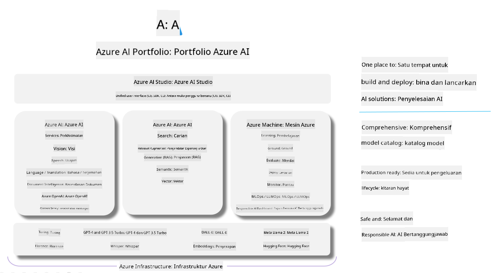

<!--
CO_OP_TRANSLATOR_METADATA:
{
  "original_hash": "7b4235159486df4000e16b7b46ddfec3",
  "translation_date": "2025-05-09T15:01:40+00:00",
  "source_file": "md/01.Introduction/05/AIFoundry.md",
  "language_code": "ms"
}
-->
# **Usando Azure AI Foundry para evaluación**

Cómo evaluar tu aplicación de IA generativa usando [Azure AI Foundry](https://ai.azure.com?WT.mc_id=aiml-138114-kinfeylo). Ya sea que estés evaluando conversaciones de una sola vuelta o de varias, Azure AI Foundry ofrece herramientas para medir el rendimiento y la seguridad del modelo.

## Cómo evaluar aplicaciones de IA generativa con Azure AI Foundry
Para instrucciones más detalladas, consulta la [Documentación de Azure AI Foundry](https://learn.microsoft.com/azure/ai-studio/how-to/evaluate-generative-ai-app?WT.mc_id=aiml-138114-kinfeylo)

Estos son los pasos para comenzar:

## Evaluación de modelos de IA generativa en Azure AI Foundry

**Requisitos previos**

- Un conjunto de datos de prueba en formato CSV o JSON.
- Un modelo de IA generativa desplegado (como Phi-3, GPT 3.5, GPT 4 o modelos Davinci).
- Un entorno de ejecución con una instancia de cómputo para realizar la evaluación.

## Métricas de evaluación integradas

Azure AI Foundry permite evaluar tanto conversaciones de una sola vuelta como conversaciones complejas de varias vueltas.  
Para escenarios de Retrieval Augmented Generation (RAG), donde el modelo se basa en datos específicos, puedes medir el rendimiento usando las métricas de evaluación integradas.  
Además, puedes evaluar escenarios generales de preguntas y respuestas de una sola vuelta (no RAG).

## Creación de una ejecución de evaluación

Desde la interfaz de Azure AI Foundry, navega a la página Evaluate o a la página Prompt Flow.  
Sigue el asistente para crear una ejecución de evaluación. Puedes asignar un nombre opcional a tu evaluación.  
Selecciona el escenario que mejor se adapte a los objetivos de tu aplicación.  
Elige una o varias métricas de evaluación para valorar los resultados del modelo.

## Flujo de evaluación personalizado (Opcional)

Para mayor flexibilidad, puedes crear un flujo de evaluación personalizado. Ajusta el proceso de evaluación según tus necesidades específicas.

## Visualización de resultados

Después de ejecutar la evaluación, registra, visualiza y analiza las métricas detalladas en Azure AI Foundry. Obtén información sobre las capacidades y limitaciones de tu aplicación.

**Note** Azure AI Foundry está actualmente en vista previa pública, por lo que se recomienda usarlo para experimentación y desarrollo. Para cargas de trabajo en producción, considera otras opciones. Consulta la [documentación oficial de AI Foundry](https://learn.microsoft.com/azure/ai-studio/?WT.mc_id=aiml-138114-kinfeylo) para más detalles e instrucciones paso a paso.

**Penafian**:  
Dokumen ini telah diterjemahkan menggunakan perkhidmatan terjemahan AI [Co-op Translator](https://github.com/Azure/co-op-translator). Walaupun kami berusaha untuk ketepatan, sila maklum bahawa terjemahan automatik mungkin mengandungi kesilapan atau ketidaktepatan. Dokumen asal dalam bahasa asalnya harus dianggap sebagai sumber yang sahih. Untuk maklumat penting, terjemahan profesional oleh manusia adalah disyorkan. Kami tidak bertanggungjawab atas sebarang salah faham atau salah tafsir yang timbul daripada penggunaan terjemahan ini.