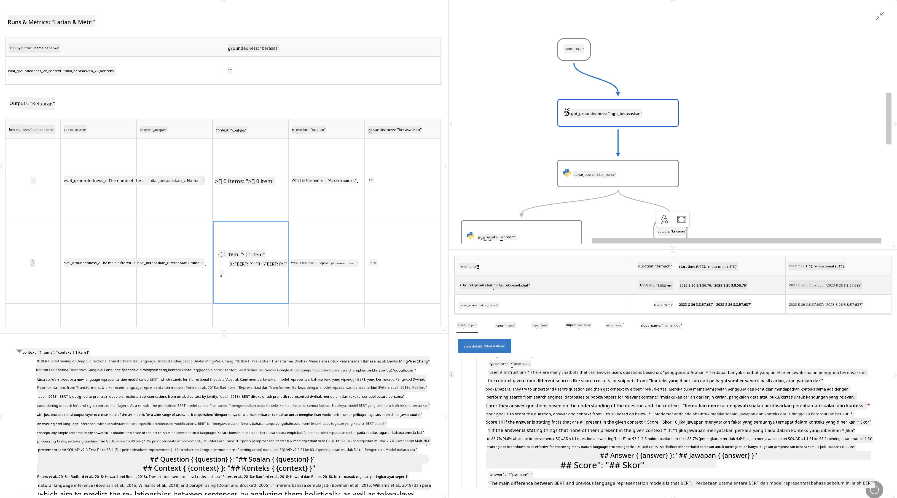

<!--
CO_OP_TRANSLATOR_METADATA:
{
  "original_hash": "3cbe7629d254f1043193b7fe22524d55",
  "translation_date": "2025-07-16T22:43:11+00:00",
  "source_file": "md/01.Introduction/05/Promptflow.md",
  "language_code": "ms"
}
-->
# **Memperkenalkan Promptflow**

[Microsoft Prompt Flow](https://microsoft.github.io/promptflow/index.html?WT.mc_id=aiml-138114-kinfeylo) adalah alat automasi aliran kerja visual yang membolehkan pengguna mencipta aliran kerja automatik menggunakan templat siap dan penyambung tersuai. Ia direka untuk membolehkan pembangun dan penganalisis perniagaan membina proses automatik dengan pantas untuk tugasan seperti pengurusan data, kerjasama, dan pengoptimuman proses. Dengan Prompt Flow, pengguna boleh dengan mudah menghubungkan perkhidmatan, aplikasi, dan sistem yang berbeza, serta mengautomasikan proses perniagaan yang kompleks.

Microsoft Prompt Flow direka untuk mempermudah kitaran pembangunan aplikasi AI dari awal hingga akhir yang dikuasakan oleh Large Language Models (LLMs). Sama ada anda sedang merancang idea, membuat prototaip, menguji, menilai, atau melancarkan aplikasi berasaskan LLM, Prompt Flow memudahkan proses tersebut dan membolehkan anda membina aplikasi LLM dengan kualiti produksi.

## Berikut adalah ciri utama dan manfaat menggunakan Microsoft Prompt Flow:

**Pengalaman Penulisan Interaktif**

Prompt Flow menyediakan representasi visual struktur aliran anda, memudahkan pemahaman dan navigasi projek anda.  
Ia menawarkan pengalaman pengekodan seperti buku nota untuk pembangunan dan penyahpepijatan aliran yang cekap.

**Variasi dan Penalaan Prompt**

Cipta dan bandingkan pelbagai variasi prompt untuk memudahkan proses penambahbaikan secara berulang. Nilai prestasi pelbagai prompt dan pilih yang paling berkesan.

**Aliran Penilaian Terbina Dalam**  
Nilai kualiti dan keberkesanan prompt dan aliran anda menggunakan alat penilaian terbina dalam.  
Fahami sejauh mana prestasi aplikasi berasaskan LLM anda.

**Sumber Komprehensif**

Prompt Flow termasuk perpustakaan alat, contoh, dan templat terbina dalam. Sumber ini berfungsi sebagai titik permulaan pembangunan, memberi inspirasi kreativiti, dan mempercepatkan proses.

**Kerjasama dan Kesediaan Perusahaan**

Sokong kerjasama pasukan dengan membenarkan pelbagai pengguna bekerja bersama dalam projek kejuruteraan prompt.  
Kekalkan kawalan versi dan kongsi pengetahuan dengan berkesan. Permudahkan keseluruhan proses kejuruteraan prompt, dari pembangunan dan penilaian hingga pelancaran dan pemantauan.

## Penilaian dalam Prompt Flow

Dalam Microsoft Prompt Flow, penilaian memainkan peranan penting dalam menilai sejauh mana prestasi model AI anda. Mari kita terokai bagaimana anda boleh menyesuaikan aliran dan metrik penilaian dalam Prompt Flow:

**Memahami Penilaian dalam Prompt Flow**

Dalam Prompt Flow, aliran mewakili urutan nod yang memproses input dan menghasilkan output. Aliran penilaian adalah jenis aliran khas yang direka untuk menilai prestasi sesuatu run berdasarkan kriteria dan matlamat tertentu.

**Ciri utama aliran penilaian**

Ia biasanya dijalankan selepas aliran yang diuji, menggunakan outputnya. Ia mengira skor atau metrik untuk mengukur prestasi aliran yang diuji. Metrik boleh merangkumi ketepatan, skor relevan, atau ukuran lain yang berkaitan.

### Menyesuaikan Aliran Penilaian

**Menentukan Input**

Aliran penilaian perlu menerima output dari run yang diuji. Tentukan input sama seperti aliran biasa.  
Sebagai contoh, jika anda menilai aliran QnA, namakan input sebagai "answer." Jika menilai aliran klasifikasi, namakan input sebagai "category." Input kebenaran sebenar (contohnya, label sebenar) juga mungkin diperlukan.

**Output dan Metrik**

Aliran penilaian menghasilkan keputusan yang mengukur prestasi aliran yang diuji. Metrik boleh dikira menggunakan Python atau LLM (Large Language Models). Gunakan fungsi log_metric() untuk merekod metrik yang berkaitan.

**Menggunakan Aliran Penilaian Tersuai**

Bangunkan aliran penilaian anda sendiri yang disesuaikan dengan tugasan dan objektif khusus anda. Sesuaikan metrik berdasarkan matlamat penilaian anda.  
Gunakan aliran penilaian tersuai ini untuk run secara berkelompok bagi ujian berskala besar.

## Kaedah Penilaian Terbina Dalam

Prompt Flow juga menyediakan kaedah penilaian terbina dalam.  
Anda boleh menghantar run berkelompok dan menggunakan kaedah ini untuk menilai sejauh mana prestasi aliran anda dengan set data besar.  
Lihat keputusan penilaian, bandingkan metrik, dan ulangi proses mengikut keperluan.  
Ingat, penilaian adalah penting untuk memastikan model AI anda memenuhi kriteria dan matlamat yang diingini. Terokai dokumentasi rasmi untuk arahan terperinci mengenai pembangunan dan penggunaan aliran penilaian dalam Microsoft Prompt Flow.

Secara ringkas, Microsoft Prompt Flow memberi kuasa kepada pembangun untuk mencipta aplikasi LLM berkualiti tinggi dengan mempermudah kejuruteraan prompt dan menyediakan persekitaran pembangunan yang kukuh. Jika anda bekerja dengan LLM, Prompt Flow adalah alat yang sangat berguna untuk diterokai. Terokai [Dokumen Penilaian Prompt Flow](https://learn.microsoft.com/azure/machine-learning/prompt-flow/how-to-develop-an-evaluation-flow?view=azureml-api-2?WT.mc_id=aiml-138114-kinfeylo) untuk arahan terperinci mengenai pembangunan dan penggunaan aliran penilaian dalam Microsoft Prompt Flow.

**Penafian**:  
Dokumen ini telah diterjemahkan menggunakan perkhidmatan terjemahan AI [Co-op Translator](https://github.com/Azure/co-op-translator). Walaupun kami berusaha untuk ketepatan, sila ambil maklum bahawa terjemahan automatik mungkin mengandungi kesilapan atau ketidaktepatan. Dokumen asal dalam bahasa asalnya harus dianggap sebagai sumber yang sahih. Untuk maklumat penting, terjemahan profesional oleh manusia adalah disyorkan. Kami tidak bertanggungjawab atas sebarang salah faham atau salah tafsir yang timbul daripada penggunaan terjemahan ini.