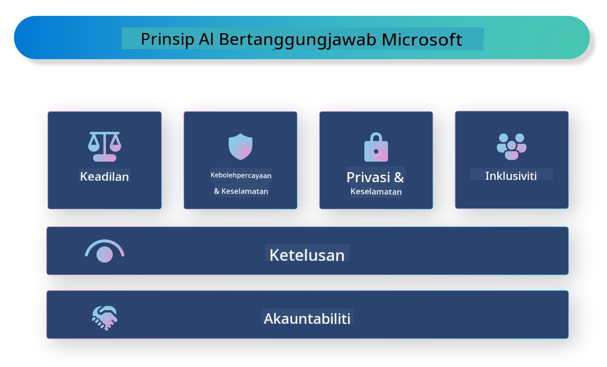

<!--
CO_OP_TRANSLATOR_METADATA:
{
  "original_hash": "805b96b20152936d8f4c587d90d6e06e",
  "translation_date": "2025-05-09T15:42:16+00:00",
  "source_file": "md/01.Introduction/05/ResponsibleAI.md",
  "language_code": "ms"
}
-->
# **היכרות עם Responsible AI**

[Microsoft Responsible AI](https://www.microsoft.com/ai/responsible-ai?WT.mc_id=aiml-138114-kinfeylo) היא יוזמה שמטרתה לסייע למפתחים ולארגונים לבנות מערכות בינה מלאכותית שקופות, אמינות ואחראיות. היוזמה מספקת הנחיות ומשאבים לפיתוח פתרונות AI אחראיים שמתיישבים עם עקרונות אתיים, כמו פרטיות, הוגנות ושקיפות. בנוסף, נסקור כמה מהאתגרים והנוהגים הטובים ביותר הקשורים לבניית מערכות AI אחראיות.

## סקירה של Microsoft Responsible AI

**עקרונות אתיים**

Microsoft Responsible AI מונחה על ידי סט עקרונות אתיים, כגון פרטיות, הוגנות, שקיפות, אחריות ובטיחות. עקרונות אלו נועדו להבטיח שמערכות AI מפותחות בצורה אתית ואחראית.

**AI שקוף**

Microsoft Responsible AI מדגישה את חשיבות השקיפות במערכות AI. זה כולל מתן הסברים ברורים על אופן פעולת מודלי ה-AI, וכן הבטחת נגישות ציבורית למקורות הנתונים והאלגוריתמים.

**AI אחראי**

[Microsoft Responsible AI](https://www.microsoft.com/ai/responsible-ai?WT.mc_id=aiml-138114-kinfeylo) מקדמת פיתוח מערכות AI אחראיות, שיכולות לספק תובנות על האופן שבו מודלי ה-AI מקבלים החלטות. זה מסייע למשתמשים להבין ולבטוח בתוצאות המערכות.

**הכללה**

מערכות AI צריכות להיות מעוצבות לטובת כולם. מיקרוסופט שואפת ליצור AI כוללני שמתחשב בפרספקטיבות מגוונות ומונע הטיות או אפליה.

**אמינות ובטיחות**

הבטחת אמינות ובטיחות של מערכות AI היא קריטית. מיקרוסופט מתמקדת בבניית מודלים חזקים שמבצעים באופן עקבי ומונעים תוצאות מזיקות.

**הוגנות ב-AI**

Microsoft Responsible AI מכירה בכך שמערכות AI עלולות לשמר הטיות אם הן מאומנות על נתונים או אלגוריתמים מוטים. היוזמה מספקת הנחיות לפיתוח מערכות AI הוגנות שאינן מפלות על בסיס גורמים כמו גזע, מגדר או גיל.

**פרטיות ואבטחה**

Microsoft Responsible AI מדגישה את החשיבות בהגנה על פרטיות המשתמש ואבטחת הנתונים במערכות AI. זה כולל יישום הצפנת נתונים חזקה ובקרות גישה, וכן ביקורות תקופתיות לזיהוי פרצות אבטחה.

**אחריות ואחראיות**

Microsoft Responsible AI מקדמת אחריות ואחראיות בפיתוח והטמעת AI. זה כולל הבטחת מודעות של מפתחים וארגונים לסיכונים הפוטנציאליים במערכות AI ונקיטת צעדים למזעורם.

## נוהגים מומלצים לבניית מערכות AI אחראיות

**פיתוח מודלי AI באמצעות מערכי נתונים מגוונים**

כדי למנוע הטיות במערכות AI, חשוב להשתמש במערכי נתונים מגוונים המייצגים טווח רחב של נקודות מבט וניסיון.

**שימוש בטכניקות AI ברורות להסבר**

טכניקות AI ברורות להסבר יכולות לסייע למשתמשים להבין כיצד מודלי ה-AI מקבלים החלטות, מה שמגביר את האמון במערכת.

**ביצוע ביקורות תקופתיות לזיהוי פרצות במערכות AI**

ביקורות שוטפות של מערכות AI יכולות לסייע בזיהוי סיכונים ופרצות שיש לטפל בהם.

**יישום הצפנת נתונים חזקה ובקרות גישה**

הצפנת נתונים ובקרות גישה מסייעות להגן על פרטיות וביטחון המשתמשים במערכות AI.

**שמירה על עקרונות אתיים בפיתוח AI**

שמירה על עקרונות אתיים כמו הוגנות, שקיפות ואחריות יכולה לסייע בבניית אמון במערכות AI ולהבטיח פיתוח אחראי.

## שימוש ב-AI Foundry ל-Responsible AI

[Azure AI Foundry](https://ai.azure.com?WT.mc_id=aiml-138114-kinfeylo) היא פלטפורמה עוצמתית המאפשרת למפתחים וארגונים ליצור במהירות יישומים אינטליגנטיים, חדשניים, מוכנים לשוק ואחראיים. הנה כמה תכונות מרכזיות של Azure AI Foundry:

**APIs ומודלים מוכנים לשימוש**

Azure AI Foundry מספקת APIs ומודלים מוכנים לשימוש ומותאמים אישית. הם מכסים מגוון רחב של משימות AI, כולל AI גנרטיבי, עיבוד שפה טבעית לשיחות, חיפוש, ניטור, תרגום, דיבור, ראייה וקבלת החלטות.

**Prompt Flow**

Prompt Flow ב-Azure AI Foundry מאפשר ליצור חוויות AI שיחתי. הוא מאפשר לעצב ולנהל זרימות שיחה, מה שמקל על בניית צ'טבוטים, עוזרים וירטואליים ויישומים אינטראקטיביים אחרים.

**Retrieval Augmented Generation (RAG)**

RAG היא טכניקה המשלבת גישות מבוססות שליפה וגנרטיביות. היא משפרת את איכות התגובות המופקות באמצעות ניצול ידע קיים (שליפה) ויצירה יצירתית (גנרטיבית).

**מדדי הערכה וניטור ל-AI גנרטיבי**

Azure AI Foundry מספקת כלים להערכת וניטור מודלים גנרטיביים. ניתן להעריך את ביצועיהם, הוגנותם ומדדים חשובים נוספים להבטחת הטמעה אחראית. בנוסף, אם יצרתם לוח בקרה, ניתן להשתמש בממשק ללא קוד ב-Azure Machine Learning Studio להתאמה אישית וליצירת לוח בקרה Responsible AI וכרטיס ניקוד מבוססי על [Repsonsible AI Toolbox](https://responsibleaitoolbox.ai/?WT.mc_id=aiml-138114-kinfeylo) Python Libraries. כרטיס הניקוד הזה מסייע לשתף תובנות מרכזיות הקשורות להוגנות, חשיבות תכונות ושיקולי הטמעה אחראית עם בעלי עניין טכניים ולא טכניים כאחד.

כדי להשתמש ב-AI Foundry עם Responsible AI, מומלץ לפעול לפי הנוהגים הבאים:

**הגדרת הבעיה והמטרות של מערכת ה-AI**

לפני תחילת תהליך הפיתוח, חשוב להגדיר בבירור את הבעיה או המטרה שהמערכת שואפת לפתור. זה יעזור לזהות את הנתונים, האלגוריתמים והמשאבים הדרושים לבניית מודל יעיל.

**איסוף ועיבוד מקדים של נתונים רלוונטיים**

איכות וכמות הנתונים בהם משתמשים לאימון מערכת AI משפיעים משמעותית על ביצועיה. לכן, חשוב לאסוף נתונים רלוונטיים, לנקותם, לעבדם מראש ולהבטיח שהם מייצגים את האוכלוסייה או הבעיה שברצונכם לפתור.

**בחירת אלגוריתם הערכה מתאים**

קיימים אלגוריתמי הערכה שונים. חשוב לבחור את האלגוריתם המתאים ביותר בהתבסס על הנתונים והבעיה שלכם.

**הערכת המודל ופירוש התוצאות**

לאחר בניית מודל AI, חשוב להעריך את ביצועיו באמצעות מדדים מתאימים ולפרש את התוצאות בשקיפות. זה יסייע לזהות הטיות או מגבלות במודל ולבצע שיפורים במידת הצורך.

**הבטחת שקיפות והסבר**

מערכות AI צריכות להיות שקופות וברורות להסבר כדי שמשתמשים יבינו כיצד הן פועלות ואיך מתקבלות ההחלטות. זה חשוב במיוחד ליישומים בעלי השפעה משמעותית על חיי אדם, כמו בריאות, פיננסים ומערכות משפטיות.

**ניטור ועדכון המודל**

מערכות AI צריכות להיות במעקב מתמיד ולעבור עדכונים כדי להבטיח שהן נשארות מדויקות ויעילות לאורך זמן. זה דורש תחזוקה שוטפת, בדיקות ואימון מחודש של המודל.

לסיכום, Microsoft Responsible AI היא יוזמה שמטרתה לסייע למפתחים וארגונים לבנות מערכות AI שקופות, אמינות ואחראיות. יש לזכור כי יישום אחראי של AI הוא קריטי, ו-Azure AI Foundry שואפת להפוך זאת לפרקטי בארגונים. באמצעות שמירה על עקרונות אתיים ונוהגים מומלצים, נוכל להבטיח שמערכות AI מפותחות ומוטמעות באופן אחראי שמביא תועלת לחברה כולה.

**Penafian**:  
Dokumen ini telah diterjemahkan menggunakan perkhidmatan terjemahan AI [Co-op Translator](https://github.com/Azure/co-op-translator). Walaupun kami berusaha untuk ketepatan, sila ambil maklum bahawa terjemahan automatik mungkin mengandungi kesilapan atau ketidaktepatan. Dokumen asal dalam bahasa asalnya hendaklah dianggap sebagai sumber yang sahih. Untuk maklumat penting, terjemahan profesional oleh manusia adalah disyorkan. Kami tidak bertanggungjawab atas sebarang salah faham atau salah tafsir yang timbul daripada penggunaan terjemahan ini.