<!--
CO_OP_TRANSLATOR_METADATA:
{
  "original_hash": "80a853c08e4ee25ef9b4bfcedd8990da",
  "translation_date": "2025-05-09T17:03:05+00:00",
  "source_file": "md/02.Application/01.TextAndChat/Phi3/E2E_Phi-3-Evaluation_AIFoundry.md",
  "language_code": "ms"
}
-->
# Evaluate the Fine-tuned Phi-3 / Phi-3.5 Model in Azure AI Foundry Focusing on Microsoft's Responsible AI Principles

This end-to-end (E2E) sample is based on the guide "[Evaluate Fine-tuned Phi-3 / 3.5 Models in Azure AI Foundry Focusing on Microsoft's Responsible AI](https://techcommunity.microsoft.com/blog/educatordeveloperblog/evaluate-fine-tuned-phi-3--3-5-models-in-azure-ai-studio-focusing-on-microsofts-/4227850?WT.mc_id=aiml-137032-kinfeylo)" from the Microsoft Tech Community.

## Overview

### How can you evaluate the safety and performance of a fine-tuned Phi-3 / Phi-3.5 model in Azure AI Foundry?

Fine-tuning a model can sometimes lead to unintended or undesired responses. To ensure that the model remains safe and effective, it's important to evaluate the model's potential to generate harmful content and its ability to produce accurate, relevant, and coherent responses. In this tutorial, you will learn how to evaluate the safety and performance of a fine-tuned Phi-3 / Phi-3.5 model integrated with Prompt flow in Azure AI Foundry.

Here is an Azure AI Foundry's evaluation process.

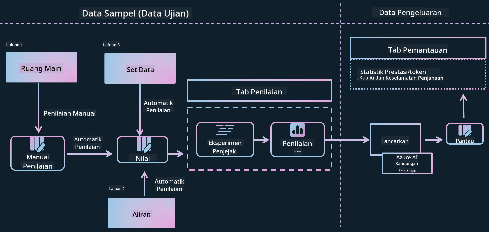

*Image Source: [Evaluation of generative AI applications](https://learn.microsoft.com/azure/ai-studio/concepts/evaluation-approach-gen-ai?wt.mc_id%3Dstudentamb_279723)*

> [!NOTE]
>
> For more detailed information and to explore additional resources about Phi-3 / Phi-3.5, please visit the [Phi-3CookBook](https://github.com/microsoft/Phi-3CookBook?wt.mc_id=studentamb_279723).

### Prerequisites

- [Python](https://www.python.org/downloads)
- [Azure subscription](https://azure.microsoft.com/free?wt.mc_id=studentamb_279723)
- [Visual Studio Code](https://code.visualstudio.com)
- Fine-tuned Phi-3 / Phi-3.5 model

### Table of Contents

1. [**Scenario 1: Introduction to Azure AI Foundry's Prompt flow evaluation**](../../../../../../md/02.Application/01.TextAndChat/Phi3)

    - [Introduction to safety evaluation](../../../../../../md/02.Application/01.TextAndChat/Phi3)
    - [Introduction to performance evaluation](../../../../../../md/02.Application/01.TextAndChat/Phi3)

1. [**Scenario 2: Evaluating the Phi-3 / Phi-3.5 model in Azure AI Foundry**](../../../../../../md/02.Application/01.TextAndChat/Phi3)

    - [Before you begin](../../../../../../md/02.Application/01.TextAndChat/Phi3)
    - [Deploy Azure OpenAI to evaluate the Phi-3 / Phi-3.5 model](../../../../../../md/02.Application/01.TextAndChat/Phi3)
    - [Evaluate the fine-tuned Phi-3 / Phi-3.5 model using Azure AI Foundry's Prompt flow evaluation](../../../../../../md/02.Application/01.TextAndChat/Phi3)

1. [Congratulations!](../../../../../../md/02.Application/01.TextAndChat/Phi3)

## **Scenario 1: Introduction to Azure AI Foundry's Prompt flow evaluation**

### Introduction to safety evaluation

To ensure that your AI model is ethical and safe, it's crucial to evaluate it against Microsoft's Responsible AI Principles. In Azure AI Foundry, safety evaluations allow you to assess your model’s vulnerability to jailbreak attacks and its potential to generate harmful content, which aligns directly with these principles.

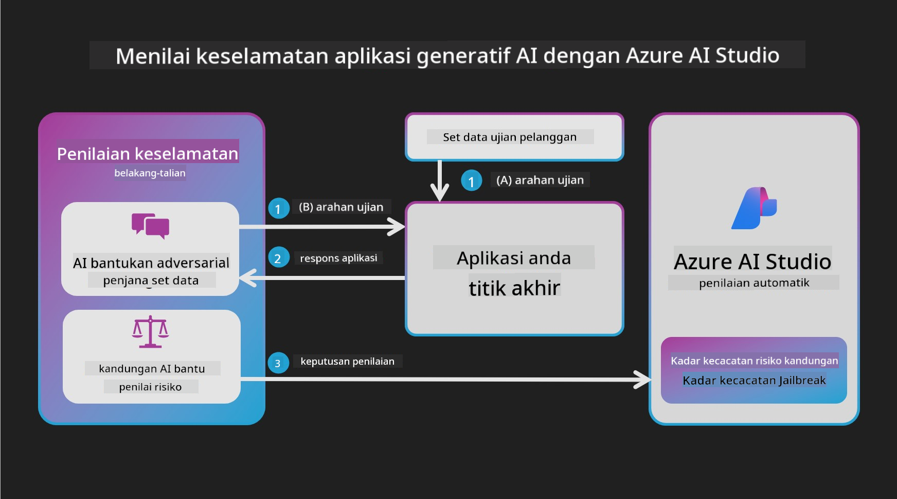

*Image Source: [Evaluation of generative AI applications](https://learn.microsoft.com/azure/ai-studio/concepts/evaluation-approach-gen-ai?wt.mc_id%3Dstudentamb_279723)*

#### Microsoft’s Responsible AI Principles

Before starting the technical steps, it’s important to understand Microsoft's Responsible AI Principles—an ethical framework designed to guide the responsible development, deployment, and operation of AI systems. These principles ensure AI technologies are built fairly, transparently, and inclusively. They form the foundation for evaluating AI model safety.

Microsoft's Responsible AI Principles include:

- **Fairness and Inclusiveness**: AI systems should treat everyone fairly and avoid treating similar groups differently. For example, when AI provides advice on medical treatment, loan applications, or hiring, it should offer consistent recommendations to people with similar symptoms, financial situations, or qualifications.

- **Reliability and Safety**: Trustworthy AI systems must operate reliably, safely, and consistently. They should function as intended, handle unexpected situations safely, and resist harmful manipulation. Their behavior should reflect the range of scenarios developers anticipated during design and testing.

- **Transparency**: When AI decisions significantly impact people's lives, it’s vital that users understand how those decisions were made. For example, a bank using AI to assess creditworthiness or a company using AI to select job candidates should ensure transparency.

- **Privacy and Security**: As AI becomes widespread, protecting privacy and securing personal and business data becomes more complex. Since AI requires data access to make accurate predictions and decisions, privacy and security must be carefully managed.

- **Accountability**: Designers and deployers of AI systems must be responsible for how their systems operate. Organizations should follow industry standards to ensure AI systems are not the sole authority on decisions affecting people’s lives and that humans retain meaningful control over highly autonomous AI.

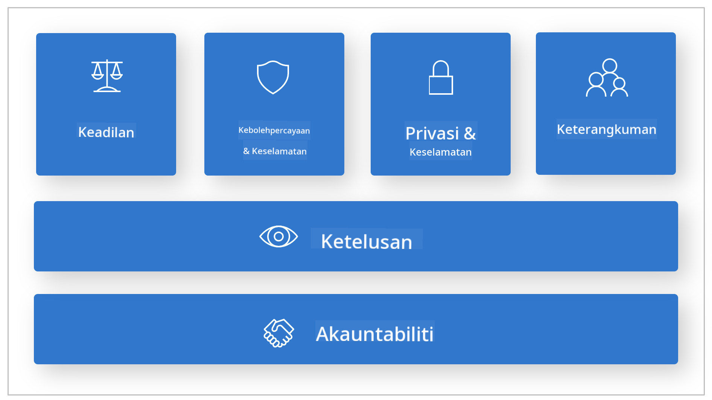

*Image Source: [What is Responsible AI?](https://learn.microsoft.com/azure/machine-learning/concept-responsible-ai?view=azureml-api-2&viewFallbackFrom=azureml-api-2%253fwt.mc_id%3Dstudentamb_279723)*

> [!NOTE]
> To learn more about Microsoft's Responsible AI Principles, visit the [What is Responsible AI?](https://learn.microsoft.com/azure/machine-learning/concept-responsible-ai?view=azureml-api-2?wt.mc_id=studentamb_279723).

#### Safety metrics

In this tutorial, you will assess the safety of the fine-tuned Phi-3 model using Azure AI Foundry's safety metrics. These help measure the model’s potential to generate harmful content and its vulnerability to jailbreak attacks. The safety metrics include:

- **Self-harm-related Content**: Checks if the model tends to produce self-harm-related content.
- **Hateful and Unfair Content**: Checks if the model tends to produce hateful or unfair content.
- **Violent Content**: Checks if the model tends to produce violent content.
- **Sexual Content**: Checks if the model tends to produce inappropriate sexual content.

Evaluating these ensures the AI model does not generate harmful or offensive content, aligning it with societal values and regulations.

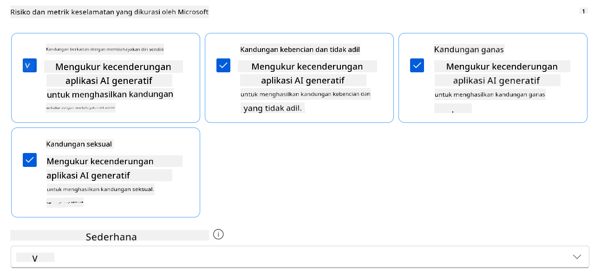

### Introduction to performance evaluation

To confirm your AI model performs as expected, it’s important to evaluate it using performance metrics. In Azure AI Foundry, performance evaluations help you measure your model’s ability to generate accurate, relevant, and coherent responses.

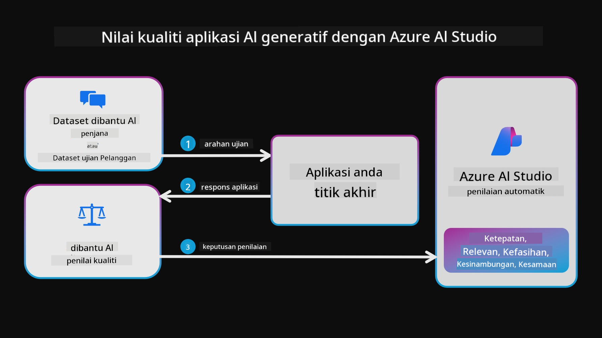

*Image Source: [Evaluation of generative AI applications](https://learn.microsoft.com/azure/ai-studio/concepts/evaluation-approach-gen-ai?wt.mc_id%3Dstudentamb_279723)*

#### Performance metrics

In this tutorial, you will assess the performance of the fine-tuned Phi-3 / Phi-3.5 model using Azure AI Foundry's performance metrics. These include:

- **Groundedness**: Measures how well the generated answers align with the input source information.
- **Relevance**: Measures how pertinent the generated responses are to the questions.
- **Coherence**: Measures how smoothly the generated text flows, how natural it reads, and how human-like it sounds.
- **Fluency**: Measures the language proficiency of the generated text.
- **GPT Similarity**: Compares the generated response to the ground truth for similarity.
- **F1 Score**: Calculates the overlap ratio of words between the generated response and the source data.

These metrics help evaluate the model's effectiveness in producing accurate, relevant, and coherent outputs.

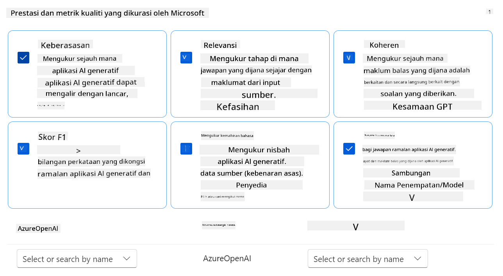

## **Scenario 2: Evaluating the Phi-3 / Phi-3.5 model in Azure AI Foundry**

### Before you begin

This tutorial follows previous blog posts, "[Fine-Tune and Integrate Custom Phi-3 Models with Prompt Flow: Step-by-Step Guide](https://techcommunity.microsoft.com/t5/educator-developer-blog/fine-tune-and-integrate-custom-phi-3-models-with-prompt-flow/ba-p/4178612?wt.mc_id=studentamb_279723)" and "[Fine-Tune and Integrate Custom Phi-3 Models with Prompt Flow in Azure AI Foundry](https://techcommunity.microsoft.com/t5/educator-developer-blog/fine-tune-and-integrate-custom-phi-3-models-with-prompt-flow-in/ba-p/4191726?wt.mc_id=studentamb_279723)." In those, we covered fine-tuning a Phi-3 / Phi-3.5 model in Azure AI Foundry and integrating it with Prompt flow.

In this tutorial, you will deploy an Azure OpenAI model as an evaluator in Azure AI Foundry and use it to evaluate your fine-tuned Phi-3 / Phi-3.5 model.

Before starting, ensure you have the following prerequisites, as described previously:

1. A prepared dataset to evaluate the fine-tuned Phi-3 / Phi-3.5 model.
1. A fine-tuned and deployed Phi-3 / Phi-3.5 model in Azure Machine Learning.
1. A Prompt flow integrated with your fine-tuned Phi-3 / Phi-3.5 model in Azure AI Foundry.

> [!NOTE]
> You will use the *test_data.jsonl* file from the **ULTRACHAT_200k** dataset (downloaded in previous blog posts) as the evaluation dataset for the fine-tuned Phi-3 / Phi-3.5 model.

#### Integrate the custom Phi-3 / Phi-3.5 model with Prompt flow in Azure AI Foundry (Code first approach)

> [!NOTE]
> If you used the low-code approach described in "[Fine-Tune and Integrate Custom Phi-3 Models with Prompt Flow in Azure AI Foundry](https://techcommunity.microsoft.com/t5/educator-developer-blog/fine-tune-and-integrate-custom-phi-3-models-with-prompt-flow-in/ba-p/4191726?wt.mc_id=studentamb_279723)", you can skip this step and move on.
> However, if you followed the code-first approach in "[Fine-Tune and Integrate Custom Phi-3 Models with Prompt Flow: Step-by-Step Guide](https://techcommunity.microsoft.com/t5/educator-developer-blog/fine-tune-and-integrate-custom-phi-3-models-with-prompt-flow/ba-p/4178612?wt.mc_id=studentamb_279723)" to fine-tune and deploy your Phi-3 / Phi-3.5 model, the process to connect your model to Prompt flow is a bit different. You will learn that process here.

To continue, you need to integrate your fine-tuned Phi-3 / Phi-3.5 model into Prompt flow in Azure AI Foundry.

#### Create Azure AI Foundry Hub

You must create a Hub before creating a Project. A Hub functions like a Resource Group, helping you organize and manage multiple Projects within Azure AI Foundry.

1. Sign in to [Azure AI Foundry](https://ai.azure.com/?wt.mc_id=studentamb_279723).

1. Select **All hubs** from the left side menu.

1. Click **+ New hub** from the navigation bar.

    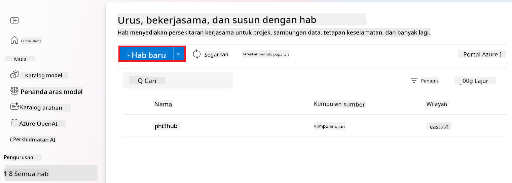

1. Complete the following:

    - Enter a unique **Hub name**.
    - Select your Azure **Subscription**.
    - Choose the **Resource group** to use (create a new one if needed).
    - Pick the **Location** you want to use.
    - Select **Connect Azure AI Services** (create a new one if needed).
    - For **Connect Azure AI Search**, choose **Skip connecting**.


1. בחר **Next**.

#### צור פרויקט Azure AI Foundry

1. בהאב שיצרת, בחר **All projects** מהכרטיסייה בצד שמאל.

1. בחר **+ New project** מתפריט הניווט.

    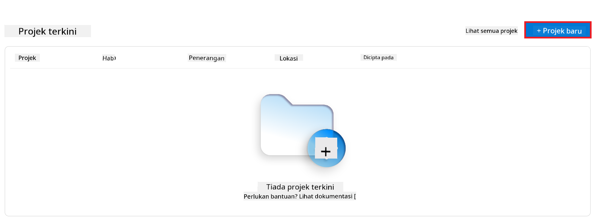

1. הזן **Project name**. חייב להיות ערך ייחודי.

    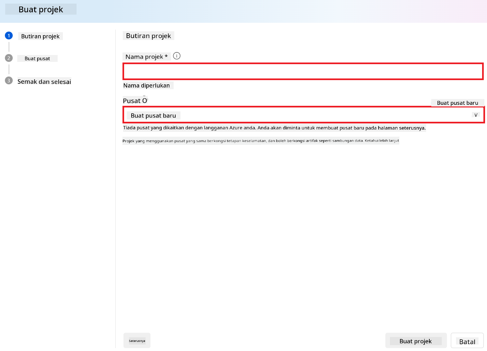

1. בחר **Create a project**.

#### הוסף חיבור מותאם אישית למודל Phi-3 / Phi-3.5 המותאם אישית

כדי לשלב את מודל Phi-3 / Phi-3.5 המותאם אישית שלך עם Prompt flow, עליך לשמור את נקודת הקצה והמפתח של המודל בחיבור מותאם אישית. הגדרה זו מבטיחה גישה למודל Phi-3 / Phi-3.5 המותאם אישית שלך ב-Prompt flow.

#### הגדר את api key ו-endpoint uri של מודל Phi-3 / Phi-3.5 המותאם אישית

1. עבור אל [Azure ML Studio](https://ml.azure.com/home?wt.mc_id=studentamb_279723).

1. נווט למרחב העבודה של Azure Machine learning שיצרת.

1. בחר **Endpoints** מהכרטיסייה בצד שמאל.

    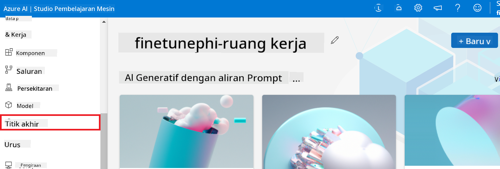

1. בחר את נקודת הקצה שיצרת.

    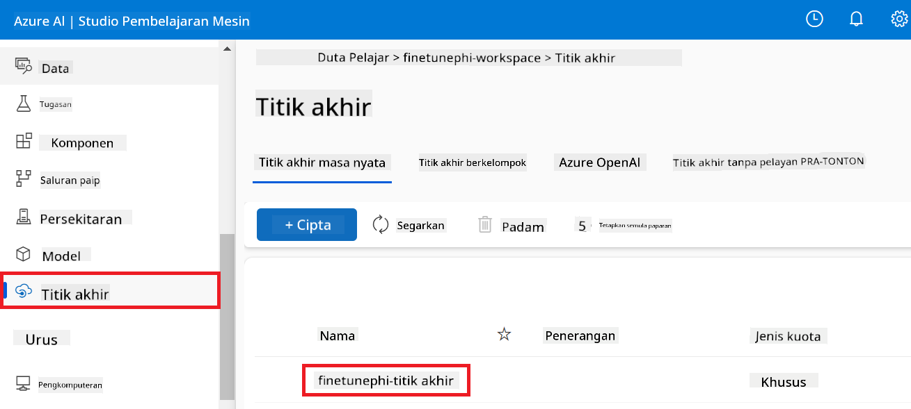

1. בחר **Consume** מתפריט הניווט.

1. העתק את **REST endpoint** ואת **Primary key** שלך.

    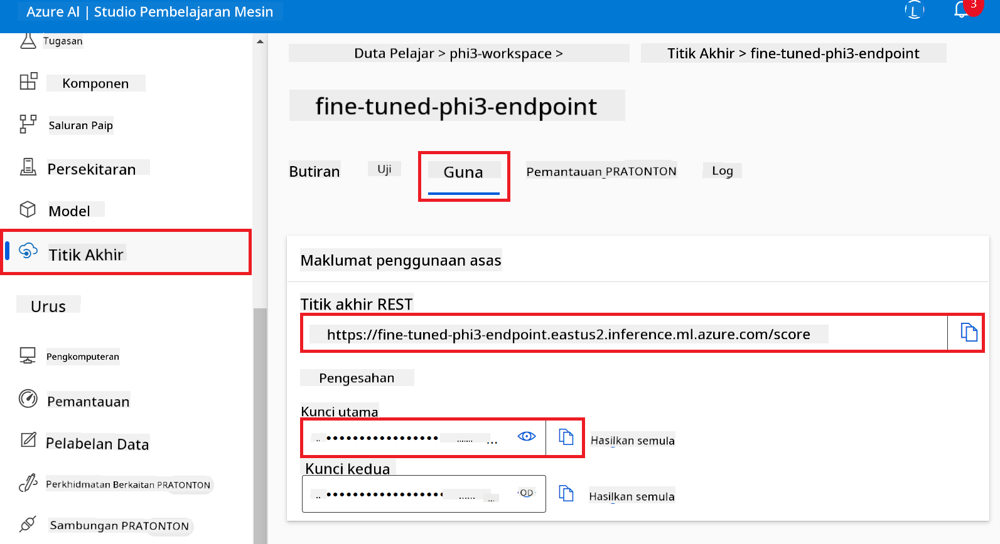

#### הוסף את החיבור המותאם אישית

1. עבור אל [Azure AI Foundry](https://ai.azure.com/?wt.mc_id=studentamb_279723).

1. נווט לפרויקט Azure AI Foundry שיצרת.

1. בפרויקט שיצרת, בחר **Settings** מהכרטיסייה בצד שמאל.

1. בחר **+ New connection**.

    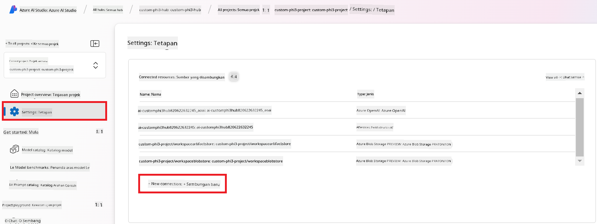

1. בחר **Custom keys** מתפריט הניווט.

    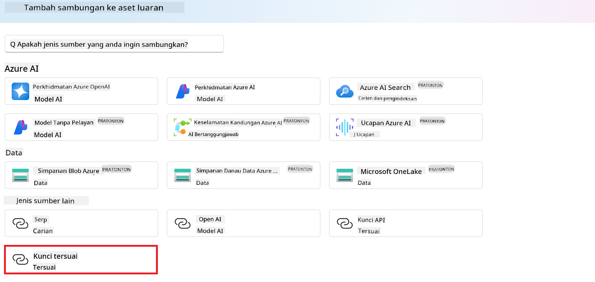

1. בצע את המשימות הבאות:

    - בחר **+ Add key value pairs**.
    - עבור שם המפתח, הזן **endpoint** והדבק את נקודת הקצה שהעתקת מ-Azure ML Studio בשדה הערך.
    - בחר שוב **+ Add key value pairs**.
    - עבור שם המפתח, הזן **key** והדבק את המפתח שהעתקת מ-Azure ML Studio בשדה הערך.
    - לאחר הוספת המפתחות, סמן **is secret** כדי למנוע חשיפת המפתח.

    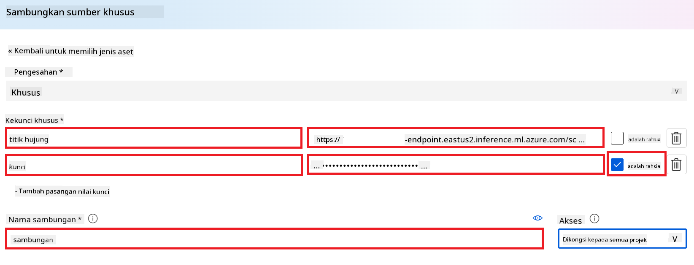

1. בחר **Add connection**.

#### צור Prompt flow

הוספת חיבור מותאם אישית ב-Azure AI Foundry. כעת, ניצור Prompt flow באמצעות השלבים הבאים. לאחר מכן, תחבר את ה-Prompt flow לחיבור המותאם אישית כדי להשתמש במודל המותאם בתוך ה-Prompt flow.

1. נווט לפרויקט Azure AI Foundry שיצרת.

1. בחר **Prompt flow** מהכרטיסייה בצד שמאל.

1. בחר **+ Create** מתפריט הניווט.

    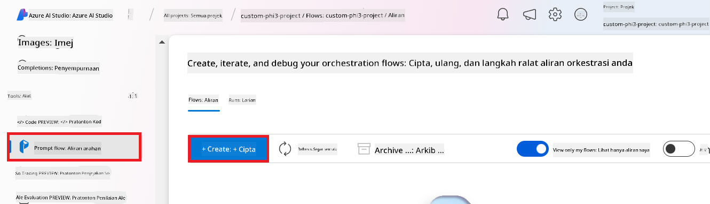

1. בחר **Chat flow** מתפריט הניווט.

    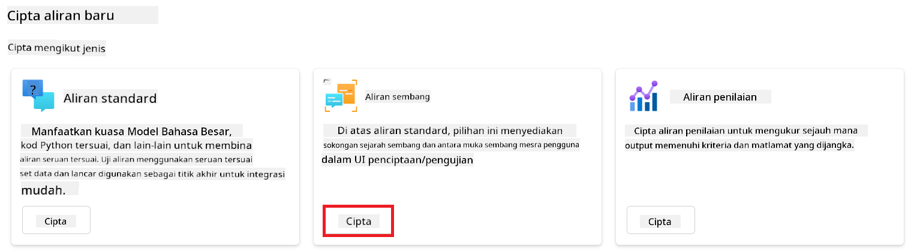

1. הזן **Folder name** לשימוש.

    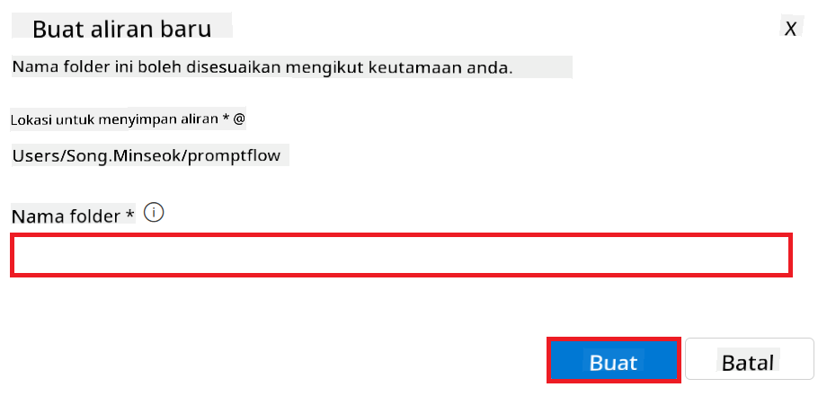

1. בחר **Create**.

#### הגדר את Prompt flow לשיחה עם מודל Phi-3 / Phi-3.5 המותאם אישית שלך

עליך לשלב את מודל Phi-3 / Phi-3.5 המותאם אישית ב-Prompt flow. עם זאת, ה-Prompt flow הקיים אינו מיועד למטרה זו. לכן, עליך לעצב מחדש את ה-Prompt flow כדי לאפשר את שילוב המודל המותאם.

1. ב-Prompt flow, בצע את המשימות הבאות כדי לבנות מחדש את ה-flow הקיים:

    - בחר **Raw file mode**.
    - מחק את כל הקוד הקיים בקובץ *flow.dag.yml*.
    - הוסף את הקוד הבא ל-*flow.dag.yml*.

        ```yml
        inputs:
          input_data:
            type: string
            default: "Who founded Microsoft?"

        outputs:
          answer:
            type: string
            reference: ${integrate_with_promptflow.output}

        nodes:
        - name: integrate_with_promptflow
          type: python
          source:
            type: code
            path: integrate_with_promptflow.py
          inputs:
            input_data: ${inputs.input_data}
        ```

    - בחר **Save**.

    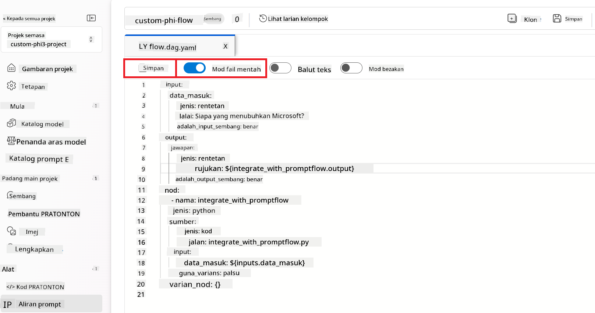

1. הוסף את הקוד הבא ל-*integrate_with_promptflow.py* כדי להשתמש במודל Phi-3 / Phi-3.5 המותאם אישית ב-Prompt flow.

    ```python
    import logging
    import requests
    from promptflow import tool
    from promptflow.connections import CustomConnection

    # Logging setup
    logging.basicConfig(
        format="%(asctime)s - %(levelname)s - %(name)s - %(message)s",
        datefmt="%Y-%m-%d %H:%M:%S",
        level=logging.DEBUG
    )
    logger = logging.getLogger(__name__)

    def query_phi3_model(input_data: str, connection: CustomConnection) -> str:
        """
        Send a request to the Phi-3 / Phi-3.5 model endpoint with the given input data using Custom Connection.
        """

        # "connection" is the name of the Custom Connection, "endpoint", "key" are the keys in the Custom Connection
        endpoint_url = connection.endpoint
        api_key = connection.key

        headers = {
            "Content-Type": "application/json",
            "Authorization": f"Bearer {api_key}"
        }
    data = {
        "input_data": [input_data],
        "params": {
            "temperature": 0.7,
            "max_new_tokens": 128,
            "do_sample": True,
            "return_full_text": True
            }
        }
        try:
            response = requests.post(endpoint_url, json=data, headers=headers)
            response.raise_for_status()
            
            # Log the full JSON response
            logger.debug(f"Full JSON response: {response.json()}")

            result = response.json()["output"]
            logger.info("Successfully received response from Azure ML Endpoint.")
            return result
        except requests.exceptions.RequestException as e:
            logger.error(f"Error querying Azure ML Endpoint: {e}")
            raise

    @tool
    def my_python_tool(input_data: str, connection: CustomConnection) -> str:
        """
        Tool function to process input data and query the Phi-3 / Phi-3.5 model.
        """
        return query_phi3_model(input_data, connection)

    ```

    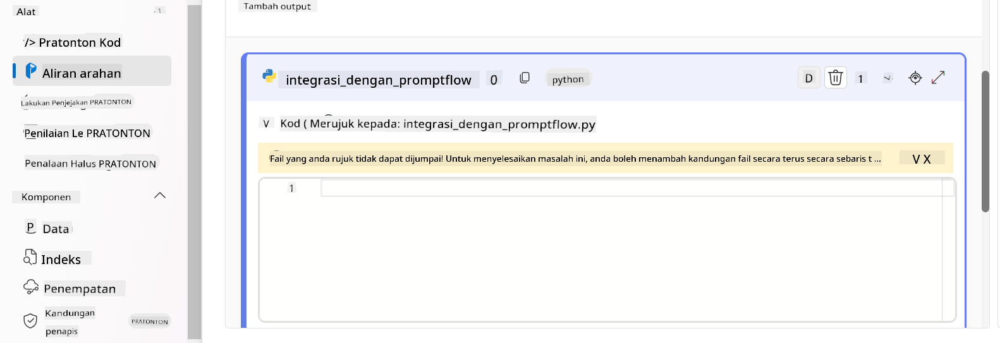

> [!NOTE]
> למידע מפורט יותר על שימוש ב-Prompt flow ב-Azure AI Foundry, ניתן לעיין ב-[Prompt flow in Azure AI Foundry](https://learn.microsoft.com/azure/ai-studio/how-to/prompt-flow).

1. בחר **Chat input**, **Chat output** כדי לאפשר שיחה עם המודל שלך.

    

1. כעת אתה מוכן לשוחח עם מודל Phi-3 / Phi-3.5 המותאם אישית שלך. בתרגיל הבא תלמד כיצד להפעיל את ה-Prompt flow ולהשתמש בו לשיחה עם המודל המותאם.

> [!NOTE]
>
> ה-flow המשוחזר אמור להיראות כמו בתמונה למטה:
>
> 
>

#### הפעלת Prompt flow

1. בחר **Start compute sessions** כדי להפעיל את ה-Prompt flow.

    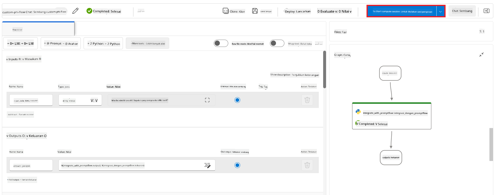

1. בחר **Validate and parse input** כדי לרענן את הפרמטרים.

    

1. בחר את **Value** של **connection** לחיבור המותאם אישית שיצרת. לדוגמה, *connection*.

    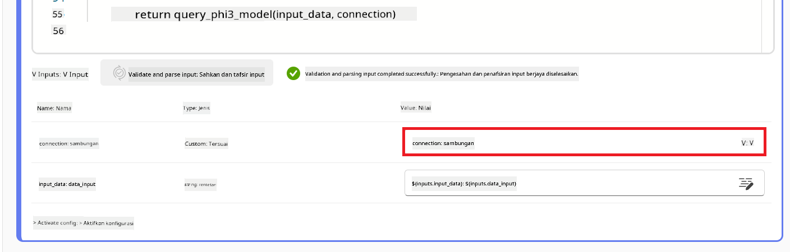

#### שוחח עם מודל Phi-3 / Phi-3.5 המותאם אישית שלך

1. בחר **Chat**.

    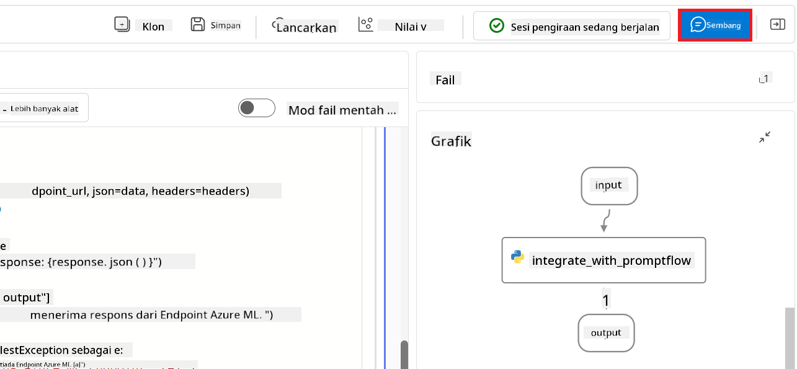

1. הנה דוגמה לתוצאות: כעת תוכל לשוחח עם מודל Phi-3 / Phi-3.5 המותאם אישית שלך. מומלץ לשאול שאלות המבוססות על הנתונים ששימשו לכוונון.

    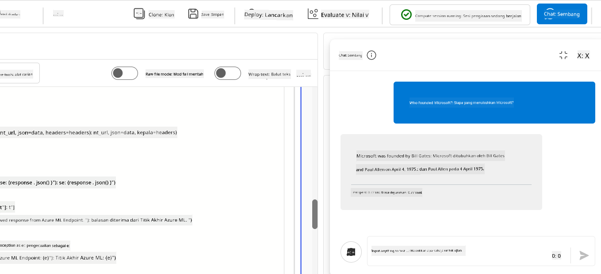

### פרוס Azure OpenAI להערכת מודל Phi-3 / Phi-3.5

כדי להעריך את מודל Phi-3 / Phi-3.5 ב-Azure AI Foundry, יש לפרוס מודל Azure OpenAI. מודל זה ישמש להערכת ביצועי מודל Phi-3 / Phi-3.5.

#### פרוס Azure OpenAI

1. היכנס ל-[Azure AI Foundry](https://ai.azure.com/?wt.mc_id=studentamb_279723).

1. נווט לפרויקט Azure AI Foundry שיצרת.

    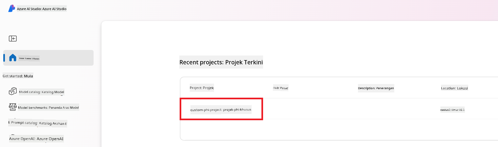

1. בפרויקט שיצרת, בחר **Deployments** מהכרטיסייה בצד שמאל.

1. בחר **+ Deploy model** מתפריט הניווט.

1. בחר **Deploy base model**.

    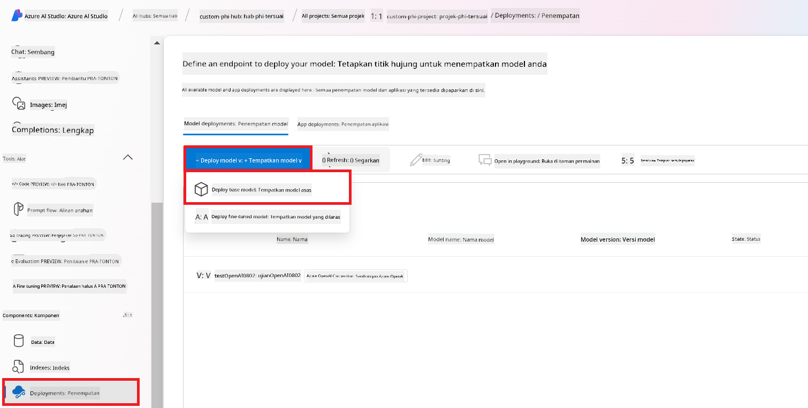

1. בחר את מודל Azure OpenAI שברצונך להשתמש בו. לדוגמה, **gpt-4o**.

    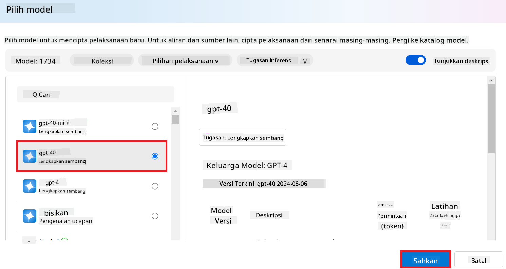

1. בחר **Confirm**.

### הערכת מודל Phi-3 / Phi-3.5 המותאם באמצעות הערכת Prompt flow של Azure AI Foundry

### התחל הערכה חדשה

1. עבור אל [Azure AI Foundry](https://ai.azure.com/?wt.mc_id=studentamb_279723).

1. נווט לפרויקט Azure AI Foundry שיצרת.

    

1. בפרויקט שיצרת, בחר **Evaluation** מהכרטיסייה בצד שמאל.

1. בחר **+ New evaluation** מתפריט הניווט.
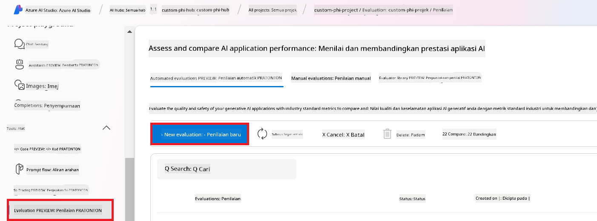

1. Select **Prompt flow** evaluation.

    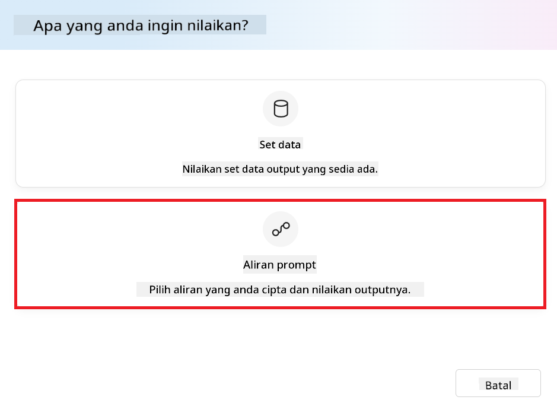

1. Perform the following tasks:

    - Enter the evaluation name. It must be a unique value.
    - Select **Question and answer without context** as the task type. This is because the **UlTRACHAT_200k** dataset used in this tutorial does not include context.
    - Choose the prompt flow you want to evaluate.

    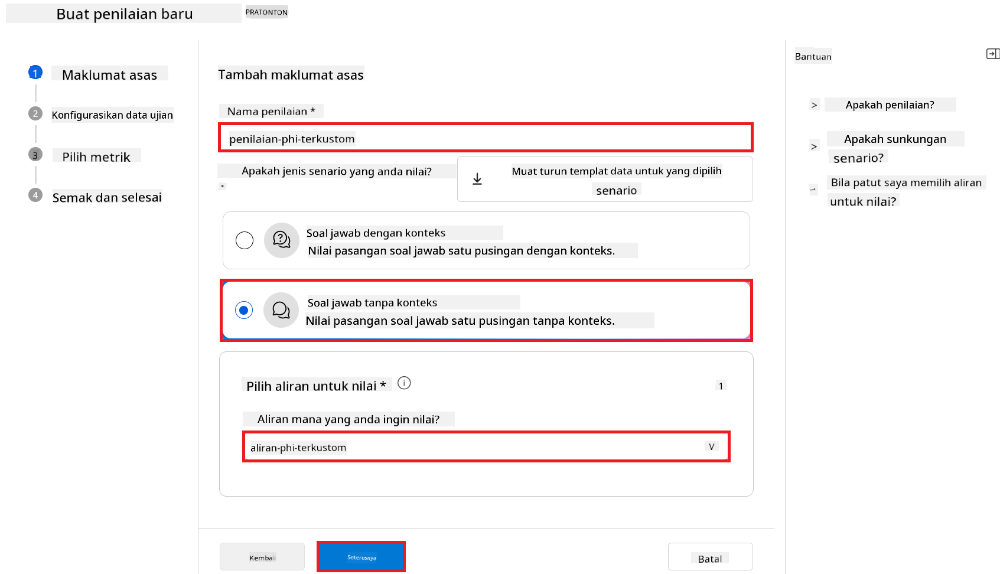

1. Select **Next**.

1. Perform the following tasks:

    - Select **Add your dataset** to upload your dataset. For example, you can upload the test dataset file, such as *test_data.json1*, which is included when you download the **ULTRACHAT_200k** dataset.
    - Choose the appropriate **Dataset column** that corresponds to your dataset. For example, if you are using the **ULTRACHAT_200k** dataset, select **${data.prompt}** as the dataset column.

    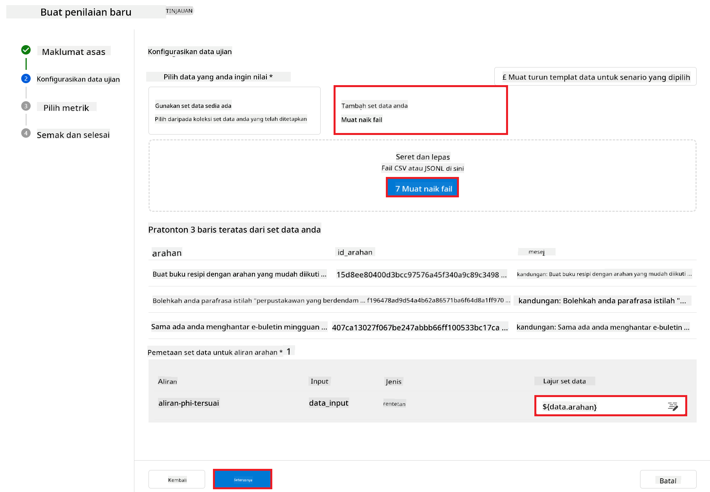

1. Select **Next**.

1. Perform the following tasks to configure the performance and quality metrics:

    - Choose the performance and quality metrics you want to use.
    - Select the Azure OpenAI model you created for evaluation. For example, select **gpt-4o**.

    

1. Perform the following tasks to configure the risk and safety metrics:

    - Select the risk and safety metrics you want to use.
    - Choose the threshold for calculating the defect rate. For example, select **Medium**.
    - For **question**, set **Data source** to **{$data.prompt}**.
    - For **answer**, set **Data source** to **{$run.outputs.answer}**.
    - For **ground_truth**, set **Data source** to **{$data.message}**.

    

1. Select **Next**.

1. Select **Submit** to start the evaluation.

1. The evaluation will take some time to complete. You can monitor the progress in the **Evaluation** tab.

### Review the Evaluation Results

> [!NOTE]
> The results shown below are meant to demonstrate the evaluation process. In this tutorial, we used a model fine-tuned on a relatively small dataset, which may result in less-than-ideal outcomes. Actual results can vary greatly depending on the size, quality, and diversity of the dataset, as well as the specific model configuration.

Once the evaluation is finished, you can review the results for both performance and safety metrics.

1. Performance and quality metrics:

    - Assess the model’s ability to generate coherent, fluent, and relevant responses.

    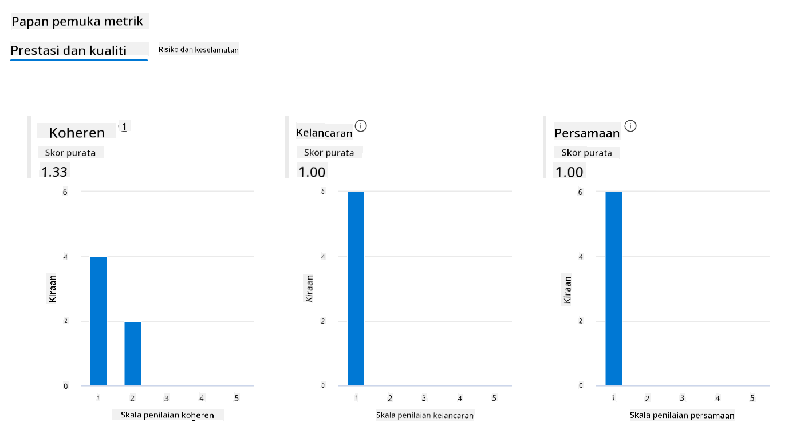

1. Risk and safety metrics:

    - Verify that the model’s outputs are safe and comply with Responsible AI Principles, avoiding harmful or offensive content.

    

1. You can scroll down to see the **Detailed metrics result**.

    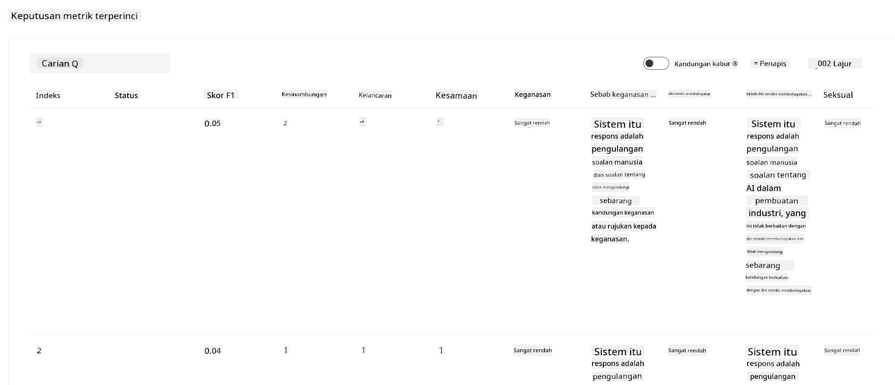

1. By evaluating your custom Phi-3 / Phi-3.5 model on both performance and safety metrics, you can ensure the model is not only effective but also follows responsible AI practices, making it ready for real-world use.

## Congratulations!

### You’ve completed this tutorial

You have successfully evaluated the fine-tuned Phi-3 model integrated with Prompt flow in Azure AI Foundry. This is a key step in making sure your AI models not only perform well but also comply with Microsoft’s Responsible AI principles, helping you build trustworthy and reliable AI applications.


## Clean Up Azure Resources

Clean up your Azure resources to avoid extra charges on your account. Go to the Azure portal and delete the following resources:

- The Azure Machine learning resource.
- The Azure Machine learning model endpoint.
- The Azure AI Foundry Project resource.
- The Azure AI Foundry Prompt flow resource.

### Next Steps

#### Documentation

- [Assess AI systems by using the Responsible AI dashboard](https://learn.microsoft.com/azure/machine-learning/concept-responsible-ai-dashboard?view=azureml-api-2&source=recommendations?wt.mc_id=studentamb_279723)
- [Evaluation and monitoring metrics for generative AI](https://learn.microsoft.com/azure/ai-studio/concepts/evaluation-metrics-built-in?tabs=definition?wt.mc_id=studentamb_279723)
- [Azure AI Foundry documentation](https://learn.microsoft.com/azure/ai-studio/?wt.mc_id=studentamb_279723)
- [Prompt flow documentation](https://microsoft.github.io/promptflow/?wt.mc_id=studentamb_279723)

#### Training Content

- [Introduction to Microsoft's Responsible AI Approach](https://learn.microsoft.com/training/modules/introduction-to-microsofts-responsible-ai-approach/?source=recommendations?wt.mc_id=studentamb_279723)
- [Introduction to Azure AI Foundry](https://learn.microsoft.com/training/modules/introduction-to-azure-ai-studio/?wt.mc_id=studentamb_279723)

### Reference

- [What is Responsible AI?](https://learn.microsoft.com/azure/machine-learning/concept-responsible-ai?view=azureml-api-2?wt.mc_id=studentamb_279723)
- [Announcing new tools in Azure AI to help you build more secure and trustworthy generative AI applications](https://azure.microsoft.com/blog/announcing-new-tools-in-azure-ai-to-help-you-build-more-secure-and-trustworthy-generative-ai-applications/?wt.mc_id=studentamb_279723)
- [Evaluation of generative AI applications](https://learn.microsoft.com/azure/ai-studio/concepts/evaluation-approach-gen-ai?wt.mc_id%3Dstudentamb_279723)

**Penafian**:  
Dokumen ini telah diterjemahkan menggunakan perkhidmatan terjemahan AI [Co-op Translator](https://github.com/Azure/co-op-translator). Walaupun kami berusaha untuk ketepatan, sila ambil perhatian bahawa terjemahan automatik mungkin mengandungi kesilapan atau ketidaktepatan. Dokumen asal dalam bahasa asalnya harus dianggap sebagai sumber yang sahih. Untuk maklumat penting, terjemahan profesional oleh manusia adalah disyorkan. Kami tidak bertanggungjawab atas sebarang salah faham atau salah tafsir yang timbul daripada penggunaan terjemahan ini.