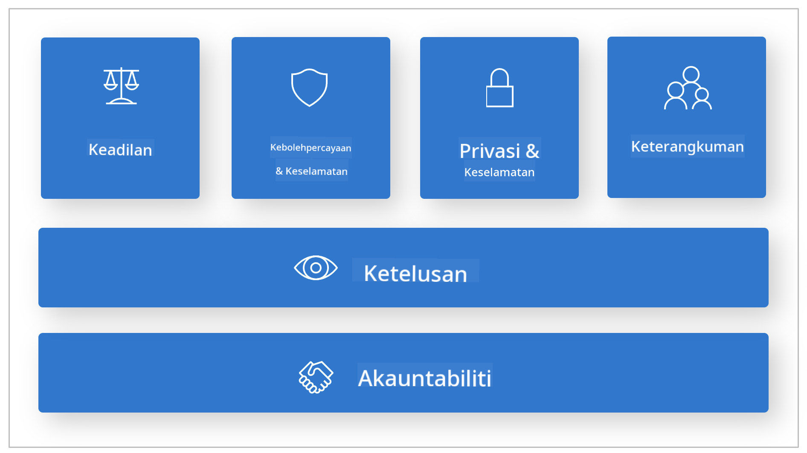
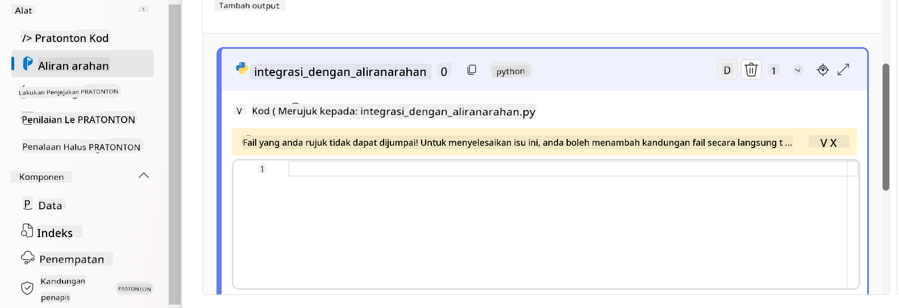
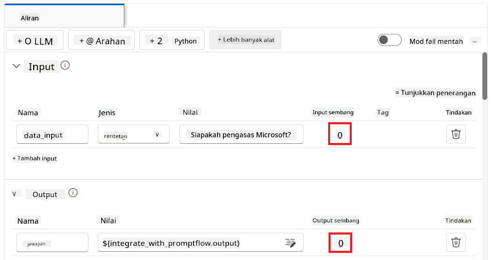
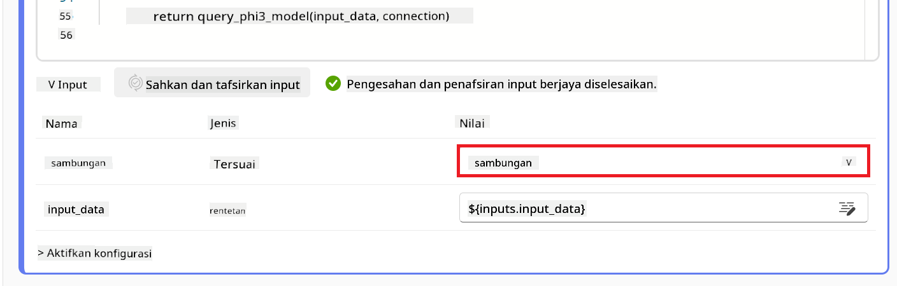
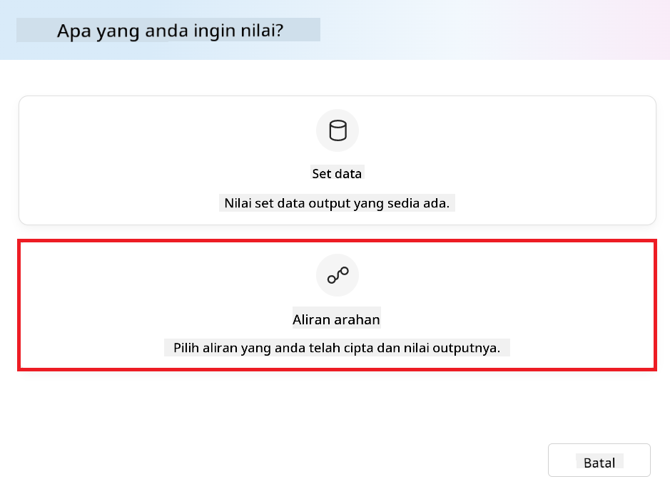
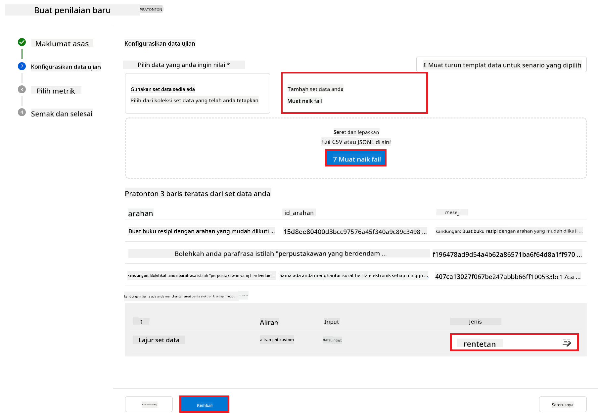
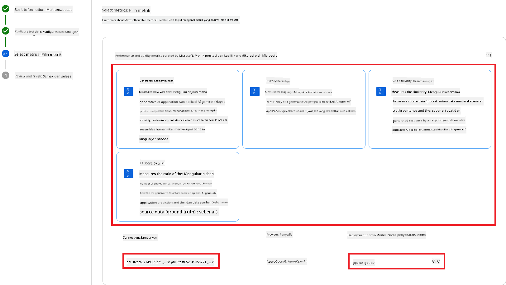
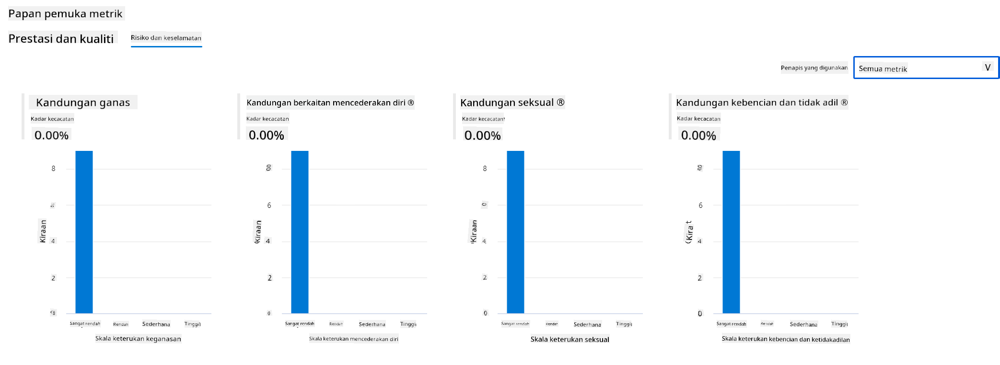

<!--
CO_OP_TRANSLATOR_METADATA:
{
  "original_hash": "80a853c08e4ee25ef9b4bfcedd8990da",
  "translation_date": "2025-07-16T23:48:37+00:00",
  "source_file": "md/02.Application/01.TextAndChat/Phi3/E2E_Phi-3-Evaluation_AIFoundry.md",
  "language_code": "ms"
}
-->
# Menilai Model Phi-3 / Phi-3.5 yang Telah Disesuaikan dalam Azure AI Foundry dengan Fokus pada Prinsip AI Bertanggungjawab Microsoft

Contoh menyeluruh (E2E) ini berdasarkan panduan "[Evaluate Fine-tuned Phi-3 / 3.5 Models in Azure AI Foundry Focusing on Microsoft's Responsible AI](https://techcommunity.microsoft.com/blog/educatordeveloperblog/evaluate-fine-tuned-phi-3--3-5-models-in-azure-ai-studio-focusing-on-microsofts-/4227850?WT.mc_id=aiml-137032-kinfeylo)" dari Microsoft Tech Community.

## Gambaran Keseluruhan

### Bagaimana anda boleh menilai keselamatan dan prestasi model Phi-3 / Phi-3.5 yang telah disesuaikan dalam Azure AI Foundry?

Penalaan halus model kadangkala boleh menyebabkan respons yang tidak diingini atau tidak dijangka. Untuk memastikan model kekal selamat dan berkesan, adalah penting untuk menilai potensi model menghasilkan kandungan berbahaya serta kemampuannya menghasilkan respons yang tepat, relevan, dan koheren. Dalam tutorial ini, anda akan belajar cara menilai keselamatan dan prestasi model Phi-3 / Phi-3.5 yang telah disesuaikan dan diintegrasikan dengan Prompt flow dalam Azure AI Foundry.

Berikut adalah proses penilaian Azure AI Foundry.


*Sumber Imej: [Evaluation of generative AI applications](https://learn.microsoft.com/azure/ai-studio/concepts/evaluation-approach-gen-ai?wt.mc_id%3Dstudentamb_279723)*

> [!NOTE]
>
> Untuk maklumat lebih terperinci dan meneroka sumber tambahan mengenai Phi-3 / Phi-3.5, sila lawati [Phi-3CookBook](https://github.com/microsoft/Phi-3CookBook?wt.mc_id=studentamb_279723).

### Prasyarat

- [Python](https://www.python.org/downloads)
- [Langganan Azure](https://azure.microsoft.com/free?wt.mc_id=studentamb_279723)
- [Visual Studio Code](https://code.visualstudio.com)
- Model Phi-3 / Phi-3.5 yang telah disesuaikan

### Jadual Kandungan

1. [**Senario 1: Pengenalan kepada penilaian Prompt flow Azure AI Foundry**](../../../../../../md/02.Application/01.TextAndChat/Phi3)

    - [Pengenalan kepada penilaian keselamatan](../../../../../../md/02.Application/01.TextAndChat/Phi3)
    - [Pengenalan kepada penilaian prestasi](../../../../../../md/02.Application/01.TextAndChat/Phi3)

1. [**Senario 2: Menilai model Phi-3 / Phi-3.5 dalam Azure AI Foundry**](../../../../../../md/02.Application/01.TextAndChat/Phi3)

    - [Sebelum anda bermula](../../../../../../md/02.Application/01.TextAndChat/Phi3)
    - [Menyebarkan Azure OpenAI untuk menilai model Phi-3 / Phi-3.5](../../../../../../md/02.Application/01.TextAndChat/Phi3)
    - [Menilai model Phi-3 / Phi-3.5 yang telah disesuaikan menggunakan penilaian Prompt flow Azure AI Foundry](../../../../../../md/02.Application/01.TextAndChat/Phi3)

1. [Tahniah!](../../../../../../md/02.Application/01.TextAndChat/Phi3)

## **Senario 1: Pengenalan kepada penilaian Prompt flow Azure AI Foundry**

### Pengenalan kepada penilaian keselamatan

Untuk memastikan model AI anda beretika dan selamat, adalah penting untuk menilainya berdasarkan Prinsip AI Bertanggungjawab Microsoft. Dalam Azure AI Foundry, penilaian keselamatan membolehkan anda menilai kerentanan model anda terhadap serangan jailbreak dan potensi model menghasilkan kandungan berbahaya, yang selari dengan prinsip-prinsip ini.


*Sumber Imej: [Evaluation of generative AI applications](https://learn.microsoft.com/azure/ai-studio/concepts/evaluation-approach-gen-ai?wt.mc_id%3Dstudentamb_279723)*

#### Prinsip AI Bertanggungjawab Microsoft

Sebelum memulakan langkah teknikal, adalah penting untuk memahami Prinsip AI Bertanggungjawab Microsoft, iaitu rangka kerja etika yang direka untuk membimbing pembangunan, penyebaran, dan operasi sistem AI secara bertanggungjawab. Prinsip-prinsip ini membimbing reka bentuk, pembangunan, dan penyebaran sistem AI secara bertanggungjawab, memastikan teknologi AI dibina dengan cara yang adil, telus, dan inklusif. Prinsip-prinsip ini menjadi asas untuk menilai keselamatan model AI.

Prinsip AI Bertanggungjawab Microsoft termasuk:

- **Keadilan dan Inklusiviti**: Sistem AI harus melayan semua orang secara adil dan mengelakkan memberi kesan berbeza kepada kumpulan orang yang berada dalam situasi serupa. Contohnya, apabila sistem AI memberikan panduan mengenai rawatan perubatan, permohonan pinjaman, atau pekerjaan, ia harus memberikan cadangan yang sama kepada semua yang mempunyai simptom, keadaan kewangan, atau kelayakan profesional yang serupa.

- **Kebolehpercayaan dan Keselamatan**: Untuk membina kepercayaan, adalah penting sistem AI beroperasi dengan boleh dipercayai, selamat, dan konsisten. Sistem ini harus dapat berfungsi seperti yang direka asalnya, bertindak balas dengan selamat terhadap keadaan yang tidak dijangka, dan menahan manipulasi berbahaya. Cara mereka berkelakuan dan pelbagai keadaan yang boleh mereka tangani mencerminkan pelbagai situasi dan keadaan yang dijangka oleh pembangun semasa reka bentuk dan ujian.

- **Ketelusan**: Apabila sistem AI membantu membuat keputusan yang memberi impak besar kepada kehidupan orang, adalah penting orang memahami bagaimana keputusan itu dibuat. Contohnya, sebuah bank mungkin menggunakan sistem AI untuk menentukan sama ada seseorang layak mendapat kredit. Sebuah syarikat mungkin menggunakan sistem AI untuk memilih calon yang paling layak untuk diambil bekerja.

- **Privasi dan Keselamatan**: Apabila AI menjadi lebih meluas, melindungi privasi dan memastikan keselamatan maklumat peribadi dan perniagaan menjadi semakin penting dan kompleks. Dengan AI, privasi dan keselamatan data memerlukan perhatian rapi kerana akses kepada data adalah penting untuk sistem AI membuat ramalan dan keputusan yang tepat dan berinformasi mengenai orang.

- **Tanggungjawab**: Orang yang mereka bentuk dan menyebarkan sistem AI mesti bertanggungjawab terhadap cara sistem mereka beroperasi. Organisasi harus menggunakan piawaian industri untuk membangunkan norma tanggungjawab. Norma ini boleh memastikan sistem AI bukanlah autoriti terakhir dalam sebarang keputusan yang memberi kesan kepada kehidupan orang. Ia juga memastikan manusia mengekalkan kawalan bermakna ke atas sistem AI yang sangat autonomi.



*Sumber Imej: [What is Responsible AI?](https://learn.microsoft.com/azure/machine-learning/concept-responsible-ai?view=azureml-api-2&viewFallbackFrom=azureml-api-2%253fwt.mc_id%3Dstudentamb_279723)*

> [!NOTE]
> Untuk mengetahui lebih lanjut mengenai Prinsip AI Bertanggungjawab Microsoft, lawati [What is Responsible AI?](https://learn.microsoft.com/azure/machine-learning/concept-responsible-ai?view=azureml-api-2?wt.mc_id=studentamb_279723).

#### Metrik keselamatan

Dalam tutorial ini, anda akan menilai keselamatan model Phi-3 yang telah disesuaikan menggunakan metrik keselamatan Azure AI Foundry. Metrik ini membantu anda menilai potensi model menghasilkan kandungan berbahaya dan kerentanannya terhadap serangan jailbreak. Metrik keselamatan termasuk:

- **Kandungan Berkaitan Diri Membahayakan**: Menilai sama ada model cenderung menghasilkan kandungan yang berkaitan dengan membahayakan diri sendiri.
- **Kandungan Kebencian dan Tidak Adil**: Menilai sama ada model cenderung menghasilkan kandungan yang penuh kebencian atau tidak adil.
- **Kandungan Keganasan**: Menilai sama ada model cenderung menghasilkan kandungan yang ganas.
- **Kandungan Seksual**: Menilai sama ada model cenderung menghasilkan kandungan seksual yang tidak sesuai.

Menilai aspek-aspek ini memastikan model AI tidak menghasilkan kandungan yang berbahaya atau menyinggung, sejajar dengan nilai masyarakat dan piawaian peraturan.


### Pengenalan kepada penilaian prestasi

Untuk memastikan model AI anda berprestasi seperti yang dijangka, adalah penting untuk menilai prestasinya berdasarkan metrik prestasi. Dalam Azure AI Foundry, penilaian prestasi membolehkan anda menilai keberkesanan model anda dalam menghasilkan respons yang tepat, relevan, dan koheren.


*Sumber Imej: [Evaluation of generative AI applications](https://learn.microsoft.com/azure/ai-studio/concepts/evaluation-approach-gen-ai?wt.mc_id%3Dstudentamb_279723)*

#### Metrik prestasi

Dalam tutorial ini, anda akan menilai prestasi model Phi-3 / Phi-3.5 yang telah disesuaikan menggunakan metrik prestasi Azure AI Foundry. Metrik ini membantu anda menilai keberkesanan model dalam menghasilkan respons yang tepat, relevan, dan koheren. Metrik prestasi termasuk:

- **Berlandaskan Fakta (Groundedness)**: Menilai sejauh mana jawapan yang dijana selari dengan maklumat dari sumber input.
- **Relevan**: Menilai kesesuaian respons yang dijana dengan soalan yang diberikan.
- **Koheren**: Menilai kelancaran teks yang dijana, bacaan yang semula jadi, dan menyerupai bahasa seperti manusia.
- **Fasih**: Menilai kemahiran bahasa teks yang dijana.
- **Kesamaan GPT**: Membandingkan respons yang dijana dengan kebenaran asas untuk kesamaan.
- **Skor F1**: Mengira nisbah perkataan yang dikongsi antara respons yang dijana dan data sumber.

Metrik ini membantu anda menilai keberkesanan model dalam menghasilkan respons yang tepat, relevan, dan koheren.


## **Senario 2: Menilai model Phi-3 / Phi-3.5 dalam Azure AI Foundry**

### Sebelum anda bermula

Tutorial ini adalah sambungan kepada pos blog sebelum ini, "[Fine-Tune and Integrate Custom Phi-3 Models with Prompt Flow: Step-by-Step Guide](https://techcommunity.microsoft.com/t5/educator-developer-blog/fine-tune-and-integrate-custom-phi-3-models-with-prompt-flow/ba-p/4178612?wt.mc_id=studentamb_279723)" dan "[Fine-Tune and Integrate Custom Phi-3 Models with Prompt Flow in Azure AI Foundry](https://techcommunity.microsoft.com/t5/educator-developer-blog/fine-tune-and-integrate-custom-phi-3-models-with-prompt-flow-in/ba-p/4191726?wt.mc_id=studentamb_279723)." Dalam pos-pos ini, kami telah membimbing proses penalaan halus model Phi-3 / Phi-3.5 dalam Azure AI Foundry dan mengintegrasikannya dengan Prompt flow.

Dalam tutorial ini, anda akan menyebarkan model Azure OpenAI sebagai penilai dalam Azure AI Foundry dan menggunakannya untuk menilai model Phi-3 / Phi-3.5 yang telah disesuaikan.

Sebelum memulakan tutorial ini, pastikan anda mempunyai prasyarat berikut, seperti yang diterangkan dalam tutorial sebelum ini:

1. Dataset yang telah disediakan untuk menilai model Phi-3 / Phi-3.5 yang telah disesuaikan.
1. Model Phi-3 / Phi-3.5 yang telah disesuaikan dan disebarkan ke Azure Machine Learning.
1. Prompt flow yang diintegrasikan dengan model Phi-3 / Phi-3.5 yang telah disesuaikan dalam Azure AI Foundry.

> [!NOTE]
> Anda akan menggunakan fail *test_data.jsonl*, yang terletak dalam folder data dari dataset **ULTRACHAT_200k** yang dimuat turun dalam pos blog sebelum ini, sebagai dataset untuk menilai model Phi-3 / Phi-3.5 yang telah disesuaikan.

#### Mengintegrasikan model Phi-3 / Phi-3.5 tersuai dengan Prompt flow dalam Azure AI Foundry (Pendekatan kod dahulu)
> [!NOTE]
> Jika anda mengikuti pendekatan low-code yang diterangkan dalam "[Fine-Tune and Integrate Custom Phi-3 Models with Prompt Flow in Azure AI Foundry](https://techcommunity.microsoft.com/t5/educator-developer-blog/fine-tune-and-integrate-custom-phi-3-models-with-prompt-flow-in/ba-p/4191726?wt.mc_id=studentamb_279723)", anda boleh langkau latihan ini dan teruskan ke latihan seterusnya.
> Walau bagaimanapun, jika anda mengikuti pendekatan code-first yang diterangkan dalam "[Fine-Tune and Integrate Custom Phi-3 Models with Prompt Flow: Step-by-Step Guide](https://techcommunity.microsoft.com/t5/educator-developer-blog/fine-tune-and-integrate-custom-phi-3-models-with-prompt-flow/ba-p/4178612?wt.mc_id=studentamb_279723)" untuk melaras dan mengedar model Phi-3 / Phi-3.5 anda, proses untuk menyambungkan model anda ke Prompt flow adalah sedikit berbeza. Anda akan mempelajari proses ini dalam latihan ini.
Untuk meneruskan, anda perlu mengintegrasikan model Phi-3 / Phi-3.5 yang telah disesuaikan ke dalam Prompt flow di Azure AI Foundry.

#### Cipta Azure AI Foundry Hub

Anda perlu mencipta Hub sebelum mencipta Projek. Hub berfungsi seperti Kumpulan Sumber, membolehkan anda mengatur dan menguruskan pelbagai Projek dalam Azure AI Foundry.

1. Log masuk ke [Azure AI Foundry](https://ai.azure.com/?wt.mc_id=studentamb_279723).

1. Pilih **All hubs** dari tab sebelah kiri.

1. Pilih **+ New hub** dari menu navigasi.

    

1. Lakukan tugasan berikut:

    - Masukkan **Hub name**. Ia mesti nilai yang unik.
    - Pilih **Subscription** Azure anda.
    - Pilih **Resource group** yang ingin digunakan (cipta yang baru jika perlu).
    - Pilih **Location** yang anda ingin gunakan.
    - Pilih **Connect Azure AI Services** yang ingin digunakan (cipta yang baru jika perlu).
    - Pilih **Connect Azure AI Search** untuk **Skip connecting**.

    

1. Pilih **Next**.

#### Cipta Projek Azure AI Foundry

1. Dalam Hub yang anda cipta, pilih **All projects** dari tab sebelah kiri.

1. Pilih **+ New project** dari menu navigasi.

    

1. Masukkan **Project name**. Ia mesti nilai yang unik.

    

1. Pilih **Create a project**.

#### Tambah sambungan khusus untuk model Phi-3 / Phi-3.5 yang telah disesuaikan

Untuk mengintegrasikan model Phi-3 / Phi-3.5 khusus anda dengan Prompt flow, anda perlu menyimpan endpoint dan kunci model dalam sambungan khusus. Persediaan ini memastikan akses ke model Phi-3 / Phi-3.5 khusus anda dalam Prompt flow.

#### Tetapkan api key dan endpoint uri model Phi-3 / Phi-3.5 yang telah disesuaikan

1. Lawati [Azure ML Studio](https://ml.azure.com/home?wt.mc_id=studentamb_279723).

1. Navigasi ke ruang kerja Azure Machine learning yang anda cipta.

1. Pilih **Endpoints** dari tab sebelah kiri.

    

1. Pilih endpoint yang anda cipta.

    

1. Pilih **Consume** dari menu navigasi.

1. Salin **REST endpoint** dan **Primary key** anda.

    

#### Tambah Sambungan Khusus

1. Lawati [Azure AI Foundry](https://ai.azure.com/?wt.mc_id=studentamb_279723).

1. Navigasi ke projek Azure AI Foundry yang anda cipta.

1. Dalam Projek yang anda cipta, pilih **Settings** dari tab sebelah kiri.

1. Pilih **+ New connection**.

    

1. Pilih **Custom keys** dari menu navigasi.

    

1. Lakukan tugasan berikut:

    - Pilih **+ Add key value pairs**.
    - Untuk nama kunci, masukkan **endpoint** dan tampal endpoint yang anda salin dari Azure ML Studio ke dalam medan nilai.
    - Pilih **+ Add key value pairs** sekali lagi.
    - Untuk nama kunci, masukkan **key** dan tampal kunci yang anda salin dari Azure ML Studio ke dalam medan nilai.
    - Selepas menambah kunci, pilih **is secret** untuk mengelakkan kunci didedahkan.

    

1. Pilih **Add connection**.

#### Cipta Prompt flow

Anda telah menambah sambungan khusus dalam Azure AI Foundry. Sekarang, mari cipta Prompt flow menggunakan langkah berikut. Kemudian, anda akan sambungkan Prompt flow ini ke sambungan khusus untuk menggunakan model yang telah disesuaikan dalam Prompt flow.

1. Navigasi ke projek Azure AI Foundry yang anda cipta.

1. Pilih **Prompt flow** dari tab sebelah kiri.

1. Pilih **+ Create** dari menu navigasi.

    

1. Pilih **Chat flow** dari menu navigasi.

    

1. Masukkan **Folder name** yang ingin digunakan.

    

1. Pilih **Create**.

#### Sediakan Prompt flow untuk bersembang dengan model Phi-3 / Phi-3.5 khusus anda

Anda perlu mengintegrasikan model Phi-3 / Phi-3.5 yang telah disesuaikan ke dalam Prompt flow. Walau bagaimanapun, Prompt flow sedia ada yang disediakan tidak direka untuk tujuan ini. Oleh itu, anda mesti mereka semula Prompt flow untuk membolehkan integrasi model khusus tersebut.

1. Dalam Prompt flow, lakukan tugasan berikut untuk membina semula aliran sedia ada:

    - Pilih **Raw file mode**.
    - Padam semua kod sedia ada dalam fail *flow.dag.yml*.
    - Tambah kod berikut ke *flow.dag.yml*.

        ```yml
        inputs:
          input_data:
            type: string
            default: "Who founded Microsoft?"

        outputs:
          answer:
            type: string
            reference: ${integrate_with_promptflow.output}

        nodes:
        - name: integrate_with_promptflow
          type: python
          source:
            type: code
            path: integrate_with_promptflow.py
          inputs:
            input_data: ${inputs.input_data}
        ```

    - Pilih **Save**.

    

1. Tambah kod berikut ke *integrate_with_promptflow.py* untuk menggunakan model Phi-3 / Phi-3.5 khusus dalam Prompt flow.

    ```python
    import logging
    import requests
    from promptflow import tool
    from promptflow.connections import CustomConnection

    # Logging setup
    logging.basicConfig(
        format="%(asctime)s - %(levelname)s - %(name)s - %(message)s",
        datefmt="%Y-%m-%d %H:%M:%S",
        level=logging.DEBUG
    )
    logger = logging.getLogger(__name__)

    def query_phi3_model(input_data: str, connection: CustomConnection) -> str:
        """
        Send a request to the Phi-3 / Phi-3.5 model endpoint with the given input data using Custom Connection.
        """

        # "connection" is the name of the Custom Connection, "endpoint", "key" are the keys in the Custom Connection
        endpoint_url = connection.endpoint
        api_key = connection.key

        headers = {
            "Content-Type": "application/json",
            "Authorization": f"Bearer {api_key}"
        }
    data = {
        "input_data": [input_data],
        "params": {
            "temperature": 0.7,
            "max_new_tokens": 128,
            "do_sample": True,
            "return_full_text": True
            }
        }
        try:
            response = requests.post(endpoint_url, json=data, headers=headers)
            response.raise_for_status()
            
            # Log the full JSON response
            logger.debug(f"Full JSON response: {response.json()}")

            result = response.json()["output"]
            logger.info("Successfully received response from Azure ML Endpoint.")
            return result
        except requests.exceptions.RequestException as e:
            logger.error(f"Error querying Azure ML Endpoint: {e}")
            raise

    @tool
    def my_python_tool(input_data: str, connection: CustomConnection) -> str:
        """
        Tool function to process input data and query the Phi-3 / Phi-3.5 model.
        """
        return query_phi3_model(input_data, connection)

    ```

    

> [!NOTE]
> Untuk maklumat lebih terperinci mengenai penggunaan Prompt flow dalam Azure AI Foundry, anda boleh rujuk [Prompt flow in Azure AI Foundry](https://learn.microsoft.com/azure/ai-studio/how-to/prompt-flow).

1. Pilih **Chat input**, **Chat output** untuk mengaktifkan sembang dengan model anda.

    

1. Kini anda sudah bersedia untuk bersembang dengan model Phi-3 / Phi-3.5 khusus anda. Dalam latihan seterusnya, anda akan belajar cara memulakan Prompt flow dan menggunakannya untuk bersembang dengan model Phi-3 / Phi-3.5 yang telah disesuaikan.

> [!NOTE]
>
> Aliran yang dibina semula harus kelihatan seperti imej di bawah:
>
> 
>

#### Mulakan Prompt flow

1. Pilih **Start compute sessions** untuk memulakan Prompt flow.

    

1. Pilih **Validate and parse input** untuk memperbaharui parameter.

    

1. Pilih **Value** bagi **connection** kepada sambungan khusus yang anda cipta. Contohnya, *connection*.

    

#### Bersembang dengan model Phi-3 / Phi-3.5 khusus anda

1. Pilih **Chat**.

    

1. Berikut adalah contoh hasilnya: Kini anda boleh bersembang dengan model Phi-3 / Phi-3.5 khusus anda. Disarankan untuk bertanya soalan berdasarkan data yang digunakan untuk penalaan halus.

    

### Lancarkan Azure OpenAI untuk menilai model Phi-3 / Phi-3.5

Untuk menilai model Phi-3 / Phi-3.5 dalam Azure AI Foundry, anda perlu melancarkan model Azure OpenAI. Model ini akan digunakan untuk menilai prestasi model Phi-3 / Phi-3.5.

#### Lancarkan Azure OpenAI

1. Log masuk ke [Azure AI Foundry](https://ai.azure.com/?wt.mc_id=studentamb_279723).

1. Navigasi ke projek Azure AI Foundry yang anda cipta.

    

1. Dalam Projek yang anda cipta, pilih **Deployments** dari tab sebelah kiri.

1. Pilih **+ Deploy model** dari menu navigasi.

1. Pilih **Deploy base model**.

    

1. Pilih model Azure OpenAI yang anda ingin gunakan. Contohnya, **gpt-4o**.

    

1. Pilih **Confirm**.

### Nilai model Phi-3 / Phi-3.5 yang telah disesuaikan menggunakan penilaian Prompt flow Azure AI Foundry

### Mulakan penilaian baru

1. Lawati [Azure AI Foundry](https://ai.azure.com/?wt.mc_id=studentamb_279723).

1. Navigasi ke projek Azure AI Foundry yang anda cipta.

    

1. Dalam Projek yang anda cipta, pilih **Evaluation** dari tab sebelah kiri.

1. Pilih **+ New evaluation** dari menu navigasi.

    

1. Pilih penilaian **Prompt flow**.

    

1. Lakukan tugasan berikut:

    - Masukkan nama penilaian. Ia mesti nilai yang unik.
    - Pilih **Question and answer without context** sebagai jenis tugasan. Kerana, set data **UlTRACHAT_200k** yang digunakan dalam tutorial ini tidak mengandungi konteks.
    - Pilih prompt flow yang anda ingin nilai.

    

1. Pilih **Next**.

1. Lakukan tugasan berikut:

    - Pilih **Add your dataset** untuk memuat naik set data. Contohnya, anda boleh memuat naik fail set data ujian, seperti *test_data.json1*, yang disertakan apabila anda memuat turun set data **ULTRACHAT_200k**.
    - Pilih **Dataset column** yang sesuai dengan set data anda. Contohnya, jika anda menggunakan set data **ULTRACHAT_200k**, pilih **${data.prompt}** sebagai lajur set data.

    

1. Pilih **Next**.

1. Lakukan tugasan berikut untuk mengkonfigurasi metrik prestasi dan kualiti:

    - Pilih metrik prestasi dan kualiti yang anda ingin gunakan.
    - Pilih model Azure OpenAI yang anda cipta untuk penilaian. Contohnya, pilih **gpt-4o**.

    

1. Lakukan tugasan berikut untuk mengkonfigurasi metrik risiko dan keselamatan:

    - Pilih metrik risiko dan keselamatan yang anda ingin gunakan.
    - Pilih ambang untuk mengira kadar kecacatan yang anda ingin gunakan. Contohnya, pilih **Medium**.
    - Untuk **question**, pilih **Data source** kepada **{$data.prompt}**.
    - Untuk **answer**, pilih **Data source** kepada **{$run.outputs.answer}**.
    - Untuk **ground_truth**, pilih **Data source** kepada **{$data.message}**.

    

1. Pilih **Next**.

1. Pilih **Submit** untuk memulakan penilaian.

1. Penilaian akan mengambil masa untuk diselesaikan. Anda boleh memantau kemajuan dalam tab **Evaluation**.

### Semak Keputusan Penilaian
> [!NOTE]
> Keputusan yang dipaparkan di bawah bertujuan untuk menggambarkan proses penilaian. Dalam tutorial ini, kami menggunakan model yang telah disesuaikan pada set data yang agak kecil, yang mungkin menghasilkan keputusan yang kurang optimum. Keputusan sebenar mungkin berbeza dengan ketara bergantung pada saiz, kualiti, dan kepelbagaian set data yang digunakan, serta konfigurasi khusus model tersebut.
Setelah penilaian selesai, anda boleh menyemak keputusan untuk metrik prestasi dan keselamatan.

1. Metrik prestasi dan kualiti:

    - menilai keberkesanan model dalam menghasilkan respons yang koheren, lancar, dan relevan.

    

1. Metrik risiko dan keselamatan:

    - Pastikan output model adalah selamat dan selaras dengan Prinsip AI Bertanggungjawab, mengelakkan sebarang kandungan yang berbahaya atau menyinggung.

    

1. Anda boleh skrol ke bawah untuk melihat **Keputusan metrik terperinci**.

    

1. Dengan menilai model Phi-3 / Phi-3.5 tersuai anda berdasarkan metrik prestasi dan keselamatan, anda boleh mengesahkan bahawa model bukan sahaja berkesan, tetapi juga mematuhi amalan AI bertanggungjawab, menjadikannya sedia untuk digunakan dalam dunia sebenar.

## Tahniah!

### Anda telah menamatkan tutorial ini

Anda telah berjaya menilai model Phi-3 yang telah disesuaikan dan diintegrasikan dengan Prompt flow dalam Azure AI Foundry. Ini adalah langkah penting untuk memastikan model AI anda bukan sahaja berprestasi baik, tetapi juga mematuhi prinsip AI Bertanggungjawab Microsoft untuk membantu anda membina aplikasi AI yang boleh dipercayai dan kukuh.


## Bersihkan Sumber Azure

Bersihkan sumber Azure anda untuk mengelakkan caj tambahan pada akaun anda. Pergi ke portal Azure dan padam sumber berikut:

- Sumber Azure Machine learning.
- Titik akhir model Azure Machine learning.
- Sumber Projek Azure AI Foundry.
- Sumber Prompt flow Azure AI Foundry.

### Langkah Seterusnya

#### Dokumentasi

- [Menilai sistem AI menggunakan papan pemuka Responsible AI](https://learn.microsoft.com/azure/machine-learning/concept-responsible-ai-dashboard?view=azureml-api-2&source=recommendations?wt.mc_id=studentamb_279723)
- [Metrik penilaian dan pemantauan untuk AI generatif](https://learn.microsoft.com/azure/ai-studio/concepts/evaluation-metrics-built-in?tabs=definition?wt.mc_id=studentamb_279723)
- [Dokumentasi Azure AI Foundry](https://learn.microsoft.com/azure/ai-studio/?wt.mc_id=studentamb_279723)
- [Dokumentasi Prompt flow](https://microsoft.github.io/promptflow/?wt.mc_id=studentamb_279723)

#### Kandungan Latihan

- [Pengenalan kepada Pendekatan Responsible AI Microsoft](https://learn.microsoft.com/training/modules/introduction-to-microsofts-responsible-ai-approach/?source=recommendations?wt.mc_id=studentamb_279723)
- [Pengenalan kepada Azure AI Foundry](https://learn.microsoft.com/training/modules/introduction-to-azure-ai-studio/?wt.mc_id=studentamb_279723)

### Rujukan

- [Apa itu Responsible AI?](https://learn.microsoft.com/azure/machine-learning/concept-responsible-ai?view=azureml-api-2?wt.mc_id=studentamb_279723)
- [Pengumuman alat baru dalam Azure AI untuk membantu anda membina aplikasi AI generatif yang lebih selamat dan boleh dipercayai](https://azure.microsoft.com/blog/announcing-new-tools-in-azure-ai-to-help-you-build-more-secure-and-trustworthy-generative-ai-applications/?wt.mc_id=studentamb_279723)
- [Penilaian aplikasi AI generatif](https://learn.microsoft.com/azure/ai-studio/concepts/evaluation-approach-gen-ai?wt.mc_id%3Dstudentamb_279723)

**Penafian**:  
Dokumen ini telah diterjemahkan menggunakan perkhidmatan terjemahan AI [Co-op Translator](https://github.com/Azure/co-op-translator). Walaupun kami berusaha untuk ketepatan, sila ambil maklum bahawa terjemahan automatik mungkin mengandungi kesilapan atau ketidaktepatan. Dokumen asal dalam bahasa asalnya harus dianggap sebagai sumber yang sahih. Untuk maklumat penting, terjemahan profesional oleh manusia adalah disyorkan. Kami tidak bertanggungjawab atas sebarang salah faham atau salah tafsir yang timbul daripada penggunaan terjemahan ini.