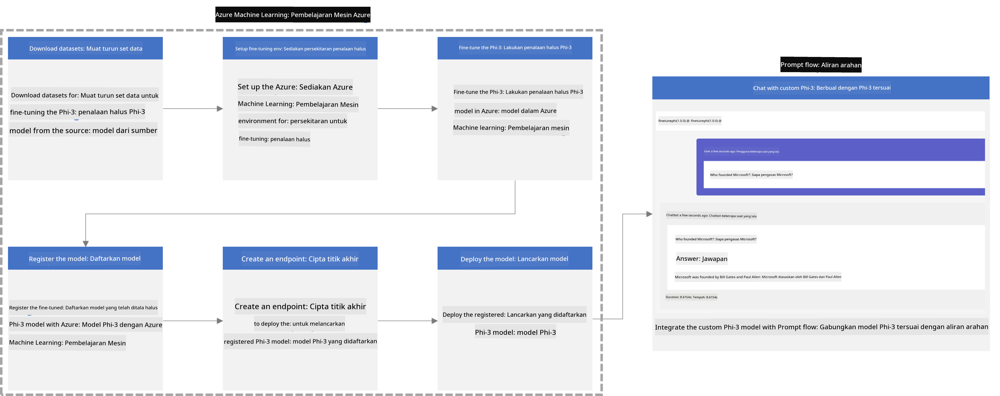
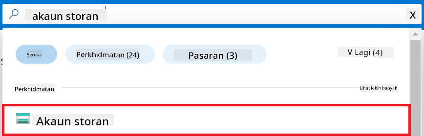
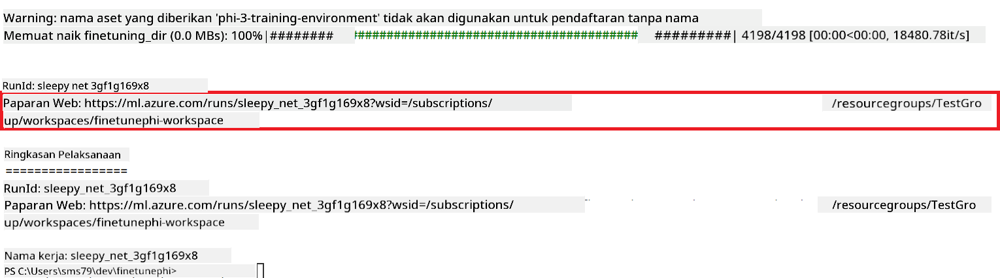
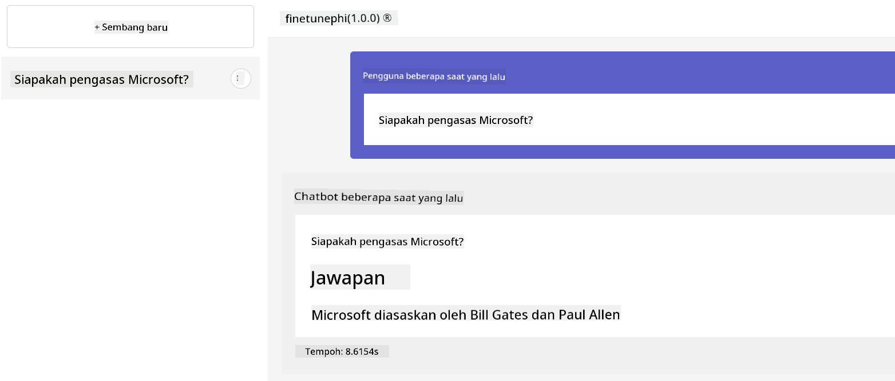

<!--
CO_OP_TRANSLATOR_METADATA:
{
  "original_hash": "7ca2c30fdb802664070e9cfbf92e24fe",
  "translation_date": "2026-01-05T09:01:28+00:00",
  "source_file": "md/02.Application/01.TextAndChat/Phi3/E2E_Phi-3-FineTuning_PromptFlow_Integration.md",
  "language_code": "ms"
}
-->
# Laraskan dan Gabungkan model Phi-3 tersuai dengan Prompt flow

Contoh hujung ke hujung (E2E) ini berdasarkan panduan "[Laraskan dan Gabungkan Model Phi-3 Tersuai dengan Prompt Flow: Panduan Langkah demi Langkah](https://techcommunity.microsoft.com/t5/educator-developer-blog/fine-tune-and-integrate-custom-phi-3-models-with-prompt-flow/ba-p/4178612?WT.mc_id=aiml-137032-kinfeylo)" dari Komuniti Teknologi Microsoft. Ia memperkenalkan proses larasan halus, penerapan, dan penggabungan model Phi-3 tersuai dengan Prompt flow.

## Gambaran Keseluruhan

Dalam contoh E2E ini, anda akan belajar cara untuk melaraskan halus model Phi-3 dan menggabungkannya dengan Prompt flow. Dengan memanfaatkan Azure Machine Learning dan Prompt flow, anda akan mewujudkan aliran kerja untuk menerapkan dan menggunakan model AI tersuai. Contoh E2E ini dibahagikan kepada tiga senario:

**Senario 1: Sediakan sumber Azure dan Bersedia untuk pelarasan halus**

**Senario 2: Laraskan halus model Phi-3 dan Terbitkan dalam Azure Machine Learning Studio**

**Senario 3: Gabungkan dengan Prompt flow dan Berbual dengan model tersuai anda**

Berikut adalah gambaran keseluruhan contoh E2E ini.



### Jadual Kandungan

1. **[Senario 1: Sediakan sumber Azure dan Bersedia untuk pelarasan halus](../../../../../../md/02.Application/01.TextAndChat/Phi3)**
    - [Buat Workspace Azure Machine Learning](../../../../../../md/02.Application/01.TextAndChat/Phi3)
    - [Mohon kuota GPU dalam Langganan Azure](../../../../../../md/02.Application/01.TextAndChat/Phi3)
    - [Tambah penetapan peranan](../../../../../../md/02.Application/01.TextAndChat/Phi3)
    - [Sediakan projek](../../../../../../md/02.Application/01.TextAndChat/Phi3)
    - [Sediakan set data untuk pelarasan halus](../../../../../../md/02.Application/01.TextAndChat/Phi3)

1. **[Senario 2: Laraskan halus model Phi-3 dan Terbitkan dalam Azure Machine Learning Studio](../../../../../../md/02.Application/01.TextAndChat/Phi3)**
    - [Sediakan Azure CLI](../../../../../../md/02.Application/01.TextAndChat/Phi3)
    - [Laraskan halus model Phi-3](../../../../../../md/02.Application/01.TextAndChat/Phi3)
    - [Terbitkan model yang telah dilaraskan halus](../../../../../../md/02.Application/01.TextAndChat/Phi3)

1. **[Senario 3: Gabungkan dengan Prompt flow dan Berbual dengan model tersuai anda](../../../../../../md/02.Application/01.TextAndChat/Phi3)**
    - [Gabungkan model Phi-3 tersuai dengan Prompt flow](../../../../../../md/02.Application/01.TextAndChat/Phi3)
    - [Berbual dengan model tersuai anda](../../../../../../md/02.Application/01.TextAndChat/Phi3)

## Senario 1: Sediakan sumber Azure dan Bersedia untuk pelarasan halus

### Buat Workspace Azure Machine Learning

1. Taip *azure machine learning* dalam **bar carian** di bahagian atas halaman portal dan pilih **Azure Machine Learning** dari pilihan yang muncul.

    

1. Pilih **+ Create** dari menu navigasi.

1. Pilih **New workspace** dari menu navigasi.

    

1. Lakukan tugasan berikut:

    - Pilih **Subscription** Azure anda.
    - Pilih **Resource group** untuk digunakan (cipta baru jika perlu).
    - Masukkan **Workspace Name**. Ia mesti nilai unik.
    - Pilih **Region** yang anda ingin gunakan.
    - Pilih **Storage account** untuk digunakan (cipta baru jika perlu).
    - Pilih **Key vault** untuk digunakan (cipta baru jika perlu).
    - Pilih **Application insights** untuk digunakan (cipta baru jika perlu).
    - Pilih **Container registry** untuk digunakan (cipta baru jika perlu).

    

1. Pilih **Review + Create**.

1. Pilih **Create**.

### Mohon kuota GPU dalam Langganan Azure

Dalam contoh E2E ini, anda akan menggunakan *Standard_NC24ads_A100_v4 GPU* untuk pelarasan halus, yang memerlukan permohonan kuota, dan *Standard_E4s_v3* CPU untuk penerapan, yang tidak memerlukan permohonan kuota.

> [!NOTE]
>
> Hanya langganan Pay-As-You-Go (jenis langganan standard) layak untuk pengagihan GPU; langganan manfaat tidak disokong buat masa ini.
>
> Bagi mereka yang menggunakan langganan manfaat (seperti Visual Studio Enterprise Subscription) atau yang ingin menguji proses pelarasan halus dan penerapan dengan cepat, tutorial ini juga memberikan panduan untuk pelarasan halus menggunakan set data minimal dengan CPU. Namun, penting untuk memahami bahawa hasil pelarasan halus adalah jauh lebih baik apabila menggunakan GPU dengan set data yang lebih besar.

1. Lawati [Azure ML Studio](https://ml.azure.com/home?wt.mc_id=studentamb_279723).

1. Lakukan tugasan berikut untuk memohon kuota *Standard NCADSA100v4 Family*:

    - Pilih **Quota** dari tab sebelah kiri.
    - Pilih **Virtual machine family** yang hendak digunakan. Contohnya, pilih **Standard NCADSA100v4 Family Cluster Dedicated vCPUs**, yang termasuk *Standard_NC24ads_A100_v4* GPU.
    - Pilih **Request quota** dari menu navigasi.

        

    - Di halaman Request quota, masukkan **New cores limit** yang ingin digunakan. Contohnya, 24.
    - Di halaman Request quota, pilih **Submit** untuk memohon kuota GPU.

> [!NOTE]
> Anda boleh memilih GPU atau CPU yang sesuai untuk keperluan anda dengan merujuk dokumen [Saiz untuk Mesin Maya di Azure](https://learn.microsoft.com/azure/virtual-machines/sizes/overview?tabs=breakdownseries%2Cgeneralsizelist%2Ccomputesizelist%2Cmemorysizelist%2Cstoragesizelist%2Cgpusizelist%2Cfpgasizelist%2Chpcsizelist).

### Tambah penetapan peranan

Untuk melaraskan halus dan menerapkan model anda, anda mesti terlebih dahulu mencipta User Assigned Managed Identity (UAI) dan memberi kebenaran yang sesuai kepadanya. UAI ini akan digunakan untuk pengesahan semasa penerapan.

#### Cipta User Assigned Managed Identity(UAI)

1. Taip *managed identities* dalam **bar carian** di bahagian atas halaman portal dan pilih **Managed Identities** dari pilihan yang muncul.

    

1. Pilih **+ Create**.

    

1. Lakukan tugasan berikut:

    - Pilih **Subscription** Azure anda.
    - Pilih **Resource group** untuk digunakan (cipta baru jika perlu).
    - Pilih **Region** yang ingin anda gunakan.
    - Masukkan **Name**. Ia mesti nilai unik.

1. Pilih **Review + create**.

1. Pilih **+ Create**.

#### Tambah penetapan peranan Contributor kepada Managed Identity

1. Navigasi ke sumber Managed Identity yang anda cipta.

1. Pilih **Azure role assignments** dari tab sebelah kiri.

1. Pilih **+Add role assignment** dari menu navigasi.

1. Dalam halaman Add role assignment, lakukan tugasan berikut:
    - Pilih **Scope** kepada **Resource group**.
    - Pilih **Subscription** Azure anda.
    - Pilih **Resource group** yang hendak digunakan.
    - Pilih **Role** kepada **Contributor**.

    

1. Pilih **Save**.

#### Tambah penetapan peranan Storage Blob Data Reader kepada Managed Identity

1. Taip *storage accounts* dalam **bar carian** di bahagian atas halaman portal dan pilih **Storage accounts** dari pilihan yang muncul.

    

1. Pilih akaun storan yang berkait dengan workspace Azure Machine Learning yang anda cipta. Contohnya, *finetunephistorage*.

1. Lakukan tugasan berikut untuk navigasi ke halaman Add role assignment:

    - Navigasi ke akaun Azure Storage yang anda cipta.
    - Pilih **Access Control (IAM)** dari tab sebelah kiri.
    - Pilih **+ Add** dari menu navigasi.
    - Pilih **Add role assignment** dari menu navigasi.

    

1. Dalam halaman Add role assignment, lakukan tugasan berikut:

    - Dalam halaman Role, taip *Storage Blob Data Reader* dalam **bar carian** dan pilih **Storage Blob Data Reader** dari pilihan yang muncul.
    - Dalam halaman Role, pilih **Next**.
    - Dalam halaman Members, pilih **Assign access to** **Managed identity**.
    - Dalam halaman Members, pilih **+ Select members**.
    - Dalam halaman Select managed identities, pilih **Subscription** Azure anda.
    - Dalam halaman Select managed identities, pilih **Managed identity** kepada **Manage Identity**.
    - Dalam halaman Select managed identities, pilih Manage Identity yang anda cipta. Contohnya, *finetunephi-managedidentity*.
    - Dalam halaman Select managed identities, pilih **Select**.

    

1. Pilih **Review + assign**.

#### Tambah penetapan peranan AcrPull kepada Managed Identity

1. Taip *container registries* dalam **bar carian** di bahagian atas halaman portal dan pilih **Container registries** dari pilihan yang muncul.

    

1. Pilih registry kontena yang berkait dengan workspace Azure Machine Learning. Contohnya, *finetunephicontainerregistries*

1. Lakukan tugasan berikut untuk navigasi ke halaman Add role assignment:

    - Pilih **Access Control (IAM)** dari tab sebelah kiri.
    - Pilih **+ Add** dari menu navigasi.
    - Pilih **Add role assignment** dari menu navigasi.

1. Dalam halaman Add role assignment, lakukan tugasan berikut:

    - Dalam halaman Role, Taip *AcrPull* dalam **bar carian** dan pilih **AcrPull** dari pilihan yang muncul.
    - Dalam halaman Role, pilih **Next**.
    - Dalam halaman Members, pilih **Assign access to** **Managed identity**.
    - Dalam halaman Members, pilih **+ Select members**.
    - Dalam halaman Select managed identities, pilih **Subscription** Azure anda.
    - Dalam halaman Select managed identities, pilih **Managed identity** kepada **Manage Identity**.
    - Dalam halaman Select managed identities, pilih Manage Identity yang anda cipta. Contohnya, *finetunephi-managedidentity*.
    - Dalam halaman Select managed identities, pilih **Select**.
    - Pilih **Review + assign**.

### Sediakan projek

Sekarang, anda akan mencipta folder untuk bekerja di dalamnya dan menyediakan persekitaran maya untuk membangunkan program yang berinteraksi dengan pengguna serta menggunakan sejarah sembang yang disimpan dari Azure Cosmos DB untuk memaklumkan balasannya.

#### Cipta folder untuk bekerja di dalamnya

1. Buka tetingkap terminal dan taip arahan berikut untuk mencipta folder bernama *finetune-phi* dalam laluan lalai.

    ```console
    mkdir finetune-phi
    ```

1. Taip arahan berikut dalam terminal anda untuk menavigasi ke folder *finetune-phi* yang anda cipta.

    ```console
    cd finetune-phi
    ```

#### Cipta persekitaran maya

1. Taip arahan berikut dalam terminal anda untuk mencipta persekitaran maya bernama *.venv*.

    ```console
    python -m venv .venv
    ```

1. Taip arahan berikut dalam terminal anda untuk mengaktifkan persekitaran maya.

    ```console
    .venv\Scripts\activate.bat
    ```

> [!NOTE]
>
> Jika berjaya, anda harus melihat *(.venv)* sebelum prompt arahan.

#### Pasang pakej yang diperlukan

1. Taip arahan berikut dalam terminal anda untuk memasang pakej yang diperlukan.

    ```console
    pip install datasets==2.19.1
    pip install transformers==4.41.1
    pip install azure-ai-ml==1.16.0
    pip install torch==2.3.1
    pip install trl==0.9.4
    pip install promptflow==1.12.0
    ```

#### Cipta fail projek
Dalam latihan ini, anda akan mencipta fail penting untuk projek kami. Fail-fail ini termasuk skrip untuk memuat turun set data, menyediakan persekitaran Azure Machine Learning, menala halus model Phi-3, dan menerapkan model yang telah ditala halus. Anda juga akan mencipta fail *conda.yml* untuk menyediakan persekitaran tala halus.

Dalam latihan ini, anda akan:

- Mencipta fail *download_dataset.py* untuk memuat turun set data.
- Mencipta fail *setup_ml.py* untuk menyediakan persekitaran Azure Machine Learning.
- Mencipta fail *fine_tune.py* dalam folder *finetuning_dir* untuk menala halus model Phi-3 menggunakan set data.
- Mencipta fail *conda.yml* untuk menyediakan persekitaran tala halus.
- Mencipta fail *deploy_model.py* untuk menerapkan model yang telah ditala halus.
- Mencipta fail *integrate_with_promptflow.py*, untuk mengintegrasikan model yang telah ditala halus dan melaksanakan model menggunakan Prompt flow.
- Mencipta fail flow.dag.yml, untuk menyediakan struktur aliran kerja bagi Prompt flow.
- Mencipta fail *config.py* untuk memasukkan maklumat Azure.

> [!NOTE]
>
> Struktur folder lengkap:
>
> ```text
> └── YourUserName
> .    └── finetune-phi
> .        ├── finetuning_dir
> .        │      └── fine_tune.py
> .        ├── conda.yml
> .        ├── config.py
> .        ├── deploy_model.py
> .        ├── download_dataset.py
> .        ├── flow.dag.yml
> .        ├── integrate_with_promptflow.py
> .        └── setup_ml.py
> ```

1. Buka **Visual Studio Code**.

1. Pilih **File** dari bar menu.

1. Pilih **Open Folder**.

1. Pilih folder *finetune-phi* yang anda cipta, yang terletak di *C:\Users\yourUserName\finetune-phi*.

    

1. Di panel kiri Visual Studio Code, klik kanan dan pilih **New File** untuk mencipta fail baru bernama *download_dataset.py*.

1. Di panel kiri Visual Studio Code, klik kanan dan pilih **New File** untuk mencipta fail baru bernama *setup_ml.py*.

1. Di panel kiri Visual Studio Code, klik kanan dan pilih **New File** untuk mencipta fail baru bernama *deploy_model.py*.

    

1. Di panel kiri Visual Studio Code, klik kanan dan pilih **New Folder** untuk mencipta folder baru bernama *finetuning_dir*.

1. Dalam folder *finetuning_dir*, cipta fail baru bernama *fine_tune.py*.

#### Cipta dan Konfigurasikan fail *conda.yml*

1. Di panel kiri Visual Studio Code, klik kanan dan pilih **New File** untuk mencipta fail baru bernama *conda.yml*.

1. Tambahkan kod berikut ke fail *conda.yml* untuk menyediakan persekitaran tala halus bagi model Phi-3.

    ```yml
    name: phi-3-training-env
    channels:
      - defaults
      - conda-forge
    dependencies:
      - python=3.10
      - pip
      - numpy<2.0
      - pip:
          - torch==2.4.0
          - torchvision==0.19.0
          - trl==0.8.6
          - transformers==4.41
          - datasets==2.21.0
          - azureml-core==1.57.0
          - azure-storage-blob==12.19.0
          - azure-ai-ml==1.16
          - azure-identity==1.17.1
          - accelerate==0.33.0
          - mlflow==2.15.1
          - azureml-mlflow==1.57.0
    ```

#### Cipta dan Konfigurasikan fail *config.py*

1. Di panel kiri Visual Studio Code, klik kanan dan pilih **New File** untuk mencipta fail baru bernama *config.py*.

1. Tambahkan kod berikut ke fail *config.py* untuk memasukkan maklumat Azure anda.

    ```python
    # Tetapan Azure
    AZURE_SUBSCRIPTION_ID = "your_subscription_id"
    AZURE_RESOURCE_GROUP_NAME = "your_resource_group_name" # "TestGroup"

    # Tetapan Pembelajaran Mesin Azure
    AZURE_ML_WORKSPACE_NAME = "your_workspace_name" # "finetunephi-workspace"

    # Tetapan Identiti Terurus Azure
    AZURE_MANAGED_IDENTITY_CLIENT_ID = "your_azure_managed_identity_client_id"
    AZURE_MANAGED_IDENTITY_NAME = "your_azure_managed_identity_name" # "finetunephi-mangedidentity"
    AZURE_MANAGED_IDENTITY_RESOURCE_ID = f"/subscriptions/{AZURE_SUBSCRIPTION_ID}/resourceGroups/{AZURE_RESOURCE_GROUP_NAME}/providers/Microsoft.ManagedIdentity/userAssignedIdentities/{AZURE_MANAGED_IDENTITY_NAME}"

    # Laluan fail set data
    TRAIN_DATA_PATH = "data/train_data.jsonl"
    TEST_DATA_PATH = "data/test_data.jsonl"

    # Tetapan model yang telah dilatih halus
    AZURE_MODEL_NAME = "your_fine_tuned_model_name" # "finetune-phi-model"
    AZURE_ENDPOINT_NAME = "your_fine_tuned_model_endpoint_name" # "finetune-phi-endpoint"
    AZURE_DEPLOYMENT_NAME = "your_fine_tuned_model_deployment_name" # "finetune-phi-deployment"

    AZURE_ML_API_KEY = "your_fine_tuned_model_api_key"
    AZURE_ML_ENDPOINT = "your_fine_tuned_model_endpoint_uri" # "https://{your-endpoint-name}.{your-region}.inference.ml.azure.com/score"
    ```

#### Tambah pembolehubah persekitaran Azure

1. Laksanakan tugas berikut untuk menambah ID Langganan Azure:

    - Taip *subscriptions* di **bar carian** di bahagian atas halaman portal dan pilih **Subscriptions** dari pilihan yang muncul.
    - Pilih Langganan Azure yang anda gunakan sekarang.
    - Salin dan tampal ID Langganan anda ke dalam fail *config.py*.

    

1. Laksanakan tugas berikut untuk menambah Nama Workspace Azure:

    - Navigasi ke sumber Azure Machine Learning yang anda cipta.
    - Salin dan tampal nama akaun anda ke dalam fail *config.py*.

    

1. Laksanakan tugas berikut untuk menambah Nama Kumpulan Sumber Azure:

    - Navigasi ke sumber Azure Machine Learning yang anda cipta.
    - Salin dan tampal Nama Kumpulan Sumber Azure anda ke dalam fail *config.py*.

    

2. Laksanakan tugas berikut untuk menambah nama Identiti Terurus Azure

    - Navigasi ke sumber Identiti Terurus yang anda cipta.
    - Salin dan tampal nama Identiti Terurus Azure anda ke dalam fail *config.py*.

    

### Sediakan set data untuk tala halus

Dalam latihan ini, anda akan menjalankan fail *download_dataset.py* untuk memuat turun set data *ULTRACHAT_200k* ke persekitaran tempatan anda. Anda kemudian akan menggunakan set data ini untuk menala halus model Phi-3 dalam Azure Machine Learning.

#### Muat turun set data anda menggunakan *download_dataset.py*

1. Buka fail *download_dataset.py* dalam Visual Studio Code.

1. Tambahkan kod berikut ke dalam *download_dataset.py*.

    ```python
    import json
    import os
    from datasets import load_dataset
    from config import (
        TRAIN_DATA_PATH,
        TEST_DATA_PATH)

    def load_and_split_dataset(dataset_name, config_name, split_ratio):
        """
        Load and split a dataset.
        """
        # Muatkan set data dengan nama, konfigurasi, dan nisbah pecahan yang ditetapkan
        dataset = load_dataset(dataset_name, config_name, split=split_ratio)
        print(f"Original dataset size: {len(dataset)}")
        
        # Bahagikan set data kepada set latihan dan ujian (80% latihan, 20% ujian)
        split_dataset = dataset.train_test_split(test_size=0.2)
        print(f"Train dataset size: {len(split_dataset['train'])}")
        print(f"Test dataset size: {len(split_dataset['test'])}")
        
        return split_dataset

    def save_dataset_to_jsonl(dataset, filepath):
        """
        Save a dataset to a JSONL file.
        """
        # Cipta direktori jika ia tidak wujud
        os.makedirs(os.path.dirname(filepath), exist_ok=True)
        
        # Buka fail dalam mod tulis
        with open(filepath, 'w', encoding='utf-8') as f:
            # Ulang setiap rekod dalam set data
            for record in dataset:
                # Buang rekod sebagai objek JSON dan tulis ke dalam fail
                json.dump(record, f)
                # Tulis aksara baris baru untuk memisahkan rekod
                f.write('\n')
        
        print(f"Dataset saved to {filepath}")

    def main():
        """
        Main function to load, split, and save the dataset.
        """
        # Muatkan dan bahagi set data ULTRACHAT_200k dengan konfigurasi dan nisbah pecahan tertentu
        dataset = load_and_split_dataset("HuggingFaceH4/ultrachat_200k", 'default', 'train_sft[:1%]')
        
        # Ekstrak set data latihan dan ujian daripada pecahan
        train_dataset = dataset['train']
        test_dataset = dataset['test']

        # Simpan set data latihan ke fail JSONL
        save_dataset_to_jsonl(train_dataset, TRAIN_DATA_PATH)
        
        # Simpan set data ujian ke fail JSONL berasingan
        save_dataset_to_jsonl(test_dataset, TEST_DATA_PATH)

    if __name__ == "__main__":
        main()

    ```

> [!TIP]
>
> **Panduan untuk menala halus dengan set data minimal menggunakan CPU**
>
> Jika anda ingin menggunakan CPU untuk menala halus, pendekatan ini sesuai untuk mereka yang mempunyai langganan manfaat (seperti Langganan Visual Studio Enterprise) atau untuk menguji proses tala halus dan penerapan dengan cepat.
>
> Gantikan `dataset = load_and_split_dataset("HuggingFaceH4/ultrachat_200k", 'default', 'train_sft[:1%]')` dengan `dataset = load_and_split_dataset("HuggingFaceH4/ultrachat_200k", 'default', 'train_sft[:10]')`
>

1. Taip arahan berikut dalam terminal anda untuk menjalankan skrip dan memuat turun set data ke persekitaran tempatan anda.

    ```console
    python download_data.py
    ```

1. Sahihkan bahawa set data telah berjaya disimpan ke direktori *finetune-phi/data* tempatan anda.

> [!NOTE]
>
> **Saiz set data dan masa tala halus**
>
> Dalam contoh E2E ini, anda hanya menggunakan 1% daripada set data (`train_sft[:1%]`). Ini secara signifikan mengurangkan jumlah data, mempercepatkan proses muat naik dan tala halus. Anda boleh laraskan peratusan untuk mencari keseimbangan yang tepat antara masa latihan dan prestasi model. Menggunakan subset set data yang lebih kecil mengurangkan masa yang diperlukan untuk tala halus, menjadikan proses lebih mudah diurus untuk contoh E2E.

## Senario 2: Tala halus model Phi-3 dan Terapkan dalam Azure Machine Learning Studio

### Sediakan Azure CLI

Anda perlu menyediakan Azure CLI untuk mengesahkan persekitaran anda. Azure CLI membolehkan anda mengurus sumber Azure terus dari baris perintah dan menyediakan kelayakan yang diperlukan agar Azure Machine Learning dapat mengakses sumber ini. Untuk memulakan, pasang [Azure CLI](https://learn.microsoft.com/cli/azure/install-azure-cli)

1. Buka tetingkap terminal dan taip arahan berikut untuk log masuk ke akaun Azure anda.

    ```console
    az login
    ```

1. Pilih akaun Azure yang anda ingin gunakan.

1. Pilih langganan Azure yang anda ingin gunakan.

    

> [!TIP]
>
> Jika anda menghadapi masalah untuk log masuk ke Azure, cuba gunakan kod peranti. Buka tetingkap terminal dan taip arahan berikut untuk log masuk ke akaun Azure anda:
>
> ```console
> az login --use-device-code
> ```
>

### Tala halus model Phi-3

Dalam latihan ini, anda akan menala halus model Phi-3 menggunakan set data yang disediakan. Pertama, anda akan mentakrifkan proses tala halus dalam fail *fine_tune.py*. Kemudian, anda akan mengkonfigurasikan persekitaran Azure Machine Learning dan memulakan proses tala halus dengan menjalankan fail *setup_ml.py*. Skrip ini memastikan proses tala halus berlaku dalam persekitaran Azure Machine Learning.

Dengan menjalankan *setup_ml.py*, anda akan menjalankan proses tala halus dalam persekitaran Azure Machine Learning.

#### Tambah kod ke fail *fine_tune.py*

1. Navigasi ke folder *finetuning_dir* dan buka fail *fine_tune.py* dalam Visual Studio Code.

1. Tambahkan kod berikut ke dalam *fine_tune.py*.

    ```python
    import argparse
    import sys
    import logging
    import os
    from datasets import load_dataset
    import torch
    import mlflow
    from transformers import AutoModelForCausalLM, AutoTokenizer, TrainingArguments
    from trl import SFTTrainer

    # Untuk mengelakkan ralat INVALID_PARAMETER_VALUE dalam MLflow, lumpuhkan integrasi MLflow
    os.environ["DISABLE_MLFLOW_INTEGRATION"] = "True"

    # Tetapan log
    logging.basicConfig(
        format="%(asctime)s - %(levelname)s - %(name)s - %(message)s",
        datefmt="%Y-%m-%d %H:%M:%S",
        handlers=[logging.StreamHandler(sys.stdout)],
        level=logging.WARNING
    )
    logger = logging.getLogger(__name__)

    def initialize_model_and_tokenizer(model_name, model_kwargs):
        """
        Initialize the model and tokenizer with the given pretrained model name and arguments.
        """
        model = AutoModelForCausalLM.from_pretrained(model_name, **model_kwargs)
        tokenizer = AutoTokenizer.from_pretrained(model_name)
        tokenizer.model_max_length = 2048
        tokenizer.pad_token = tokenizer.unk_token
        tokenizer.pad_token_id = tokenizer.convert_tokens_to_ids(tokenizer.pad_token)
        tokenizer.padding_side = 'right'
        return model, tokenizer

    def apply_chat_template(example, tokenizer):
        """
        Apply a chat template to tokenize messages in the example.
        """
        messages = example["messages"]
        if messages[0]["role"] != "system":
            messages.insert(0, {"role": "system", "content": ""})
        example["text"] = tokenizer.apply_chat_template(
            messages, tokenize=False, add_generation_prompt=False
        )
        return example

    def load_and_preprocess_data(train_filepath, test_filepath, tokenizer):
        """
        Load and preprocess the dataset.
        """
        train_dataset = load_dataset('json', data_files=train_filepath, split='train')
        test_dataset = load_dataset('json', data_files=test_filepath, split='train')
        column_names = list(train_dataset.features)

        train_dataset = train_dataset.map(
            apply_chat_template,
            fn_kwargs={"tokenizer": tokenizer},
            num_proc=10,
            remove_columns=column_names,
            desc="Applying chat template to train dataset",
        )

        test_dataset = test_dataset.map(
            apply_chat_template,
            fn_kwargs={"tokenizer": tokenizer},
            num_proc=10,
            remove_columns=column_names,
            desc="Applying chat template to test dataset",
        )

        return train_dataset, test_dataset

    def train_and_evaluate_model(train_dataset, test_dataset, model, tokenizer, output_dir):
        """
        Train and evaluate the model.
        """
        training_args = TrainingArguments(
            bf16=True,
            do_eval=True,
            output_dir=output_dir,
            eval_strategy="epoch",
            learning_rate=5.0e-06,
            logging_steps=20,
            lr_scheduler_type="cosine",
            num_train_epochs=3,
            overwrite_output_dir=True,
            per_device_eval_batch_size=4,
            per_device_train_batch_size=4,
            remove_unused_columns=True,
            save_steps=500,
            seed=0,
            gradient_checkpointing=True,
            gradient_accumulation_steps=1,
            warmup_ratio=0.2,
        )

        trainer = SFTTrainer(
            model=model,
            args=training_args,
            train_dataset=train_dataset,
            eval_dataset=test_dataset,
            max_seq_length=2048,
            dataset_text_field="text",
            tokenizer=tokenizer,
            packing=True
        )

        train_result = trainer.train()
        trainer.log_metrics("train", train_result.metrics)

        mlflow.transformers.log_model(
            transformers_model={"model": trainer.model, "tokenizer": tokenizer},
            artifact_path=output_dir,
        )

        tokenizer.padding_side = 'left'
        eval_metrics = trainer.evaluate()
        eval_metrics["eval_samples"] = len(test_dataset)
        trainer.log_metrics("eval", eval_metrics)

    def main(train_file, eval_file, model_output_dir):
        """
        Main function to fine-tune the model.
        """
        model_kwargs = {
            "use_cache": False,
            "trust_remote_code": True,
            "torch_dtype": torch.bfloat16,
            "device_map": None,
            "attn_implementation": "eager"
        }

        # pretrained_model_name = "microsoft/Phi-3-mini-4k-instruct"
        pretrained_model_name = "microsoft/Phi-3.5-mini-instruct"

        with mlflow.start_run():
            model, tokenizer = initialize_model_and_tokenizer(pretrained_model_name, model_kwargs)
            train_dataset, test_dataset = load_and_preprocess_data(train_file, eval_file, tokenizer)
            train_and_evaluate_model(train_dataset, test_dataset, model, tokenizer, model_output_dir)

    if __name__ == "__main__":
        parser = argparse.ArgumentParser()
        parser.add_argument("--train-file", type=str, required=True, help="Path to the training data")
        parser.add_argument("--eval-file", type=str, required=True, help="Path to the evaluation data")
        parser.add_argument("--model_output_dir", type=str, required=True, help="Directory to save the fine-tuned model")
        args = parser.parse_args()
        main(args.train_file, args.eval_file, args.model_output_dir)

    ```

1. Simpan dan tutup fail *fine_tune.py*.

> [!TIP]
> **Anda boleh menala halus model Phi-3.5**
>
> Dalam fail *fine_tune.py*, anda boleh menukar `pretrained_model_name` dari `"microsoft/Phi-3-mini-4k-instruct"` kepada mana-mana model yang anda mahu tala halus. Sebagai contoh, jika anda menukarnya kepada `"microsoft/Phi-3.5-mini-instruct"`, anda akan menggunakan model Phi-3.5-mini-instruct untuk tala halus. Untuk mencari dan menggunakan nama model yang anda suka, lawati [Hugging Face](https://huggingface.co/), cari model yang anda minati, dan kemudian salin dan tampal namanya ke medan `pretrained_model_name` dalam skrip anda.
>
> <image type="content" src="../../../../imgs/02/FineTuning-PromptFlow/finetunephi3.5.png" alt-text="Tala halus Phi-3.5.">
>

#### Tambah kod ke fail *setup_ml.py*

1. Buka fail *setup_ml.py* dalam Visual Studio Code.

1. Tambahkan kod berikut ke dalam *setup_ml.py*.

    ```python
    import logging
    from azure.ai.ml import MLClient, command, Input
    from azure.ai.ml.entities import Environment, AmlCompute
    from azure.identity import AzureCliCredential
    from config import (
        AZURE_SUBSCRIPTION_ID,
        AZURE_RESOURCE_GROUP_NAME,
        AZURE_ML_WORKSPACE_NAME,
        TRAIN_DATA_PATH,
        TEST_DATA_PATH
    )

    # Pemalar

    # Buka komen baris berikut untuk menggunakan instans CPU untuk latihan
    # COMPUTE_INSTANCE_TYPE = "Standard_E16s_v3" # cpu
    # COMPUTE_NAME = "cpu-e16s-v3"
    # DOCKER_IMAGE_NAME = "mcr.microsoft.com/azureml/openmpi4.1.0-ubuntu20.04:latest"

    # Buka komen baris berikut untuk menggunakan instans GPU untuk latihan
    COMPUTE_INSTANCE_TYPE = "Standard_NC24ads_A100_v4"
    COMPUTE_NAME = "gpu-nc24s-a100-v4"
    DOCKER_IMAGE_NAME = "mcr.microsoft.com/azureml/curated/acft-hf-nlp-gpu:59"

    CONDA_FILE = "conda.yml"
    LOCATION = "eastus2" # Gantikan dengan lokasi kluster pengkomputeran anda
    FINETUNING_DIR = "./finetuning_dir" # Laluan ke skrip penyelarasan halus
    TRAINING_ENV_NAME = "phi-3-training-environment" # Nama persekitaran latihan
    MODEL_OUTPUT_DIR = "./model_output" # Laluan ke direktori output model dalam azure ml

    # Persediaan log untuk menjejaki proses
    logger = logging.getLogger(__name__)
    logging.basicConfig(
        format="%(asctime)s - %(levelname)s - %(name)s - %(message)s",
        datefmt="%Y-%m-%d %H:%M:%S",
        level=logging.WARNING
    )

    def get_ml_client():
        """
        Initialize the ML Client using Azure CLI credentials.
        """
        credential = AzureCliCredential()
        return MLClient(credential, AZURE_SUBSCRIPTION_ID, AZURE_RESOURCE_GROUP_NAME, AZURE_ML_WORKSPACE_NAME)

    def create_or_get_environment(ml_client):
        """
        Create or update the training environment in Azure ML.
        """
        env = Environment(
            image=DOCKER_IMAGE_NAME,  # Imej Docker untuk persekitaran
            conda_file=CONDA_FILE,  # Fail persekitaran Conda
            name=TRAINING_ENV_NAME,  # Nama persekitaran
        )
        return ml_client.environments.create_or_update(env)

    def create_or_get_compute_cluster(ml_client, compute_name, COMPUTE_INSTANCE_TYPE, location):
        """
        Create or update the compute cluster in Azure ML.
        """
        try:
            compute_cluster = ml_client.compute.get(compute_name)
            logger.info(f"Compute cluster '{compute_name}' already exists. Reusing it for the current run.")
        except Exception:
            logger.info(f"Compute cluster '{compute_name}' does not exist. Creating a new one with size {COMPUTE_INSTANCE_TYPE}.")
            compute_cluster = AmlCompute(
                name=compute_name,
                size=COMPUTE_INSTANCE_TYPE,
                location=location,
                tier="Dedicated",  # Peringkat kluster pengkomputeran
                min_instances=0,  # Bilangan instans minimum
                max_instances=1  # Bilangan instans maksimum
            )
            ml_client.compute.begin_create_or_update(compute_cluster).wait()  # Tunggu kluster untuk dicipta
        return compute_cluster

    def create_fine_tuning_job(env, compute_name):
        """
        Set up the fine-tuning job in Azure ML.
        """
        return command(
            code=FINETUNING_DIR,  # Laluan ke fine_tune.py
            command=(
                "python fine_tune.py "
                "--train-file ${{inputs.train_file}} "
                "--eval-file ${{inputs.eval_file}} "
                "--model_output_dir ${{inputs.model_output}}"
            ),
            environment=env,  # Persekitaran latihan
            compute=compute_name,  # Kluster pengkomputeran untuk digunakan
            inputs={
                "train_file": Input(type="uri_file", path=TRAIN_DATA_PATH),  # Laluan ke fail data latihan
                "eval_file": Input(type="uri_file", path=TEST_DATA_PATH),  # Laluan ke fail data penilaian
                "model_output": MODEL_OUTPUT_DIR
            }
        )

    def main():
        """
        Main function to set up and run the fine-tuning job in Azure ML.
        """
        # Inisialisasi ML Client
        ml_client = get_ml_client()

        # Cipta Persekitaran
        env = create_or_get_environment(ml_client)
        
        # Cipta atau dapatkan kluster pengkomputeran sedia ada
        create_or_get_compute_cluster(ml_client, COMPUTE_NAME, COMPUTE_INSTANCE_TYPE, LOCATION)

        # Cipta dan Hantar Tugas Penyelarasan Halus
        job = create_fine_tuning_job(env, COMPUTE_NAME)
        returned_job = ml_client.jobs.create_or_update(job)  # Hantar tugas
        ml_client.jobs.stream(returned_job.name)  # Alirkan log tugas
        
        # Tangkap nama tugas
        job_name = returned_job.name
        print(f"Job name: {job_name}")

    if __name__ == "__main__":
        main()

    ```

1. Gantikan `COMPUTE_INSTANCE_TYPE`, `COMPUTE_NAME`, dan `LOCATION` dengan butiran khusus anda.

    ```python
   # Nyahkomen baris berikut untuk menggunakan instance GPU bagi latihan
    COMPUTE_INSTANCE_TYPE = "Standard_NC24ads_A100_v4"
    COMPUTE_NAME = "gpu-nc24s-a100-v4"
    ...
    LOCATION = "eastus2" # Gantikan dengan lokasi kluster pengiraan anda
    ```

> [!TIP]
>
> **Panduan untuk menala halus dengan set data minimal menggunakan CPU**
>
> Jika anda ingin menggunakan CPU untuk menala halus, pendekatan ini sesuai untuk mereka yang mempunyai langganan manfaat (seperti Langganan Visual Studio Enterprise) atau untuk menguji proses tala halus dan penerapan dengan cepat.
>
> 1. Buka fail *setup_ml*.
> 1. Gantikan `COMPUTE_INSTANCE_TYPE`, `COMPUTE_NAME`, dan `DOCKER_IMAGE_NAME` dengan yang berikut. Jika anda tidak mempunyai akses kepada *Standard_E16s_v3*, anda boleh menggunakan instans CPU yang setara atau memohon kuota baru.
> 1. Gantikan `LOCATION` dengan butiran khusus anda.
>
>    ```python
>    # Uncomment the following lines to use a CPU instance for training
>    COMPUTE_INSTANCE_TYPE = "Standard_E16s_v3" # cpu
>    COMPUTE_NAME = "cpu-e16s-v3"
>    DOCKER_IMAGE_NAME = "mcr.microsoft.com/azureml/openmpi4.1.0-ubuntu20.04:latest"
>    LOCATION = "eastus2" # Replace with the location of your compute cluster
>    ```
>

1. Taip arahan berikut untuk menjalankan skrip *setup_ml.py* dan mulakan proses tala halus dalam Azure Machine Learning.

    ```python
    python setup_ml.py
    ```

1. Dalam latihan ini, anda berjaya menala halus model Phi-3 menggunakan Azure Machine Learning. Dengan menjalankan skrip *setup_ml.py*, anda telah menyediakan persekitaran Azure Machine Learning dan memulakan proses tala halus yang ditakrifkan dalam fail *fine_tune.py*. Sila ambil perhatian bahawa proses tala halus boleh mengambil masa yang cukup lama. Selepas menjalankan arahan `python setup_ml.py`, anda perlu menunggu proses selesai. Anda boleh memantau status kerja tala halus dengan mengikuti pautan yang disediakan dalam terminal ke portal Azure Machine Learning.

    

### Terapkan model yang telah ditala halus

Untuk mengintegrasikan model Phi-3 yang telah ditala halus dengan Prompt Flow, anda perlu menerapkan model itu agar boleh diakses untuk inferens masa nyata. Proses ini melibatkan pendaftaran model, mencipta titik hujung dalam talian, dan menerapkan model.

#### Tetapkan nama model, nama titik hujung, dan nama penerapan untuk penerapan

1. Buka fail *config.py*.

1. Gantikan `AZURE_MODEL_NAME = "your_fine_tuned_model_name"` dengan nama yang anda inginkan untuk model anda.

1. Gantikan `AZURE_ENDPOINT_NAME = "your_fine_tuned_model_endpoint_name"` dengan nama yang anda inginkan untuk titik hujung anda.

1. Gantikan `AZURE_DEPLOYMENT_NAME = "your_fine_tuned_model_deployment_name"` dengan nama yang anda inginkan untuk penerapan anda.

#### Tambah kod ke fail *deploy_model.py*

Menjalankan fail *deploy_model.py* mengautomasikan keseluruhan proses penerapan. Ia mendaftar model, mencipta titik hujung, dan melaksanakan penerapan berdasarkan tetapan yang dinyatakan dalam fail config.py, yang termasuk nama model, nama titik hujung, dan nama penerapan.

1. Buka fail *deploy_model.py* dalam Visual Studio Code.

1. Tambahkan kod berikut ke dalam *deploy_model.py*.

    ```python
    import logging
    from azure.identity import AzureCliCredential
    from azure.ai.ml import MLClient
    from azure.ai.ml.entities import Model, ProbeSettings, ManagedOnlineEndpoint, ManagedOnlineDeployment, IdentityConfiguration, ManagedIdentityConfiguration, OnlineRequestSettings
    from azure.ai.ml.constants import AssetTypes

    # Import konfigurasi
    from config import (
        AZURE_SUBSCRIPTION_ID,
        AZURE_RESOURCE_GROUP_NAME,
        AZURE_ML_WORKSPACE_NAME,
        AZURE_MANAGED_IDENTITY_RESOURCE_ID,
        AZURE_MANAGED_IDENTITY_CLIENT_ID,
        AZURE_MODEL_NAME,
        AZURE_ENDPOINT_NAME,
        AZURE_DEPLOYMENT_NAME
    )

    # Pemalar
    JOB_NAME = "your-job-name"
    COMPUTE_INSTANCE_TYPE = "Standard_E4s_v3"

    deployment_env_vars = {
        "SUBSCRIPTION_ID": AZURE_SUBSCRIPTION_ID,
        "RESOURCE_GROUP_NAME": AZURE_RESOURCE_GROUP_NAME,
        "UAI_CLIENT_ID": AZURE_MANAGED_IDENTITY_CLIENT_ID,
    }

    # Penyediaan log
    logging.basicConfig(
        format="%(asctime)s - %(levelname)s - %(name)s - %(message)s",
        datefmt="%Y-%m-%d %H:%M:%S",
        level=logging.DEBUG
    )
    logger = logging.getLogger(__name__)

    def get_ml_client():
        """Initialize and return the ML Client."""
        credential = AzureCliCredential()
        return MLClient(credential, AZURE_SUBSCRIPTION_ID, AZURE_RESOURCE_GROUP_NAME, AZURE_ML_WORKSPACE_NAME)

    def register_model(ml_client, model_name, job_name):
        """Register a new model."""
        model_path = f"azureml://jobs/{job_name}/outputs/artifacts/paths/model_output"
        logger.info(f"Registering model {model_name} from job {job_name} at path {model_path}.")
        run_model = Model(
            path=model_path,
            name=model_name,
            description="Model created from run.",
            type=AssetTypes.MLFLOW_MODEL,
        )
        model = ml_client.models.create_or_update(run_model)
        logger.info(f"Registered model ID: {model.id}")
        return model

    def delete_existing_endpoint(ml_client, endpoint_name):
        """Delete existing endpoint if it exists."""
        try:
            endpoint_result = ml_client.online_endpoints.get(name=endpoint_name)
            logger.info(f"Deleting existing endpoint {endpoint_name}.")
            ml_client.online_endpoints.begin_delete(name=endpoint_name).result()
            logger.info(f"Deleted existing endpoint {endpoint_name}.")
        except Exception as e:
            logger.info(f"No existing endpoint {endpoint_name} found to delete: {e}")

    def create_or_update_endpoint(ml_client, endpoint_name, description=""):
        """Create or update an endpoint."""
        delete_existing_endpoint(ml_client, endpoint_name)
        logger.info(f"Creating new endpoint {endpoint_name}.")
        endpoint = ManagedOnlineEndpoint(
            name=endpoint_name,
            description=description,
            identity=IdentityConfiguration(
                type="user_assigned",
                user_assigned_identities=[ManagedIdentityConfiguration(resource_id=AZURE_MANAGED_IDENTITY_RESOURCE_ID)]
            )
        )
        endpoint_result = ml_client.online_endpoints.begin_create_or_update(endpoint).result()
        logger.info(f"Created new endpoint {endpoint_name}.")
        return endpoint_result

    def create_or_update_deployment(ml_client, endpoint_name, deployment_name, model):
        """Create or update a deployment."""

        logger.info(f"Creating deployment {deployment_name} for endpoint {endpoint_name}.")
        deployment = ManagedOnlineDeployment(
            name=deployment_name,
            endpoint_name=endpoint_name,
            model=model.id,
            instance_type=COMPUTE_INSTANCE_TYPE,
            instance_count=1,
            environment_variables=deployment_env_vars,
            request_settings=OnlineRequestSettings(
                max_concurrent_requests_per_instance=3,
                request_timeout_ms=180000,
                max_queue_wait_ms=120000
            ),
            liveness_probe=ProbeSettings(
                failure_threshold=30,
                success_threshold=1,
                period=100,
                initial_delay=500,
            ),
            readiness_probe=ProbeSettings(
                failure_threshold=30,
                success_threshold=1,
                period=100,
                initial_delay=500,
            ),
        )
        deployment_result = ml_client.online_deployments.begin_create_or_update(deployment).result()
        logger.info(f"Created deployment {deployment.name} for endpoint {endpoint_name}.")
        return deployment_result

    def set_traffic_to_deployment(ml_client, endpoint_name, deployment_name):
        """Set traffic to the specified deployment."""
        try:
            # Dapatkan butiran titik akhir semasa
            endpoint = ml_client.online_endpoints.get(name=endpoint_name)
            
            # Log peruntukan trafik semasa untuk penyahpepijatan
            logger.info(f"Current traffic allocation: {endpoint.traffic}")
            
            # Tetapkan peruntukan trafik untuk penempatan
            endpoint.traffic = {deployment_name: 100}
            
            # Kemas kini titik akhir dengan peruntukan trafik baru
            endpoint_poller = ml_client.online_endpoints.begin_create_or_update(endpoint)
            updated_endpoint = endpoint_poller.result()
            
            # Log peruntukan trafik yang dikemas kini untuk penyahpepijatan
            logger.info(f"Updated traffic allocation: {updated_endpoint.traffic}")
            logger.info(f"Set traffic to deployment {deployment_name} at endpoint {endpoint_name}.")
            return updated_endpoint
        except Exception as e:
            # Log sebarang ralat yang berlaku semasa proses
            logger.error(f"Failed to set traffic to deployment: {e}")
            raise


    def main():
        ml_client = get_ml_client()

        registered_model = register_model(ml_client, AZURE_MODEL_NAME, JOB_NAME)
        logger.info(f"Registered model ID: {registered_model.id}")

        endpoint = create_or_update_endpoint(ml_client, AZURE_ENDPOINT_NAME, "Endpoint for finetuned Phi-3 model")
        logger.info(f"Endpoint {AZURE_ENDPOINT_NAME} is ready.")

        try:
            deployment = create_or_update_deployment(ml_client, AZURE_ENDPOINT_NAME, AZURE_DEPLOYMENT_NAME, registered_model)
            logger.info(f"Deployment {AZURE_DEPLOYMENT_NAME} is created for endpoint {AZURE_ENDPOINT_NAME}.")

            set_traffic_to_deployment(ml_client, AZURE_ENDPOINT_NAME, AZURE_DEPLOYMENT_NAME)
            logger.info(f"Traffic is set to deployment {AZURE_DEPLOYMENT_NAME} at endpoint {AZURE_ENDPOINT_NAME}.")
        except Exception as e:
            logger.error(f"Failed to create or update deployment: {e}")

    if __name__ == "__main__":
        main()

    ```

1. Laksanakan tugas berikut untuk mendapatkan `JOB_NAME`:

    - Navigasi ke sumber Azure Machine Learning yang anda cipta.
    - Pilih **Studio web URL** untuk membuka ruang kerja Azure Machine Learning.
    - Pilih **Jobs** dari tab sebelah kiri.
    - Pilih eksperimen untuk tala halus. Sebagai contoh, *finetunephi*.
    - Pilih kerja yang anda cipta.
- Salin dan tampal Nama kerja anda ke dalam `JOB_NAME = "nama-kerja-anda"` dalam fail *deploy_model.py*.

1. Gantikan `COMPUTE_INSTANCE_TYPE` dengan butiran khusus anda.

1. Taip arahan berikut untuk menjalankan skrip *deploy_model.py* dan mulakan proses penghasilan di Azure Machine Learning.

    ```python
    python deploy_model.py
    ```

> [!WARNING]
> Untuk mengelakkan caj tambahan ke akaun anda, pastikan untuk memadamkan titik hujung yang telah dibuat dalam ruang kerja Azure Machine Learning.
>

#### Semak status penghasilan di Azure Machine Learning Workspace

1. Lawati [Azure ML Studio](https://ml.azure.com/home?wt.mc_id=studentamb_279723).

1. Navigasi ke ruang kerja Azure Machine Learning yang anda buat.

1. Pilih **Studio web URL** untuk membuka ruang kerja Azure Machine Learning.

1. Pilih **Endpoints** daripada tab sebelah kiri.

    

2. Pilih titik hujung yang anda buat.

    

3. Pada halaman ini, anda boleh menguruskan titik hujung yang dibuat semasa proses penghasilan.

## Senario 3: Integrasi dengan Prompt flow dan Bersembang dengan model khusus anda

### Integrasikan model Phi-3 khusus dengan Prompt flow

Setelah berjaya menghasil model yang telah disesuaikan, anda kini boleh mengintegrasikannya dengan Prompt flow untuk menggunakan model anda dalam aplikasi masa nyata, membolehkan pelbagai tugasan interaktif dengan model Phi-3 khusus anda.

#### Tetapkan kunci api dan URI titik hujung model Phi-3 yang telah disesuaikan

1. Navigasi ke ruang kerja Azure Machine Learning yang anda buat.
1. Pilih **Endpoints** daripada tab sebelah kiri.
1. Pilih titik hujung yang anda buat.
1. Pilih **Consume** daripada menu navigasi.
1. Salin dan tampal **REST endpoint** anda ke dalam fail *config.py*, gantikan `AZURE_ML_ENDPOINT = "your_fine_tuned_model_endpoint_uri"` dengan **REST endpoint** anda.
1. Salin dan tampal **Primary key** anda ke dalam fail *config.py*, gantikan `AZURE_ML_API_KEY = "your_fine_tuned_model_api_key"` dengan **Primary key** anda.

    

#### Tambah kod ke fail *flow.dag.yml*

1. Buka fail *flow.dag.yml* dalam Visual Studio Code.

1. Tambah kod berikut ke dalam *flow.dag.yml*.

    ```yml
    inputs:
      input_data:
        type: string
        default: "Who founded Microsoft?"

    outputs:
      answer:
        type: string
        reference: ${integrate_with_promptflow.output}

    nodes:
    - name: integrate_with_promptflow
      type: python
      source:
        type: code
        path: integrate_with_promptflow.py
      inputs:
        input_data: ${inputs.input_data}
    ```

#### Tambah kod ke fail *integrate_with_promptflow.py*

1. Buka fail *integrate_with_promptflow.py* dalam Visual Studio Code.

1. Tambah kod berikut ke dalam *integrate_with_promptflow.py*.

    ```python
    import logging
    import requests
    from promptflow.core import tool
    import asyncio
    import platform
    from config import (
        AZURE_ML_ENDPOINT,
        AZURE_ML_API_KEY
    )

    # Tetapan log
    logging.basicConfig(
        format="%(asctime)s - %(levelname)s - %(name)s - %(message)s",
        datefmt="%Y-%m-%d %H:%M:%S",
        level=logging.DEBUG
    )
    logger = logging.getLogger(__name__)

    def query_azml_endpoint(input_data: list, endpoint_url: str, api_key: str) -> str:
        """
        Send a request to the Azure ML endpoint with the given input data.
        """
        headers = {
            "Content-Type": "application/json",
            "Authorization": f"Bearer {api_key}"
        }
        data = {
            "input_data": [input_data],
            "params": {
                "temperature": 0.7,
                "max_new_tokens": 128,
                "do_sample": True,
                "return_full_text": True
            }
        }
        try:
            response = requests.post(endpoint_url, json=data, headers=headers)
            response.raise_for_status()
            result = response.json()[0]
            logger.info("Successfully received response from Azure ML Endpoint.")
            return result
        except requests.exceptions.RequestException as e:
            logger.error(f"Error querying Azure ML Endpoint: {e}")
            raise

    def setup_asyncio_policy():
        """
        Setup asyncio event loop policy for Windows.
        """
        if platform.system() == 'Windows':
            asyncio.set_event_loop_policy(asyncio.WindowsSelectorEventLoopPolicy())
            logger.info("Set Windows asyncio event loop policy.")

    @tool
    def my_python_tool(input_data: str) -> str:
        """
        Tool function to process input data and query the Azure ML endpoint.
        """
        setup_asyncio_policy()
        return query_azml_endpoint(input_data, AZURE_ML_ENDPOINT, AZURE_ML_API_KEY)

    ```

### Bersembang dengan model khusus anda

1. Taip arahan berikut untuk menjalankan skrip *deploy_model.py* dan mulakan proses penghasilan di Azure Machine Learning.

    ```python
    pf flow serve --source ./ --port 8080 --host localhost
    ```

1. Berikut adalah contoh hasil: Kini anda boleh bersembang dengan model Phi-3 khusus anda. Disarankan untuk bertanya soalan berdasarkan data yang digunakan untuk penalaan halus.

    

---

<!-- CO-OP TRANSLATOR DISCLAIMER START -->
**Penafian**:  
Dokumen ini telah diterjemahkan menggunakan perkhidmatan terjemahan AI [Co-op Translator](https://github.com/Azure/co-op-translator). Walaupun kami berusaha untuk ketepatan, sila maklum bahawa terjemahan automatik mungkin mengandungi kesilapan atau ketidaktepatan. Dokumen asal dalam bahasa asalnya hendaklah dianggap sebagai sumber yang sah dan utama. Untuk maklumat yang penting, terjemahan profesional oleh manusia adalah disyorkan. Kami tidak bertanggungjawab atas sebarang salah faham atau salah tafsiran yang timbul daripada penggunaan terjemahan ini.
<!-- CO-OP TRANSLATOR DISCLAIMER END -->