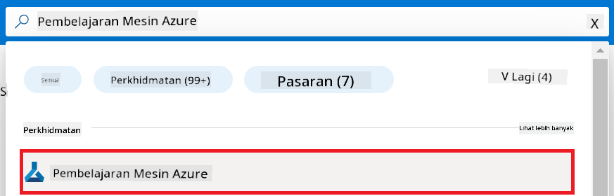
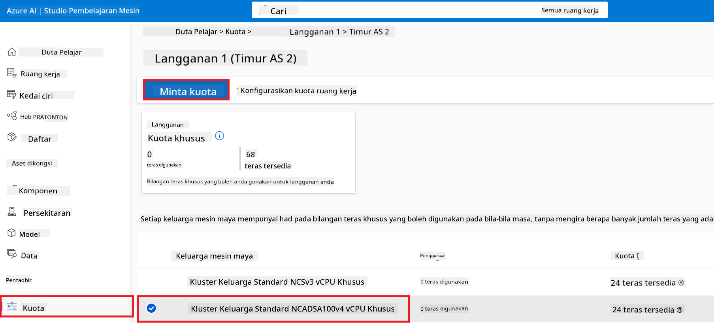
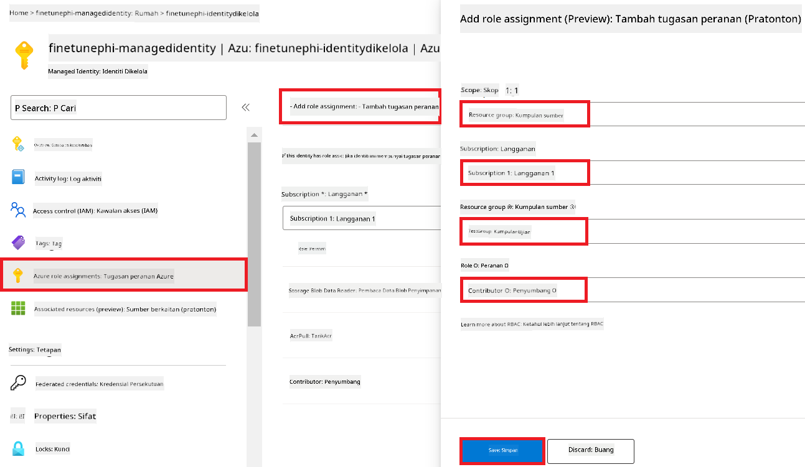
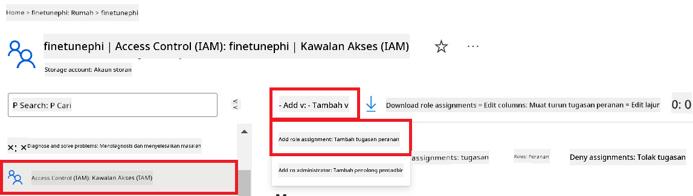
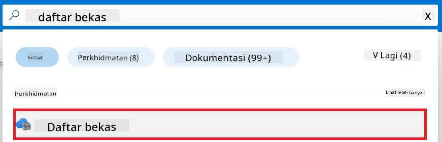
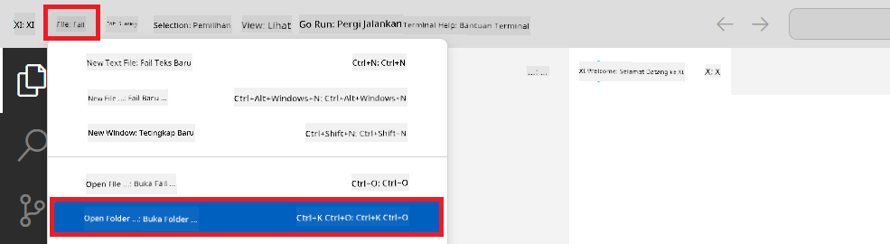
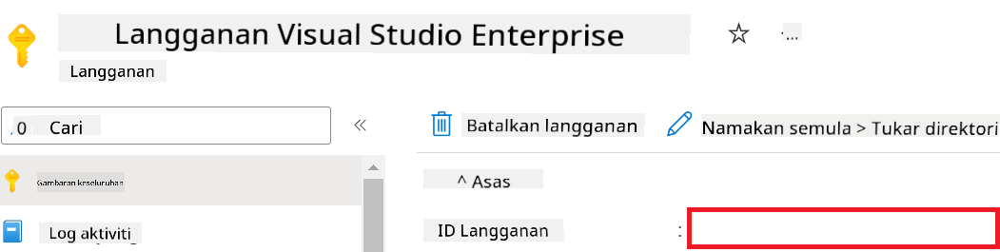
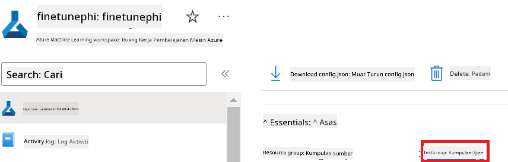
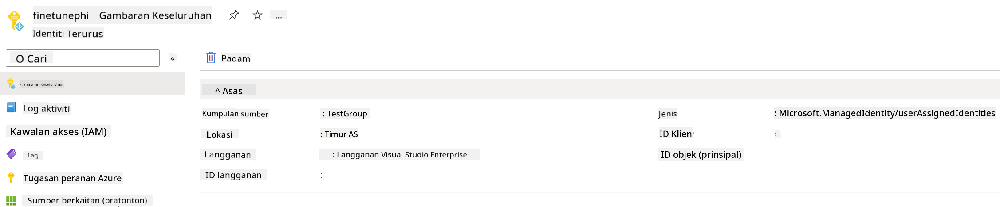
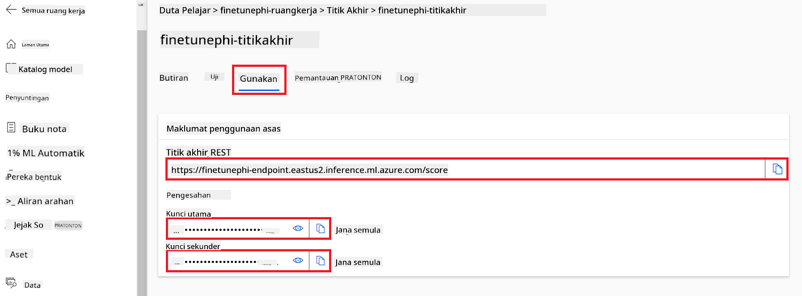

<!--
CO_OP_TRANSLATOR_METADATA:
{
  "original_hash": "455be2b7b9c3390d367d528f8fab2aa0",
  "translation_date": "2025-07-17T00:38:18+00:00",
  "source_file": "md/02.Application/01.TextAndChat/Phi3/E2E_Phi-3-FineTuning_PromptFlow_Integration.md",
  "language_code": "ms"
}
-->
# Laraskan dan Integrasikan model Phi-3 tersuai dengan Prompt flow

Contoh hujung-ke-hujung (E2E) ini berdasarkan panduan "[Laraskan dan Integrasikan Model Phi-3 Tersuai dengan Prompt Flow: Panduan Langkah demi Langkah](https://techcommunity.microsoft.com/t5/educator-developer-blog/fine-tune-and-integrate-custom-phi-3-models-with-prompt-flow/ba-p/4178612?WT.mc_id=aiml-137032-kinfeylo)" dari Microsoft Tech Community. Ia memperkenalkan proses melaraskan, menyebarkan, dan mengintegrasikan model Phi-3 tersuai dengan Prompt flow.

## Gambaran Keseluruhan

Dalam contoh E2E ini, anda akan belajar cara melaraskan model Phi-3 dan mengintegrasikannya dengan Prompt flow. Dengan memanfaatkan Azure Machine Learning dan Prompt flow, anda akan membina aliran kerja untuk menyebarkan dan menggunakan model AI tersuai. Contoh E2E ini dibahagikan kepada tiga senario:

**Senario 1: Sediakan sumber Azure dan Bersedia untuk melaraskan**

**Senario 2: Laraskan model Phi-3 dan Sebarkan dalam Azure Machine Learning Studio**

**Senario 3: Integrasikan dengan Prompt flow dan Berbual dengan model tersuai anda**

Berikut adalah gambaran keseluruhan contoh E2E ini.


### Jadual Kandungan

1. **[Senario 1: Sediakan sumber Azure dan Bersedia untuk melaraskan](../../../../../../md/02.Application/01.TextAndChat/Phi3)**
    - [Cipta Workspace Azure Machine Learning](../../../../../../md/02.Application/01.TextAndChat/Phi3)
    - [Mohon kuota GPU dalam Langganan Azure](../../../../../../md/02.Application/01.TextAndChat/Phi3)
    - [Tambah penugasan peranan](../../../../../../md/02.Application/01.TextAndChat/Phi3)
    - [Sediakan projek](../../../../../../md/02.Application/01.TextAndChat/Phi3)
    - [Sediakan set data untuk melaraskan](../../../../../../md/02.Application/01.TextAndChat/Phi3)

1. **[Senario 2: Laraskan model Phi-3 dan Sebarkan dalam Azure Machine Learning Studio](../../../../../../md/02.Application/01.TextAndChat/Phi3)**
    - [Sediakan Azure CLI](../../../../../../md/02.Application/01.TextAndChat/Phi3)
    - [Laraskan model Phi-3](../../../../../../md/02.Application/01.TextAndChat/Phi3)
    - [Sebarkan model yang telah dilaraskan](../../../../../../md/02.Application/01.TextAndChat/Phi3)

1. **[Senario 3: Integrasikan dengan Prompt flow dan Berbual dengan model tersuai anda](../../../../../../md/02.Application/01.TextAndChat/Phi3)**
    - [Integrasikan model Phi-3 tersuai dengan Prompt flow](../../../../../../md/02.Application/01.TextAndChat/Phi3)
    - [Berbual dengan model tersuai anda](../../../../../../md/02.Application/01.TextAndChat/Phi3)

## Senario 1: Sediakan sumber Azure dan Bersedia untuk melaraskan

### Cipta Workspace Azure Machine Learning

1. Taip *azure machine learning* dalam **bar carian** di bahagian atas halaman portal dan pilih **Azure Machine Learning** daripada pilihan yang muncul.

    

1. Pilih **+ Create** dari menu navigasi.

1. Pilih **New workspace** dari menu navigasi.

    

1. Lakukan tugasan berikut:

    - Pilih **Subscription** Azure anda.
    - Pilih **Resource group** yang ingin digunakan (cipta baru jika perlu).
    - Masukkan **Workspace Name**. Ia mesti nilai unik.
    - Pilih **Region** yang anda ingin gunakan.
    - Pilih **Storage account** yang ingin digunakan (cipta baru jika perlu).
    - Pilih **Key vault** yang ingin digunakan (cipta baru jika perlu).
    - Pilih **Application insights** yang ingin digunakan (cipta baru jika perlu).
    - Pilih **Container registry** yang ingin digunakan (cipta baru jika perlu).

    

1. Pilih **Review + Create**.

1. Pilih **Create**.

### Mohon kuota GPU dalam Langganan Azure

Dalam contoh E2E ini, anda akan menggunakan *Standard_NC24ads_A100_v4 GPU* untuk melaraskan, yang memerlukan permohonan kuota, dan *Standard_E4s_v3* CPU untuk penyebaran, yang tidak memerlukan permohonan kuota.

> [!NOTE]
>
> Hanya langganan Pay-As-You-Go (jenis langganan standard) layak untuk peruntukan GPU; langganan manfaat tidak disokong buat masa ini.
>
> Bagi mereka yang menggunakan langganan manfaat (seperti Visual Studio Enterprise Subscription) atau yang ingin menguji proses melaraskan dan penyebaran dengan cepat, tutorial ini juga menyediakan panduan untuk melaraskan dengan set data minimum menggunakan CPU. Namun, penting untuk diingat bahawa hasil pelarasan jauh lebih baik apabila menggunakan GPU dengan set data yang lebih besar.

1. Lawati [Azure ML Studio](https://ml.azure.com/home?wt.mc_id=studentamb_279723).

1. Lakukan tugasan berikut untuk memohon kuota *Standard NCADSA100v4 Family*:

    - Pilih **Quota** dari tab sebelah kiri.
    - Pilih **Virtual machine family** yang ingin digunakan. Contohnya, pilih **Standard NCADSA100v4 Family Cluster Dedicated vCPUs**, yang merangkumi *Standard_NC24ads_A100_v4* GPU.
    - Pilih **Request quota** dari menu navigasi.

        

    - Dalam halaman Request quota, masukkan **New cores limit** yang anda ingin gunakan. Contohnya, 24.
    - Dalam halaman Request quota, pilih **Submit** untuk memohon kuota GPU.

> [!NOTE]
> Anda boleh memilih GPU atau CPU yang sesuai mengikut keperluan dengan merujuk kepada dokumen [Sizes for Virtual Machines in Azure](https://learn.microsoft.com/azure/virtual-machines/sizes/overview?tabs=breakdownseries%2Cgeneralsizelist%2Ccomputesizelist%2Cmemorysizelist%2Cstoragesizelist%2Cgpusizelist%2Cfpgasizelist%2Chpcsizelist).

### Tambah penugasan peranan

Untuk melaraskan dan menyebarkan model anda, anda mesti terlebih dahulu mencipta User Assigned Managed Identity (UAI) dan memberikan kebenaran yang sesuai. UAI ini akan digunakan untuk pengesahan semasa penyebaran.

#### Cipta User Assigned Managed Identity (UAI)

1. Taip *managed identities* dalam **bar carian** di bahagian atas halaman portal dan pilih **Managed Identities** daripada pilihan yang muncul.

    

1. Pilih **+ Create**.

    

1. Lakukan tugasan berikut:

    - Pilih **Subscription** Azure anda.
    - Pilih **Resource group** yang ingin digunakan (cipta baru jika perlu).
    - Pilih **Region** yang anda ingin gunakan.
    - Masukkan **Name**. Ia mesti nilai unik.

1. Pilih **Review + create**.

1. Pilih **+ Create**.

#### Tambah penugasan peranan Contributor kepada Managed Identity

1. Navigasi ke sumber Managed Identity yang anda cipta.

1. Pilih **Azure role assignments** dari tab sebelah kiri.

1. Pilih **+Add role assignment** dari menu navigasi.

1. Dalam halaman Add role assignment, lakukan tugasan berikut:
    - Pilih **Scope** kepada **Resource group**.
    - Pilih **Subscription** Azure anda.
    - Pilih **Resource group** yang ingin digunakan.
    - Pilih **Role** kepada **Contributor**.

    

1. Pilih **Save**.

#### Tambah penugasan peranan Storage Blob Data Reader kepada Managed Identity

1. Taip *storage accounts* dalam **bar carian** di bahagian atas halaman portal dan pilih **Storage accounts** daripada pilihan yang muncul.

    

1. Pilih akaun storan yang berkaitan dengan workspace Azure Machine Learning yang anda cipta. Contohnya, *finetunephistorage*.

1. Lakukan tugasan berikut untuk navigasi ke halaman Add role assignment:

    - Navigasi ke akaun storan Azure yang anda cipta.
    - Pilih **Access Control (IAM)** dari tab sebelah kiri.
    - Pilih **+ Add** dari menu navigasi.
    - Pilih **Add role assignment** dari menu navigasi.

    

1. Dalam halaman Add role assignment, lakukan tugasan berikut:

    - Dalam halaman Role, taip *Storage Blob Data Reader* dalam **bar carian** dan pilih **Storage Blob Data Reader** daripada pilihan yang muncul.
    - Dalam halaman Role, pilih **Next**.
    - Dalam halaman Members, pilih **Assign access to** **Managed identity**.
    - Dalam halaman Members, pilih **+ Select members**.
    - Dalam halaman Select managed identities, pilih **Subscription** Azure anda.
    - Dalam halaman Select managed identities, pilih **Managed identity** kepada **Manage Identity**.
    - Dalam halaman Select managed identities, pilih Managed Identity yang anda cipta. Contohnya, *finetunephi-managedidentity*.
    - Dalam halaman Select managed identities, pilih **Select**.

    

1. Pilih **Review + assign**.

#### Tambah penugasan peranan AcrPull kepada Managed Identity

1. Taip *container registries* dalam **bar carian** di bahagian atas halaman portal dan pilih **Container registries** daripada pilihan yang muncul.

    

1. Pilih container registry yang berkaitan dengan workspace Azure Machine Learning. Contohnya, *finetunephicontainerregistries*

1. Lakukan tugasan berikut untuk navigasi ke halaman Add role assignment:

    - Pilih **Access Control (IAM)** dari tab sebelah kiri.
    - Pilih **+ Add** dari menu navigasi.
    - Pilih **Add role assignment** dari menu navigasi.

1. Dalam halaman Add role assignment, lakukan tugasan berikut:

    - Dalam halaman Role, taip *AcrPull* dalam **bar carian** dan pilih **AcrPull** daripada pilihan yang muncul.
    - Dalam halaman Role, pilih **Next**.
    - Dalam halaman Members, pilih **Assign access to** **Managed identity**.
    - Dalam halaman Members, pilih **+ Select members**.
    - Dalam halaman Select managed identities, pilih **Subscription** Azure anda.
    - Dalam halaman Select managed identities, pilih **Managed identity** kepada **Manage Identity**.
    - Dalam halaman Select managed identities, pilih Managed Identity yang anda cipta. Contohnya, *finetunephi-managedidentity*.
    - Dalam halaman Select managed identities, pilih **Select**.
    - Pilih **Review + assign**.

### Sediakan projek

Sekarang, anda akan mencipta folder untuk bekerja di dalamnya dan menyediakan persekitaran maya untuk membangunkan program yang berinteraksi dengan pengguna dan menggunakan sejarah sembang yang disimpan dari Azure Cosmos DB untuk memaklumkan responsnya.

#### Cipta folder untuk bekerja di dalamnya

1. Buka tetingkap terminal dan taip arahan berikut untuk mencipta folder bernama *finetune-phi* dalam laluan lalai.

    ```console
    mkdir finetune-phi
    ```

1. Taip arahan berikut dalam terminal anda untuk menavigasi ke folder *finetune-phi* yang anda cipta.

    ```console
    cd finetune-phi
    ```

#### Cipta persekitaran maya

1. Taip arahan berikut dalam terminal anda untuk mencipta persekitaran maya bernama *.venv*.

    ```console
    python -m venv .venv
    ```

1. Taip arahan berikut dalam terminal anda untuk mengaktifkan persekitaran maya.

    ```console
    .venv\Scripts\activate.bat
    ```
> [!NOTE]
>
> Jika berjaya, anda akan melihat *(.venv)* sebelum prompt arahan.
#### Pasang pakej yang diperlukan

1. Taip arahan berikut dalam terminal anda untuk memasang pakej yang diperlukan.

    ```console
    pip install datasets==2.19.1
    pip install transformers==4.41.1
    pip install azure-ai-ml==1.16.0
    pip install torch==2.3.1
    pip install trl==0.9.4
    pip install promptflow==1.12.0
    ```

#### Cipta fail projek

Dalam latihan ini, anda akan mencipta fail penting untuk projek kita. Fail-fail ini termasuk skrip untuk memuat turun set data, menyediakan persekitaran Azure Machine Learning, melatih semula model Phi-3, dan menyebarkan model yang telah dilatih semula. Anda juga akan mencipta fail *conda.yml* untuk menyediakan persekitaran latihan semula.

Dalam latihan ini, anda akan:

- Cipta fail *download_dataset.py* untuk memuat turun set data.
- Cipta fail *setup_ml.py* untuk menyediakan persekitaran Azure Machine Learning.
- Cipta fail *fine_tune.py* dalam folder *finetuning_dir* untuk melatih semula model Phi-3 menggunakan set data.
- Cipta fail *conda.yml* untuk menyediakan persekitaran latihan semula.
- Cipta fail *deploy_model.py* untuk menyebarkan model yang telah dilatih semula.
- Cipta fail *integrate_with_promptflow.py* untuk mengintegrasikan model yang telah dilatih semula dan menjalankan model menggunakan Prompt flow.
- Cipta fail flow.dag.yml untuk menyediakan struktur aliran kerja bagi Prompt flow.
- Cipta fail *config.py* untuk memasukkan maklumat Azure.

> [!NOTE]
>
> Struktur folder lengkap:
>
> ```text
> └── YourUserName
> .    └── finetune-phi
> .        ├── finetuning_dir
> .        │      └── fine_tune.py
> .        ├── conda.yml
> .        ├── config.py
> .        ├── deploy_model.py
> .        ├── download_dataset.py
> .        ├── flow.dag.yml
> .        ├── integrate_with_promptflow.py
> .        └── setup_ml.py
> ```

1. Buka **Visual Studio Code**.

1. Pilih **File** dari bar menu.

1. Pilih **Open Folder**.

1. Pilih folder *finetune-phi* yang anda cipta, yang terletak di *C:\Users\yourUserName\finetune-phi*.

    

1. Di panel kiri Visual Studio Code, klik kanan dan pilih **New File** untuk mencipta fail baru bernama *download_dataset.py*.

1. Di panel kiri Visual Studio Code, klik kanan dan pilih **New File** untuk mencipta fail baru bernama *setup_ml.py*.

1. Di panel kiri Visual Studio Code, klik kanan dan pilih **New File** untuk mencipta fail baru bernama *deploy_model.py*.

    

1. Di panel kiri Visual Studio Code, klik kanan dan pilih **New Folder** untuk mencipta folder baru bernama *finetuning_dir*.

1. Dalam folder *finetuning_dir*, cipta fail baru bernama *fine_tune.py*.

#### Cipta dan Konfigurasikan fail *conda.yml*

1. Di panel kiri Visual Studio Code, klik kanan dan pilih **New File** untuk mencipta fail baru bernama *conda.yml*.

1. Tambahkan kod berikut ke dalam fail *conda.yml* untuk menyediakan persekitaran latihan semula bagi model Phi-3.

    ```yml
    name: phi-3-training-env
    channels:
      - defaults
      - conda-forge
    dependencies:
      - python=3.10
      - pip
      - numpy<2.0
      - pip:
          - torch==2.4.0
          - torchvision==0.19.0
          - trl==0.8.6
          - transformers==4.41
          - datasets==2.21.0
          - azureml-core==1.57.0
          - azure-storage-blob==12.19.0
          - azure-ai-ml==1.16
          - azure-identity==1.17.1
          - accelerate==0.33.0
          - mlflow==2.15.1
          - azureml-mlflow==1.57.0
    ```

#### Cipta dan Konfigurasikan fail *config.py*

1. Di panel kiri Visual Studio Code, klik kanan dan pilih **New File** untuk mencipta fail baru bernama *config.py*.

1. Tambahkan kod berikut ke dalam fail *config.py* untuk memasukkan maklumat Azure anda.

    ```python
    # Azure settings
    AZURE_SUBSCRIPTION_ID = "your_subscription_id"
    AZURE_RESOURCE_GROUP_NAME = "your_resource_group_name" # "TestGroup"

    # Azure Machine Learning settings
    AZURE_ML_WORKSPACE_NAME = "your_workspace_name" # "finetunephi-workspace"

    # Azure Managed Identity settings
    AZURE_MANAGED_IDENTITY_CLIENT_ID = "your_azure_managed_identity_client_id"
    AZURE_MANAGED_IDENTITY_NAME = "your_azure_managed_identity_name" # "finetunephi-mangedidentity"
    AZURE_MANAGED_IDENTITY_RESOURCE_ID = f"/subscriptions/{AZURE_SUBSCRIPTION_ID}/resourceGroups/{AZURE_RESOURCE_GROUP_NAME}/providers/Microsoft.ManagedIdentity/userAssignedIdentities/{AZURE_MANAGED_IDENTITY_NAME}"

    # Dataset file paths
    TRAIN_DATA_PATH = "data/train_data.jsonl"
    TEST_DATA_PATH = "data/test_data.jsonl"

    # Fine-tuned model settings
    AZURE_MODEL_NAME = "your_fine_tuned_model_name" # "finetune-phi-model"
    AZURE_ENDPOINT_NAME = "your_fine_tuned_model_endpoint_name" # "finetune-phi-endpoint"
    AZURE_DEPLOYMENT_NAME = "your_fine_tuned_model_deployment_name" # "finetune-phi-deployment"

    AZURE_ML_API_KEY = "your_fine_tuned_model_api_key"
    AZURE_ML_ENDPOINT = "your_fine_tuned_model_endpoint_uri" # "https://{your-endpoint-name}.{your-region}.inference.ml.azure.com/score"
    ```

#### Tambah pembolehubah persekitaran Azure

1. Lakukan tugas berikut untuk menambah Azure Subscription ID:

    - Taip *subscriptions* dalam **bar carian** di bahagian atas halaman portal dan pilih **Subscriptions** dari pilihan yang muncul.
    - Pilih Azure Subscription yang anda sedang gunakan.
    - Salin dan tampal Subscription ID anda ke dalam fail *config.py*.

    

1. Lakukan tugas berikut untuk menambah Nama Workspace Azure:

    - Navigasi ke sumber Azure Machine Learning yang anda cipta.
    - Salin dan tampal nama akaun anda ke dalam fail *config.py*.

    

1. Lakukan tugas berikut untuk menambah Nama Kumpulan Sumber Azure:

    - Navigasi ke sumber Azure Machine Learning yang anda cipta.
    - Salin dan tampal Nama Kumpulan Sumber Azure anda ke dalam fail *config.py*.

    

2. Lakukan tugas berikut untuk menambah nama Identiti Terurus Azure

    - Navigasi ke sumber Managed Identities yang anda cipta.
    - Salin dan tampal nama Identiti Terurus Azure anda ke dalam fail *config.py*.

    

### Sediakan set data untuk latihan semula

Dalam latihan ini, anda akan menjalankan fail *download_dataset.py* untuk memuat turun set data *ULTRACHAT_200k* ke persekitaran tempatan anda. Anda kemudian akan menggunakan set data ini untuk melatih semula model Phi-3 dalam Azure Machine Learning.

#### Muat turun set data anda menggunakan *download_dataset.py*

1. Buka fail *download_dataset.py* dalam Visual Studio Code.

1. Tambahkan kod berikut ke dalam *download_dataset.py*.

    ```python
    import json
    import os
    from datasets import load_dataset
    from config import (
        TRAIN_DATA_PATH,
        TEST_DATA_PATH)

    def load_and_split_dataset(dataset_name, config_name, split_ratio):
        """
        Load and split a dataset.
        """
        # Load the dataset with the specified name, configuration, and split ratio
        dataset = load_dataset(dataset_name, config_name, split=split_ratio)
        print(f"Original dataset size: {len(dataset)}")
        
        # Split the dataset into train and test sets (80% train, 20% test)
        split_dataset = dataset.train_test_split(test_size=0.2)
        print(f"Train dataset size: {len(split_dataset['train'])}")
        print(f"Test dataset size: {len(split_dataset['test'])}")
        
        return split_dataset

    def save_dataset_to_jsonl(dataset, filepath):
        """
        Save a dataset to a JSONL file.
        """
        # Create the directory if it does not exist
        os.makedirs(os.path.dirname(filepath), exist_ok=True)
        
        # Open the file in write mode
        with open(filepath, 'w', encoding='utf-8') as f:
            # Iterate over each record in the dataset
            for record in dataset:
                # Dump the record as a JSON object and write it to the file
                json.dump(record, f)
                # Write a newline character to separate records
                f.write('\n')
        
        print(f"Dataset saved to {filepath}")

    def main():
        """
        Main function to load, split, and save the dataset.
        """
        # Load and split the ULTRACHAT_200k dataset with a specific configuration and split ratio
        dataset = load_and_split_dataset("HuggingFaceH4/ultrachat_200k", 'default', 'train_sft[:1%]')
        
        # Extract the train and test datasets from the split
        train_dataset = dataset['train']
        test_dataset = dataset['test']

        # Save the train dataset to a JSONL file
        save_dataset_to_jsonl(train_dataset, TRAIN_DATA_PATH)
        
        # Save the test dataset to a separate JSONL file
        save_dataset_to_jsonl(test_dataset, TEST_DATA_PATH)

    if __name__ == "__main__":
        main()

    ```

> [!TIP]
>
> **Panduan untuk melatih semula dengan set data minimum menggunakan CPU**
>
> Jika anda ingin menggunakan CPU untuk latihan semula, pendekatan ini sesuai untuk mereka yang mempunyai langganan manfaat (seperti Visual Studio Enterprise Subscription) atau untuk menguji proses latihan semula dan penyebaran dengan cepat.
>
> Gantikan `dataset = load_and_split_dataset("HuggingFaceH4/ultrachat_200k", 'default', 'train_sft[:1%]')` dengan `dataset = load_and_split_dataset("HuggingFaceH4/ultrachat_200k", 'default', 'train_sft[:10]')`
>

1. Taip arahan berikut dalam terminal anda untuk menjalankan skrip dan memuat turun set data ke persekitaran tempatan anda.

    ```console
    python download_data.py
    ```

1. Sahkan bahawa set data telah berjaya disimpan ke direktori *finetune-phi/data* tempatan anda.

> [!NOTE]
>
> **Saiz set data dan masa latihan semula**
>
> Dalam contoh E2E ini, anda hanya menggunakan 1% daripada set data (`train_sft[:1%]`). Ini mengurangkan jumlah data dengan ketara, mempercepatkan proses muat naik dan latihan semula. Anda boleh laraskan peratusan untuk mencari keseimbangan yang sesuai antara masa latihan dan prestasi model. Menggunakan subset yang lebih kecil daripada set data mengurangkan masa yang diperlukan untuk latihan semula, menjadikan proses lebih mudah diurus untuk contoh E2E.

## Senario 2: Latih semula model Phi-3 dan Sebarkan dalam Azure Machine Learning Studio

### Sediakan Azure CLI

Anda perlu menyediakan Azure CLI untuk mengesahkan persekitaran anda. Azure CLI membolehkan anda mengurus sumber Azure terus dari baris arahan dan menyediakan kelayakan yang diperlukan untuk Azure Machine Learning mengakses sumber ini. Untuk bermula, pasang [Azure CLI](https://learn.microsoft.com/cli/azure/install-azure-cli)

1. Buka tetingkap terminal dan taip arahan berikut untuk log masuk ke akaun Azure anda.

    ```console
    az login
    ```

1. Pilih akaun Azure anda untuk digunakan.

1. Pilih langganan Azure anda untuk digunakan.

    

> [!TIP]
>
> Jika anda menghadapi masalah untuk log masuk ke Azure, cuba gunakan kod peranti. Buka tetingkap terminal dan taip arahan berikut untuk log masuk ke akaun Azure anda:
>
> ```console
> az login --use-device-code
> ```
>

### Latih semula model Phi-3

Dalam latihan ini, anda akan melatih semula model Phi-3 menggunakan set data yang disediakan. Pertama, anda akan mentakrifkan proses latihan semula dalam fail *fine_tune.py*. Kemudian, anda akan mengkonfigurasi persekitaran Azure Machine Learning dan memulakan proses latihan semula dengan menjalankan fail *setup_ml.py*. Skrip ini memastikan latihan semula berlaku dalam persekitaran Azure Machine Learning.

Dengan menjalankan *setup_ml.py*, anda akan menjalankan proses latihan semula dalam persekitaran Azure Machine Learning.

#### Tambah kod ke fail *fine_tune.py*

1. Navigasi ke folder *finetuning_dir* dan buka fail *fine_tune.py* dalam Visual Studio Code.

1. Tambahkan kod berikut ke dalam *fine_tune.py*.

    ```python
    import argparse
    import sys
    import logging
    import os
    from datasets import load_dataset
    import torch
    import mlflow
    from transformers import AutoModelForCausalLM, AutoTokenizer, TrainingArguments
    from trl import SFTTrainer

    # To avoid the INVALID_PARAMETER_VALUE error in MLflow, disable MLflow integration
    os.environ["DISABLE_MLFLOW_INTEGRATION"] = "True"

    # Logging setup
    logging.basicConfig(
        format="%(asctime)s - %(levelname)s - %(name)s - %(message)s",
        datefmt="%Y-%m-%d %H:%M:%S",
        handlers=[logging.StreamHandler(sys.stdout)],
        level=logging.WARNING
    )
    logger = logging.getLogger(__name__)

    def initialize_model_and_tokenizer(model_name, model_kwargs):
        """
        Initialize the model and tokenizer with the given pretrained model name and arguments.
        """
        model = AutoModelForCausalLM.from_pretrained(model_name, **model_kwargs)
        tokenizer = AutoTokenizer.from_pretrained(model_name)
        tokenizer.model_max_length = 2048
        tokenizer.pad_token = tokenizer.unk_token
        tokenizer.pad_token_id = tokenizer.convert_tokens_to_ids(tokenizer.pad_token)
        tokenizer.padding_side = 'right'
        return model, tokenizer

    def apply_chat_template(example, tokenizer):
        """
        Apply a chat template to tokenize messages in the example.
        """
        messages = example["messages"]
        if messages[0]["role"] != "system":
            messages.insert(0, {"role": "system", "content": ""})
        example["text"] = tokenizer.apply_chat_template(
            messages, tokenize=False, add_generation_prompt=False
        )
        return example

    def load_and_preprocess_data(train_filepath, test_filepath, tokenizer):
        """
        Load and preprocess the dataset.
        """
        train_dataset = load_dataset('json', data_files=train_filepath, split='train')
        test_dataset = load_dataset('json', data_files=test_filepath, split='train')
        column_names = list(train_dataset.features)

        train_dataset = train_dataset.map(
            apply_chat_template,
            fn_kwargs={"tokenizer": tokenizer},
            num_proc=10,
            remove_columns=column_names,
            desc="Applying chat template to train dataset",
        )

        test_dataset = test_dataset.map(
            apply_chat_template,
            fn_kwargs={"tokenizer": tokenizer},
            num_proc=10,
            remove_columns=column_names,
            desc="Applying chat template to test dataset",
        )

        return train_dataset, test_dataset

    def train_and_evaluate_model(train_dataset, test_dataset, model, tokenizer, output_dir):
        """
        Train and evaluate the model.
        """
        training_args = TrainingArguments(
            bf16=True,
            do_eval=True,
            output_dir=output_dir,
            eval_strategy="epoch",
            learning_rate=5.0e-06,
            logging_steps=20,
            lr_scheduler_type="cosine",
            num_train_epochs=3,
            overwrite_output_dir=True,
            per_device_eval_batch_size=4,
            per_device_train_batch_size=4,
            remove_unused_columns=True,
            save_steps=500,
            seed=0,
            gradient_checkpointing=True,
            gradient_accumulation_steps=1,
            warmup_ratio=0.2,
        )

        trainer = SFTTrainer(
            model=model,
            args=training_args,
            train_dataset=train_dataset,
            eval_dataset=test_dataset,
            max_seq_length=2048,
            dataset_text_field="text",
            tokenizer=tokenizer,
            packing=True
        )

        train_result = trainer.train()
        trainer.log_metrics("train", train_result.metrics)

        mlflow.transformers.log_model(
            transformers_model={"model": trainer.model, "tokenizer": tokenizer},
            artifact_path=output_dir,
        )

        tokenizer.padding_side = 'left'
        eval_metrics = trainer.evaluate()
        eval_metrics["eval_samples"] = len(test_dataset)
        trainer.log_metrics("eval", eval_metrics)

    def main(train_file, eval_file, model_output_dir):
        """
        Main function to fine-tune the model.
        """
        model_kwargs = {
            "use_cache": False,
            "trust_remote_code": True,
            "torch_dtype": torch.bfloat16,
            "device_map": None,
            "attn_implementation": "eager"
        }

        # pretrained_model_name = "microsoft/Phi-3-mini-4k-instruct"
        pretrained_model_name = "microsoft/Phi-3.5-mini-instruct"

        with mlflow.start_run():
            model, tokenizer = initialize_model_and_tokenizer(pretrained_model_name, model_kwargs)
            train_dataset, test_dataset = load_and_preprocess_data(train_file, eval_file, tokenizer)
            train_and_evaluate_model(train_dataset, test_dataset, model, tokenizer, model_output_dir)

    if __name__ == "__main__":
        parser = argparse.ArgumentParser()
        parser.add_argument("--train-file", type=str, required=True, help="Path to the training data")
        parser.add_argument("--eval-file", type=str, required=True, help="Path to the evaluation data")
        parser.add_argument("--model_output_dir", type=str, required=True, help="Directory to save the fine-tuned model")
        args = parser.parse_args()
        main(args.train_file, args.eval_file, args.model_output_dir)

    ```

1. Simpan dan tutup fail *fine_tune.py*.

> [!TIP]
> **Anda boleh melatih semula model Phi-3.5**
>
> Dalam fail *fine_tune.py*, anda boleh menukar `pretrained_model_name` dari `"microsoft/Phi-3-mini-4k-instruct"` ke mana-mana model yang anda ingin latih semula. Contohnya, jika anda menukarnya kepada `"microsoft/Phi-3.5-mini-instruct"`, anda akan menggunakan model Phi-3.5-mini-instruct untuk latihan semula. Untuk mencari dan menggunakan nama model yang anda suka, lawati [Hugging Face](https://huggingface.co/), cari model yang anda minati, dan salin serta tampal namanya ke dalam medan `pretrained_model_name` dalam skrip anda.
>
> :::image type="content" source="../../imgs/03/FineTuning-PromptFlow/finetunephi3.5.png" alt-text="Latih semula Phi-3.5.":::
>

#### Tambah kod ke fail *setup_ml.py*

1. Buka fail *setup_ml.py* dalam Visual Studio Code.

1. Tambahkan kod berikut ke dalam *setup_ml.py*.

    ```python
    import logging
    from azure.ai.ml import MLClient, command, Input
    from azure.ai.ml.entities import Environment, AmlCompute
    from azure.identity import AzureCliCredential
    from config import (
        AZURE_SUBSCRIPTION_ID,
        AZURE_RESOURCE_GROUP_NAME,
        AZURE_ML_WORKSPACE_NAME,
        TRAIN_DATA_PATH,
        TEST_DATA_PATH
    )

    # Constants

    # Uncomment the following lines to use a CPU instance for training
    # COMPUTE_INSTANCE_TYPE = "Standard_E16s_v3" # cpu
    # COMPUTE_NAME = "cpu-e16s-v3"
    # DOCKER_IMAGE_NAME = "mcr.microsoft.com/azureml/openmpi4.1.0-ubuntu20.04:latest"

    # Uncomment the following lines to use a GPU instance for training
    COMPUTE_INSTANCE_TYPE = "Standard_NC24ads_A100_v4"
    COMPUTE_NAME = "gpu-nc24s-a100-v4"
    DOCKER_IMAGE_NAME = "mcr.microsoft.com/azureml/curated/acft-hf-nlp-gpu:59"

    CONDA_FILE = "conda.yml"
    LOCATION = "eastus2" # Replace with the location of your compute cluster
    FINETUNING_DIR = "./finetuning_dir" # Path to the fine-tuning script
    TRAINING_ENV_NAME = "phi-3-training-environment" # Name of the training environment
    MODEL_OUTPUT_DIR = "./model_output" # Path to the model output directory in azure ml

    # Logging setup to track the process
    logger = logging.getLogger(__name__)
    logging.basicConfig(
        format="%(asctime)s - %(levelname)s - %(name)s - %(message)s",
        datefmt="%Y-%m-%d %H:%M:%S",
        level=logging.WARNING
    )

    def get_ml_client():
        """
        Initialize the ML Client using Azure CLI credentials.
        """
        credential = AzureCliCredential()
        return MLClient(credential, AZURE_SUBSCRIPTION_ID, AZURE_RESOURCE_GROUP_NAME, AZURE_ML_WORKSPACE_NAME)

    def create_or_get_environment(ml_client):
        """
        Create or update the training environment in Azure ML.
        """
        env = Environment(
            image=DOCKER_IMAGE_NAME,  # Docker image for the environment
            conda_file=CONDA_FILE,  # Conda environment file
            name=TRAINING_ENV_NAME,  # Name of the environment
        )
        return ml_client.environments.create_or_update(env)

    def create_or_get_compute_cluster(ml_client, compute_name, COMPUTE_INSTANCE_TYPE, location):
        """
        Create or update the compute cluster in Azure ML.
        """
        try:
            compute_cluster = ml_client.compute.get(compute_name)
            logger.info(f"Compute cluster '{compute_name}' already exists. Reusing it for the current run.")
        except Exception:
            logger.info(f"Compute cluster '{compute_name}' does not exist. Creating a new one with size {COMPUTE_INSTANCE_TYPE}.")
            compute_cluster = AmlCompute(
                name=compute_name,
                size=COMPUTE_INSTANCE_TYPE,
                location=location,
                tier="Dedicated",  # Tier of the compute cluster
                min_instances=0,  # Minimum number of instances
                max_instances=1  # Maximum number of instances
            )
            ml_client.compute.begin_create_or_update(compute_cluster).wait()  # Wait for the cluster to be created
        return compute_cluster

    def create_fine_tuning_job(env, compute_name):
        """
        Set up the fine-tuning job in Azure ML.
        """
        return command(
            code=FINETUNING_DIR,  # Path to fine_tune.py
            command=(
                "python fine_tune.py "
                "--train-file ${{inputs.train_file}} "
                "--eval-file ${{inputs.eval_file}} "
                "--model_output_dir ${{inputs.model_output}}"
            ),
            environment=env,  # Training environment
            compute=compute_name,  # Compute cluster to use
            inputs={
                "train_file": Input(type="uri_file", path=TRAIN_DATA_PATH),  # Path to the training data file
                "eval_file": Input(type="uri_file", path=TEST_DATA_PATH),  # Path to the evaluation data file
                "model_output": MODEL_OUTPUT_DIR
            }
        )

    def main():
        """
        Main function to set up and run the fine-tuning job in Azure ML.
        """
        # Initialize ML Client
        ml_client = get_ml_client()

        # Create Environment
        env = create_or_get_environment(ml_client)
        
        # Create or get existing compute cluster
        create_or_get_compute_cluster(ml_client, COMPUTE_NAME, COMPUTE_INSTANCE_TYPE, LOCATION)

        # Create and Submit Fine-Tuning Job
        job = create_fine_tuning_job(env, COMPUTE_NAME)
        returned_job = ml_client.jobs.create_or_update(job)  # Submit the job
        ml_client.jobs.stream(returned_job.name)  # Stream the job logs
        
        # Capture the job name
        job_name = returned_job.name
        print(f"Job name: {job_name}")

    if __name__ == "__main__":
        main()

    ```

1. Gantikan `COMPUTE_INSTANCE_TYPE`, `COMPUTE_NAME`, dan `LOCATION` dengan butiran khusus anda.

    ```python
   # Uncomment the following lines to use a GPU instance for training
    COMPUTE_INSTANCE_TYPE = "Standard_NC24ads_A100_v4"
    COMPUTE_NAME = "gpu-nc24s-a100-v4"
    ...
    LOCATION = "eastus2" # Replace with the location of your compute cluster
    ```

> [!TIP]
>
> **Panduan untuk melatih semula dengan set data minimum menggunakan CPU**
>
> Jika anda ingin menggunakan CPU untuk latihan semula, pendekatan ini sesuai untuk mereka yang mempunyai langganan manfaat (seperti Visual Studio Enterprise Subscription) atau untuk menguji proses latihan semula dan penyebaran dengan cepat.
>
> 1. Buka fail *setup_ml*.
> 2. Gantikan `COMPUTE_INSTANCE_TYPE`, `COMPUTE_NAME`, dan `DOCKER_IMAGE_NAME` dengan yang berikut. Jika anda tidak mempunyai akses ke *Standard_E16s_v3*, anda boleh menggunakan instans CPU yang setara atau memohon kuota baru.
> 3. Gantikan `LOCATION` dengan butiran khusus anda.
>
>    ```python
>    # Uncomment the following lines to use a CPU instance for training
>    COMPUTE_INSTANCE_TYPE = "Standard_E16s_v3" # cpu
>    COMPUTE_NAME = "cpu-e16s-v3"
>    DOCKER_IMAGE_NAME = "mcr.microsoft.com/azureml/openmpi4.1.0-ubuntu20.04:latest"
>    LOCATION = "eastus2" # Replace with the location of your compute cluster
>    ```
>

1. Taip arahan berikut untuk menjalankan skrip *setup_ml.py* dan mulakan proses latihan semula dalam Azure Machine Learning.

    ```python
    python setup_ml.py
    ```

1. Dalam latihan ini, anda berjaya melatih semula model Phi-3 menggunakan Azure Machine Learning. Dengan menjalankan skrip *setup_ml.py*, anda telah menyediakan persekitaran Azure Machine Learning dan memulakan proses latihan semula yang ditakrifkan dalam fail *fine_tune.py*. Sila ambil perhatian bahawa proses latihan semula boleh mengambil masa yang agak lama. Selepas menjalankan arahan `python setup_ml.py`, anda perlu menunggu proses selesai. Anda boleh memantau status kerja latihan semula dengan mengikuti pautan yang disediakan dalam terminal ke portal Azure Machine Learning.

    

### Sebarkan model yang telah dilatih semula

Untuk mengintegrasikan model Phi-3 yang telah dilatih semula dengan Prompt Flow, anda perlu menyebarkan model tersebut supaya ia boleh diakses untuk inferens masa nyata. Proses ini melibatkan pendaftaran model, mencipta endpoint dalam talian, dan menyebarkan model.

#### Tetapkan nama model, nama endpoint, dan nama penyebaran untuk penyebaran

1. Buka fail *config.py*.

1. Gantikan `AZURE_MODEL_NAME = "your_fine_tuned_model_name"` dengan nama yang anda inginkan untuk model anda.

1. Gantikan `AZURE_ENDPOINT_NAME = "your_fine_tuned_model_endpoint_name"` dengan nama yang anda inginkan untuk endpoint anda.

1. Gantikan `AZURE_DEPLOYMENT_NAME = "your_fine_tuned_model_deployment_name"` dengan nama yang anda inginkan untuk penyebaran anda.

#### Tambah kod ke fail *deploy_model.py*

Menjalankan fail *deploy_model.py* mengautomasikan keseluruhan proses penyebaran. Ia mendaftar model, mencipta endpoint, dan melaksanakan penyebaran berdasarkan tetapan yang ditentukan dalam fail config.py, yang merangkumi nama model, nama endpoint, dan nama penyebaran.

1. Buka fail *deploy_model.py* dalam Visual Studio Code.

1. Tambahkan kod berikut ke dalam *deploy_model.py*.

    ```python
    import logging
    from azure.identity import AzureCliCredential
    from azure.ai.ml import MLClient
    from azure.ai.ml.entities import Model, ProbeSettings, ManagedOnlineEndpoint, ManagedOnlineDeployment, IdentityConfiguration, ManagedIdentityConfiguration, OnlineRequestSettings
    from azure.ai.ml.constants import AssetTypes

    # Configuration imports
    from config import (
        AZURE_SUBSCRIPTION_ID,
        AZURE_RESOURCE_GROUP_NAME,
        AZURE_ML_WORKSPACE_NAME,
        AZURE_MANAGED_IDENTITY_RESOURCE_ID,
        AZURE_MANAGED_IDENTITY_CLIENT_ID,
        AZURE_MODEL_NAME,
        AZURE_ENDPOINT_NAME,
        AZURE_DEPLOYMENT_NAME
    )

    # Constants
    JOB_NAME = "your-job-name"
    COMPUTE_INSTANCE_TYPE = "Standard_E4s_v3"

    deployment_env_vars = {
        "SUBSCRIPTION_ID": AZURE_SUBSCRIPTION_ID,
        "RESOURCE_GROUP_NAME": AZURE_RESOURCE_GROUP_NAME,
        "UAI_CLIENT_ID": AZURE_MANAGED_IDENTITY_CLIENT_ID,
    }

    # Logging setup
    logging.basicConfig(
        format="%(asctime)s - %(levelname)s - %(name)s - %(message)s",
        datefmt="%Y-%m-%d %H:%M:%S",
        level=logging.DEBUG
    )
    logger = logging.getLogger(__name__)

    def get_ml_client():
        """Initialize and return the ML Client."""
        credential = AzureCliCredential()
        return MLClient(credential, AZURE_SUBSCRIPTION_ID, AZURE_RESOURCE_GROUP_NAME, AZURE_ML_WORKSPACE_NAME)

    def register_model(ml_client, model_name, job_name):
        """Register a new model."""
        model_path = f"azureml://jobs/{job_name}/outputs/artifacts/paths/model_output"
        logger.info(f"Registering model {model_name} from job {job_name} at path {model_path}.")
        run_model = Model(
            path=model_path,
            name=model_name,
            description="Model created from run.",
            type=AssetTypes.MLFLOW_MODEL,
        )
        model = ml_client.models.create_or_update(run_model)
        logger.info(f"Registered model ID: {model.id}")
        return model

    def delete_existing_endpoint(ml_client, endpoint_name):
        """Delete existing endpoint if it exists."""
        try:
            endpoint_result = ml_client.online_endpoints.get(name=endpoint_name)
            logger.info(f"Deleting existing endpoint {endpoint_name}.")
            ml_client.online_endpoints.begin_delete(name=endpoint_name).result()
            logger.info(f"Deleted existing endpoint {endpoint_name}.")
        except Exception as e:
            logger.info(f"No existing endpoint {endpoint_name} found to delete: {e}")

    def create_or_update_endpoint(ml_client, endpoint_name, description=""):
        """Create or update an endpoint."""
        delete_existing_endpoint(ml_client, endpoint_name)
        logger.info(f"Creating new endpoint {endpoint_name}.")
        endpoint = ManagedOnlineEndpoint(
            name=endpoint_name,
            description=description,
            identity=IdentityConfiguration(
                type="user_assigned",
                user_assigned_identities=[ManagedIdentityConfiguration(resource_id=AZURE_MANAGED_IDENTITY_RESOURCE_ID)]
            )
        )
        endpoint_result = ml_client.online_endpoints.begin_create_or_update(endpoint).result()
        logger.info(f"Created new endpoint {endpoint_name}.")
        return endpoint_result

    def create_or_update_deployment(ml_client, endpoint_name, deployment_name, model):
        """Create or update a deployment."""

        logger.info(f"Creating deployment {deployment_name} for endpoint {endpoint_name}.")
        deployment = ManagedOnlineDeployment(
            name=deployment_name,
            endpoint_name=endpoint_name,
            model=model.id,
            instance_type=COMPUTE_INSTANCE_TYPE,
            instance_count=1,
            environment_variables=deployment_env_vars,
            request_settings=OnlineRequestSettings(
                max_concurrent_requests_per_instance=3,
                request_timeout_ms=180000,
                max_queue_wait_ms=120000
            ),
            liveness_probe=ProbeSettings(
                failure_threshold=30,
                success_threshold=1,
                period=100,
                initial_delay=500,
            ),
            readiness_probe=ProbeSettings(
                failure_threshold=30,
                success_threshold=1,
                period=100,
                initial_delay=500,
            ),
        )
        deployment_result = ml_client.online_deployments.begin_create_or_update(deployment).result()
        logger.info(f"Created deployment {deployment.name} for endpoint {endpoint_name}.")
        return deployment_result

    def set_traffic_to_deployment(ml_client, endpoint_name, deployment_name):
        """Set traffic to the specified deployment."""
        try:
            # Fetch the current endpoint details
            endpoint = ml_client.online_endpoints.get(name=endpoint_name)
            
            # Log the current traffic allocation for debugging
            logger.info(f"Current traffic allocation: {endpoint.traffic}")
            
            # Set the traffic allocation for the deployment
            endpoint.traffic = {deployment_name: 100}
            
            # Update the endpoint with the new traffic allocation
            endpoint_poller = ml_client.online_endpoints.begin_create_or_update(endpoint)
            updated_endpoint = endpoint_poller.result()
            
            # Log the updated traffic allocation for debugging
            logger.info(f"Updated traffic allocation: {updated_endpoint.traffic}")
            logger.info(f"Set traffic to deployment {deployment_name} at endpoint {endpoint_name}.")
            return updated_endpoint
        except Exception as e:
            # Log any errors that occur during the process
            logger.error(f"Failed to set traffic to deployment: {e}")
            raise


    def main():
        ml_client = get_ml_client()

        registered_model = register_model(ml_client, AZURE_MODEL_NAME, JOB_NAME)
        logger.info(f"Registered model ID: {registered_model.id}")

        endpoint = create_or_update_endpoint(ml_client, AZURE_ENDPOINT_NAME, "Endpoint for finetuned Phi-3 model")
        logger.info(f"Endpoint {AZURE_ENDPOINT_NAME} is ready.")

        try:
            deployment = create_or_update_deployment(ml_client, AZURE_ENDPOINT_NAME, AZURE_DEPLOYMENT_NAME, registered_model)
            logger.info(f"Deployment {AZURE_DEPLOYMENT_NAME} is created for endpoint {AZURE_ENDPOINT_NAME}.")

            set_traffic_to_deployment(ml_client, AZURE_ENDPOINT_NAME, AZURE_DEPLOYMENT_NAME)
            logger.info(f"Traffic is set to deployment {AZURE_DEPLOYMENT_NAME} at endpoint {AZURE_ENDPOINT_NAME}.")
        except Exception as e:
            logger.error(f"Failed to create or update deployment: {e}")

    if __name__ == "__main__":
        main()

    ```

1. Lakukan tugas berikut untuk mendapatkan `JOB_NAME`:

    - Navigasi ke sumber Azure Machine Learning yang anda cipta.
    - Pilih **Studio web URL** untuk membuka ruang kerja Azure Machine Learning.
    - Pilih **Jobs** dari tab sebelah kiri.
    - Pilih eksperimen untuk latihan semula. Contohnya, *finetunephi*.
    - Pilih kerja yang anda cipta.
- Salin dan tampal Nama kerja anda ke dalam `JOB_NAME = "your-job-name"` dalam fail *deploy_model.py*.

1. Gantikan `COMPUTE_INSTANCE_TYPE` dengan butiran khusus anda.

1. Taip arahan berikut untuk menjalankan skrip *deploy_model.py* dan mulakan proses penyebaran dalam Azure Machine Learning.

    ```python
    python deploy_model.py
    ```


> [!WARNING]
> Untuk mengelakkan caj tambahan ke akaun anda, pastikan untuk memadamkan endpoint yang telah dibuat dalam ruang kerja Azure Machine Learning.
>

#### Semak status penyebaran dalam Azure Machine Learning Workspace

1. Lawati [Azure ML Studio](https://ml.azure.com/home?wt.mc_id=studentamb_279723).

1. Navigasi ke ruang kerja Azure Machine Learning yang anda telah cipta.

1. Pilih **Studio web URL** untuk membuka ruang kerja Azure Machine Learning.

1. Pilih **Endpoints** dari tab sebelah kiri.

    

2. Pilih endpoint yang anda telah cipta.

    

3. Pada halaman ini, anda boleh menguruskan endpoint yang dibuat semasa proses penyebaran.

## Senario 3: Integrasi dengan Prompt flow dan Berbual dengan model tersuai anda

### Integrasi model Phi-3 tersuai dengan Prompt flow

Selepas berjaya menyebarkan model yang telah ditala halus, anda kini boleh mengintegrasikannya dengan Prompt flow untuk menggunakan model anda dalam aplikasi masa nyata, membolehkan pelbagai tugasan interaktif dengan model Phi-3 tersuai anda.

#### Tetapkan kunci api dan uri endpoint model Phi-3 yang telah ditala halus

1. Navigasi ke ruang kerja Azure Machine Learning yang anda telah cipta.
1. Pilih **Endpoints** dari tab sebelah kiri.
1. Pilih endpoint yang anda telah cipta.
1. Pilih **Consume** dari menu navigasi.
1. Salin dan tampal **REST endpoint** anda ke dalam fail *config.py*, gantikan `AZURE_ML_ENDPOINT = "your_fine_tuned_model_endpoint_uri"` dengan **REST endpoint** anda.
1. Salin dan tampal **Primary key** anda ke dalam fail *config.py*, gantikan `AZURE_ML_API_KEY = "your_fine_tuned_model_api_key"` dengan **Primary key** anda.

    

#### Tambah kod ke dalam fail *flow.dag.yml*

1. Buka fail *flow.dag.yml* dalam Visual Studio Code.

1. Tambah kod berikut ke dalam *flow.dag.yml*.

    ```yml
    inputs:
      input_data:
        type: string
        default: "Who founded Microsoft?"

    outputs:
      answer:
        type: string
        reference: ${integrate_with_promptflow.output}

    nodes:
    - name: integrate_with_promptflow
      type: python
      source:
        type: code
        path: integrate_with_promptflow.py
      inputs:
        input_data: ${inputs.input_data}
    ```

#### Tambah kod ke dalam fail *integrate_with_promptflow.py*

1. Buka fail *integrate_with_promptflow.py* dalam Visual Studio Code.

1. Tambah kod berikut ke dalam *integrate_with_promptflow.py*.

    ```python
    import logging
    import requests
    from promptflow.core import tool
    import asyncio
    import platform
    from config import (
        AZURE_ML_ENDPOINT,
        AZURE_ML_API_KEY
    )

    # Logging setup
    logging.basicConfig(
        format="%(asctime)s - %(levelname)s - %(name)s - %(message)s",
        datefmt="%Y-%m-%d %H:%M:%S",
        level=logging.DEBUG
    )
    logger = logging.getLogger(__name__)

    def query_azml_endpoint(input_data: list, endpoint_url: str, api_key: str) -> str:
        """
        Send a request to the Azure ML endpoint with the given input data.
        """
        headers = {
            "Content-Type": "application/json",
            "Authorization": f"Bearer {api_key}"
        }
        data = {
            "input_data": [input_data],
            "params": {
                "temperature": 0.7,
                "max_new_tokens": 128,
                "do_sample": True,
                "return_full_text": True
            }
        }
        try:
            response = requests.post(endpoint_url, json=data, headers=headers)
            response.raise_for_status()
            result = response.json()[0]
            logger.info("Successfully received response from Azure ML Endpoint.")
            return result
        except requests.exceptions.RequestException as e:
            logger.error(f"Error querying Azure ML Endpoint: {e}")
            raise

    def setup_asyncio_policy():
        """
        Setup asyncio event loop policy for Windows.
        """
        if platform.system() == 'Windows':
            asyncio.set_event_loop_policy(asyncio.WindowsSelectorEventLoopPolicy())
            logger.info("Set Windows asyncio event loop policy.")

    @tool
    def my_python_tool(input_data: str) -> str:
        """
        Tool function to process input data and query the Azure ML endpoint.
        """
        setup_asyncio_policy()
        return query_azml_endpoint(input_data, AZURE_ML_ENDPOINT, AZURE_ML_API_KEY)

    ```

### Berbual dengan model tersuai anda

1. Taip arahan berikut untuk menjalankan skrip *deploy_model.py* dan mulakan proses penyebaran dalam Azure Machine Learning.

    ```python
    pf flow serve --source ./ --port 8080 --host localhost
    ```

1. Berikut adalah contoh hasilnya: Kini anda boleh berbual dengan model Phi-3 tersuai anda. Disarankan untuk bertanya soalan berdasarkan data yang digunakan untuk tala halus.

    

**Penafian**:  
Dokumen ini telah diterjemahkan menggunakan perkhidmatan terjemahan AI [Co-op Translator](https://github.com/Azure/co-op-translator). Walaupun kami berusaha untuk ketepatan, sila ambil maklum bahawa terjemahan automatik mungkin mengandungi kesilapan atau ketidaktepatan. Dokumen asal dalam bahasa asalnya harus dianggap sebagai sumber yang sahih. Untuk maklumat penting, terjemahan profesional oleh manusia adalah disyorkan. Kami tidak bertanggungjawab atas sebarang salah faham atau salah tafsir yang timbul daripada penggunaan terjemahan ini.