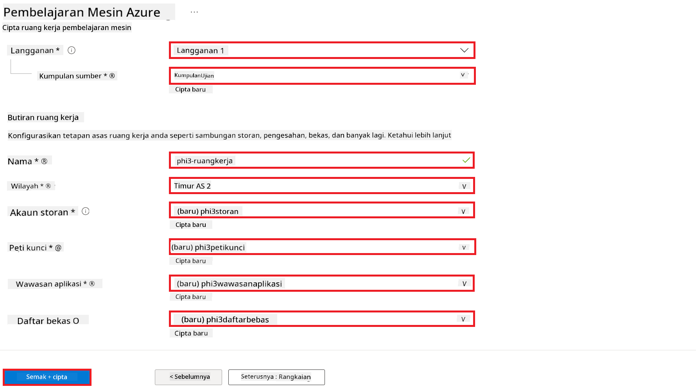
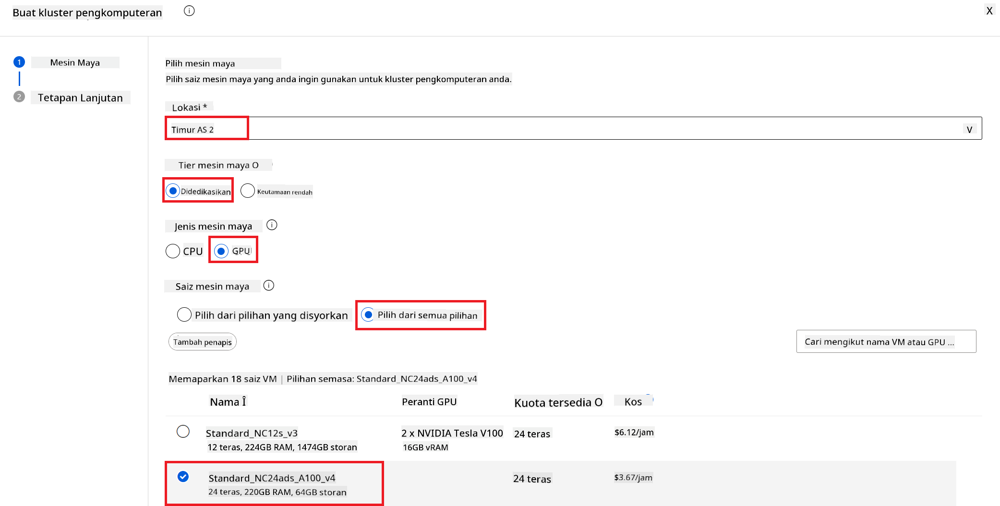
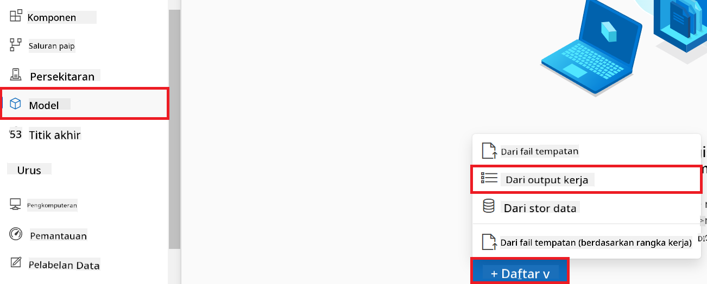
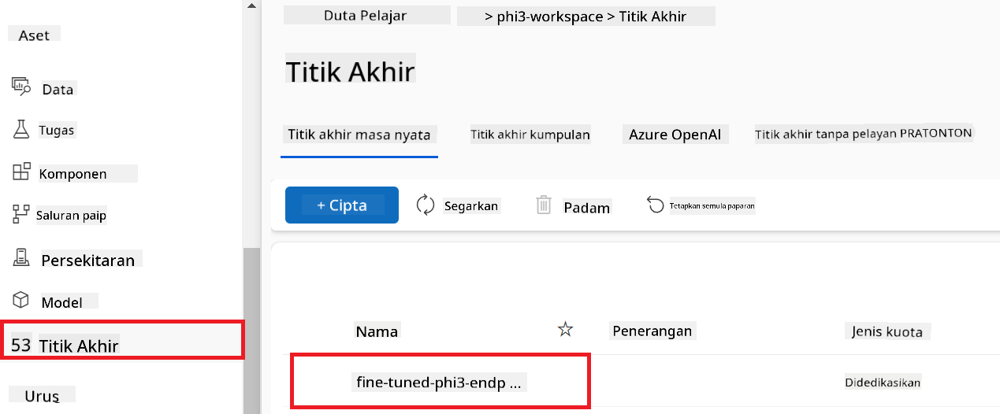
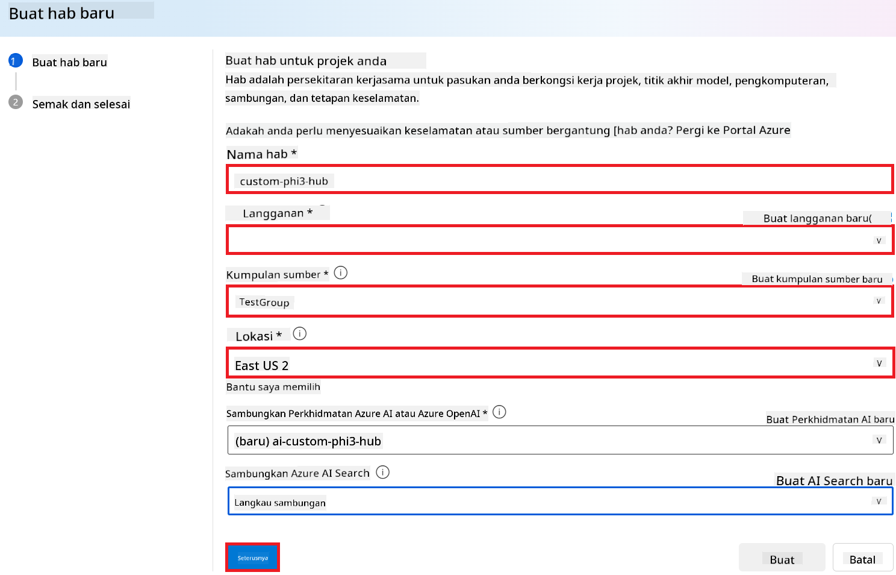
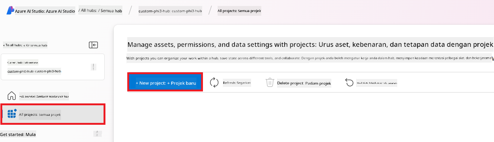
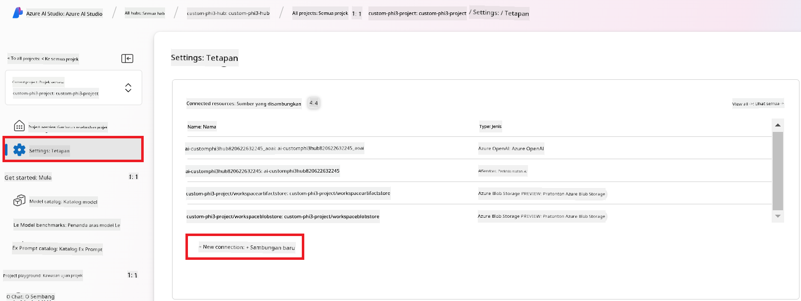
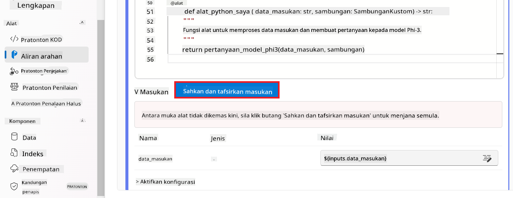
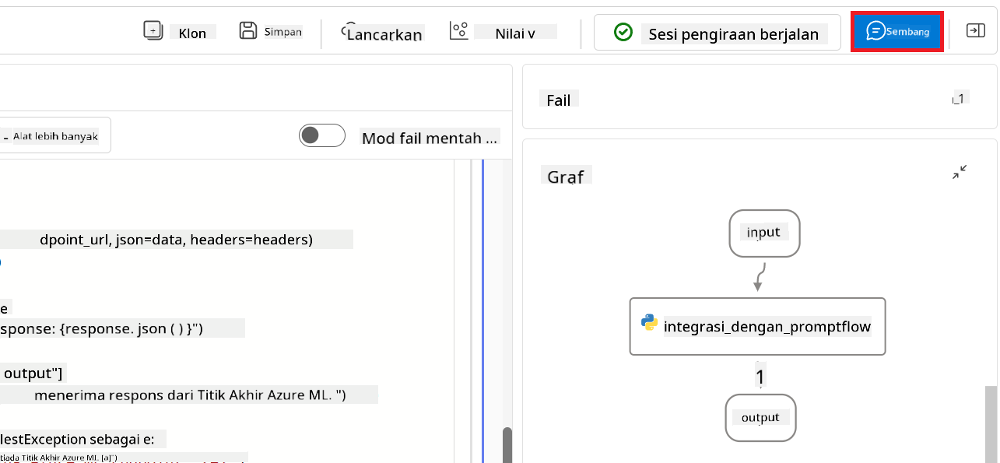

<!--
CO_OP_TRANSLATOR_METADATA:
{
  "original_hash": "0df910a227098303cc392b6ad204c271",
  "translation_date": "2026-01-06T04:56:00+00:00",
  "source_file": "md/02.Application/01.TextAndChat/Phi3/E2E_Phi-3-FineTuning_PromptFlow_Integration_AIFoundry.md",
  "language_code": "ms"
}
-->
# Laras Halus dan Integrasi model Phi-3 tersuai dengan Aliran Prompt dalam Azure AI Foundry

Contoh hujung-ke-hujung (E2E) ini berdasarkan panduan "[Laraskan Halus dan Integrasi Model Phi-3 Tersuai dengan Aliran Prompt dalam Azure AI Foundry](https://techcommunity.microsoft.com/t5/educator-developer-blog/fine-tune-and-integrate-custom-phi-3-models-with-prompt-flow-in/ba-p/4191726?WT.mc_id=aiml-137032-kinfeylo)" dari Komuniti Teknologi Microsoft. Ia memperkenalkan proses melaras halus, menyebarkan, dan mengintegrasikan model Phi-3 tersuai dengan aliran Prompt dalam Azure AI Foundry. Berbeza dengan contoh E2E, "[Laraskan Halus dan Integrasi Model Phi-3 Tersuai dengan Aliran Prompt](./E2E_Phi-3-FineTuning_PromptFlow_Integration.md)", yang melibatkan menjalankan kod secara tempatan, tutorial ini memfokuskan sepenuhnya pada melaras halus dan mengintegrasikan model anda dalam Azure AI / ML Studio.

## Gambaran Keseluruhan

Dalam contoh E2E ini, anda akan belajar cara melaras halus model Phi-3 dan mengintegrasikannya dengan aliran Prompt dalam Azure AI Foundry. Dengan memanfaatkan Azure AI / ML Studio, anda akan membina aliran kerja untuk menyebarkan dan menggunakan model AI tersuai. Contoh E2E ini dibahagikan kepada tiga senario:

**Senario 1: Sediakan sumber Azure dan Sediakan untuk melaras halus**

**Senario 2: Laras halus model Phi-3 dan Sebarkan dalam Azure Machine Learning Studio**

**Senario 3: Integrasi dengan aliran Prompt dan Berbual dengan model tersuai anda dalam Azure AI Foundry**

Berikut adalah gambaran keseluruhan contoh E2E ini.


### Kandungan

1. **[Senario 1: Sediakan sumber Azure dan Sediakan untuk melaras halus](../../../../../../md/02.Application/01.TextAndChat/Phi3)**
    - [Buat Ruang Kerja Azure Machine Learning](../../../../../../md/02.Application/01.TextAndChat/Phi3)
    - [Mohon kuota GPU dalam Langganan Azure](../../../../../../md/02.Application/01.TextAndChat/Phi3)
    - [Tambah tugasan peranan](../../../../../../md/02.Application/01.TextAndChat/Phi3)
    - [Sediakan projek](../../../../../../md/02.Application/01.TextAndChat/Phi3)
    - [Sediakan set data untuk melaras halus](../../../../../../md/02.Application/01.TextAndChat/Phi3)

1. **[Senario 2: Laras halus model Phi-3 dan Sebarkan dalam Azure Machine Learning Studio](../../../../../../md/02.Application/01.TextAndChat/Phi3)**
    - [Laras halus model Phi-3](../../../../../../md/02.Application/01.TextAndChat/Phi3)
    - [Sebarkan model Phi-3 yang telah dilaras halus](../../../../../../md/02.Application/01.TextAndChat/Phi3)

1. **[Senario 3: Integrasi dengan aliran Prompt dan Berbual dengan model tersuai anda dalam Azure AI Foundry](../../../../../../md/02.Application/01.TextAndChat/Phi3)**
    - [Integrasi model Phi-3 tersuai dengan aliran Prompt](../../../../../../md/02.Application/01.TextAndChat/Phi3)
    - [Berbual dengan model Phi-3 tersuai anda](../../../../../../md/02.Application/01.TextAndChat/Phi3)

## Senario 1: Sediakan sumber Azure dan Sediakan untuk melaras halus

### Buat Ruang Kerja Azure Machine Learning

1. Taip *azure machine learning* dalam **bar carian** di bahagian atas halaman portal dan pilih **Azure Machine Learning** daripada pilihan yang muncul.

    

2. Pilih **+ Create** daripada menu navigasi.

3. Pilih **New workspace** daripada menu navigasi.

    

4. Laksanakan tugas berikut:

    - Pilih **Subscription** Azure anda.
    - Pilih **Resource group** untuk digunakan (cipta yang baru jika perlu).
    - Masukkan **Workspace Name**. Ia mesti nilai unik.
    - Pilih **Region** yang anda ingin gunakan.
    - Pilih **Storage account** untuk digunakan (cipta yang baru jika perlu).
    - Pilih **Key vault** untuk digunakan (cipta yang baru jika perlu).
    - Pilih **Application insights** untuk digunakan (cipta yang baru jika perlu).
    - Pilih **Container registry** untuk digunakan (cipta yang baru jika perlu).

    

5. Pilih **Review + Create**.

6. Pilih **Create**.

### Mohon kuota GPU dalam Langganan Azure

Dalam tutorial ini, anda akan belajar cara melaras halus dan menyebarkan model Phi-3, menggunakan GPU. Untuk melaras halus, anda akan menggunakan GPU *Standard_NC24ads_A100_v4*, yang memerlukan permohonan kuota. Untuk penyebaran, anda akan menggunakan GPU *Standard_NC6s_v3*, yang juga memerlukan permohonan kuota.

> [!NOTE]
>
> Hanya langganan Pay-As-You-Go (jenis langganan standard) layak untuk peruntukan GPU; langganan manfaat tidak disokong buat masa ini.
>

1. Lawati [Azure ML Studio](https://ml.azure.com/home?wt.mc_id=studentamb_279723).

1. Laksanakan tugas berikut untuk memohon kuota *Standard NCADSA100v4 Family*:

    - Pilih **Quota** dari tab sebelah kiri.
    - Pilih **Virtual machine family** untuk digunakan. Contohnya, pilih **Standard NCADSA100v4 Family Cluster Dedicated vCPUs**, yang merangkumi GPU *Standard_NC24ads_A100_v4*.
    - Pilih **Request quota** daripada menu navigasi.

        

    - Dalam halaman Request quota, masukkan **New cores limit** yang anda ingin gunakan. Contohnya, 24.
    - Dalam halaman Request quota, pilih **Submit** untuk memohon kuota GPU.

1. Laksanakan tugas berikut untuk memohon kuota *Standard NCSv3 Family*:

    - Pilih **Quota** dari tab sebelah kiri.
    - Pilih **Virtual machine family** untuk digunakan. Contohnya, pilih **Standard NCSv3 Family Cluster Dedicated vCPUs**, yang merangkumi GPU *Standard_NC6s_v3*.
    - Pilih **Request quota** daripada menu navigasi.
    - Dalam halaman Request quota, masukkan **New cores limit** yang anda ingin gunakan. Contohnya, 24.
    - Dalam halaman Request quota, pilih **Submit** untuk memohon kuota GPU.

### Tambah tugasan peranan

Untuk melaras halus dan menyebarkan model anda, anda mesti terlebih dahulu mencipta Identiti Terurus Ditugaskan Pengguna (UAI) dan memberikan kebenaran yang sesuai. UAI ini akan digunakan untuk pengesahan semasa penyebaran.

#### Buat User Assigned Managed Identity(UAI)

1. Taip *managed identities* dalam **bar carian** di bahagian atas halaman portal dan pilih **Managed Identities** daripada pilihan yang muncul.

    

1. Pilih **+ Create**.

    

1. Laksanakan tugas berikut:

    - Pilih **Subscription** Azure anda.
    - Pilih **Resource group** untuk digunakan (cipta yang baru jika perlu).
    - Pilih **Region** yang anda ingin gunakan.
    - Masukkan **Name**. Ia mesti nilai unik.

    

1. Pilih **Review + create**.

1. Pilih **+ Create**.

#### Tambah tugasan peranan Contributor kepada Managed Identity

1. Navigasi ke sumber Managed Identity yang anda buat.

1. Pilih **Azure role assignments** dari tab sebelah kiri.

1. Pilih **+Add role assignment** dari menu navigasi.

1. Dalam halaman Add role assignment, laksanakan tugas berikut:
    - Pilih **Scope** ke **Resource group**.
    - Pilih **Subscription** Azure anda.
    - Pilih **Resource group** untuk digunakan.
    - Pilih **Role** ke **Contributor**.

    

2. Pilih **Save**.

#### Tambah tugasan peranan Storage Blob Data Reader kepada Managed Identity

1. Taip *storage accounts* dalam **bar carian** di bahagian atas halaman portal dan pilih **Storage accounts** daripada pilihan yang muncul.

    

1. Pilih akaun penyimpanan yang dikaitkan dengan ruang kerja Azure Machine Learning yang anda buat. Contohnya, *finetunephistorage*.

1. Laksanakan tugas berikut untuk navigasi ke halaman Add role assignment:

    - Navigasi ke akaun Azure Storage yang anda buat.
    - Pilih **Access Control (IAM)** dari tab sebelah kiri.
    - Pilih **+ Add** dari menu navigasi.
    - Pilih **Add role assignment** dari menu navigasi.

    

1. Dalam halaman Add role assignment, laksanakan tugas berikut:

    - Dalam halaman Role, taip *Storage Blob Data Reader* dalam **bar carian** dan pilih **Storage Blob Data Reader** daripada pilihan yang muncul.
    - Dalam halaman Role, pilih **Next**.
    - Dalam halaman Members, pilih **Assign access to** **Managed identity**.
    - Dalam halaman Members, pilih **+ Select members**.
    - Dalam halaman Select managed identities, pilih **Subscription** Azure anda.
    - Dalam halaman Select managed identities, pilih **Managed identity** ke **Manage Identity**.
    - Dalam halaman Select managed identities, pilih Manage Identity yang anda cipta. Contohnya, *finetunephi-managedidentity*.
    - Dalam halaman Select managed identities, pilih **Select**.

    

1. Pilih **Review + assign**.

#### Tambah tugasan peranan AcrPull kepada Managed Identity

1. Taip *container registries* dalam **bar carian** di bahagian atas halaman portal dan pilih **Container registries** daripada pilihan yang muncul.

    

1. Pilih pendaftaran kontena yang dikaitkan dengan ruang kerja Azure Machine Learning. Contohnya, *finetunephicontainerregistry*

1. Laksanakan tugas berikut untuk navigasi ke halaman Add role assignment:

    - Pilih **Access Control (IAM)** dari tab sebelah kiri.
    - Pilih **+ Add** dari menu navigasi.
    - Pilih **Add role assignment** dari menu navigasi.

1. Dalam halaman Add role assignment, laksanakan tugas berikut:

    - Dalam halaman Role, Taip *AcrPull* dalam **bar carian** dan pilih **AcrPull** daripada pilihan yang muncul.
    - Dalam halaman Role, pilih **Next**.
    - Dalam halaman Members, pilih **Assign access to** **Managed identity**.
    - Dalam halaman Members, pilih **+ Select members**.
    - Dalam halaman Select managed identities, pilih **Subscription** Azure anda.
    - Dalam halaman Select managed identities, pilih **Managed identity** ke **Manage Identity**.
    - Dalam halaman Select managed identities, pilih Manage Identity yang anda cipta. Contohnya, *finetunephi-managedidentity*.
    - Dalam halaman Select managed identities, pilih **Select**.
    - Pilih **Review + assign**.

### Sediakan projek

Untuk memuat turun set data yang diperlukan untuk melaras halus, anda akan menyediakan persekitaran tempatan.

Dalam latihan ini, anda akan

- Cipta folder untuk bekerja di dalamnya.
- Cipta persekitaran maya.
- Pasang pakej yang diperlukan.
- Cipta fail *download_dataset.py* untuk memuat turun set data.

#### Cipta folder untuk bekerja di dalamnya

1. Buka tetingkap terminal dan taip arahan berikut untuk mencipta folder bernama *finetune-phi* di laluan lalai.

    ```console
    mkdir finetune-phi
    ```

2. Taip arahan berikut di dalam terminal anda untuk menavigasi ke folder *finetune-phi* yang anda buat.

    ```console
    cd finetune-phi
    ```

#### Buat persekitaran maya

1. Taip arahan berikut di dalam terminal anda untuk membuat persekitaran maya bernama *.venv*.

    ```console
    python -m venv .venv
    ```

2. Taip arahan berikut di dalam terminal anda untuk mengaktifkan persekitaran maya.

    ```console
    .venv\Scripts\activate.bat
    ```

> [!NOTE]
> Jika berjaya, anda harus melihat *(.venv)* sebelum arahan tanda semak.

#### Pasang pakej yang diperlukan

1. Taip arahan berikut di dalam terminal anda untuk memasang pakej yang diperlukan.

    ```console
    pip install datasets==2.19.1
    ```

#### Buat `donload_dataset.py`

> [!NOTE]
> Struktur folder lengkap:
>
> ```text
> └── YourUserName
> .    └── finetune-phi
> .        └── download_dataset.py
> ```

1. Buka **Visual Studio Code**.

1. Pilih **File** dari bar menu.

1. Pilih **Open Folder**.

1. Pilih folder *finetune-phi* yang anda buat, yang terletak di *C:\Users\yourUserName\finetune-phi*.

    

1. Dalam panel kiri Visual Studio Code, klik kanan dan pilih **New File** untuk membuat fail baru bernama *download_dataset.py*.

    

### Sediakan dataset untuk fine-tuning

Dalam latihan ini, anda akan menjalankan fail *download_dataset.py* untuk memuat turun dataset *ultrachat_200k* ke persekitaran tempatan anda. Anda kemudian akan menggunakan dataset ini untuk melakukan fine-tuning model Phi-3 dalam Azure Machine Learning.

Dalam latihan ini, anda akan:

- Tambah kod ke fail *download_dataset.py* untuk memuat turun dataset.
- Jalankan fail *download_dataset.py* untuk memuat turun dataset ke persekitaran tempatan anda.

#### Muat turun dataset anda menggunakan *download_dataset.py*

1. Buka fail *download_dataset.py* dalam Visual Studio Code.

1. Tambah kod berikut ke dalam fail *download_dataset.py*.

    ```python
    import json
    import os
    from datasets import load_dataset

    def load_and_split_dataset(dataset_name, config_name, split_ratio):
        """
        Load and split a dataset.
        """
        # Muatkan set data dengan nama, konfigurasi, dan nisbah pembahagian yang ditetapkan
        dataset = load_dataset(dataset_name, config_name, split=split_ratio)
        print(f"Original dataset size: {len(dataset)}")
        
        # Bahagikan set data kepada set latihan dan ujian (80% latihan, 20% ujian)
        split_dataset = dataset.train_test_split(test_size=0.2)
        print(f"Train dataset size: {len(split_dataset['train'])}")
        print(f"Test dataset size: {len(split_dataset['test'])}")
        
        return split_dataset

    def save_dataset_to_jsonl(dataset, filepath):
        """
        Save a dataset to a JSONL file.
        """
        # Buat direktori jika ia tidak wujud
        os.makedirs(os.path.dirname(filepath), exist_ok=True)
        
        # Buka fail dalam mod tulis
        with open(filepath, 'w', encoding='utf-8') as f:
            # Iterasi ke atas setiap rekod dalam set data
            for record in dataset:
                # Dump rekod sebagai objek JSON dan tulis ke dalam fail
                json.dump(record, f)
                # Tulis aksara baris baru untuk memisahkan rekod
                f.write('\n')
        
        print(f"Dataset saved to {filepath}")

    def main():
        """
        Main function to load, split, and save the dataset.
        """
        # Muat dan bahagikan set data ULTRACHAT_200k dengan konfigurasi dan nisbah pembahagian tertentu
        dataset = load_and_split_dataset("HuggingFaceH4/ultrachat_200k", 'default', 'train_sft[:1%]')
        
        # Ekstrak set data latihan dan ujian daripada pembahagian
        train_dataset = dataset['train']
        test_dataset = dataset['test']

        # Simpan set data latihan ke fail JSONL
        save_dataset_to_jsonl(train_dataset, "data/train_data.jsonl")
        
        # Simpan set data ujian ke fail JSONL yang berasingan
        save_dataset_to_jsonl(test_dataset, "data/test_data.jsonl")

    if __name__ == "__main__":
        main()

    ```

1. Taip arahan berikut di dalam terminal anda untuk menjalankan skrip dan memuat turun dataset ke persekitaran tempatan anda.

    ```console
    python download_dataset.py
    ```

1. Sahkan bahawa dataset berjaya disimpan ke direktori *finetune-phi/data* tempatan anda.

> [!NOTE]
>
> #### Nota mengenai saiz dataset dan masa fine-tuning
>
> Dalam tutorial ini, anda hanya menggunakan 1% daripada dataset (`split='train[:1%]'`). Ini mengurangkan jumlah data dengan ketara, mempercepatkan proses muat naik dan fine-tuning. Anda boleh sesuaikan peratusan untuk mencari keseimbangan yang tepat antara masa latihan dan prestasi model. Menggunakan subset dataset yang lebih kecil mengurangkan masa yang diperlukan untuk fine-tuning, menjadikan proses lebih mudah untuk tutorial.

## Senario 2: Fine-tune model Phi-3 dan Hantar dalam Azure Machine Learning Studio

### Fine-tune model Phi-3

Dalam latihan ini, anda akan melakukan fine-tuning model Phi-3 dalam Azure Machine Learning Studio.

Dalam latihan ini, anda akan:

- Buat kluster komputer untuk fine-tuning.
- Fine-tune model Phi-3 dalam Azure Machine Learning Studio.

#### Buat kluster komputer untuk fine-tuning

1. Lawati [Azure ML Studio](https://ml.azure.com/home?wt.mc_id=studentamb_279723).

1. Pilih **Compute** dari tab sebelah kiri.

1. Pilih **Compute clusters** dari menu navigasi.

1. Pilih **+ New**.

    

1. Lakukan tugasan berikut:

    - Pilih **Region** yang anda ingin gunakan.
    - Pilih **Virtual machine tier** kepada **Dedicated**.
    - Pilih **Virtual machine type** kepada **GPU**.
    - Pilih penapis **Virtual machine size** ke **Select from all options**.
    - Pilih **Virtual machine size** ke **Standard_NC24ads_A100_v4**.

    

1. Pilih **Next**.

1. Lakukan tugasan berikut:

    - Masukkan **Compute name**. Ia mestilah nilai unik.
    - Pilih **Minimum number of nodes** kepada **0**.
    - Pilih **Maximum number of nodes** kepada **1**.
    - Pilih **Idle seconds before scale down** kepada **120**.

    

1. Pilih **Create**.

#### Fine-tune model Phi-3

1. Lawati [Azure ML Studio](https://ml.azure.com/home?wt.mc_id=studentamb_279723).

1. Pilih workspace Azure Machine Learning yang anda buat.

    

1. Lakukan tugasan berikut:

    - Pilih **Model catalog** dari tab sebelah kiri.
    - Taip *phi-3-mini-4k* dalam **bar carian** dan pilih **Phi-3-mini-4k-instruct** dari pilihan yang muncul.

    

1. Pilih **Fine-tune** dari menu navigasi.

    

1. Lakukan tugasan berikut:

    - Pilih **Select task type** kepada **Chat completion**.
    - Pilih **+ Select data** untuk muat naik **Data Latihan**.
    - Pilih jenis muat naik Data Validasi kepada **Provide different validation data**.
    - Pilih **+ Select data** untuk muat naik **Data Validasi**.

    

> [!TIP]
>
> Anda boleh pilih **Advanced settings** untuk sesuaikan konfigurasi seperti **learning_rate** dan **lr_scheduler_type** untuk mengoptimumkan proses fine-tuning mengikut keperluan khusus anda.

1. Pilih **Finish**.

1. Dalam latihan ini, anda berjaya melakukan fine-tuning model Phi-3 menggunakan Azure Machine Learning. Sila ambil perhatian bahawa proses fine-tuning boleh mengambil masa yang agak lama. Selepas menjalankan kerja fine-tuning, anda perlu menunggu ia selesai. Anda boleh memantau status kerja fine-tuning dengan menavigasi ke tab Jobs di sebelah kiri Workspace Azure Machine Learning anda. Dalam siri seterusnya, anda akan menghantar model yang telah di-fine-tune dan mengintegrasikannya dengan Prompt flow.

    

### Hantar model Phi-3 yang telah di-fine-tune

Untuk mengintegrasikan model Phi-3 yang telah di-fine-tune dengan Prompt flow, anda perlu menghantar model tersebut supaya ia boleh diakses untuk inferens masa sebenar. Proses ini melibatkan pendaftaran model, membuat endpoint dalam talian, dan menghantar model.

Dalam latihan ini, anda akan:

- Daftarkan model yang telah di-fine-tune dalam workspace Azure Machine Learning.
- Buat endpoint dalam talian.
- Hantar model Phi-3 yang telah di-fine-tune yang berdaftar.

#### Daftarkan model yang telah di-fine-tune

1. Lawati [Azure ML Studio](https://ml.azure.com/home?wt.mc_id=studentamb_279723).

1. Pilih workspace Azure Machine Learning yang anda buat.

    

1. Pilih **Models** dari tab sebelah kiri.
1. Pilih **+ Register**.
1. Pilih **From a job output**.

    

1. Pilih kerja yang anda buat.

    

1. Pilih **Next**.

1. Pilih **Model type** kepada **MLflow**.

1. Pastikan **Job output** dipilih; ia sepatutnya dipilih secara automatik.

    

2. Pilih **Next**.

3. Pilih **Register**.

    

4. Anda boleh melihat model yang didaftarkan dengan menavigasi ke menu **Models** dari tab sebelah kiri.

    

#### Hantar model yang telah di-fine-tune

1. Navigasi ke workspace Azure Machine Learning yang anda buat.

1. Pilih **Endpoints** dari tab sebelah kiri.

1. Pilih **Real-time endpoints** dari menu navigasi.

    

1. Pilih **Create**.

1. Pilih model yang didaftarkan yang anda buat.

    

1. Pilih **Select**.

1. Lakukan tugasan berikut:

    - Pilih **Virtual machine** ke *Standard_NC6s_v3*.
    - Pilih **Instance count** yang anda ingin gunakan. Contohnya, *1*.
    - Pilih **Endpoint** ke **New** untuk buat endpoint baru.
    - Masukkan **Endpoint name**. Ia mestilah nilai unik.
    - Masukkan **Deployment name**. Ia mestilah nilai unik.

    

1. Pilih **Deploy**.

> [!WARNING]
> Untuk mengelakkan caj tambahan pada akaun anda, pastikan anda memadam endpoint yang telah dibuat dalam workspace Azure Machine Learning.
>

#### Semak status penghantaran dalam Azure Machine Learning Workspace

1. Navigasi ke workspace Azure Machine Learning yang anda buat.

1. Pilih **Endpoints** dari tab sebelah kiri.

1. Pilih endpoint yang anda buat.

    

1. Pada halaman ini, anda boleh menguruskan endpoint semasa proses penghantaran.

> [!NOTE]
> Setelah penghantaran selesai, pastikan **Live traffic** ditetapkan kepada **100%**. Jika tidak, pilih **Update traffic** untuk laraskan tetapan trafik. Perlu diingat bahawa anda tidak boleh menguji model jika trafik ditetapkan kepada 0%.
>
> 
>

## Senario 3: Integrasi dengan Prompt flow dan Berbual dengan model khusus anda dalam Azure AI Foundry

### Integrasi model Phi-3 khusus dengan Prompt flow

Setelah berjaya menghantar model yang telah di-fine-tune, anda kini boleh mengintegrasikannya dengan Prompt Flow untuk menggunakan model anda dalam aplikasi masa sebenar, membolehkan pelbagai tugasan interaktif dengan model Phi-3 khusus anda.

Dalam latihan ini, anda akan:

- Buat Azure AI Foundry Hub.
- Buat Projek Azure AI Foundry.
- Buat Prompt flow.
- Tambah sambungan khusus untuk model Phi-3 yang telah di-fine-tune.
- Sediakan Prompt flow untuk berbual dengan model Phi-3 khusus anda.

> [!NOTE]
> Anda juga boleh integrasi dengan Promptflow menggunakan Azure ML Studio. Proses integrasi yang sama boleh digunakan pada Azure ML Studio.

#### Buat Azure AI Foundry Hub

Anda perlu membuat Hub sebelum membuat Projek. Hub bertindak seperti Kumpulan Sumber, membolehkan anda mengatur dan mengurus pelbagai Projek dalam Azure AI Foundry.

1. Lawati [Azure AI Foundry](https://ai.azure.com/?WT.mc_id=aiml-137032-kinfeylo).

1. Pilih **All hubs** dari tab sebelah kiri.

1. Pilih **+ New hub** dari menu navigasi.
    

1. Lakukan tugasan berikut:

    - Masukkan **Nama Hub**. Ia mesti nilai yang unik.
    - Pilih **Langganan** Azure anda.
    - Pilih **Kumpulan sumber** yang ingin digunakan (buat yang baru jika perlu).
    - Pilih **Lokasi** yang anda ingin gunakan.
    - Pilih **Sambungkan Perkhidmatan AI Azure** yang ingin digunakan (buat yang baru jika perlu).
    - Pilih **Sambungkan Carian AI Azure** untuk **Langkau penyambungan**.

    

1. Pilih **Seterusnya**.

#### Buat Projek Azure AI Foundry

1. Dalam Hub yang anda buat, pilih **Semua projek** dari tab sebelah kiri.

1. Pilih **+ Projek baru** dari menu navigasi.

    

1. Masukkan **Nama projek**. Ia mesti nilai yang unik.

    

1. Pilih **Buat projek**.

#### Tambah sambungan khusus untuk model Phi-3 yang dilatih halus

Untuk menggabungkan model Phi-3 tersuai anda dengan aliran Prompt, anda perlu menyimpan titik akhir dan kunci model dalam sambungan khusus. Tetapan ini memastikan akses kepada model Phi-3 tersuai anda dalam aliran Prompt.

#### Tetapkan kunci api dan uri titik akhir model Phi-3 yang dilatih halus

1. Lawati [Azure ML Studio](https://ml.azure.com/home?WT.mc_id=aiml-137032-kinfeylo).

1. Navigasi ke ruang kerja Pembelajaran Mesin Azure yang anda telah buat.

1. Pilih **Titik akhir** dari tab sebelah kiri.

    

1. Pilih titik akhir yang anda buat.

    

1. Pilih **Gunakan** dari menu navigasi.

1. Salin **titik akhir REST** dan **kunci utama** anda.

    

#### Tambah Sambungan Khusus

1. Lawati [Azure AI Foundry](https://ai.azure.com/?WT.mc_id=aiml-137032-kinfeylo).

1. Navigasi ke projek Azure AI Foundry yang anda buat.

1. Dalam Projek yang anda buat, pilih **Tetapan** dari tab sebelah kiri.

1. Pilih **+ Sambungan baru**.

    

1. Pilih **Kunci khusus** dari menu navigasi.

    

1. Lakukan tugasan berikut:

    - Pilih **+ Tambah pasangan nilai kunci**.
    - Untuk nama kunci, masukkan **endpoint** dan tampal titik akhir yang anda salin dari Azure ML Studio ke dalam medan nilai.
    - Pilih **+ Tambah pasangan nilai kunci** sekali lagi.
    - Untuk nama kunci, masukkan **key** dan tampal kunci yang anda salin dari Azure ML Studio ke dalam medan nilai.
    - Selepas menambah kunci, pilih **adalah rahsia** untuk menghalang pendedahan kunci.

    

1. Pilih **Tambah sambungan**.

#### Buat aliran Prompt

Anda telah menambah sambungan khusus dalam Azure AI Foundry. Sekarang, mari buat aliran Prompt menggunakan langkah-langkah berikut. Kemudian, anda akan sambungkan aliran Prompt ini ke sambungan khusus supaya anda boleh menggunakan model yang dilatih halus dalam aliran Prompt.

1. Navigasi ke projek Azure AI Foundry yang anda buat.

1. Pilih **Aliran Prompt** dari tab sebelah kiri.

1. Pilih **+ Buat** dari menu navigasi.

    

1. Pilih **Aliran sembang** dari menu navigasi.

    

1. Masukkan **Nama folder** yang ingin digunakan.

    

2. Pilih **Buat**.

#### Tetapkan aliran Prompt untuk bersembang dengan model Phi-3 tersuai anda

Anda perlu mengintegrasikan model Phi-3 yang dilatih halus ke dalam aliran Prompt. Namun, aliran Prompt yang sedia ada tidak direka untuk tujuan ini. Oleh itu, anda mesti reka bentuk semula aliran Prompt supaya membolehkan integrasi model tersuai.

1. Dalam aliran Prompt, lakukan tugasan berikut untuk membina semula aliran sedia ada:

    - Pilih **Mod fail mentah**.
    - Padam semua kod sedia ada dalam fail *flow.dag.yml*.
    - Tambah kod berikut ke fail *flow.dag.yml*.

        ```yml
        inputs:
          input_data:
            type: string
            default: "Who founded Microsoft?"

        outputs:
          answer:
            type: string
            reference: ${integrate_with_promptflow.output}

        nodes:
        - name: integrate_with_promptflow
          type: python
          source:
            type: code
            path: integrate_with_promptflow.py
          inputs:
            input_data: ${inputs.input_data}
        ```

    - Pilih **Simpan**.

    

1. Tambah kod berikut ke fail *integrate_with_promptflow.py* untuk menggunakan model Phi-3 tersuai dalam aliran Prompt.

    ```python
    import logging
    import requests
    from promptflow import tool
    from promptflow.connections import CustomConnection

    # Persediaan log
    logging.basicConfig(
        format="%(asctime)s - %(levelname)s - %(name)s - %(message)s",
        datefmt="%Y-%m-%d %H:%M:%S",
        level=logging.DEBUG
    )
    logger = logging.getLogger(__name__)

    def query_phi3_model(input_data: str, connection: CustomConnection) -> str:
        """
        Send a request to the Phi-3 model endpoint with the given input data using Custom Connection.
        """

        # "connection" adalah nama Sambungan Tersuai, "endpoint", "key" adalah kunci dalam Sambungan Tersuai
        endpoint_url = connection.endpoint
        api_key = connection.key

        headers = {
            "Content-Type": "application/json",
            "Authorization": f"Bearer {api_key}"
        }
        data = {
            "input_data": {
                "input_string": [
                    {"role": "user", "content": input_data}
                ],
                "parameters": {
                    "temperature": 0.7,
                    "max_new_tokens": 128
                }
            }
        }
        try:
            response = requests.post(endpoint_url, json=data, headers=headers)
            response.raise_for_status()
            
            # Log respons JSON penuh
            logger.debug(f"Full JSON response: {response.json()}")

            result = response.json()["output"]
            logger.info("Successfully received response from Azure ML Endpoint.")
            return result
        except requests.exceptions.RequestException as e:
            logger.error(f"Error querying Azure ML Endpoint: {e}")
            raise

    @tool
    def my_python_tool(input_data: str, connection: CustomConnection) -> str:
        """
        Tool function to process input data and query the Phi-3 model.
        """
        return query_phi3_model(input_data, connection)

    ```

    

> [!NOTE]
> Untuk maklumat lebih terperinci mengenai penggunaan aliran Prompt dalam Azure AI Foundry, anda boleh merujuk kepada [Aliran prompt dalam Azure AI Foundry](https://learn.microsoft.com/azure/ai-studio/how-to/prompt-flow).

1. Pilih **Input sembang**, **Output sembang** untuk membolehkan sembang dengan model anda.

    

1. Sekarang anda sedia untuk bersembang dengan model Phi-3 tersuai anda. Dalam latihan seterusnya, anda akan belajar cara memulakan aliran Prompt dan menggunakannya untuk bersembang dengan model Phi-3 yang dilatih halus anda.

> [!NOTE]
>
> Aliran yang dibina semula sepatutnya kelihatan seperti imej di bawah:
>
> 
>

### Bersembang dengan model Phi-3 tersuai anda

Sekarang bahawa anda telah melatih halus dan mengintegrasikan model Phi-3 tersuai anda dengan aliran Prompt, anda sudah bersedia untuk mula berinteraksi dengannya. Latihan ini akan membimbing anda melalui proses menyediakan dan memulakan sembang dengan model anda menggunakan aliran Prompt. Dengan mengikuti langkah-langkah ini, anda akan dapat menggunakan sepenuhnya kemampuan model Phi-3 yang dilatih halus untuk pelbagai tugasan dan perbualan.

- Bersembang dengan model Phi-3 tersuai anda menggunakan aliran Prompt.

#### Mulakan aliran Prompt

1. Pilih **Mula sesi pengkomputeran** untuk memulakan aliran Prompt.

    

1. Pilih **Sahkan dan tafsir input** untuk memperbaharui parameter.

    

1. Pilih **Nilai** bagi **sambungan** ke sambungan khusus yang anda buat. Contohnya, *connection*.

    

#### Bersembang dengan model tersuai anda

1. Pilih **Sembang**.

    

1. Berikut adalah contoh keputusan: Kini anda boleh bersembang dengan model Phi-3 tersuai anda. Adalah disyorkan untuk bertanya soalan berdasarkan data yang digunakan untuk melatih halus.

    

---

<!-- CO-OP TRANSLATOR DISCLAIMER START -->
**Penafian**:  
Dokumen ini telah diterjemahkan menggunakan perkhidmatan terjemahan AI [Co-op Translator](https://github.com/Azure/co-op-translator). Walaupun kami berusaha untuk ketepatan, sila ambil maklum bahawa terjemahan automatik mungkin mengandungi kesilapan atau ketidaktepatan. Dokumen asal dalam bahasa asalnya harus dianggap sebagai sumber yang sahih. Untuk maklumat penting, terjemahan profesional oleh manusia adalah disyorkan. Kami tidak bertanggungjawab terhadap sebarang salah faham atau salah tafsir yang timbul daripada penggunaan terjemahan ini.
<!-- CO-OP TRANSLATOR DISCLAIMER END -->