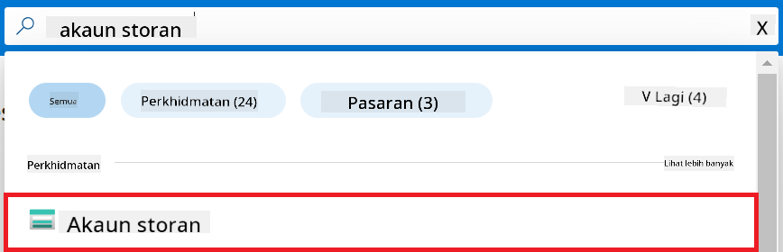

<!--
CO_OP_TRANSLATOR_METADATA:
{
  "original_hash": "ecbd9179a21edbaafaf114d47f09f3e3",
  "translation_date": "2025-07-17T01:45:12+00:00",
  "source_file": "md/02.Application/01.TextAndChat/Phi3/E2E_Phi-3-FineTuning_PromptFlow_Integration_AIFoundry.md",
  "language_code": "ms"
}
-->
# Laraskan dan Integrasikan model Phi-3 tersuai dengan Prompt flow dalam Azure AI Foundry

Contoh hujung-ke-hujung (E2E) ini berdasarkan panduan "[Laraskan dan Integrasikan Model Phi-3 Tersuai dengan Prompt Flow dalam Azure AI Foundry](https://techcommunity.microsoft.com/t5/educator-developer-blog/fine-tune-and-integrate-custom-phi-3-models-with-prompt-flow-in/ba-p/4191726?WT.mc_id=aiml-137032-kinfeylo)" dari Microsoft Tech Community. Ia memperkenalkan proses melaraskan, menyebarkan, dan mengintegrasikan model Phi-3 tersuai dengan Prompt flow dalam Azure AI Foundry.  
Berbeza dengan contoh E2E, "[Laraskan dan Integrasikan Model Phi-3 Tersuai dengan Prompt Flow](./E2E_Phi-3-FineTuning_PromptFlow_Integration.md)", yang melibatkan menjalankan kod secara tempatan, tutorial ini memberi tumpuan sepenuhnya kepada melaraskan dan mengintegrasikan model anda dalam Azure AI / ML Studio.

## Gambaran Keseluruhan

Dalam contoh E2E ini, anda akan belajar cara melaraskan model Phi-3 dan mengintegrasikannya dengan Prompt flow dalam Azure AI Foundry. Dengan memanfaatkan Azure AI / ML Studio, anda akan membina aliran kerja untuk menyebarkan dan menggunakan model AI tersuai. Contoh E2E ini dibahagikan kepada tiga senario:

**Senario 1: Sediakan sumber Azure dan Bersedia untuk melaraskan**

**Senario 2: Laraskan model Phi-3 dan Sebarkan dalam Azure Machine Learning Studio**

**Senario 3: Integrasikan dengan Prompt flow dan Berbual dengan model tersuai anda dalam Azure AI Foundry**

Berikut adalah gambaran keseluruhan contoh E2E ini.


### Jadual Kandungan

1. **[Senario 1: Sediakan sumber Azure dan Bersedia untuk melaraskan](../../../../../../md/02.Application/01.TextAndChat/Phi3)**
    - [Cipta Azure Machine Learning Workspace](../../../../../../md/02.Application/01.TextAndChat/Phi3)
    - [Mohon kuota GPU dalam Azure Subscription](../../../../../../md/02.Application/01.TextAndChat/Phi3)
    - [Tambah penugasan peranan](../../../../../../md/02.Application/01.TextAndChat/Phi3)
    - [Sediakan projek](../../../../../../md/02.Application/01.TextAndChat/Phi3)
    - [Sediakan set data untuk melaraskan](../../../../../../md/02.Application/01.TextAndChat/Phi3)

1. **[Senario 2: Laraskan model Phi-3 dan Sebarkan dalam Azure Machine Learning Studio](../../../../../../md/02.Application/01.TextAndChat/Phi3)**
    - [Laraskan model Phi-3](../../../../../../md/02.Application/01.TextAndChat/Phi3)
    - [Sebarkan model Phi-3 yang telah dilaraskan](../../../../../../md/02.Application/01.TextAndChat/Phi3)

1. **[Senario 3: Integrasikan dengan Prompt flow dan Berbual dengan model tersuai anda dalam Azure AI Foundry](../../../../../../md/02.Application/01.TextAndChat/Phi3)**
    - [Integrasikan model Phi-3 tersuai dengan Prompt flow](../../../../../../md/02.Application/01.TextAndChat/Phi3)
    - [Berbual dengan model Phi-3 tersuai anda](../../../../../../md/02.Application/01.TextAndChat/Phi3)

## Senario 1: Sediakan sumber Azure dan Bersedia untuk melaraskan

### Cipta Azure Machine Learning Workspace

1. Taip *azure machine learning* dalam **bar carian** di bahagian atas halaman portal dan pilih **Azure Machine Learning** daripada pilihan yang muncul.

    

2. Pilih **+ Create** dari menu navigasi.

3. Pilih **New workspace** dari menu navigasi.

    

4. Lakukan tugasan berikut:

    - Pilih **Subscription** Azure anda.
    - Pilih **Resource group** yang ingin digunakan (cipta baru jika perlu).
    - Masukkan **Workspace Name**. Ia mesti nilai unik.
    - Pilih **Region** yang anda ingin gunakan.
    - Pilih **Storage account** yang ingin digunakan (cipta baru jika perlu).
    - Pilih **Key vault** yang ingin digunakan (cipta baru jika perlu).
    - Pilih **Application insights** yang ingin digunakan (cipta baru jika perlu).
    - Pilih **Container registry** yang ingin digunakan (cipta baru jika perlu).

    

5. Pilih **Review + Create**.

6. Pilih **Create**.

### Mohon kuota GPU dalam Azure Subscription

Dalam tutorial ini, anda akan belajar cara melaraskan dan menyebarkan model Phi-3 menggunakan GPU. Untuk melaraskan, anda akan menggunakan GPU *Standard_NC24ads_A100_v4*, yang memerlukan permohonan kuota. Untuk penyebaran, anda akan menggunakan GPU *Standard_NC6s_v3*, yang juga memerlukan permohonan kuota.

> [!NOTE]
>
> Hanya langganan Pay-As-You-Go (jenis langganan standard) layak untuk peruntukan GPU; langganan manfaat tidak disokong buat masa ini.
>

1. Lawati [Azure ML Studio](https://ml.azure.com/home?wt.mc_id=studentamb_279723).

1. Lakukan tugasan berikut untuk memohon kuota *Standard NCADSA100v4 Family*:

    - Pilih **Quota** dari tab sebelah kiri.
    - Pilih **Virtual machine family** yang ingin digunakan. Contohnya, pilih **Standard NCADSA100v4 Family Cluster Dedicated vCPUs**, yang merangkumi GPU *Standard_NC24ads_A100_v4*.
    - Pilih **Request quota** dari menu navigasi.

        

    - Dalam halaman Request quota, masukkan **New cores limit** yang anda ingin gunakan. Contohnya, 24.
    - Dalam halaman Request quota, pilih **Submit** untuk memohon kuota GPU.

1. Lakukan tugasan berikut untuk memohon kuota *Standard NCSv3 Family*:

    - Pilih **Quota** dari tab sebelah kiri.
    - Pilih **Virtual machine family** yang ingin digunakan. Contohnya, pilih **Standard NCSv3 Family Cluster Dedicated vCPUs**, yang merangkumi GPU *Standard_NC6s_v3*.
    - Pilih **Request quota** dari menu navigasi.
    - Dalam halaman Request quota, masukkan **New cores limit** yang anda ingin gunakan. Contohnya, 24.
    - Dalam halaman Request quota, pilih **Submit** untuk memohon kuota GPU.

### Tambah penugasan peranan

Untuk melaraskan dan menyebarkan model anda, anda mesti terlebih dahulu mencipta User Assigned Managed Identity (UAI) dan memberikan kebenaran yang sesuai. UAI ini akan digunakan untuk pengesahan semasa penyebaran.

#### Cipta User Assigned Managed Identity (UAI)

1. Taip *managed identities* dalam **bar carian** di bahagian atas halaman portal dan pilih **Managed Identities** daripada pilihan yang muncul.

    

1. Pilih **+ Create**.

    

1. Lakukan tugasan berikut:

    - Pilih **Subscription** Azure anda.
    - Pilih **Resource group** yang ingin digunakan (cipta baru jika perlu).
    - Pilih **Region** yang anda ingin gunakan.
    - Masukkan **Name**. Ia mesti nilai unik.

    

1. Pilih **Review + create**.

1. Pilih **+ Create**.

#### Tambah penugasan peranan Contributor kepada Managed Identity

1. Navigasi ke sumber Managed Identity yang anda cipta.

1. Pilih **Azure role assignments** dari tab sebelah kiri.

1. Pilih **+Add role assignment** dari menu navigasi.

1. Dalam halaman Add role assignment, lakukan tugasan berikut:
    - Pilih **Scope** kepada **Resource group**.
    - Pilih **Subscription** Azure anda.
    - Pilih **Resource group** yang ingin digunakan.
    - Pilih **Role** kepada **Contributor**.

    

2. Pilih **Save**.

#### Tambah penugasan peranan Storage Blob Data Reader kepada Managed Identity

1. Taip *storage accounts* dalam **bar carian** di bahagian atas halaman portal dan pilih **Storage accounts** daripada pilihan yang muncul.

    

1. Pilih akaun storan yang berkaitan dengan Azure Machine Learning workspace yang anda cipta. Contohnya, *finetunephistorage*.

1. Lakukan tugasan berikut untuk navigasi ke halaman Add role assignment:

    - Navigasi ke akaun storan Azure yang anda cipta.
    - Pilih **Access Control (IAM)** dari tab sebelah kiri.
    - Pilih **+ Add** dari menu navigasi.
    - Pilih **Add role assignment** dari menu navigasi.

    

1. Dalam halaman Add role assignment, lakukan tugasan berikut:

    - Dalam halaman Role, taip *Storage Blob Data Reader* dalam **bar carian** dan pilih **Storage Blob Data Reader** daripada pilihan yang muncul.
    - Dalam halaman Role, pilih **Next**.
    - Dalam halaman Members, pilih **Assign access to** **Managed identity**.
    - Dalam halaman Members, pilih **+ Select members**.
    - Dalam halaman Select managed identities, pilih **Subscription** Azure anda.
    - Dalam halaman Select managed identities, pilih **Managed identity** kepada **Manage Identity**.
    - Dalam halaman Select managed identities, pilih Managed Identity yang anda cipta. Contohnya, *finetunephi-managedidentity*.
    - Dalam halaman Select managed identities, pilih **Select**.

    

1. Pilih **Review + assign**.

#### Tambah penugasan peranan AcrPull kepada Managed Identity

1. Taip *container registries* dalam **bar carian** di bahagian atas halaman portal dan pilih **Container registries** daripada pilihan yang muncul.

    

1. Pilih container registry yang berkaitan dengan Azure Machine Learning workspace. Contohnya, *finetunephicontainerregistry*

1. Lakukan tugasan berikut untuk navigasi ke halaman Add role assignment:

    - Pilih **Access Control (IAM)** dari tab sebelah kiri.
    - Pilih **+ Add** dari menu navigasi.
    - Pilih **Add role assignment** dari menu navigasi.

1. Dalam halaman Add role assignment, lakukan tugasan berikut:

    - Dalam halaman Role, taip *AcrPull* dalam **bar carian** dan pilih **AcrPull** daripada pilihan yang muncul.
    - Dalam halaman Role, pilih **Next**.
    - Dalam halaman Members, pilih **Assign access to** **Managed identity**.
    - Dalam halaman Members, pilih **+ Select members**.
    - Dalam halaman Select managed identities, pilih **Subscription** Azure anda.
    - Dalam halaman Select managed identities, pilih **Managed identity** kepada **Manage Identity**.
    - Dalam halaman Select managed identities, pilih Managed Identity yang anda cipta. Contohnya, *finetunephi-managedidentity*.
    - Dalam halaman Select managed identities, pilih **Select**.
    - Pilih **Review + assign**.

### Sediakan projek

Untuk memuat turun set data yang diperlukan untuk melaraskan, anda akan menyediakan persekitaran tempatan.

Dalam latihan ini, anda akan

- Cipta folder untuk bekerja di dalamnya.
- Cipta persekitaran maya.
- Pasang pakej yang diperlukan.
- Cipta fail *download_dataset.py* untuk memuat turun set data.

#### Cipta folder untuk bekerja di dalamnya

1. Buka tetingkap terminal dan taip arahan berikut untuk mencipta folder bernama *finetune-phi* dalam laluan lalai.

    ```console
    mkdir finetune-phi
    ```

2. Taip arahan berikut dalam terminal anda untuk menavigasi ke folder *finetune-phi* yang anda cipta.
#### Cipta persekitaran maya

1. Taip arahan berikut dalam terminal anda untuk mencipta persekitaran maya bernama *.venv*.

    ```console
    python -m venv .venv
    ```

2. Taip arahan berikut dalam terminal anda untuk mengaktifkan persekitaran maya.

    ```console
    .venv\Scripts\activate.bat
    ```


> [!NOTE]
> Jika berjaya, anda akan melihat *(.venv)* sebelum prompt arahan.

#### Pasang pakej yang diperlukan

1. Taip arahan berikut dalam terminal anda untuk memasang pakej yang diperlukan.

    ```console
    pip install datasets==2.19.1
    ```

#### Cipta `download_dataset.py`

> [!NOTE]
> Struktur folder lengkap:
>
> ```text
> └── YourUserName
> .    └── finetune-phi
> .        └── download_dataset.py
> ```

1. Buka **Visual Studio Code**.

1. Pilih **File** dari bar menu.

1. Pilih **Open Folder**.

1. Pilih folder *finetune-phi* yang anda cipta, yang terletak di *C:\Users\yourUserName\finetune-phi*.

    

1. Di panel kiri Visual Studio Code, klik kanan dan pilih **New File** untuk mencipta fail baru bernama *download_dataset.py*.

    

### Sediakan dataset untuk fine-tuning

Dalam latihan ini, anda akan menjalankan fail *download_dataset.py* untuk memuat turun dataset *ultrachat_200k* ke persekitaran tempatan anda. Anda kemudian akan menggunakan dataset ini untuk fine-tune model Phi-3 dalam Azure Machine Learning.

Dalam latihan ini, anda akan:

- Tambah kod ke dalam fail *download_dataset.py* untuk memuat turun dataset.
- Jalankan fail *download_dataset.py* untuk memuat turun dataset ke persekitaran tempatan anda.

#### Muat turun dataset anda menggunakan *download_dataset.py*

1. Buka fail *download_dataset.py* dalam Visual Studio Code.

1. Tambah kod berikut ke dalam fail *download_dataset.py*.

    ```python
    import json
    import os
    from datasets import load_dataset

    def load_and_split_dataset(dataset_name, config_name, split_ratio):
        """
        Load and split a dataset.
        """
        # Load the dataset with the specified name, configuration, and split ratio
        dataset = load_dataset(dataset_name, config_name, split=split_ratio)
        print(f"Original dataset size: {len(dataset)}")
        
        # Split the dataset into train and test sets (80% train, 20% test)
        split_dataset = dataset.train_test_split(test_size=0.2)
        print(f"Train dataset size: {len(split_dataset['train'])}")
        print(f"Test dataset size: {len(split_dataset['test'])}")
        
        return split_dataset

    def save_dataset_to_jsonl(dataset, filepath):
        """
        Save a dataset to a JSONL file.
        """
        # Create the directory if it does not exist
        os.makedirs(os.path.dirname(filepath), exist_ok=True)
        
        # Open the file in write mode
        with open(filepath, 'w', encoding='utf-8') as f:
            # Iterate over each record in the dataset
            for record in dataset:
                # Dump the record as a JSON object and write it to the file
                json.dump(record, f)
                # Write a newline character to separate records
                f.write('\n')
        
        print(f"Dataset saved to {filepath}")

    def main():
        """
        Main function to load, split, and save the dataset.
        """
        # Load and split the ULTRACHAT_200k dataset with a specific configuration and split ratio
        dataset = load_and_split_dataset("HuggingFaceH4/ultrachat_200k", 'default', 'train_sft[:1%]')
        
        # Extract the train and test datasets from the split
        train_dataset = dataset['train']
        test_dataset = dataset['test']

        # Save the train dataset to a JSONL file
        save_dataset_to_jsonl(train_dataset, "data/train_data.jsonl")
        
        # Save the test dataset to a separate JSONL file
        save_dataset_to_jsonl(test_dataset, "data/test_data.jsonl")

    if __name__ == "__main__":
        main()

    ```

1. Taip arahan berikut dalam terminal anda untuk menjalankan skrip dan memuat turun dataset ke persekitaran tempatan anda.

    ```console
    python download_dataset.py
    ```

1. Sahkan bahawa dataset telah berjaya disimpan ke direktori *finetune-phi/data* tempatan anda.

> [!NOTE]
>
> #### Nota mengenai saiz dataset dan masa fine-tuning
>
> Dalam tutorial ini, anda hanya menggunakan 1% daripada dataset (`split='train[:1%]'`). Ini mengurangkan jumlah data dengan ketara, mempercepatkan proses muat naik dan fine-tuning. Anda boleh laraskan peratusan untuk mencari keseimbangan yang sesuai antara masa latihan dan prestasi model. Menggunakan subset dataset yang lebih kecil mengurangkan masa yang diperlukan untuk fine-tuning, menjadikan proses lebih mudah untuk tutorial.

## Senario 2: Fine-tune model Phi-3 dan Deploy dalam Azure Machine Learning Studio

### Fine-tune model Phi-3

Dalam latihan ini, anda akan fine-tune model Phi-3 dalam Azure Machine Learning Studio.

Dalam latihan ini, anda akan:

- Cipta kluster komputer untuk fine-tuning.
- Fine-tune model Phi-3 dalam Azure Machine Learning Studio.

#### Cipta kluster komputer untuk fine-tuning

1. Lawati [Azure ML Studio](https://ml.azure.com/home?wt.mc_id=studentamb_279723).

1. Pilih **Compute** dari tab sebelah kiri.

1. Pilih **Compute clusters** dari menu navigasi.

1. Pilih **+ New**.

    

1. Lakukan tugasan berikut:

    - Pilih **Region** yang anda ingin gunakan.
    - Pilih **Virtual machine tier** kepada **Dedicated**.
    - Pilih **Virtual machine type** kepada **GPU**.
    - Pilih penapis **Virtual machine size** kepada **Select from all options**.
    - Pilih **Virtual machine size** kepada **Standard_NC24ads_A100_v4**.

    

1. Pilih **Next**.

1. Lakukan tugasan berikut:

    - Masukkan **Compute name**. Ia mesti nilai unik.
    - Pilih **Minimum number of nodes** kepada **0**.
    - Pilih **Maximum number of nodes** kepada **1**.
    - Pilih **Idle seconds before scale down** kepada **120**.

    

1. Pilih **Create**.

#### Fine-tune model Phi-3

1. Lawati [Azure ML Studio](https://ml.azure.com/home?wt.mc_id=studentamb_279723).

1. Pilih workspace Azure Machine Learning yang anda cipta.

    

1. Lakukan tugasan berikut:

    - Pilih **Model catalog** dari tab sebelah kiri.
    - Taip *phi-3-mini-4k* dalam **bar carian** dan pilih **Phi-3-mini-4k-instruct** dari pilihan yang muncul.

    

1. Pilih **Fine-tune** dari menu navigasi.

    

1. Lakukan tugasan berikut:

    - Pilih **Select task type** kepada **Chat completion**.
    - Pilih **+ Select data** untuk memuat naik **Traning data**.
    - Pilih jenis muat naik Validation data kepada **Provide different validation data**.
    - Pilih **+ Select data** untuk memuat naik **Validation data**.

    

    > [!TIP]
    >
    > Anda boleh pilih **Advanced settings** untuk sesuaikan konfigurasi seperti **learning_rate** dan **lr_scheduler_type** bagi mengoptimumkan proses fine-tuning mengikut keperluan anda.

1. Pilih **Finish**.

1. Dalam latihan ini, anda berjaya fine-tune model Phi-3 menggunakan Azure Machine Learning. Sila ambil perhatian bahawa proses fine-tuning boleh mengambil masa yang lama. Selepas menjalankan kerja fine-tuning, anda perlu menunggu sehingga ia selesai. Anda boleh memantau status kerja fine-tuning dengan pergi ke tab Jobs di sebelah kiri Workspace Azure Machine Learning anda. Dalam siri seterusnya, anda akan deploy model yang telah di-fine-tune dan mengintegrasikannya dengan Prompt flow.

    

### Deploy model Phi-3 yang telah di-fine-tune

Untuk mengintegrasikan model Phi-3 yang telah di-fine-tune dengan Prompt flow, anda perlu deploy model tersebut supaya ia boleh diakses untuk inferens masa nyata. Proses ini melibatkan pendaftaran model, penciptaan endpoint dalam talian, dan deployment model.

Dalam latihan ini, anda akan:

- Daftarkan model yang telah di-fine-tune dalam workspace Azure Machine Learning.
- Cipta endpoint dalam talian.
- Deploy model Phi-3 yang telah didaftarkan dan di-fine-tune.

#### Daftarkan model yang telah di-fine-tune

1. Lawati [Azure ML Studio](https://ml.azure.com/home?wt.mc_id=studentamb_279723).

1. Pilih workspace Azure Machine Learning yang anda cipta.

    

1. Pilih **Models** dari tab sebelah kiri.
1. Pilih **+ Register**.
1. Pilih **From a job output**.

    

1. Pilih kerja yang anda cipta.

    

1. Pilih **Next**.

1. Pilih **Model type** kepada **MLflow**.

1. Pastikan **Job output** dipilih; ia sepatutnya dipilih secara automatik.

    

2. Pilih **Next**.

3. Pilih **Register**.

    

4. Anda boleh melihat model yang telah didaftarkan dengan pergi ke menu **Models** dari tab sebelah kiri.

    

#### Deploy model yang telah di-fine-tune

1. Pergi ke workspace Azure Machine Learning yang anda cipta.

1. Pilih **Endpoints** dari tab sebelah kiri.

1. Pilih **Real-time endpoints** dari menu navigasi.

    

1. Pilih **Create**.

1. Pilih model yang telah didaftarkan yang anda cipta.

    

1. Pilih **Select**.

1. Lakukan tugasan berikut:

    - Pilih **Virtual machine** kepada *Standard_NC6s_v3*.
    - Pilih **Instance count** yang anda ingin gunakan. Contohnya, *1*.
    - Pilih **Endpoint** kepada **New** untuk mencipta endpoint baru.
    - Masukkan **Endpoint name**. Ia mesti nilai unik.
    - Masukkan **Deployment name**. Ia mesti nilai unik.

    

1. Pilih **Deploy**.

> [!WARNING]
> Untuk mengelakkan caj tambahan pada akaun anda, pastikan anda memadam endpoint yang telah dicipta dalam workspace Azure Machine Learning.
>

#### Semak status deployment dalam Azure Machine Learning Workspace

1. Pergi ke workspace Azure Machine Learning yang anda cipta.

1. Pilih **Endpoints** dari tab sebelah kiri.

1. Pilih endpoint yang anda cipta.

    

1. Pada halaman ini, anda boleh menguruskan endpoints semasa proses deployment.

> [!NOTE]
> Setelah deployment selesai, pastikan **Live traffic** ditetapkan kepada **100%**. Jika tidak, pilih **Update traffic** untuk laraskan tetapan trafik. Perlu diingat anda tidak boleh menguji model jika trafik ditetapkan kepada 0%.
>
> 
>

## Senario 3: Integrasi dengan Prompt flow dan Berbual dengan model khusus anda dalam Azure AI Foundry

### Integrasi model Phi-3 khusus dengan Prompt flow

Selepas berjaya deploy model yang telah di-fine-tune, anda kini boleh mengintegrasikannya dengan Prompt Flow untuk menggunakan model anda dalam aplikasi masa nyata, membolehkan pelbagai tugasan interaktif dengan model Phi-3 khusus anda.

Dalam latihan ini, anda akan:

- Cipta Azure AI Foundry Hub.
- Cipta Projek Azure AI Foundry.
- Cipta Prompt flow.
- Tambah sambungan khusus untuk model Phi-3 yang telah di-fine-tune.
- Sediakan Prompt flow untuk berbual dengan model Phi-3 khusus anda.
> [!NOTE]
> Anda juga boleh mengintegrasikan dengan Promptflow menggunakan Azure ML Studio. Proses integrasi yang sama boleh digunakan untuk Azure ML Studio.
#### Cipta Azure AI Foundry Hub

Anda perlu mencipta Hub sebelum mencipta Projek. Hub berfungsi seperti Kumpulan Sumber, membolehkan anda mengatur dan menguruskan pelbagai Projek dalam Azure AI Foundry.

1. Lawati [Azure AI Foundry](https://ai.azure.com/?WT.mc_id=aiml-137032-kinfeylo).

1. Pilih **All hubs** dari tab sebelah kiri.

1. Pilih **+ New hub** dari menu navigasi.

    

1. Lakukan tugasan berikut:

    - Masukkan **Hub name**. Ia mesti nilai yang unik.
    - Pilih **Subscription** Azure anda.
    - Pilih **Resource group** yang ingin digunakan (cipta yang baru jika perlu).
    - Pilih **Location** yang anda ingin gunakan.
    - Pilih **Connect Azure AI Services** yang ingin digunakan (cipta yang baru jika perlu).
    - Pilih **Connect Azure AI Search** kepada **Skip connecting**.

    

1. Pilih **Next**.

#### Cipta Projek Azure AI Foundry

1. Dalam Hub yang anda cipta, pilih **All projects** dari tab sebelah kiri.

1. Pilih **+ New project** dari menu navigasi.

    

1. Masukkan **Project name**. Ia mesti nilai yang unik.

    

1. Pilih **Create a project**.

#### Tambah sambungan khusus untuk model Phi-3 yang telah ditala

Untuk mengintegrasikan model Phi-3 khusus anda dengan Prompt flow, anda perlu menyimpan endpoint dan kunci model dalam sambungan khusus. Persediaan ini memastikan akses ke model Phi-3 khusus anda dalam Prompt flow.

#### Tetapkan api key dan endpoint uri model Phi-3 yang telah ditala

1. Lawati [Azure ML Studio](https://ml.azure.com/home?WT.mc_id=aiml-137032-kinfeylo).

1. Navigasi ke ruang kerja Azure Machine learning yang anda cipta.

1. Pilih **Endpoints** dari tab sebelah kiri.

    

1. Pilih endpoint yang anda cipta.

    

1. Pilih **Consume** dari menu navigasi.

1. Salin **REST endpoint** dan **Primary key** anda.

    

#### Tambah Sambungan Khusus

1. Lawati [Azure AI Foundry](https://ai.azure.com/?WT.mc_id=aiml-137032-kinfeylo).

1. Navigasi ke projek Azure AI Foundry yang anda cipta.

1. Dalam Projek yang anda cipta, pilih **Settings** dari tab sebelah kiri.

1. Pilih **+ New connection**.

    

1. Pilih **Custom keys** dari menu navigasi.

    

1. Lakukan tugasan berikut:

    - Pilih **+ Add key value pairs**.
    - Untuk nama kunci, masukkan **endpoint** dan tampal endpoint yang anda salin dari Azure ML Studio ke dalam medan nilai.
    - Pilih **+ Add key value pairs** sekali lagi.
    - Untuk nama kunci, masukkan **key** dan tampal kunci yang anda salin dari Azure ML Studio ke dalam medan nilai.
    - Selepas menambah kunci, pilih **is secret** untuk mengelakkan kunci didedahkan.

    

1. Pilih **Add connection**.

#### Cipta Prompt flow

Anda telah menambah sambungan khusus dalam Azure AI Foundry. Sekarang, mari cipta Prompt flow menggunakan langkah berikut. Kemudian, anda akan sambungkan Prompt flow ini ke sambungan khusus supaya anda boleh menggunakan model yang telah ditala dalam Prompt flow.

1. Navigasi ke projek Azure AI Foundry yang anda cipta.

1. Pilih **Prompt flow** dari tab sebelah kiri.

1. Pilih **+ Create** dari menu navigasi.

    

1. Pilih **Chat flow** dari menu navigasi.

    

1. Masukkan **Folder name** yang ingin digunakan.

    

2. Pilih **Create**.

#### Sediakan Prompt flow untuk bersembang dengan model Phi-3 khusus anda

Anda perlu mengintegrasikan model Phi-3 yang telah ditala ke dalam Prompt flow. Walau bagaimanapun, Prompt flow sedia ada yang disediakan tidak direka untuk tujuan ini. Oleh itu, anda mesti mereka semula Prompt flow untuk membolehkan integrasi model khusus tersebut.

1. Dalam Prompt flow, lakukan tugasan berikut untuk membina semula aliran sedia ada:

    - Pilih **Raw file mode**.
    - Padam semua kod sedia ada dalam fail *flow.dag.yml*.
    - Tambah kod berikut ke dalam fail *flow.dag.yml*.

        ```yml
        inputs:
          input_data:
            type: string
            default: "Who founded Microsoft?"

        outputs:
          answer:
            type: string
            reference: ${integrate_with_promptflow.output}

        nodes:
        - name: integrate_with_promptflow
          type: python
          source:
            type: code
            path: integrate_with_promptflow.py
          inputs:
            input_data: ${inputs.input_data}
        ```

    - Pilih **Save**.

    

1. Tambah kod berikut ke dalam fail *integrate_with_promptflow.py* untuk menggunakan model Phi-3 khusus dalam Prompt flow.

    ```python
    import logging
    import requests
    from promptflow import tool
    from promptflow.connections import CustomConnection

    # Logging setup
    logging.basicConfig(
        format="%(asctime)s - %(levelname)s - %(name)s - %(message)s",
        datefmt="%Y-%m-%d %H:%M:%S",
        level=logging.DEBUG
    )
    logger = logging.getLogger(__name__)

    def query_phi3_model(input_data: str, connection: CustomConnection) -> str:
        """
        Send a request to the Phi-3 model endpoint with the given input data using Custom Connection.
        """

        # "connection" is the name of the Custom Connection, "endpoint", "key" are the keys in the Custom Connection
        endpoint_url = connection.endpoint
        api_key = connection.key

        headers = {
            "Content-Type": "application/json",
            "Authorization": f"Bearer {api_key}"
        }
        data = {
            "input_data": {
                "input_string": [
                    {"role": "user", "content": input_data}
                ],
                "parameters": {
                    "temperature": 0.7,
                    "max_new_tokens": 128
                }
            }
        }
        try:
            response = requests.post(endpoint_url, json=data, headers=headers)
            response.raise_for_status()
            
            # Log the full JSON response
            logger.debug(f"Full JSON response: {response.json()}")

            result = response.json()["output"]
            logger.info("Successfully received response from Azure ML Endpoint.")
            return result
        except requests.exceptions.RequestException as e:
            logger.error(f"Error querying Azure ML Endpoint: {e}")
            raise

    @tool
    def my_python_tool(input_data: str, connection: CustomConnection) -> str:
        """
        Tool function to process input data and query the Phi-3 model.
        """
        return query_phi3_model(input_data, connection)

    ```

    

> [!NOTE]
> Untuk maklumat lebih terperinci mengenai penggunaan Prompt flow dalam Azure AI Foundry, anda boleh rujuk [Prompt flow in Azure AI Foundry](https://learn.microsoft.com/azure/ai-studio/how-to/prompt-flow).

1. Pilih **Chat input**, **Chat output** untuk membolehkan sembang dengan model anda.

    

1. Kini anda sudah bersedia untuk bersembang dengan model Phi-3 khusus anda. Dalam latihan seterusnya, anda akan belajar cara memulakan Prompt flow dan menggunakannya untuk bersembang dengan model Phi-3 yang telah ditala.

> [!NOTE]
>
> Aliran yang dibina semula sepatutnya kelihatan seperti imej di bawah:
>
> 
>

### Bersembang dengan model Phi-3 khusus anda

Kini anda telah menala dan mengintegrasikan model Phi-3 khusus anda dengan Prompt flow, anda sudah bersedia untuk mula berinteraksi dengannya. Latihan ini akan membimbing anda melalui proses menyediakan dan memulakan sembang dengan model anda menggunakan Prompt flow. Dengan mengikuti langkah-langkah ini, anda akan dapat menggunakan sepenuhnya keupayaan model Phi-3 yang telah ditala untuk pelbagai tugasan dan perbualan.

- Bersembang dengan model Phi-3 khusus anda menggunakan Prompt flow.

#### Mulakan Prompt flow

1. Pilih **Start compute sessions** untuk memulakan Prompt flow.

    

1. Pilih **Validate and parse input** untuk memperbaharui parameter.

    

1. Pilih **Value** bagi **connection** kepada sambungan khusus yang anda cipta. Contohnya, *connection*.

    

#### Bersembang dengan model khusus anda

1. Pilih **Chat**.

    

1. Berikut adalah contoh hasilnya: Kini anda boleh bersembang dengan model Phi-3 khusus anda. Disarankan untuk bertanya soalan berdasarkan data yang digunakan untuk penalaan.

    

**Penafian**:  
Dokumen ini telah diterjemahkan menggunakan perkhidmatan terjemahan AI [Co-op Translator](https://github.com/Azure/co-op-translator). Walaupun kami berusaha untuk ketepatan, sila ambil maklum bahawa terjemahan automatik mungkin mengandungi kesilapan atau ketidaktepatan. Dokumen asal dalam bahasa asalnya harus dianggap sebagai sumber yang sahih. Untuk maklumat penting, terjemahan profesional oleh manusia adalah disyorkan. Kami tidak bertanggungjawab atas sebarang salah faham atau salah tafsir yang timbul daripada penggunaan terjemahan ini.