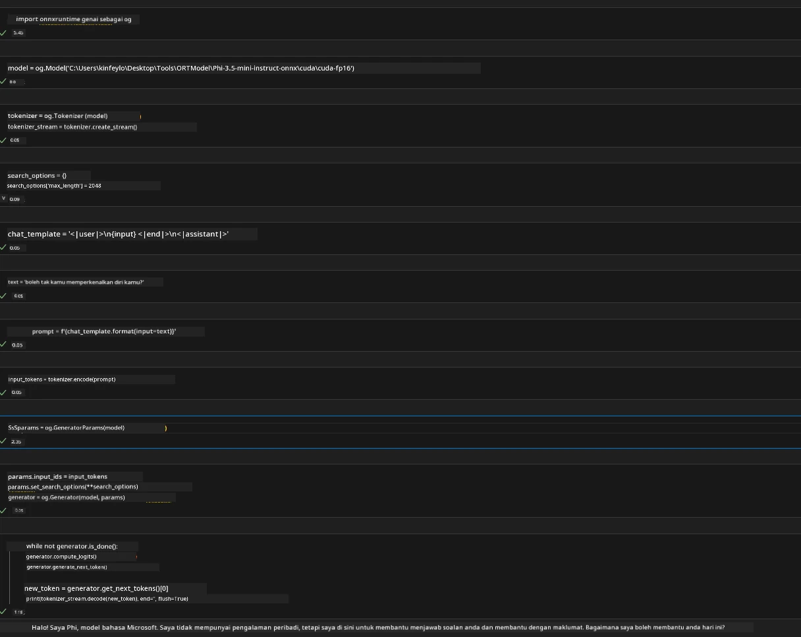
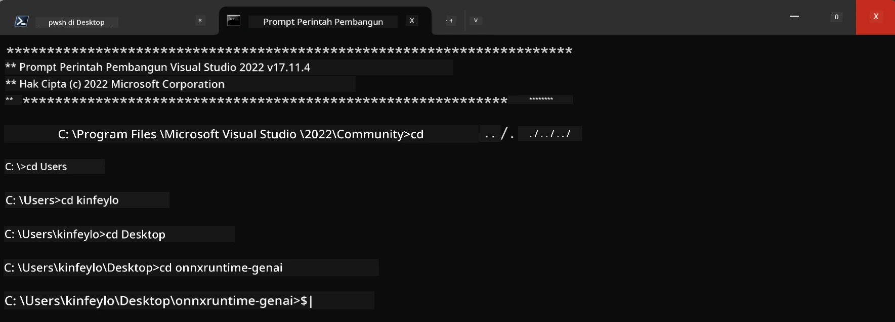

<!--
CO_OP_TRANSLATOR_METADATA:
{
  "original_hash": "b066fc29c1b2129df84e027cb75119ce",
  "translation_date": "2025-07-17T02:45:43+00:00",
  "source_file": "md/02.Application/01.TextAndChat/Phi3/ORTWindowGPUGuideline.md",
  "language_code": "ms"
}
-->
# **Garis Panduan untuk OnnxRuntime GenAI Windows GPU**

Garis panduan ini menyediakan langkah-langkah untuk memasang dan menggunakan ONNX Runtime (ORT) dengan GPU di Windows. Ia direka untuk membantu anda memanfaatkan pecutan GPU bagi model anda, meningkatkan prestasi dan kecekapan.

Dokumen ini memberikan panduan mengenai:

- Persediaan Persekitaran: Arahan untuk memasang kebergantungan yang diperlukan seperti CUDA, cuDNN, dan ONNX Runtime.
- Konfigurasi: Cara mengkonfigurasi persekitaran dan ONNX Runtime untuk menggunakan sumber GPU dengan berkesan.
- Petua Pengoptimuman: Nasihat tentang cara menyesuaikan tetapan GPU anda untuk prestasi yang optimum.

### **1. Python 3.10.x /3.11.8**

   ***Nota*** Disarankan menggunakan [miniforge](https://github.com/conda-forge/miniforge/releases/latest/download/Miniforge3-Windows-x86_64.exe) sebagai persekitaran Python anda

   ```bash

   conda create -n pydev python==3.11.8

   conda activate pydev

   ```

   ***Peringatan*** Jika anda telah memasang mana-mana perpustakaan ONNX untuk Python, sila nyahpasangnya

### **2. Pasang CMake dengan winget**

   ```bash

   winget install -e --id Kitware.CMake

   ```

### **3. Pasang Visual Studio 2022 - Pembangunan Desktop dengan C++**

   ***Nota*** Jika anda tidak mahu menyusun, anda boleh langkau langkah ini


### **4. Pasang Pemacu NVIDIA**

1. **Pemacu GPU NVIDIA**  [https://www.nvidia.com/en-us/drivers/](https://www.nvidia.com/en-us/drivers/)

2. **NVIDIA CUDA 12.4** [https://developer.nvidia.com/cuda-12-4-0-download-archive](https://developer.nvidia.com/cuda-12-4-0-download-archive)

3. **NVIDIA CUDNN 9.4**  [https://developer.nvidia.com/cudnn-downloads](https://developer.nvidia.com/cudnn-downloads)

***Peringatan*** Sila gunakan tetapan lalai semasa proses pemasangan

### **5. Tetapkan Persekitaran NVIDIA**

Salin fail lib, bin, include NVIDIA CUDNN 9.4 ke dalam lib, bin, include NVIDIA CUDA 12.4

- salin fail dari *'C:\Program Files\NVIDIA\CUDNN\v9.4\bin\12.6'* ke  *'C:\Program Files\NVIDIA GPU Computing Toolkit\CUDA\v12.4\bin'*

- salin fail dari *'C:\Program Files\NVIDIA\CUDNN\v9.4\include\12.6'* ke  *'C:\Program Files\NVIDIA GPU Computing Toolkit\CUDA\v12.4\include'*

- salin fail dari *'C:\Program Files\NVIDIA\CUDNN\v9.4\lib\12.6'* ke  *'C:\Program Files\NVIDIA GPU Computing Toolkit\CUDA\v12.4\lib\x64'*

### **6. Muat Turun Phi-3.5-mini-instruct-onnx**

   ```bash

   winget install -e --id Git.Git

   winget install -e --id GitHub.GitLFS

   git lfs install

   git clone https://huggingface.co/microsoft/Phi-3.5-mini-instruct-onnx

   ```

### **7. Jalankan InferencePhi35Instruct.ipynb**

   Buka [Notebook](../../../../../../code/09.UpdateSamples/Aug/ortgpu-phi35-instruct.ipynb) dan jalankan



### **8. Kompilasi ORT GenAI GPU**

   ***Nota*** 
   
   1. Sila nyahpasang semua berkaitan onnx, onnxruntime dan onnxruntime-genai terlebih dahulu

   ```bash

   pip list 
   
   ```

   Kemudian nyahpasang semua perpustakaan onnxruntime seperti berikut

   ```bash

   pip uninstall onnxruntime

   pip uninstall onnxruntime-genai

   pip uninstall onnxruntume-genai-cuda
   
   ```

   2. Semak sokongan Sambungan Visual Studio

   Semak di C:\Program Files\NVIDIA GPU Computing Toolkit\CUDA\v12.4\extras untuk memastikan folder C:\Program Files\NVIDIA GPU Computing Toolkit\CUDA\v12.4\extras\visual_studio_integration wujud. 
   
   Jika tidak dijumpai, periksa folder pemacu toolkit Cuda lain dan salin folder visual_studio_integration beserta kandungannya ke C:\Program Files\NVIDIA GPU Computing Toolkit\CUDA\v12.4\extras\visual_studio_integration

   - Jika anda tidak mahu menyusun, anda boleh langkau langkah ini

   ```bash

   git clone https://github.com/microsoft/onnxruntime-genai

   ```

   - Muat turun [https://github.com/microsoft/onnxruntime/releases/download/v1.19.2/onnxruntime-win-x64-gpu-1.19.2.zip](https://github.com/microsoft/onnxruntime/releases/download/v1.19.2/onnxruntime-win-x64-gpu-1.19.2.zip)

   - Nyahzip onnxruntime-win-x64-gpu-1.19.2.zip, dan namakan semula kepada **ort**, salin folder ort ke onnxruntime-genai

   - Gunakan Windows Terminal, buka Developer Command Prompt untuk VS 2022 dan pergi ke onnxruntime-genai



   - Kompilasi menggunakan persekitaran python anda

   ```bash

   cd onnxruntime-genai

   python build.py --use_cuda  --cuda_home "C:\Program Files\NVIDIA GPU Computing Toolkit\CUDA\v12.4" --config Release
 

   cd build/Windows/Release/Wheel

   pip install .whl

   ```

**Penafian**:  
Dokumen ini telah diterjemahkan menggunakan perkhidmatan terjemahan AI [Co-op Translator](https://github.com/Azure/co-op-translator). Walaupun kami berusaha untuk ketepatan, sila ambil maklum bahawa terjemahan automatik mungkin mengandungi kesilapan atau ketidaktepatan. Dokumen asal dalam bahasa asalnya harus dianggap sebagai sumber yang sahih. Untuk maklumat penting, terjemahan profesional oleh manusia adalah disyorkan. Kami tidak bertanggungjawab atas sebarang salah faham atau salah tafsir yang timbul daripada penggunaan terjemahan ini.