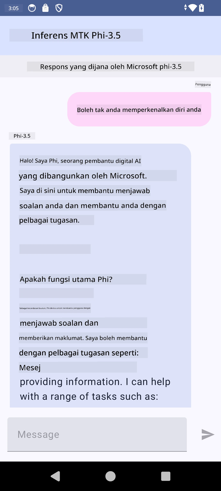

# **Menggunakan Microsoft Phi-3.5 tflite untuk membuat aplikasi Android**

Ini adalah contoh Android yang menggunakan model Microsoft Phi-3.5 tflite.

## **📚 Pengetahuan**

Android LLM Inference API membolehkan anda menjalankan model bahasa besar (LLM) sepenuhnya di peranti untuk aplikasi Android, yang boleh digunakan untuk melaksanakan pelbagai tugasan, seperti menjana teks, mendapatkan maklumat dalam bentuk bahasa semula jadi, dan meringkaskan dokumen. Tugasan ini menyediakan sokongan terbina dalam untuk pelbagai model bahasa besar teks-ke-teks, supaya anda boleh menggunakan model AI generatif terkini yang berjalan di peranti untuk aplikasi Android anda.

Google AI Edge Torch adalah perpustakaan python yang menyokong penukaran model PyTorch ke format .tflite, yang kemudiannya boleh dijalankan dengan TensorFlow Lite dan MediaPipe. Ini membolehkan aplikasi untuk Android, iOS dan IoT yang boleh menjalankan model sepenuhnya di peranti. AI Edge Torch menawarkan liputan CPU yang luas, dengan sokongan awal untuk GPU dan NPU. AI Edge Torch berusaha untuk integrasi rapat dengan PyTorch, dibina di atas torch.export() dan menyediakan liputan yang baik untuk operator Core ATen.

## **🪬 Panduan**

### **🔥 Tukar Microsoft Phi-3.5 ke sokongan tflite**

0. Contoh ini untuk Android 14+

1. Pasang Python 3.10.12

***Cadangan:*** gunakan conda untuk memasang persekitaran Python anda

2. Ubuntu 20.04 / 22.04 (sila fokus pada [google ai-edge-torch](https://github.com/google-ai-edge/ai-edge-torch))

***Cadangan:*** Gunakan Azure Linux VM atau VM awan pihak ketiga untuk mencipta persekitaran anda

3. Pergi ke bash Linux anda, untuk memasang perpustakaan Python

```bash

git clone https://github.com/google-ai-edge/ai-edge-torch.git

cd ai-edge-torch

pip install -r requirements.txt -U 

pip install tensorflow-cpu -U

pip install -e .

```

4. Muat turun Microsoft-3.5-Instruct dari Hugging face

```bash

git lfs install

git clone  https://huggingface.co/microsoft/Phi-3.5-mini-instruct

```

5. Tukar Microsoft Phi-3.5 ke tflite

```bash

python ai-edge-torch/ai_edge_torch/generative/examples/phi/convert_phi3_to_tflite.py --checkpoint_path  Your Microsoft Phi-3.5-mini-instruct path --tflite_path Your Microsoft Phi-3.5-mini-instruct tflite path  --prefill_seq_len 1024 --kv_cache_max_len 1280 --quantize True

```

### **🔥 Tukar Microsoft Phi-3.5 ke Bundle Mediapipe Android**

Sila pasang mediapipe terlebih dahulu

```bash

pip install mediapipe

```

Jalankan kod ini di [notebook anda](../../../../../../code/09.UpdateSamples/Aug/Android/convert/convert_phi.ipynb)

```python

import mediapipe as mp
from mediapipe.tasks.python.genai import bundler

config = bundler.BundleConfig(
    tflite_model='Your Phi-3.5 tflite model path',
    tokenizer_model='Your Phi-3.5 tokenizer model path',
    start_token='start_token',
    stop_tokens=[STOP_TOKENS],
    output_filename='Your Phi-3.5 task model path',
    enable_bytes_to_unicode_mapping=True or Flase,
)
bundler.create_bundle(config)

```

### **🔥 Gunakan adb push untuk memindahkan model tugasan ke laluan peranti Android anda**

```bash

adb shell rm -r /data/local/tmp/llm/ # Remove any previously loaded models

adb shell mkdir -p /data/local/tmp/llm/

adb push 'Your Phi-3.5 task model path' /data/local/tmp/llm/phi3.task

```

### **🔥 Menjalankan kod Android anda**



**Penafian**:  
Dokumen ini telah diterjemahkan menggunakan perkhidmatan terjemahan AI [Co-op Translator](https://github.com/Azure/co-op-translator). Walaupun kami berusaha untuk ketepatan, sila ambil maklum bahawa terjemahan automatik mungkin mengandungi kesilapan atau ketidaktepatan. Dokumen asal dalam bahasa asalnya harus dianggap sebagai sumber yang sahih. Untuk maklumat penting, terjemahan profesional oleh manusia adalah disyorkan. Kami tidak bertanggungjawab atas sebarang salah faham atau salah tafsir yang timbul daripada penggunaan terjemahan ini.