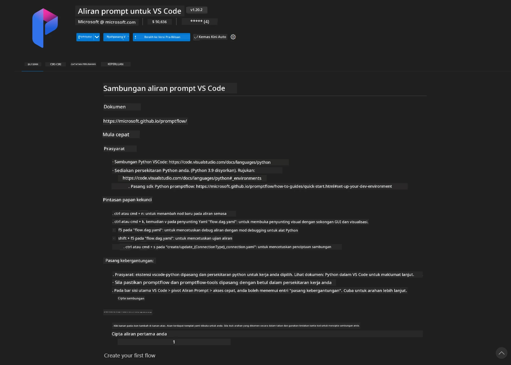
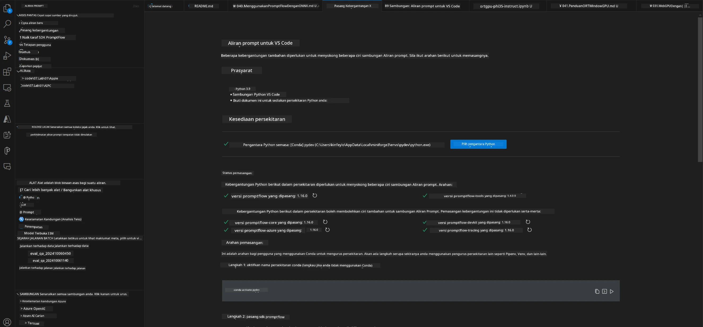
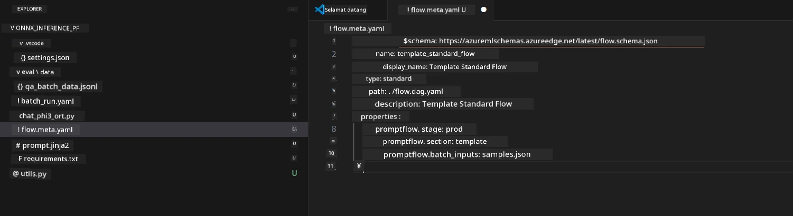
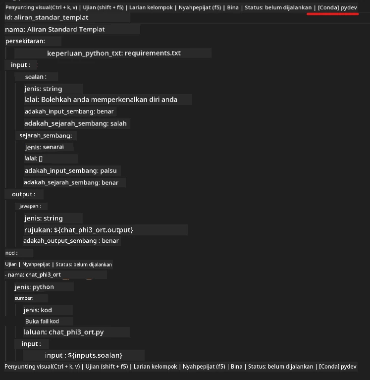
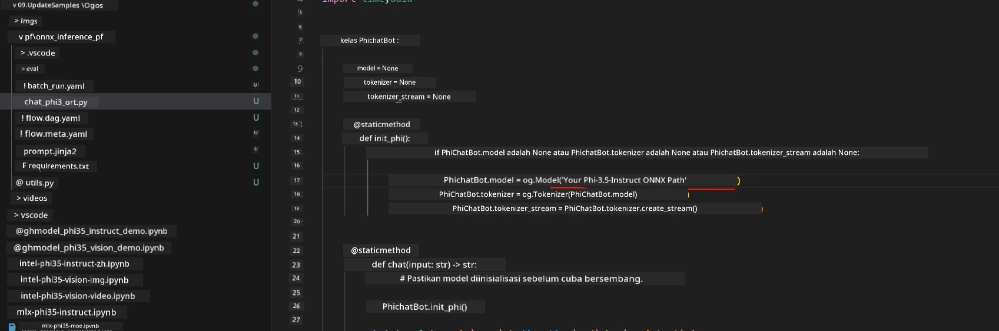
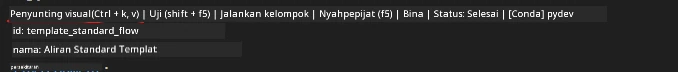
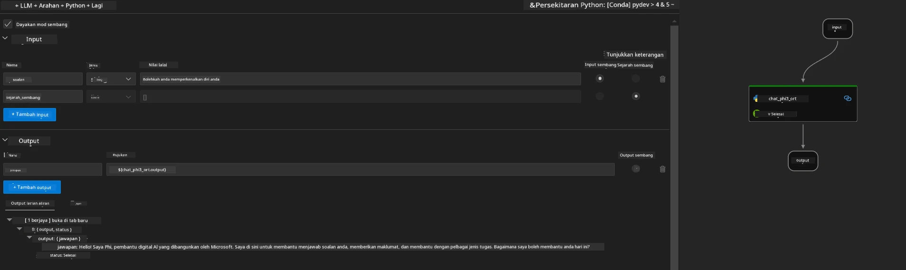
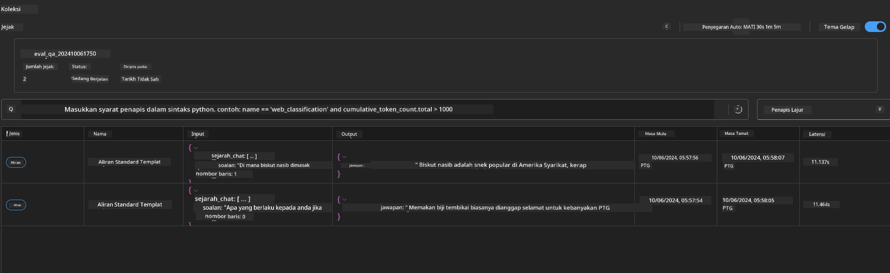

# Menggunakan Windows GPU untuk mencipta penyelesaian Prompt flow dengan Phi-3.5-Instruct ONNX

Dokumen berikut adalah contoh cara menggunakan PromptFlow dengan ONNX (Open Neural Network Exchange) untuk membangunkan aplikasi AI berdasarkan model Phi-3.

PromptFlow adalah satu set alat pembangunan yang direka untuk memudahkan kitaran pembangunan menyeluruh aplikasi AI berasaskan LLM (Large Language Model), dari idea dan prototaip hingga ujian dan penilaian.

Dengan menggabungkan PromptFlow dengan ONNX, pembangun boleh:

- Mengoptimumkan Prestasi Model: Memanfaatkan ONNX untuk inferens model dan penyebaran yang cekap.
- Memudahkan Pembangunan: Gunakan PromptFlow untuk mengurus aliran kerja dan mengautomasikan tugasan berulang.
- Meningkatkan Kerjasama: Memudahkan kerjasama yang lebih baik antara ahli pasukan dengan menyediakan persekitaran pembangunan yang bersatu.

**Prompt flow** adalah satu set alat pembangunan yang direka untuk memudahkan kitaran pembangunan menyeluruh aplikasi AI berasaskan LLM, dari idea, prototaip, ujian, penilaian hingga penyebaran dan pemantauan produksi. Ia memudahkan kejuruteraan prompt dan membolehkan anda membina aplikasi LLM dengan kualiti produksi.

Prompt flow boleh disambungkan ke OpenAI, Azure OpenAI Service, dan model yang boleh disesuaikan (Huggingface, LLM/SLM tempatan). Kami berharap dapat menyebarkan model ONNX kuantisasi Phi-3.5 ke aplikasi tempatan. Prompt flow boleh membantu kami merancang perniagaan dengan lebih baik dan melengkapkan penyelesaian tempatan berdasarkan Phi-3.5. Dalam contoh ini, kami akan menggabungkan ONNX Runtime GenAI Library untuk melengkapkan penyelesaian Prompt flow berdasarkan Windows GPU.

## **Pemasangan**

### **ONNX Runtime GenAI untuk Windows GPU**

Baca panduan ini untuk menetapkan ONNX Runtime GenAI untuk Windows GPU [klik di sini](./ORTWindowGPUGuideline.md)

### **Sediakan Prompt flow dalam VSCode**

1. Pasang Sambungan Prompt flow VS Code



2. Selepas memasang Sambungan Prompt flow VS Code, klik sambungan tersebut, dan pilih **Installation dependencies** ikut panduan ini untuk memasang Prompt flow SDK dalam persekitaran anda



3. Muat turun [Kod Contoh](../../../../../../code/09.UpdateSamples/Aug/pf/onnx_inference_pf) dan gunakan VS Code untuk membuka contoh ini



4. Buka **flow.dag.yaml** untuk memilih persekitaran Python anda



   Buka **chat_phi3_ort.py** untuk menukar lokasi Model Phi-3.5-instruct ONNX anda



5. Jalankan prompt flow anda untuk ujian

Buka **flow.dag.yaml** klik editor visual



selepas klik ini, dan jalankan untuk menguji



1. Anda boleh jalankan batch dalam terminal untuk memeriksa lebih banyak keputusan


```bash

pf run create --file batch_run.yaml --stream --name 'Your eval qa name'    

```

Anda boleh semak keputusan dalam pelayar lalai anda




**Penafian**:  
Dokumen ini telah diterjemahkan menggunakan perkhidmatan terjemahan AI [Co-op Translator](https://github.com/Azure/co-op-translator). Walaupun kami berusaha untuk ketepatan, sila ambil maklum bahawa terjemahan automatik mungkin mengandungi kesilapan atau ketidaktepatan. Dokumen asal dalam bahasa asalnya harus dianggap sebagai sumber yang sahih. Untuk maklumat penting, terjemahan profesional oleh manusia adalah disyorkan. Kami tidak bertanggungjawab atas sebarang salah faham atau salah tafsir yang timbul daripada penggunaan terjemahan ini.