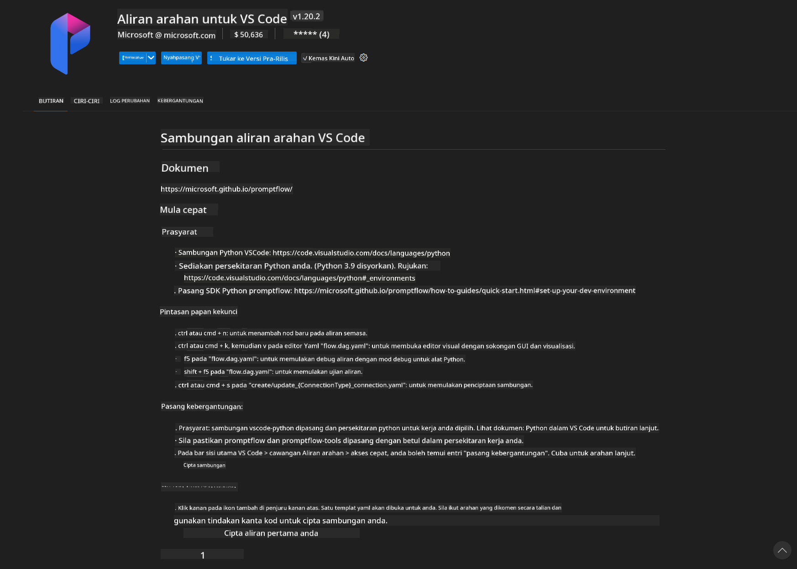
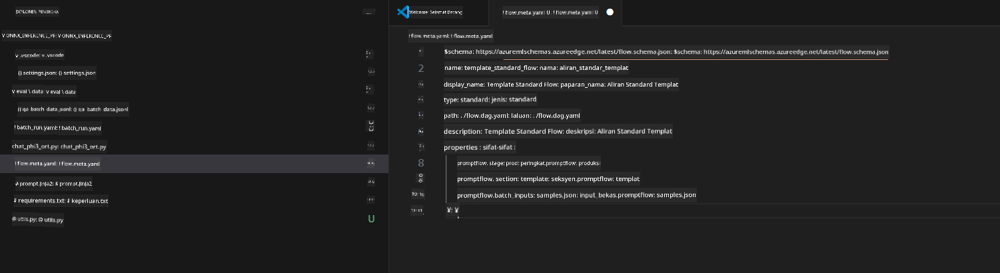
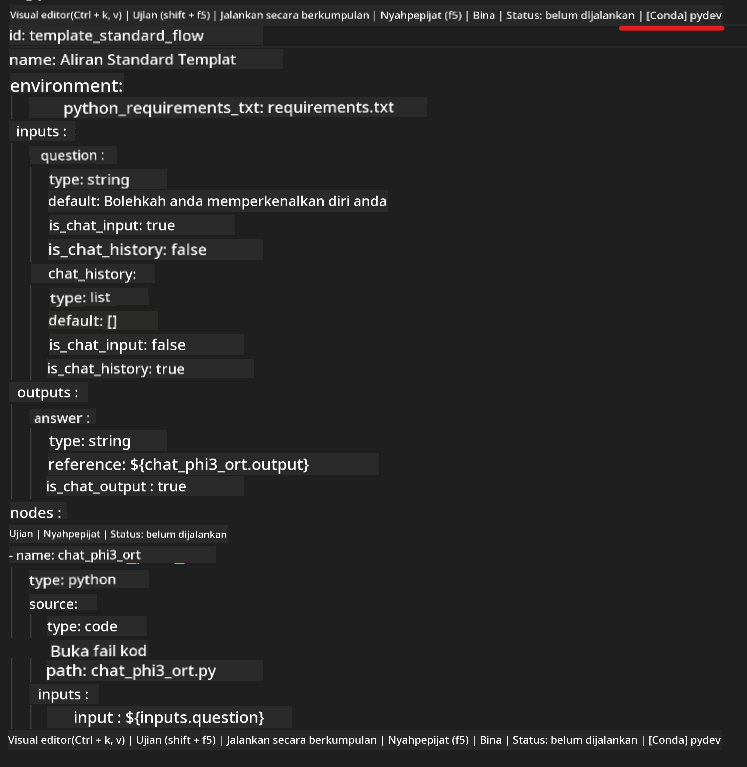
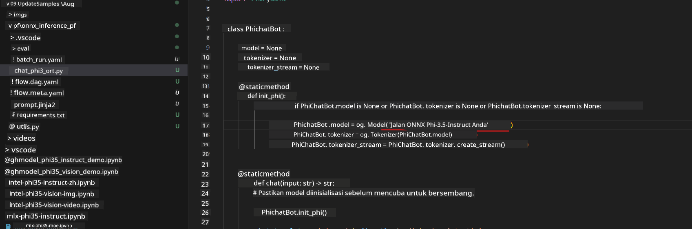
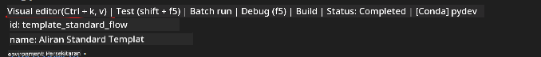
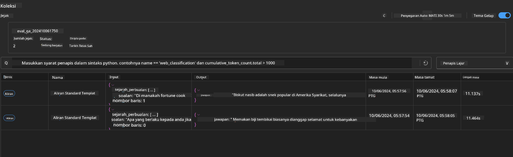

<!--
CO_OP_TRANSLATOR_METADATA:
{
  "original_hash": "92e7dac1e5af0dd7c94170fdaf6860fe",
  "translation_date": "2025-05-09T18:54:18+00:00",
  "source_file": "md/02.Application/01.TextAndChat/Phi3/UsingPromptFlowWithONNX.md",
  "language_code": "ms"
}
-->
# Using Windows GPU to create Prompt flow solution with Phi-3.5-Instruct ONNX 

The following document provides an example of how to use PromptFlow with ONNX (Open Neural Network Exchange) for building AI applications based on Phi-3 models.

PromptFlow is a set of development tools designed to simplify the entire development process of LLM-based (Large Language Model) AI applications, from idea generation and prototyping to testing and evaluation.

By combining PromptFlow with ONNX, developers can:

- Optimize Model Performance: Use ONNX for efficient model inference and deployment.
- Simplify Development: Utilize PromptFlow to manage workflows and automate repetitive tasks.
- Enhance Collaboration: Promote better teamwork by offering a unified development environment.

**Prompt flow** is a set of development tools aimed at streamlining the full development cycle of LLM-based AI applications, covering ideation, prototyping, testing, evaluation, production deployment, and monitoring. It simplifies prompt engineering and enables you to build LLM applications with production-level quality.

Prompt flow supports connections to OpenAI, Azure OpenAI Service, and customizable models (Huggingface, local LLM/SLM). We plan to deploy Phi-3.5's quantized ONNX model for local applications. Prompt flow can assist in better business planning and help complete local solutions based on Phi-3.5. In this example, we will integrate the ONNX Runtime GenAI Library to build the Prompt flow solution using Windows GPU.

## **Installation**

### **ONNX Runtime GenAI for Windows GPU**

Follow this guideline to set up ONNX Runtime GenAI for Windows GPU [click here](./ORTWindowGPUGuideline.md)

### **Set up Prompt flow in VSCode**

1. Install the Prompt flow VS Code Extension



2. After installing the Prompt flow VS Code Extension, click the extension and select **Installation dependencies**. Follow the instructions to install the Prompt flow SDK in your environment.


3. Download the [Sample Code](../../../../../../code/09.UpdateSamples/Aug/pf/onnx_inference_pf) and open it using VS Code.



4. Open **flow.dag.yaml** to select your Python environment.



   Open **chat_phi3_ort.py** to update the location of your Phi-3.5-instruct ONNX Model.



5. Run your prompt flow to test it.

Open **flow.dag.yaml** and click the visual editor.



After clicking this, run it to test.


1. You can also run batch commands in the terminal to check additional results.

```bash

pf run create --file batch_run.yaml --stream --name 'Your eval qa name'    

```

You can view the results in your default browser.



**Penafian**:  
Dokumen ini telah diterjemahkan menggunakan perkhidmatan terjemahan AI [Co-op Translator](https://github.com/Azure/co-op-translator). Walaupun kami berusaha untuk ketepatan, sila ambil perhatian bahawa terjemahan automatik mungkin mengandungi kesilapan atau ketidaktepatan. Dokumen asal dalam bahasa asalnya harus dianggap sebagai sumber yang sahih. Untuk maklumat penting, terjemahan manusia profesional adalah disyorkan. Kami tidak bertanggungjawab atas sebarang salah faham atau salah tafsir yang timbul daripada penggunaan terjemahan ini.