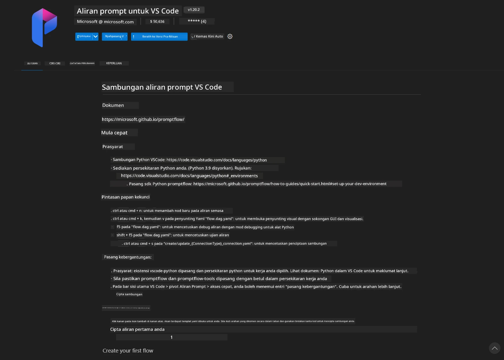
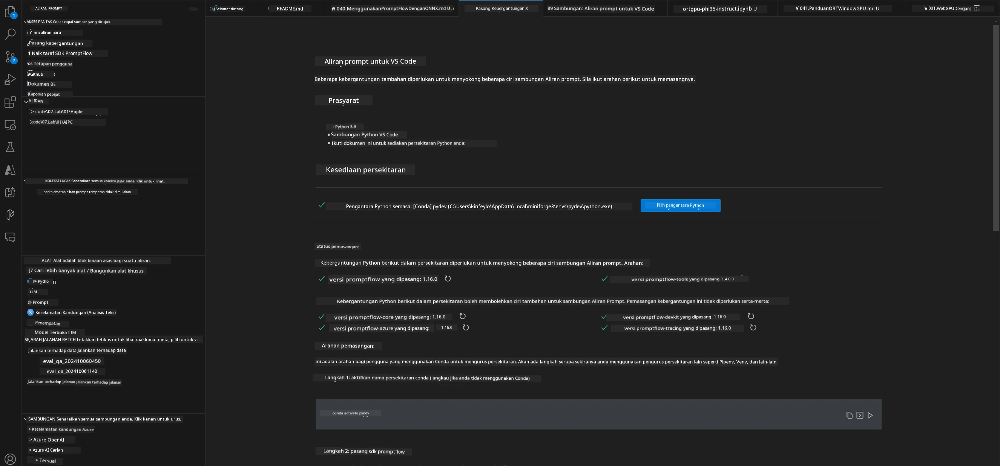
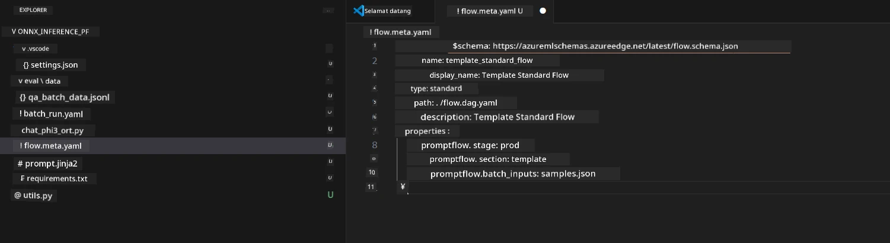
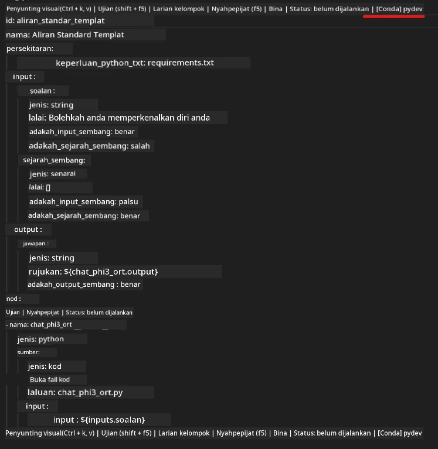
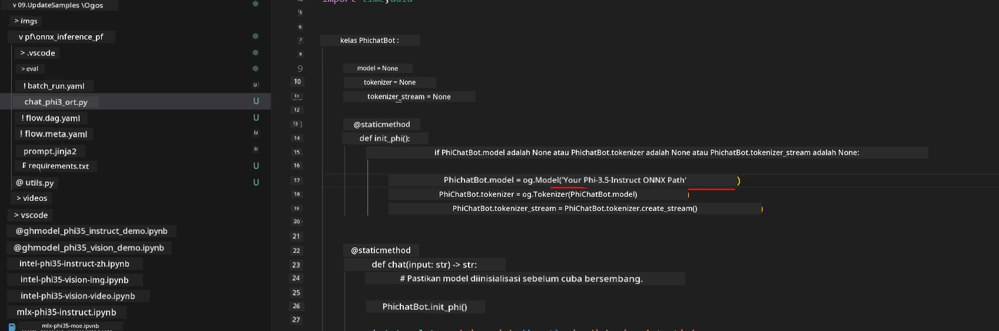
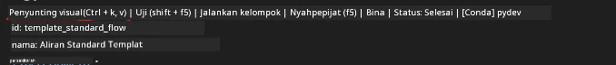
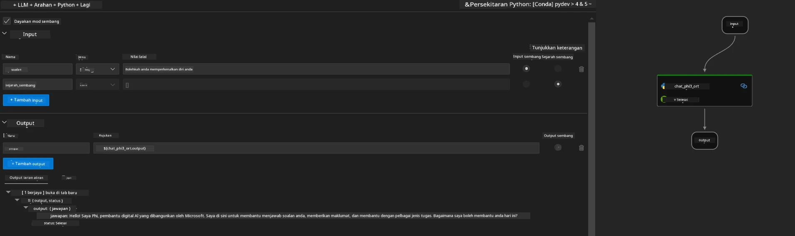
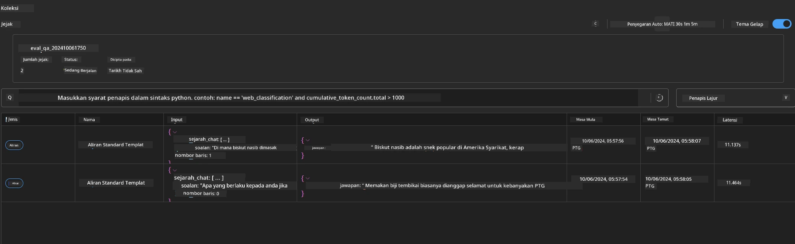

# Menggunakan GPU Windows untuk mencipta penyelesaian Prompt flow dengan Phi-3.5-Instruct ONNX 

Dokumen berikut adalah contoh cara menggunakan PromptFlow dengan ONNX (Open Neural Network Exchange) untuk membangunkan aplikasi AI berdasarkan model Phi-3.

PromptFlow adalah satu set alat pembangunan yang direka untuk memudahkan kitaran pembangunan menyeluruh aplikasi AI berasaskan LLM (Model Bahasa Besar), dari idea dan prototaip hingga ke ujian dan penilaian.

Dengan mengintegrasikan PromptFlow dengan ONNX, pembangun boleh:

- Mengoptimumkan Prestasi Model: Manfaatkan ONNX untuk inferens model yang cekap dan penyebaran.
- Memudahkan Pembangunan: Gunakan PromptFlow untuk mengurus aliran kerja dan mengautomasikan tugas berulang.
- Meningkatkan Kerjasama: Memudahkan kerjasama yang lebih baik antara ahli pasukan dengan menyediakan persekitaran pembangunan yang bersatu.

**Prompt flow** adalah satu set alat pembangunan yang direka untuk memudahkan kitaran pembangunan menyeluruh aplikasi AI berasaskan LLM, dari idea, prototaip, ujian, penilaian hingga penyebaran dan pemantauan produksi. Ia menjadikan kejuruteraan arahan lebih mudah dan membolehkan anda membina aplikasi LLM dengan kualiti produksi.

Prompt flow boleh menyambung ke OpenAI, Azure OpenAI Service, dan model yang boleh disesuaikan (Huggingface, LLM/SLM tempatan). Kami berharap untuk menyebarkan model ONNX Phi-3.5 yang telah dikuantisasi ke aplikasi tempatan. Prompt flow boleh membantu kami merancang perniagaan dengan lebih baik dan melengkapkan penyelesaian tempatan berdasarkan Phi-3.5. Dalam contoh ini, kami akan menggabungkan ONNX Runtime GenAI Library untuk melengkapkan penyelesaian Prompt flow berdasarkan GPU Windows.

## **Pemasangan**

### **ONNX Runtime GenAI untuk GPU Windows**

Baca panduan ini untuk menetapkan ONNX Runtime GenAI bagi GPU Windows  [klik di sini](./ORTWindowGPUGuideline.md)

### **Tetapkan Prompt flow dalam VSCode**

1. Pasang Sambungan Prompt flow VS Code



2. Selepas memasang Sambungan Prompt flow VS Code, klik sambungan tersebut, dan pilih **Installation dependencies** ikut panduan ini untuk memasang SDK Prompt flow dalam persekitaran anda



3. Muat turun [Kod Contoh](../../../../../../code/09.UpdateSamples/Aug/pf/onnx_inference_pf) dan gunakan VS Code untuk membuka contoh ini



4. Buka **flow.dag.yaml** untuk memilih persekitaran Python anda



   Buka **chat_phi3_ort.py** untuk menukar lokasi Model ONNX Phi-3.5-instruct anda



5. Jalankan prompt flow anda untuk ujian

Buka **flow.dag.yaml** klik editor visual



selepas klik ini, dan jalankan untuk menguji



1. Anda boleh jalankan batch dalam terminal untuk memeriksa lebih banyak hasil


```bash

pf run create --file batch_run.yaml --stream --name 'Your eval qa name'    

```

Anda boleh periksa hasil dalam pelayar lalai anda




---

<!-- CO-OP TRANSLATOR DISCLAIMER START -->
**Penafian**:
Dokumen ini telah diterjemahkan menggunakan perkhidmatan terjemahan AI [Co-op Translator](https://github.com/Azure/co-op-translator). Walaupun kami berusaha untuk ketepatan, sila ambil maklum bahawa terjemahan automatik mungkin mengandungi kesilapan atau ketidaktepatan. Dokumen asal dalam bahasa asalnya harus dianggap sebagai sumber yang sahih. Untuk maklumat penting, terjemahan oleh manusia profesional adalah disyorkan. Kami tidak bertanggungjawab terhadap sebarang salah faham atau salah tafsir yang timbul daripada penggunaan terjemahan ini.
<!-- CO-OP TRANSLATOR DISCLAIMER END -->