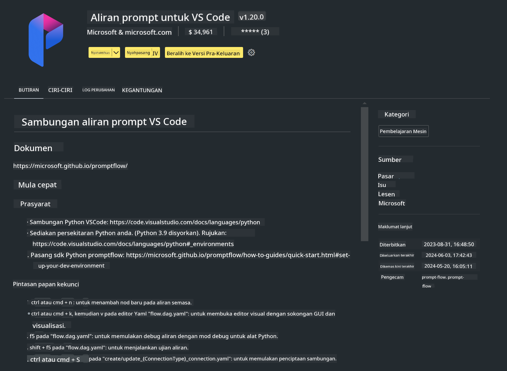

<!--
CO_OP_TRANSLATOR_METADATA:
{
  "original_hash": "a4ef39027902e82f2c33d568d2a2259a",
  "translation_date": "2025-05-09T19:20:41+00:00",
  "source_file": "md/02.Application/02.Code/Phi3/VSCodeExt/HOL/AIPC/01.Installations.md",
  "language_code": "ms"
}
-->
# **مختبر 0 - التثبيت**

عند دخولنا المختبر، نحتاج إلى إعداد البيئة المناسبة:


### **1. بايثون 3.11+**

يوصى باستخدام miniforge لإعداد بيئة بايثون الخاصة بك

لإعداد miniforge، يرجى الرجوع إلى [https://github.com/conda-forge/miniforge](https://github.com/conda-forge/miniforge)

بعد إعداد miniforge، قم بتشغيل الأمر التالي في Power Shell

```bash

conda create -n pyenv python==3.11.8 -y

conda activate pyenv

```


### **2. تثبيت Prompt flow SDK**

في المختبر 1، نستخدم Prompt flow، لذلك تحتاج إلى إعداد Prompt flow SDK.

```bash

pip install promptflow --upgrade

```

يمكنك التحقق من promptflow sdk باستخدام هذا الأمر


```bash

pf --version

```

### **3. تثبيت إضافة Visual Studio Code لـ Prompt flow**




### **4. مكتبة تسريع Intel NPU**

تدعم المعالجات الجديدة من إنتل NPU. إذا كنت تريد استخدام NPU لتشغيل LLMs / SLMs محليًا، يمكنك استخدام ***مكتبة تسريع Intel NPU***. إذا كنت تريد معرفة المزيد، يمكنك قراءة [https://github.com/microsoft/PhiCookBook/blob/main/md/01.Introduction/03/AIPC_Inference.md](https://github.com/microsoft/PhiCookBook/blob/main/md/01.Introduction/03/AIPC_Inference.md).

قم بتثبيت مكتبة تسريع Intel NPU في bash


```bash

pip install intel-npu-acceleration-library

```

***ملاحظة***: يرجى ملاحظة أن هذه المكتبة تدعم transformers ***4.40.2***، يرجى التأكد من الإصدار


### **5. مكتبات بايثون أخرى**


قم بإنشاء ملف requirements.txt وأضف هذا المحتوى

```txt

notebook
numpy 
scipy 
scikit-learn 
matplotlib 
pandas 
pillow 
graphviz

```


### **6. تثبيت NVM**

قم بتثبيت nvm في Powershell 


```bash

winget install -e --id CoreyButler.NVMforWindows

```

قم بتثبيت nodejs إصدار 18.20


```bash

nvm install 18.20.0

nvm use 18.20.0

```

### **7. تثبيت دعم تطوير Visual Studio Code**


```bash

npm install --global yo generator-code

```

تهانينا! لقد قمت بإعداد SDK بنجاح. بعد ذلك، تابع الخطوات العملية.

**Penafian**:  
Dokumen ini telah diterjemahkan menggunakan perkhidmatan terjemahan AI [Co-op Translator](https://github.com/Azure/co-op-translator). Walaupun kami berusaha untuk ketepatan, sila ambil perhatian bahawa terjemahan automatik mungkin mengandungi kesilapan atau ketidaktepatan. Dokumen asal dalam bahasa asalnya harus dianggap sebagai sumber yang sahih. Untuk maklumat penting, terjemahan profesional oleh manusia adalah disyorkan. Kami tidak bertanggungjawab atas sebarang salah faham atau salah tafsir yang timbul daripada penggunaan terjemahan ini.