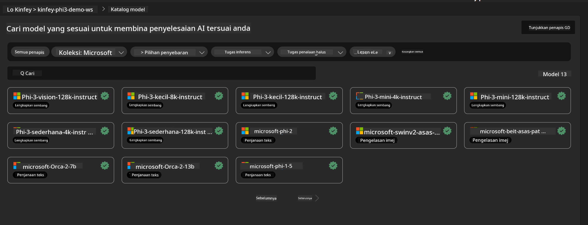
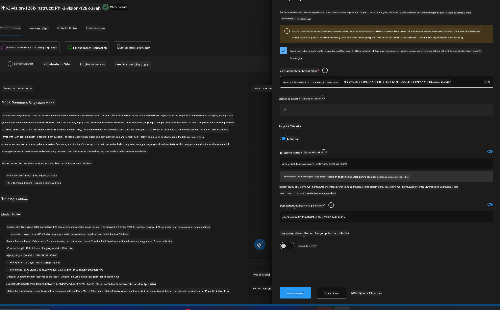
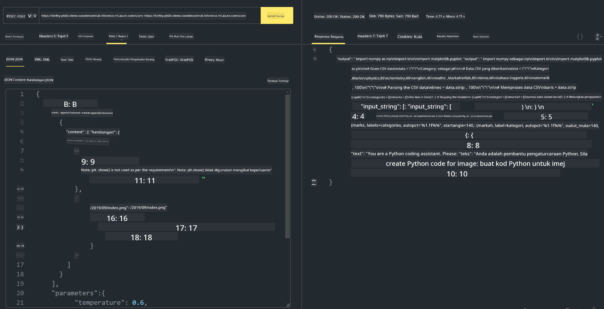

<!--
CO_OP_TRANSLATOR_METADATA:
{
  "original_hash": "20cb4e6ac1686248e8be913ccf6c2bc2",
  "translation_date": "2025-07-17T04:07:44+00:00",
  "source_file": "md/02.Application/02.Code/Phi3/VSCodeExt/HOL/AIPC/03.DeployPhi3VisionOnAzure.md",
  "language_code": "ms"
}
-->
# **Makmal 3 - Menggunakan Phi-3-vision pada Azure Machine Learning Service**

Kami menggunakan NPU untuk melengkapkan penyebaran kod tempatan ke peringkat produksi, dan kemudian kami ingin memperkenalkan keupayaan untuk menggunakan PHI-3-VISION melalui perkhidmatan ini bagi menghasilkan kod daripada gambar.

Dalam pengenalan ini, kita boleh dengan cepat membina Model As Service Phi-3 Vision dalam Azure Machine Learning Service.

***Note***： Phi-3 Vision memerlukan kuasa pengkomputeran untuk menjana kandungan dengan lebih pantas. Kita memerlukan kuasa pengkomputeran awan untuk membantu mencapai ini.


### **1. Cipta Azure Machine Learning Service**

Kita perlu mencipta Azure Machine Learning Service di Azure Portal. Jika anda ingin belajar cara melakukannya, sila lawati pautan ini [https://learn.microsoft.com/azure/machine-learning/quickstart-create-resources?view=azureml-api-2](https://learn.microsoft.com/azure/machine-learning/quickstart-create-resources?view=azureml-api-2)


### **2. Pilih Phi-3 Vision dalam Azure Machine Learning Service**




### **3. Sebarkan Phi-3-Vision di Azure**





### **4. Uji Endpoint dalam Postman**





***Note***

1. Parameter yang dihantar mesti termasuk Authorization, azureml-model-deployment, dan Content-Type. Anda perlu semak maklumat penyebaran untuk mendapatkannya.

2. Untuk menghantar parameter, Phi-3-Vision memerlukan pautan imej. Sila rujuk kaedah GPT-4-Vision untuk menghantar parameter, seperti

```json

{
  "input_data":{
    "input_string":[
      {
        "role":"user",
        "content":[ 
          {
            "type": "text",
            "text": "You are a Python coding assistant.Please create Python code for image "
          },
          {
              "type": "image_url",
              "image_url": {
                "url": "https://ajaytech.co/wp-content/uploads/2019/09/index.png"
              }
          }
        ]
      }
    ],
    "parameters":{
          "temperature": 0.6,
          "top_p": 0.9,
          "do_sample": false,
          "max_new_tokens": 2048
    }
  }
}

```

3. Panggil **/score** menggunakan kaedah Post

**Tahniah**！Anda telah berjaya melengkapkan penyebaran PHI-3-VISION dengan pantas dan mencuba cara menggunakan gambar untuk menjana kod. Seterusnya, kita boleh membina aplikasi dengan gabungan NPU dan awan.

**Penafian**:  
Dokumen ini telah diterjemahkan menggunakan perkhidmatan terjemahan AI [Co-op Translator](https://github.com/Azure/co-op-translator). Walaupun kami berusaha untuk ketepatan, sila ambil maklum bahawa terjemahan automatik mungkin mengandungi kesilapan atau ketidaktepatan. Dokumen asal dalam bahasa asalnya harus dianggap sebagai sumber yang sahih. Untuk maklumat penting, terjemahan profesional oleh manusia adalah disyorkan. Kami tidak bertanggungjawab atas sebarang salah faham atau salah tafsir yang timbul daripada penggunaan terjemahan ini.