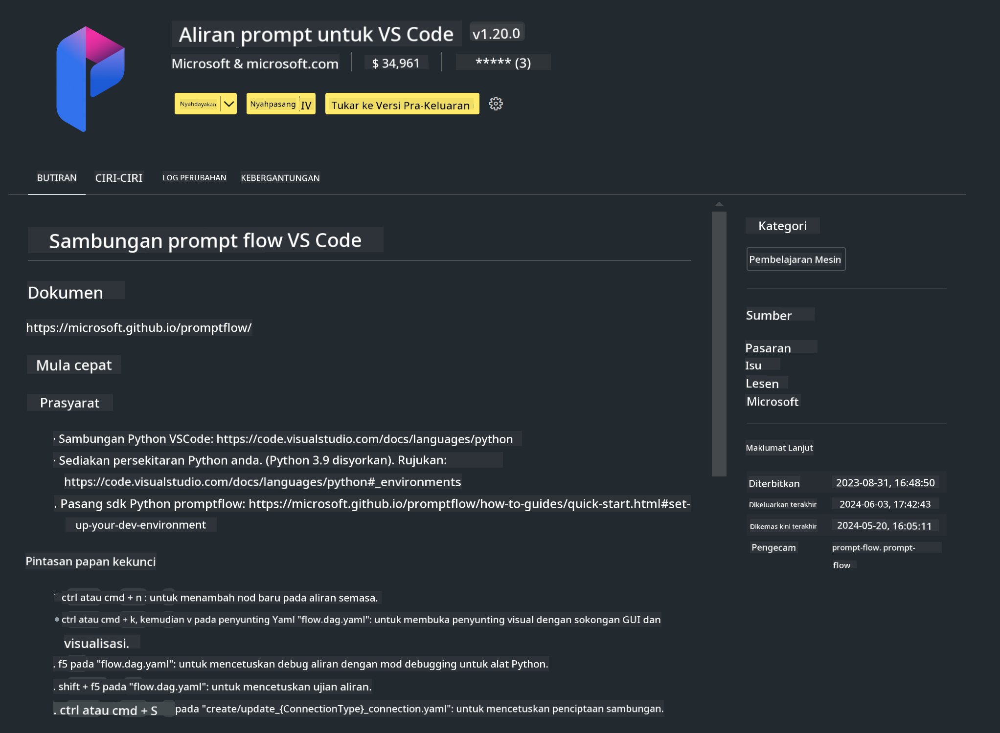

<!--
CO_OP_TRANSLATOR_METADATA:
{
  "original_hash": "4b16264917d9b93169745d92b8ce8c65",
  "translation_date": "2025-07-17T04:20:17+00:00",
  "source_file": "md/02.Application/02.Code/Phi3/VSCodeExt/HOL/Apple/01.Installations.md",
  "language_code": "ms"
}
-->
# **Makmal 0 - Pemasangan**

Apabila kita memasuki Makmal, kita perlu mengkonfigurasi persekitaran yang berkaitan :


### **1. Python 3.11+**

Disarankan untuk menggunakan miniforge bagi mengkonfigurasi persekitaran Python anda

Untuk mengkonfigurasi miniforge, sila rujuk [https://github.com/conda-forge/miniforge](https://github.com/conda-forge/miniforge)

Selepas mengkonfigurasi miniforge, jalankan arahan berikut dalam Power Shell

```bash

conda create -n pyenv python==3.11.8 -y

conda activate pyenv

```


### **2. Pasang Prompt flow SDK**

Dalam Makmal 1, kita menggunakan Prompt flow, jadi anda perlu mengkonfigurasi Prompt flow SDK.

```bash

pip install promptflow --upgrade

```

Anda boleh semak promptflow sdk dengan arahan ini


```bash

pf --version

```

### **3. Pasang Sambungan Prompt flow Visual Studio Code**



### **4. Rangka Kerja MLX Apple**

MLX adalah rangka kerja array untuk penyelidikan pembelajaran mesin pada Apple silicon, dibawa oleh penyelidikan pembelajaran mesin Apple. Anda boleh menggunakan **Rangka Kerja Apple MLX** untuk mempercepatkan LLM / SLM dengan Apple Silicon. Jika anda ingin tahu lebih lanjut, anda boleh baca [https://github.com/microsoft/PhiCookBook/blob/main/md/01.Introduction/03/MLX_Inference.md](https://github.com/microsoft/PhiCookBook/blob/main/md/01.Introduction/03/MLX_Inference.md).

Pasang Perpustakaan Rangka Kerja MLX dalam bash


```bash

pip install mlx-lm

```


### **5. Perpustakaan Python Lain**


cipta requirements.txt dan tambah kandungan ini

```txt

notebook
numpy 
scipy 
scikit-learn 
matplotlib 
pandas 
pillow 
graphviz

```


### **6. Pasang NVM**

pasang nvm dalam Powershell 


```bash

brew install nvm

```

pasang nodejs 18.20


```bash

nvm install 18.20.0

nvm use 18.20.0

```

### **7. Pasang Sokongan Pembangunan Visual Studio Code**


```bash

npm install --global yo generator-code

```

Tahniah! Anda telah berjaya mengkonfigurasi SDK. Seterusnya, teruskan ke langkah praktikal.

**Penafian**:  
Dokumen ini telah diterjemahkan menggunakan perkhidmatan terjemahan AI [Co-op Translator](https://github.com/Azure/co-op-translator). Walaupun kami berusaha untuk ketepatan, sila ambil maklum bahawa terjemahan automatik mungkin mengandungi kesilapan atau ketidaktepatan. Dokumen asal dalam bahasa asalnya harus dianggap sebagai sumber yang sahih. Untuk maklumat penting, terjemahan profesional oleh manusia adalah disyorkan. Kami tidak bertanggungjawab atas sebarang salah faham atau salah tafsir yang timbul daripada penggunaan terjemahan ini.