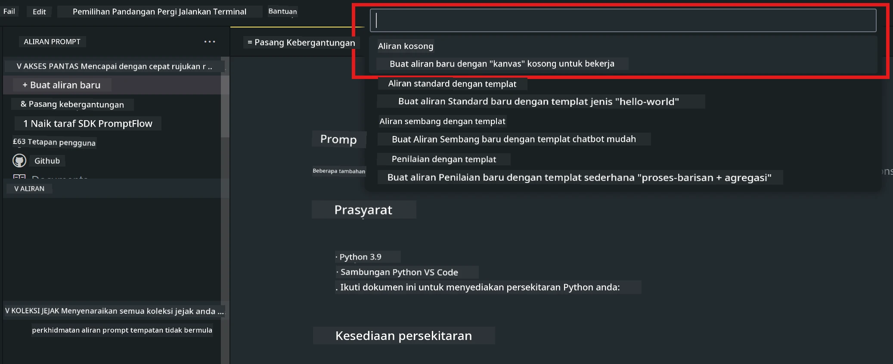
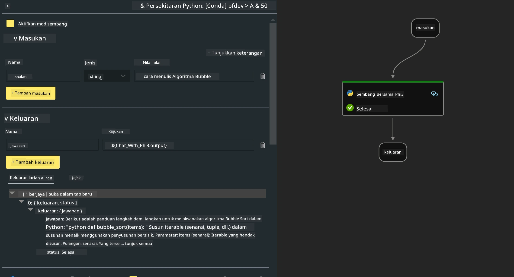

<!--
CO_OP_TRANSLATOR_METADATA:
{
  "original_hash": "3dbbf568625b1ee04b354c2dc81d3248",
  "translation_date": "2025-07-17T04:27:50+00:00",
  "source_file": "md/02.Application/02.Code/Phi3/VSCodeExt/HOL/Apple/02.PromptflowWithMLX.md",
  "language_code": "ms"
}
-->
# **Makmal 2 - Jalankan Prompt flow dengan Phi-3-mini dalam AIPC**

## **Apa itu Prompt flow**

Prompt flow adalah satu set alat pembangunan yang direka untuk memudahkan kitaran pembangunan aplikasi AI berasaskan LLM dari awal idea, prototaip, ujian, penilaian hingga pengeluaran dan pemantauan. Ia menjadikan kejuruteraan prompt lebih mudah dan membolehkan anda membina aplikasi LLM dengan kualiti pengeluaran.

Dengan prompt flow, anda boleh:

- Membina aliran yang menghubungkan LLM, prompt, kod Python dan alat lain dalam satu aliran kerja yang boleh dijalankan.

- Menyahpepijat dan mengulangi aliran anda, terutamanya interaksi dengan LLM dengan mudah.

- Menilai aliran anda, mengira metrik kualiti dan prestasi dengan set data yang lebih besar.

- Mengintegrasikan ujian dan penilaian ke dalam sistem CI/CD anda untuk memastikan kualiti aliran anda.

- Mengeluarkan aliran anda ke platform perkhidmatan pilihan atau mengintegrasikannya ke dalam kod aplikasi anda dengan mudah.

- (Pilihan tetapi sangat disyorkan) Bekerjasama dengan pasukan anda dengan menggunakan versi awan Prompt flow dalam Azure AI.

## **Membina aliran kod generasi pada Apple Silicon**

***Note*** ：Jika anda belum melengkapkan pemasangan persekitaran, sila lawati [Lab 0 -Installations](./01.Installations.md)

1. Buka Sambungan Prompt flow dalam Visual Studio Code dan cipta projek aliran kosong



2. Tambah parameter Input dan Output serta Tambah Kod Python sebagai aliran baru



Anda boleh rujuk struktur ini (flow.dag.yaml) untuk membina aliran anda

```yaml

inputs:
  prompt:
    type: string
    default: Write python code for Fibonacci serie. Please use markdown as output
outputs:
  result:
    type: string
    reference: ${gen_code_by_phi3.output}
nodes:
- name: gen_code_by_phi3
  type: python
  source:
    type: code
    path: gen_code_by_phi3.py
  inputs:
    prompt: ${inputs.prompt}


```

3. Kuantifikasi phi-3-mini

Kami berharap dapat menjalankan SLM dengan lebih baik pada peranti tempatan. Secara amnya, kami kuantifikasi model (INT4, FP16, FP32)

```bash

python -m mlx_lm.convert --hf-path microsoft/Phi-3-mini-4k-instruct

```

**Note:** folder lalai ialah mlx_model

4. Tambah Kod dalam ***Chat_With_Phi3.py***

```python


from promptflow import tool

from mlx_lm import load, generate


# The inputs section will change based on the arguments of the tool function, after you save the code
# Adding type to arguments and return value will help the system show the types properly
# Please update the function name/signature per need
@tool
def my_python_tool(prompt: str) -> str:

    model_id = './mlx_model_phi3_mini'

    model, tokenizer = load(model_id)

    # <|user|>\nWrite python code for Fibonacci serie. Please use markdown as output<|end|>\n<|assistant|>

    response = generate(model, tokenizer, prompt="<|user|>\n" + prompt  + "<|end|>\n<|assistant|>", max_tokens=2048, verbose=True)

    return response


```

4. Anda boleh menguji aliran dari Debug atau Run untuk memeriksa sama ada kod generasi berfungsi dengan baik atau tidak


5. Jalankan aliran sebagai API pembangunan dalam terminal

```

pf flow serve --source ./ --port 8080 --host localhost   

```

Anda boleh mengujinya dalam Postman / Thunder Client

### **Note**

1. Larian pertama mengambil masa yang lama. Disyorkan untuk memuat turun model phi-3 dari Hugging face CLI.

2. Memandangkan kuasa pengkomputeran Intel NPU yang terhad, disyorkan menggunakan Phi-3-mini-4k-instruct

3. Kami menggunakan Pecutan Intel NPU untuk kuantifikasi penukaran INT4, tetapi jika anda menjalankan semula perkhidmatan, anda perlu memadamkan folder cache dan nc_workshop.

## **Sumber**

1. Belajar Promptflow [https://microsoft.github.io/promptflow/](https://microsoft.github.io/promptflow/)

2. Belajar Pecutan Intel NPU [https://github.com/intel/intel-npu-acceleration-library](https://github.com/intel/intel-npu-acceleration-library)

3. Kod Contoh, muat turun [Local NPU Agent Sample Code](../../../../../../../../../code/07.Lab/01/AIPC/local-npu-agent)

**Penafian**:  
Dokumen ini telah diterjemahkan menggunakan perkhidmatan terjemahan AI [Co-op Translator](https://github.com/Azure/co-op-translator). Walaupun kami berusaha untuk ketepatan, sila ambil maklum bahawa terjemahan automatik mungkin mengandungi kesilapan atau ketidaktepatan. Dokumen asal dalam bahasa asalnya harus dianggap sebagai sumber yang sahih. Untuk maklumat penting, terjemahan profesional oleh manusia adalah disyorkan. Kami tidak bertanggungjawab atas sebarang salah faham atau salah tafsir yang timbul daripada penggunaan terjemahan ini.