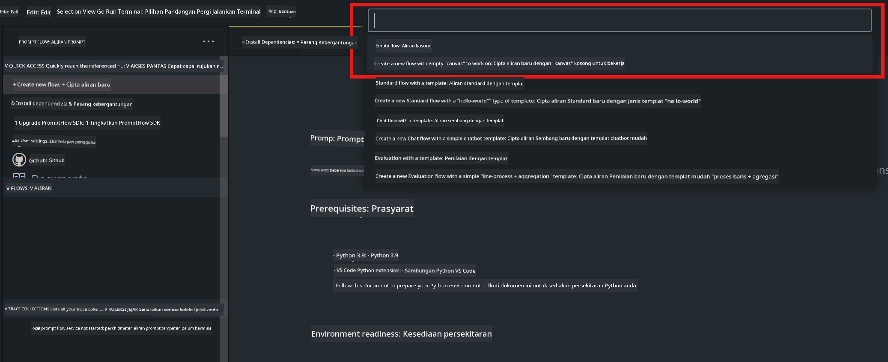
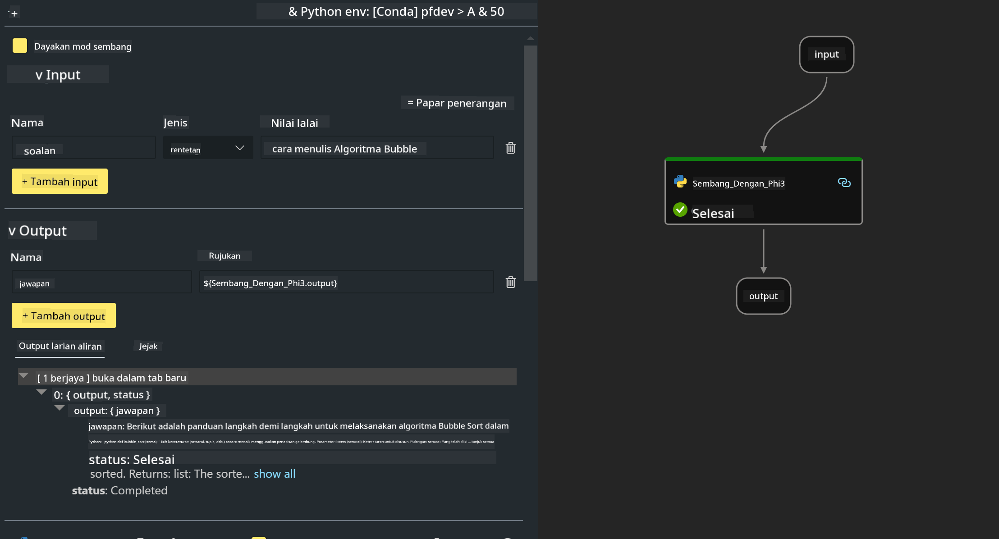
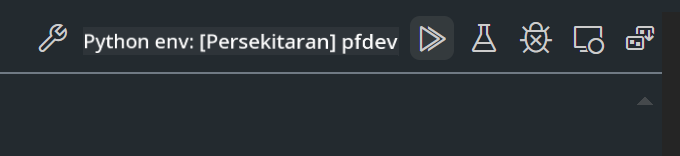

<!--
CO_OP_TRANSLATOR_METADATA:
{
  "original_hash": "3dbbf568625b1ee04b354c2dc81d3248",
  "translation_date": "2025-05-09T19:40:42+00:00",
  "source_file": "md/02.Application/02.Code/Phi3/VSCodeExt/HOL/Apple/02.PromptflowWithMLX.md",
  "language_code": "ms"
}
-->
# **Лабораторная работа 2 – Запуск Prompt flow с Phi-3-mini в AIPC**

## **Что такое Prompt flow**

Prompt flow — это набор инструментов для разработки, который упрощает полный цикл создания AI-приложений на базе LLM: от идеи, прототипирования, тестирования и оценки до развертывания в продакшен и мониторинга. Он значительно облегчает prompt engineering и помогает создавать приложения на LLM с качеством, готовым к производству.

С помощью Prompt flow вы сможете:

- Создавать цепочки, связывающие LLM, промпты, Python-код и другие инструменты в исполняемый рабочий процесс.

- Отлаживать и быстро итеративно улучшать ваши цепочки, особенно взаимодействие с LLM.

- Оценивать ваши цепочки, рассчитывать метрики качества и производительности на больших наборах данных.

- Интегрировать тестирование и оценку в вашу CI/CD систему для контроля качества.

- Развёртывать цепочки на выбранной платформе или легко интегрировать в код вашего приложения.

- (Опционально, но настоятельно рекомендуется) Работать в команде, используя облачную версию Prompt flow в Azure AI.

## **Создание генерационных кодовых цепочек на Apple Silicon**

***Note*** ：Если вы ещё не завершили установку окружения, пожалуйста, посетите [Lab 0 -Installations](./01.Installations.md)

1. Откройте расширение Prompt flow в Visual Studio Code и создайте пустой проект цепочки



2. Добавьте параметры Inputs и Outputs, а также добавьте Python-код как новую цепочку



Вы можете использовать эту структуру (flow.dag.yaml) для построения вашей цепочки

```yaml

inputs:
  prompt:
    type: string
    default: Write python code for Fibonacci serie. Please use markdown as output
outputs:
  result:
    type: string
    reference: ${gen_code_by_phi3.output}
nodes:
- name: gen_code_by_phi3
  type: python
  source:
    type: code
    path: gen_code_by_phi3.py
  inputs:
    prompt: ${inputs.prompt}


```

3. Квантификация phi-3-mini

Мы хотим лучше запускать SLM на локальных устройствах. Обычно мы квантифицируем модель (INT4, FP16, FP32)

```bash

python -m mlx_lm.convert --hf-path microsoft/Phi-3-mini-4k-instruct

```

**Note:** папка по умолчанию — mlx_model

4. Добавьте код в ***Chat_With_Phi3.py***

```python


from promptflow import tool

from mlx_lm import load, generate


# The inputs section will change based on the arguments of the tool function, after you save the code
# Adding type to arguments and return value will help the system show the types properly
# Please update the function name/signature per need
@tool
def my_python_tool(prompt: str) -> str:

    model_id = './mlx_model_phi3_mini'

    model, tokenizer = load(model_id)

    # <|user|>\nWrite python code for Fibonacci serie. Please use markdown as output<|end|>\n<|assistant|>

    response = generate(model, tokenizer, prompt="<|user|>\n" + prompt  + "<|end|>\n<|assistant|>", max_tokens=2048, verbose=True)

    return response


```

4. Вы можете протестировать цепочку через Debug или Run, чтобы проверить корректность генерации кода



5. Запустите цепочку как API для разработки в терминале

```

pf flow serve --source ./ --port 8080 --host localhost   

```

Вы можете протестировать её в Postman / Thunder Client

### **Note**

1. Первый запуск занимает много времени. Рекомендуется скачать модель phi-3 через Hugging face CLI.

2. Учитывая ограниченные вычислительные возможности Intel NPU, рекомендуется использовать Phi-3-mini-4k-instruct.

3. Мы используем ускорение Intel NPU для квантификации в INT4, но при повторном запуске сервиса необходимо удалить папки cache и nc_workshop.

## **Ресурсы**

1. Изучить Promptflow [https://microsoft.github.io/promptflow/](https://microsoft.github.io/promptflow/)

2. Изучить Intel NPU Acceleration [https://github.com/intel/intel-npu-acceleration-library](https://github.com/intel/intel-npu-acceleration-library)

3. Пример кода, скачать [Local NPU Agent Sample Code](../../../../../../../../../code/07.Lab/01/AIPC/local-npu-agent)

**Penafian**:  
Dokumen ini telah diterjemahkan menggunakan perkhidmatan terjemahan AI [Co-op Translator](https://github.com/Azure/co-op-translator). Walaupun kami berusaha untuk ketepatan, sila ambil perhatian bahawa terjemahan automatik mungkin mengandungi kesilapan atau ketidaktepatan. Dokumen asal dalam bahasa asalnya hendaklah dianggap sebagai sumber yang sahih. Untuk maklumat yang kritikal, terjemahan profesional oleh manusia adalah disyorkan. Kami tidak bertanggungjawab terhadap sebarang salah faham atau salah tafsir yang timbul daripada penggunaan terjemahan ini.