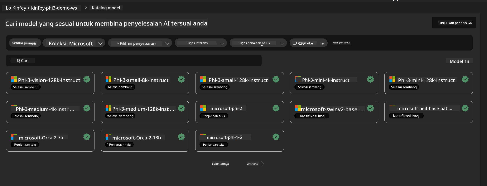
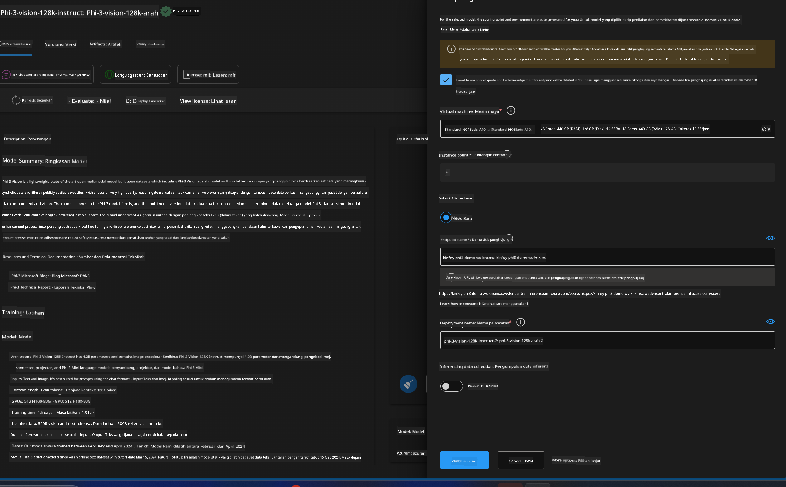
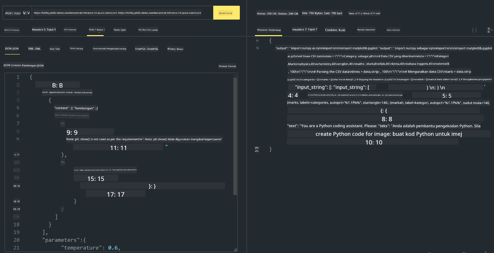

<!--
CO_OP_TRANSLATOR_METADATA:
{
  "original_hash": "20cb4e6ac1686248e8be913ccf6c2bc2",
  "translation_date": "2025-05-09T19:44:35+00:00",
  "source_file": "md/02.Application/02.Code/Phi3/VSCodeExt/HOL/Apple/03.DeployPhi3VisionOnAzure.md",
  "language_code": "ms"
}
-->
# **实验3 - 在Azure机器学习服务上部署Phi-3-vision**

我们使用NPU完成本地代码的生产部署，然后希望通过它引入PHI-3-VISION的能力，实现从图片生成代码。

在本介绍中，我们可以快速构建一个基于Azure机器学习服务的Model As Service Phi-3 Vision服务。

***Note***：Phi-3 Vision需要较强的计算能力以更快地生成内容，我们需要借助云计算能力来实现这一点。


### **1. 创建Azure机器学习服务**

我们需要在Azure门户中创建一个Azure机器学习服务。如果你想了解具体步骤，请访问此链接 [https://learn.microsoft.com/azure/machine-learning/quickstart-create-resources?view=azureml-api-2](https://learn.microsoft.com/azure/machine-learning/quickstart-create-resources?view=azureml-api-2)


### **2. 在Azure机器学习服务中选择Phi-3 Vision**




### **3. 在Azure中部署Phi-3-Vision**





### **4. 在Postman中测试端点**





***Note***

1. 传输的参数必须包含Authorization、azureml-model-deployment和Content-Type。你需要查看部署信息以获取这些参数。

2. 传输参数时，Phi-3-Vision需要传入图片链接。请参考GPT-4-Vision的方法传递参数，例如

```json

{
  "input_data":{
    "input_string":[
      {
        "role":"user",
        "content":[ 
          {
            "type": "text",
            "text": "You are a Python coding assistant.Please create Python code for image "
          },
          {
              "type": "image_url",
              "image_url": {
                "url": "https://ajaytech.co/wp-content/uploads/2019/09/index.png"
              }
          }
        ]
      }
    ],
    "parameters":{
          "temperature": 0.6,
          "top_p": 0.9,
          "do_sample": false,
          "max_new_tokens": 2048
    }
  }
}

```

3. 使用Post方法调用**/score**

**恭喜**！你已完成PHI-3-VISION的快速部署，并尝试了如何通过图片生成代码。接下来，我们可以结合NPU和云构建应用。

**Penafian**:  
Dokumen ini telah diterjemahkan menggunakan perkhidmatan terjemahan AI [Co-op Translator](https://github.com/Azure/co-op-translator). Walaupun kami berusaha untuk ketepatan, sila ambil perhatian bahawa terjemahan automatik mungkin mengandungi kesilapan atau ketidaktepatan. Dokumen asal dalam bahasa asalnya harus dianggap sebagai sumber yang sahih. Untuk maklumat penting, terjemahan profesional oleh manusia adalah disyorkan. Kami tidak bertanggungjawab atas sebarang salah faham atau salah tafsir yang timbul daripada penggunaan terjemahan ini.