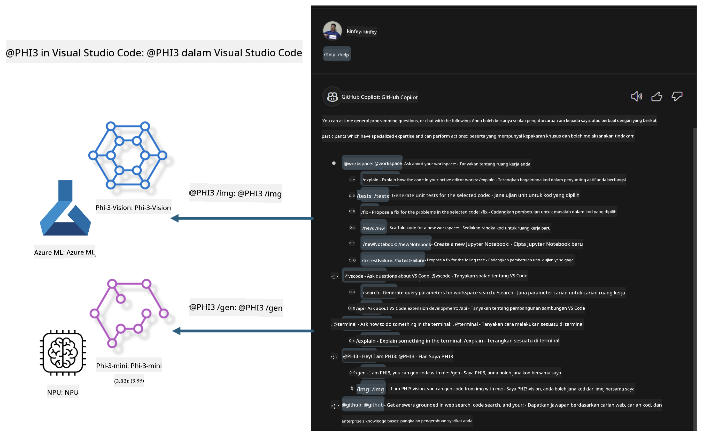

<!--
CO_OP_TRANSLATOR_METADATA:
{
  "original_hash": "00b7a699de8ac405fa821f4c0f7fc0ab",
  "translation_date": "2025-05-09T19:15:45+00:00",
  "source_file": "md/02.Application/02.Code/Phi3/VSCodeExt/README.md",
  "language_code": "ms"
}
-->
# **قم ببناء مساعد GitHub Copilot Chat الخاص بك في Visual Studio Code باستخدام عائلة Microsoft Phi-3**

هل استخدمت وكيل مساحة العمل في GitHub Copilot Chat؟ هل ترغب في بناء وكيل كود خاص بفريقك؟ تهدف هذه الورشة العملية إلى دمج النموذج مفتوح المصدر لبناء وكيل أعمال كود على مستوى المؤسسات.

## **الأساسيات**

### **لماذا تختار Microsoft Phi-3**

Phi-3 هي سلسلة عائلية تشمل phi-3-mini و phi-3-small و phi-3-medium، تعتمد على معلمات تدريب مختلفة لتوليد النصوص، إكمال الحوارات، وتوليد الأكواد. هناك أيضًا phi-3-vision المبني على الرؤية. هذا مناسب للمؤسسات أو الفرق المختلفة لإنشاء حلول ذكاء اصطناعي توليدي تعمل بدون اتصال بالإنترنت.

يوصى بقراءة هذا الرابط [https://github.com/microsoft/PhiCookBook/blob/main/md/01.Introduction/01/01.PhiFamily.md](https://github.com/microsoft/PhiCookBook/blob/main/md/01.Introduction/01/01.PhiFamily.md)

### **Microsoft GitHub Copilot Chat**

امتداد GitHub Copilot Chat يوفر لك واجهة دردشة تتيح لك التفاعل مع GitHub Copilot والحصول على إجابات لأسئلة متعلقة بالبرمجة مباشرة داخل VS Code، دون الحاجة للبحث في الوثائق أو المنتديات عبر الإنترنت.

قد يستخدم Copilot Chat تمييز بناء الجملة، التراجع، وميزات تنسيق أخرى لإضافة وضوح للرد المولد. بناءً على نوع السؤال من المستخدم، قد يحتوي الرد على روابط للسياق الذي استخدمه Copilot في توليد الرد، مثل ملفات الكود المصدر أو الوثائق، أو أزرار للوصول إلى وظائف VS Code.

- يندمج Copilot Chat في سير عمل المطور ويوفر لك المساعدة حيث تحتاجها:

- ابدأ محادثة دردشة داخلية مباشرة من المحرر أو الطرفية للحصول على مساعدة أثناء البرمجة

- استخدم عرض الدردشة لتكون لديك مساعد ذكي بجانبك لمساعدتك في أي وقت

- شغّل Quick Chat لطرح سؤال سريع والعودة إلى عملك

يمكنك استخدام GitHub Copilot Chat في سيناريوهات مختلفة، مثل:

- الإجابة على أسئلة برمجية حول أفضل طريقة لحل مشكلة

- شرح كود شخص آخر واقتراح تحسينات

- اقتراح إصلاحات للكود

- توليد حالات اختبار وحدة

- توليد توثيق للكود

يوصى بقراءة هذا الرابط [https://code.visualstudio.com/docs/copilot/copilot-chat](https://code.visualstudio.com/docs/copilot/copilot-chat?WT.mc_id=aiml-137032-kinfeylo)

###  **Microsoft GitHub Copilot Chat @workspace**

الإشارة إلى **@workspace** في Copilot Chat تتيح لك طرح أسئلة حول كامل قاعدة كودك. بناءً على السؤال، يقوم Copilot باسترجاع الملفات والرموز ذات الصلة بذكاء، والتي يذكرها في إجابته كرابط وأمثلة على الكود.

للإجابة على سؤالك، يبحث **@workspace** في نفس المصادر التي يستخدمها المطور عند التنقل في قاعدة الكود في VS Code:

- جميع الملفات في مساحة العمل، باستثناء الملفات التي تم تجاهلها بواسطة ملف .gitignore

- هيكل الدليل مع المجلدات والملفات المتداخلة

- فهرس بحث الكود الخاص بـ GitHub، إذا كانت مساحة العمل مستودع GitHub ومفهرسة بواسطة بحث الكود

- الرموز والتعريفات في مساحة العمل

- النص المحدد حاليًا أو النص المرئي في المحرر النشط

ملاحظة: يتم تجاوز .gitignore إذا كان لديك ملف مفتوح أو نص محدد داخل ملف تم تجاهله.

يوصى بقراءة هذا الرابط [[https://code.visualstudio.com/docs/copilot/copilot-chat](https://code.visualstudio.com/docs/copilot/workspace-context?WT.mc_id=aiml-137032-kinfeylo)]

## **المزيد عن هذه الورشة**

لقد حسّن GitHub Copilot بشكل كبير من كفاءة البرمجة في المؤسسات، وكل مؤسسة تأمل في تخصيص الوظائف ذات الصلة بـ GitHub Copilot. العديد من المؤسسات قامت بتخصيص امتدادات مشابهة لـ GitHub Copilot بناءً على سيناريوهات أعمالها الخاصة والنماذج مفتوحة المصدر. بالنسبة للمؤسسات، فإن الامتدادات المخصصة أسهل في التحكم، لكن هذا يؤثر على تجربة المستخدم. بعد كل شيء، يمتلك GitHub Copilot وظائف أقوى في التعامل مع السيناريوهات العامة والاحترافية. إذا أمكن الحفاظ على تجربة متسقة، فسيكون من الأفضل تخصيص امتداد المؤسسة الخاص. يوفر GitHub Copilot Chat واجهات برمجة تطبيقات مناسبة للمؤسسات للتوسع في تجربة الدردشة. الحفاظ على تجربة متسقة ووجود وظائف مخصصة يوفر تجربة مستخدم أفضل.

تعتمد هذه الورشة بشكل رئيسي على نموذج Phi-3 مع الجمع بين NPU المحلي و Azure الهجين لبناء وكيل مخصص في GitHub Copilot Chat ***@PHI3*** لمساعدة مطوري المؤسسات في إكمال توليد الكود***(@PHI3 /gen)*** وتوليد الكود بناءً على الصور ***(@PHI3 /img)***.

### ***ملاحظة:*** 

يتم تنفيذ هذه الورشة حاليًا في AIPC لمعالجات Intel و Apple Silicon. سنستمر في تحديث نسخة NPU الخاصة بـ Qualcomm.

## **الورشة**

| الاسم | الوصف | AIPC | Apple |
| ------------ | ----------- | -------- |-------- |
| Lab0 - Installations(✅) | إعداد وتثبيت البيئات والأدوات ذات الصلة | [Go](./HOL/AIPC/01.Installations.md) |[Go](./HOL/Apple/01.Installations.md) |
| Lab1 - Run Prompt flow with Phi-3-mini (✅) | بالاشتراك مع AIPC / Apple Silicon، استخدام NPU المحلي لإنشاء توليد الكود عبر Phi-3-mini | [Go](./HOL/AIPC/02.PromptflowWithNPU.md) |  [Go](./HOL/Apple/02.PromptflowWithMLX.md) |
| Lab2 - Deploy Phi-3-vision on Azure Machine Learning Service(✅) | توليد الكود من خلال نشر نموذج كتالوج Azure Machine Learning Service - صورة Phi-3-vision | [Go](./HOL/AIPC/03.DeployPhi3VisionOnAzure.md) |[Go](./HOL/Apple/03.DeployPhi3VisionOnAzure.md) |
| Lab3 - Create a @phi-3 agent in GitHub Copilot Chat(✅)  | إنشاء وكيل Phi-3 مخصص في GitHub Copilot Chat لإكمال توليد الكود، كود توليد الرسوم البيانية، RAG، وغيرها | [Go](./HOL/AIPC/04.CreatePhi3AgentInVSCode.md) | [Go](./HOL/Apple/04.CreatePhi3AgentInVSCode.md) |
| Sample Code (✅)  | تحميل كود العينة | [Go](../../../../../../../code/07.Lab/01/AIPC) | [Go](../../../../../../../code/07.Lab/01/Apple) |

## **الموارد**

1. Phi-3 Cookbook [https://github.com/microsoft/Phi-3CookBook](https://github.com/microsoft/Phi-3CookBook)

2. تعرف أكثر على GitHub Copilot [https://learn.microsoft.com/training/paths/copilot/](https://learn.microsoft.com/training/paths/copilot/?WT.mc_id=aiml-137032-kinfeylo)

3. تعرف أكثر على GitHub Copilot Chat [https://learn.microsoft.com/training/paths/accelerate-app-development-using-github-copilot/](https://learn.microsoft.com/training/paths/accelerate-app-development-using-github-copilot/?WT.mc_id=aiml-137032-kinfeylo)

4. تعرف أكثر على GitHub Copilot Chat API [https://code.visualstudio.com/api/extension-guides/chat](https://code.visualstudio.com/api/extension-guides/chat?WT.mc_id=aiml-137032-kinfeylo)

5. تعرف أكثر على Azure AI Foundry [https://learn.microsoft.com/training/paths/create-custom-copilots-ai-studio/](https://learn.microsoft.com/training/paths/create-custom-copilots-ai-studio/?WT.mc_id=aiml-137032-kinfeylo)

6. تعرف أكثر على كتالوج النماذج في Azure AI Foundry [https://learn.microsoft.com/azure/ai-studio/how-to/model-catalog-overview](https://learn.microsoft.com/azure/ai-studio/how-to/model-catalog-overview)

**Penafian**:  
Dokumen ini telah diterjemahkan menggunakan perkhidmatan terjemahan AI [Co-op Translator](https://github.com/Azure/co-op-translator). Walaupun kami berusaha untuk ketepatan, sila ambil perhatian bahawa terjemahan automatik mungkin mengandungi kesilapan atau ketidaktepatan. Dokumen asal dalam bahasa asalnya harus dianggap sebagai sumber yang sahih. Untuk maklumat penting, terjemahan manusia profesional adalah disyorkan. Kami tidak bertanggungjawab atas sebarang salah faham atau salah tafsir yang timbul daripada penggunaan terjemahan ini.