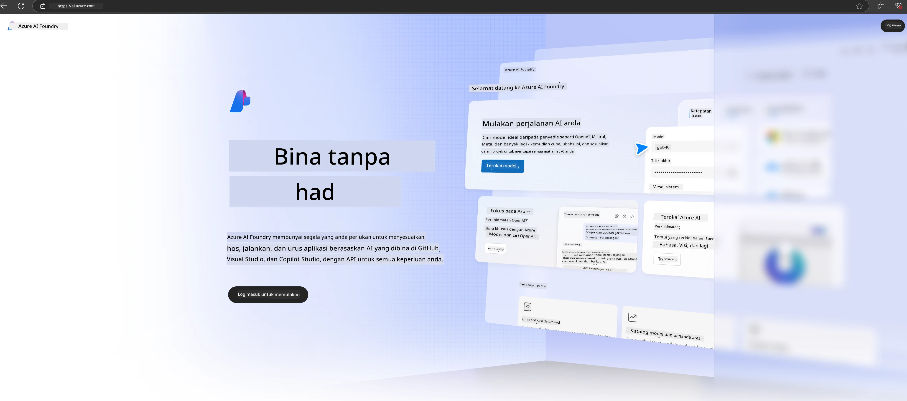

# **Menggunakan Phi-3 dalam Azure AI Foundry**

Dengan perkembangan Generative AI, kami berharap dapat menggunakan platform sehenti untuk menguruskan pelbagai LLM dan SLM, integrasi data perusahaan, operasi fine-tuning/RAG, serta penilaian pelbagai perniagaan perusahaan selepas menggabungkan LLM dan SLM, dan sebagainya, supaya aplikasi generatif AI dapat dilaksanakan dengan lebih bijak. [Azure AI Foundry](https://ai.azure.com) adalah platform aplikasi generatif AI peringkat perusahaan.

Dengan Azure AI Foundry, anda boleh menilai respons model bahasa besar (LLM) dan mengatur komponen aplikasi prompt menggunakan prompt flow untuk prestasi yang lebih baik. Platform ini memudahkan skala untuk mengubah bukti konsep menjadi pengeluaran sepenuhnya dengan mudah. Pemantauan dan penambahbaikan berterusan menyokong kejayaan jangka panjang.

Kita boleh dengan cepat melancarkan model Phi-3 di Azure AI Foundry melalui langkah mudah, dan kemudian menggunakan Azure AI Foundry untuk melengkapkan kerja berkaitan Playground/Chat, Fine-tuning, penilaian dan lain-lain berkaitan Phi-3.

## **1. Persediaan**

Jika anda sudah memasang [Azure Developer CLI](https://learn.microsoft.com/azure/developer/azure-developer-cli/overview?WT.mc_id=aiml-138114-kinfeylo) pada mesin anda, menggunakan templat ini semudah menjalankan arahan ini dalam direktori baru.

## Penciptaan Manual

Mencipta projek dan hub Microsoft Azure AI Foundry adalah cara yang baik untuk mengatur dan mengurus kerja AI anda. Berikut adalah panduan langkah demi langkah untuk memulakan:

### Mencipta Projek dalam Azure AI Foundry

1. **Pergi ke Azure AI Foundry**: Log masuk ke portal Azure AI Foundry.
2. **Cipta Projek**:
   - Jika anda berada dalam projek, pilih "Azure AI Foundry" di bahagian atas kiri halaman untuk kembali ke halaman Utama.
   - Pilih "+ Create project".
   - Masukkan nama untuk projek tersebut.
   - Jika anda mempunyai hub, ia akan dipilih secara lalai. Jika anda mempunyai akses ke lebih daripada satu hub, anda boleh memilih yang lain dari dropdown. Jika anda ingin mencipta hub baru, pilih "Create new hub" dan berikan nama.
   - Pilih "Create".

### Mencipta Hub dalam Azure AI Foundry

1. **Pergi ke Azure AI Foundry**: Log masuk dengan akaun Azure anda.
2. **Cipta Hub**:
   - Pilih Pusat Pengurusan dari menu kiri.
   - Pilih "All resources", kemudian anak panah ke bawah di sebelah "+ New project" dan pilih "+ New hub".
   - Dalam dialog "Create a new hub", masukkan nama untuk hub anda (contoh: contoso-hub) dan ubah medan lain mengikut kehendak.
   - Pilih "Next", semak maklumat, kemudian pilih "Create".

Untuk arahan lebih terperinci, anda boleh rujuk dokumentasi rasmi [Microsoft](https://learn.microsoft.com/azure/ai-studio/how-to/create-projects).

Selepas penciptaan berjaya, anda boleh mengakses studio yang anda cipta melalui [ai.azure.com](https://ai.azure.com/)

Boleh ada pelbagai projek dalam satu AI Foundry. Cipta projek dalam AI Foundry sebagai persediaan.

Cipta Azure AI Foundry [QuickStarts](https://learn.microsoft.com/azure/ai-studio/quickstarts/get-started-code)

## **2. Melancarkan model Phi dalam Azure AI Foundry**

Klik pilihan Explore pada projek untuk masuk ke Model Catalog dan pilih Phi-3

Pilih Phi-3-mini-4k-instruct

Klik 'Deploy' untuk melancarkan model Phi-3-mini-4k-instruct

> [!NOTE]
>
> Anda boleh memilih kuasa pengkomputeran semasa melancarkan

## **3. Playground Chat Phi dalam Azure AI Foundry**

Pergi ke halaman pelancaran, pilih Playground, dan berbual dengan Phi-3 dari Azure AI Foundry

## **4. Melancarkan Model dari Azure AI Foundry**

Untuk melancarkan model dari Azure Model Catalog, anda boleh ikut langkah berikut:

- Log masuk ke Azure AI Foundry.
- Pilih model yang anda ingin lancarkan dari katalog model Azure AI Foundry.
- Pada halaman Butiran model, pilih Deploy dan kemudian pilih Serverless API dengan Azure AI Content Safety.
- Pilih projek di mana anda ingin melancarkan model anda. Untuk menggunakan tawaran Serverless API, ruang kerja anda mesti berada di rantau East US 2 atau Sweden Central. Anda boleh sesuaikan nama Deployment.
- Pada wizard pelancaran, pilih Pricing and terms untuk mengetahui harga dan terma penggunaan.
- Pilih Deploy. Tunggu sehingga pelancaran siap dan anda dialihkan ke halaman Deployments.
- Pilih Open in playground untuk mula berinteraksi dengan model.
- Anda boleh kembali ke halaman Deployments, pilih pelancaran, dan catat URL Sasaran endpoint dan Secret Key, yang boleh anda gunakan untuk memanggil pelancaran dan menjana hasil.
- Anda sentiasa boleh mendapatkan butiran endpoint, URL, dan kunci akses dengan pergi ke tab Build dan memilih Deployments dari bahagian Components.

> [!NOTE]
> Sila ambil perhatian bahawa akaun anda mesti mempunyai kebenaran peranan Azure AI Developer pada Resource Group untuk melaksanakan langkah ini.

## **5. Menggunakan Phi API dalam Azure AI Foundry**

Anda boleh akses https://{Nama projek anda}.region.inference.ml.azure.com/swagger.json melalui Postman GET dan gabungkan dengan Key untuk mengetahui antara muka yang disediakan

Anda boleh mendapatkan parameter permintaan dengan sangat mudah, serta parameter respons.

**Penafian**:  
Dokumen ini telah diterjemahkan menggunakan perkhidmatan terjemahan AI [Co-op Translator](https://github.com/Azure/co-op-translator). Walaupun kami berusaha untuk ketepatan, sila ambil maklum bahawa terjemahan automatik mungkin mengandungi kesilapan atau ketidaktepatan. Dokumen asal dalam bahasa asalnya harus dianggap sebagai sumber yang sahih. Untuk maklumat penting, terjemahan profesional oleh manusia adalah disyorkan. Kami tidak bertanggungjawab atas sebarang salah faham atau salah tafsir yang timbul daripada penggunaan terjemahan ini.