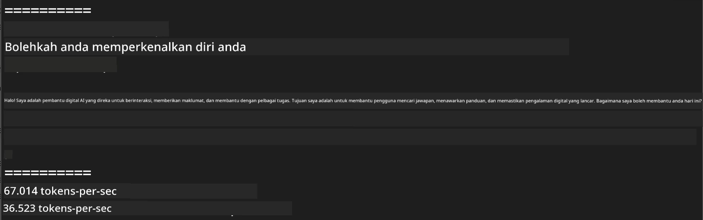
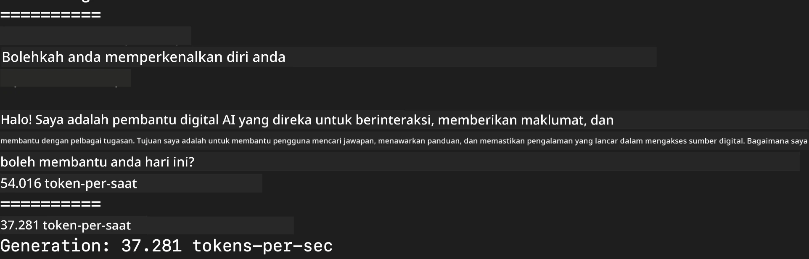
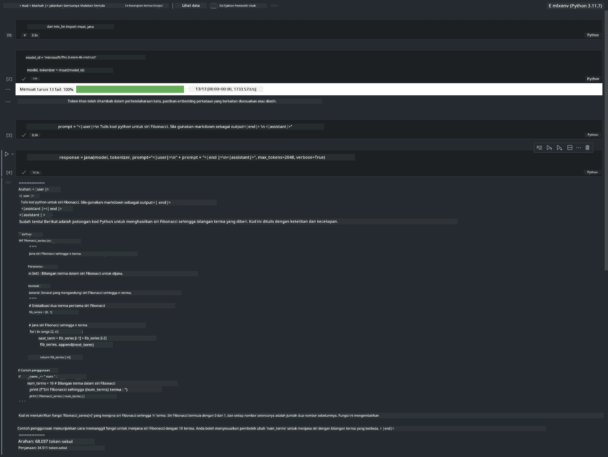

<!--
CO_OP_TRANSLATOR_METADATA:
{
  "original_hash": "dcb656f3d206fc4968e236deec5d4384",
  "translation_date": "2025-07-17T10:08:19+00:00",
  "source_file": "md/03.FineTuning/03.Inference/MLX_Inference.md",
  "language_code": "ms"
}
-->
# **Inferens Phi-3 dengan Rangka Kerja Apple MLX**

## **Apa itu Rangka Kerja MLX**

MLX adalah rangka kerja tatasusunan untuk penyelidikan pembelajaran mesin pada cip Apple silicon, dibangunkan oleh penyelidik pembelajaran mesin Apple.

MLX direka oleh penyelidik pembelajaran mesin untuk penyelidik pembelajaran mesin. Rangka kerja ini bertujuan untuk mesra pengguna, tetapi masih cekap untuk melatih dan melaksanakan model. Reka bentuk rangka kerja ini juga mudah dari segi konsep. Kami berhasrat untuk memudahkan penyelidik mengembangkan dan memperbaiki MLX dengan tujuan untuk meneroka idea baru dengan pantas.

LLM boleh dipercepatkan pada peranti Apple Silicon melalui MLX, dan model boleh dijalankan secara tempatan dengan sangat mudah.

## **Menggunakan MLX untuk inferens Phi-3-mini**

### **1. Sediakan persekitaran MLX anda**

1. Python 3.11.x  
2. Pasang Perpustakaan MLX


```bash

pip install mlx-lm

```

### **2. Menjalankan Phi-3-mini di Terminal dengan MLX**


```bash

python -m mlx_lm.generate --model microsoft/Phi-3-mini-4k-instruct --max-token 2048 --prompt  "<|user|>\nCan you introduce yourself<|end|>\n<|assistant|>"

```

Keputusannya (persekitaran saya adalah Apple M1 Max, 64GB) adalah



### **3. Kuantisasi Phi-3-mini dengan MLX di Terminal**


```bash

python -m mlx_lm.convert --hf-path microsoft/Phi-3-mini-4k-instruct

```

***Nota：*** Model boleh dikuantisasi melalui mlx_lm.convert, dan kuantisasi lalai adalah INT4. Contoh ini mengkuantisasi Phi-3-mini ke INT4

Model boleh dikuantisasi melalui mlx_lm.convert, dan kuantisasi lalai adalah INT4. Contoh ini adalah untuk mengkuantisasi Phi-3-mini ke INT4. Selepas kuantisasi, ia akan disimpan dalam direktori lalai ./mlx_model

Kita boleh menguji model yang telah dikuantisasi dengan MLX dari terminal


```bash

python -m mlx_lm.generate --model ./mlx_model/ --max-token 2048 --prompt  "<|user|>\nCan you introduce yourself<|end|>\n<|assistant|>"

```

Keputusannya adalah




### **4. Menjalankan Phi-3-mini dengan MLX dalam Jupyter Notebook**




***Nota:*** Sila baca contoh ini [klik pautan ini](../../../../../code/03.Inference/MLX/MLX_DEMO.ipynb)


## **Sumber**

1. Ketahui tentang Rangka Kerja Apple MLX [https://ml-explore.github.io](https://ml-explore.github.io/mlx/build/html/index.html)

2. Repositori Apple MLX GitHub [https://github.com/ml-explore](https://github.com/ml-explore)

**Penafian**:  
Dokumen ini telah diterjemahkan menggunakan perkhidmatan terjemahan AI [Co-op Translator](https://github.com/Azure/co-op-translator). Walaupun kami berusaha untuk ketepatan, sila ambil perhatian bahawa terjemahan automatik mungkin mengandungi kesilapan atau ketidaktepatan. Dokumen asal dalam bahasa asalnya harus dianggap sebagai sumber yang sahih. Untuk maklumat penting, terjemahan profesional oleh manusia adalah disyorkan. Kami tidak bertanggungjawab atas sebarang salah faham atau salah tafsir yang timbul daripada penggunaan terjemahan ini.