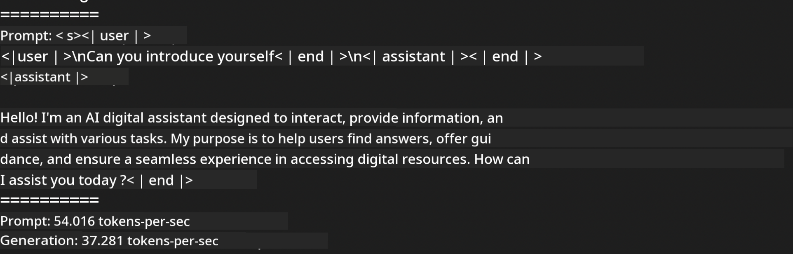

<!--
CO_OP_TRANSLATOR_METADATA:
{
  "original_hash": "dcb656f3d206fc4968e236deec5d4384",
  "translation_date": "2025-05-09T22:32:54+00:00",
  "source_file": "md/03.FineTuning/03.Inference/MLX_Inference.md",
  "language_code": "ms"
}
-->
# **Inference Phi-3 with Apple MLX Framework**

## **What is MLX Framework**

MLX 是一个专为 Apple 硅芯片上的机器学习研究设计的数组框架，由 Apple 机器学习研究团队开发。

MLX 由机器学习研究人员为机器学习研究人员设计。该框架旨在用户友好，同时在训练和部署模型时保持高效。框架本身的设计也非常简洁。我们的目标是让研究人员能够轻松扩展和改进 MLX，从而快速探索新想法。

通过 MLX，LLM 可以在 Apple Silicon 设备上加速运行，模型也可以非常方便地本地运行。

## **Using MLX to inference Phi-3-mini**

### **1. Set up you MLX env**

1. Python 3.11.x
2. Install MLX Library


```bash

pip install mlx-lm

```

### **2. Running Phi-3-mini in Terminal with MLX**


```bash

python -m mlx_lm.generate --model microsoft/Phi-3-mini-4k-instruct --max-token 2048 --prompt  "<|user|>\nCan you introduce yourself<|end|>\n<|assistant|>"

```

结果（我的环境是 Apple M1 Max，64GB）如下


### **3. Quantizing Phi-3-mini with MLX in Terminal**


```bash

python -m mlx_lm.convert --hf-path microsoft/Phi-3-mini-4k-instruct

```

***Note：*** 可以通过 mlx_lm.convert 对模型进行量化，默认的量化方式是 INT4。此示例将 Phi-3-mini 量化为 INT4。

模型可以通过 mlx_lm.convert 量化，默认量化为 INT4。这个例子是将 Phi-3-mini 量化成 INT4。量化完成后，模型会存储在默认目录 ./mlx_model 中。

我们可以从终端测试量化后的模型


```bash

python -m mlx_lm.generate --model ./mlx_model/ --max-token 2048 --prompt  "<|user|>\nCan you introduce yourself<|end|>\n<|assistant|>"

```

结果如下




### **4. Running Phi-3-mini with MLX in Jupyter Notebook**


***Note:*** 请查看这个示例 [点击这里](../../../../../code/03.Inference/MLX/MLX_DEMO.ipynb)


## **Resources**

1. 了解 Apple MLX Framework [https://ml-explore.github.io](https://ml-explore.github.io/mlx/build/html/index.html)

2. Apple MLX GitHub 仓库 [https://github.com/ml-explore](https://github.com/ml-explore)

**Penafian**:  
Dokumen ini telah diterjemahkan menggunakan perkhidmatan terjemahan AI [Co-op Translator](https://github.com/Azure/co-op-translator). Walaupun kami berusaha untuk ketepatan, sila ambil perhatian bahawa terjemahan automatik mungkin mengandungi kesilapan atau ketidaktepatan. Dokumen asal dalam bahasa asalnya harus dianggap sebagai sumber yang sahih. Untuk maklumat penting, terjemahan profesional oleh manusia adalah disyorkan. Kami tidak bertanggungjawab atas sebarang salah faham atau salah tafsir yang timbul daripada penggunaan terjemahan ini.