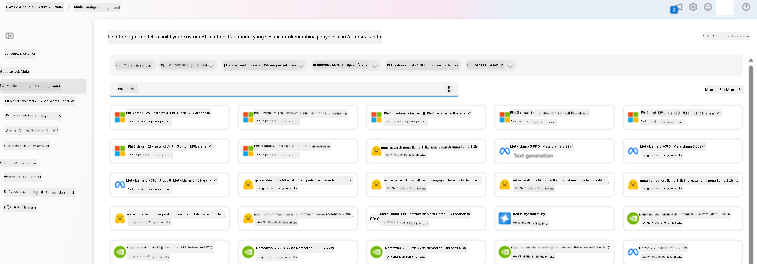
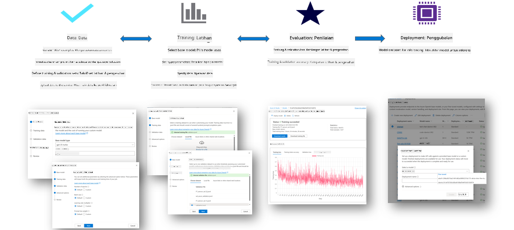
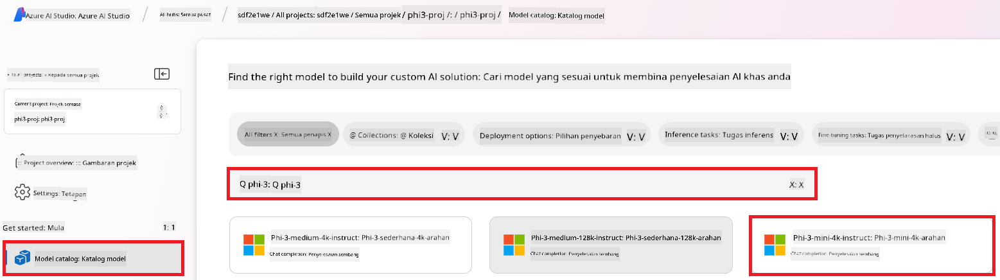
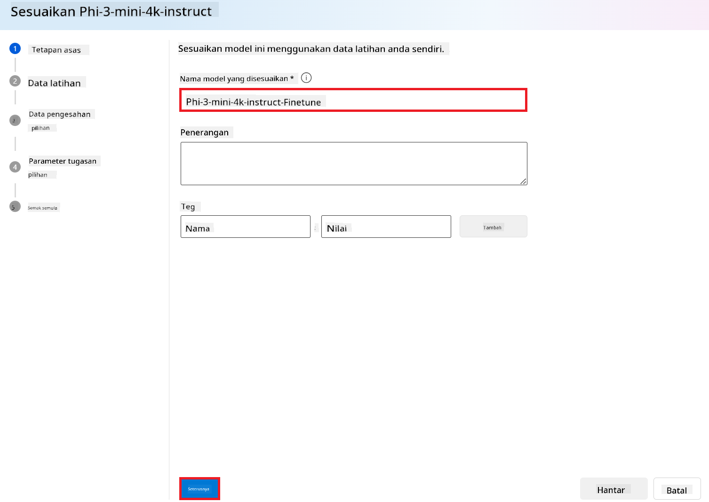
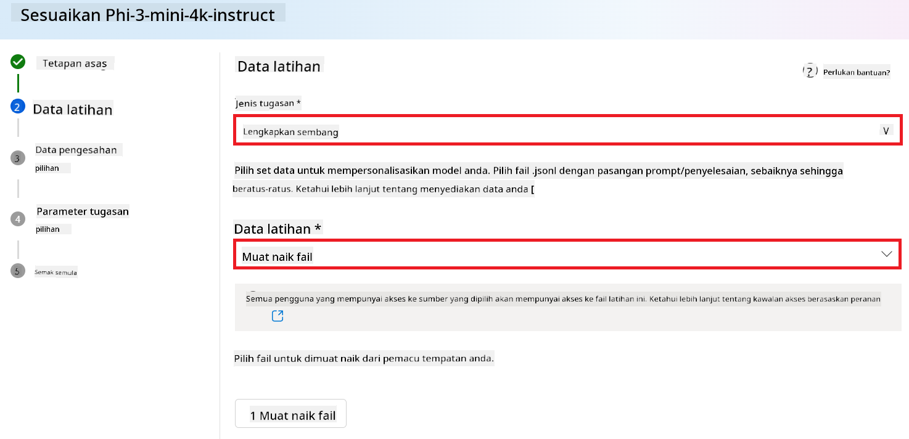
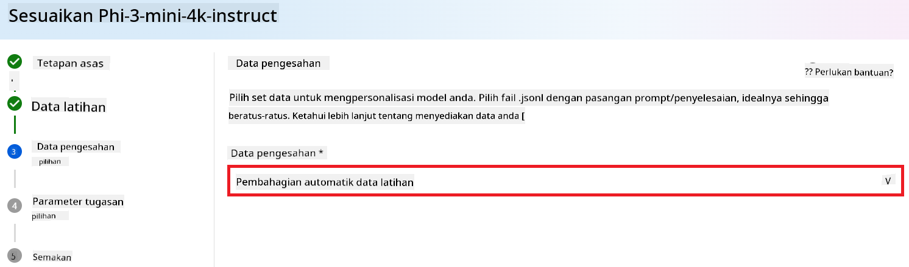
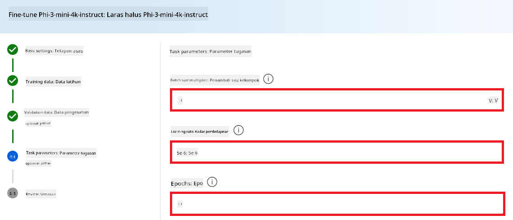
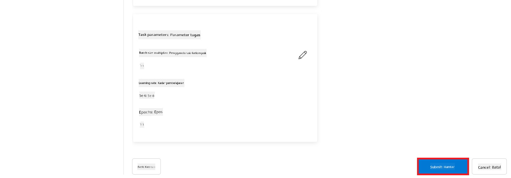
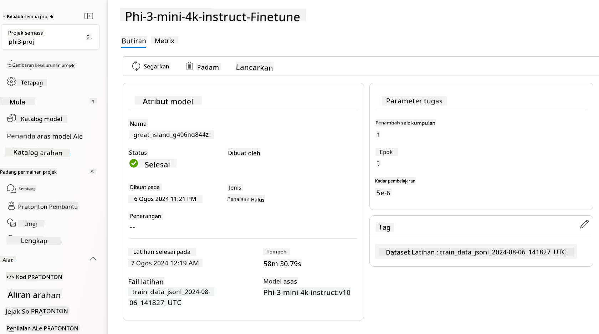

<!--
CO_OP_TRANSLATOR_METADATA:
{
  "original_hash": "c1559c5af6caccf6f623fd43a6b3a9a3",
  "translation_date": "2025-05-09T20:34:59+00:00",
  "source_file": "md/03.FineTuning/FineTuning_AIFoundry.md",
  "language_code": "ms"
}
-->
# כוונון מדויק של Phi-3 עם Azure AI Foundry

בואו נבחן כיצד לכוונן במדויק את מודל השפה Phi-3 Mini של מיקרוסופט באמצעות Azure AI Foundry. כוונון מדויק מאפשר להתאים את Phi-3 Mini למשימות ספציפיות, מה שהופך אותו לעוצמתי ומותאם יותר להקשר.

## שיקולים

- **יכולות:** אילו מודלים ניתנים לכוונון מדויק? לאילו משימות ניתן לכוונן את המודל הבסיסי?
- **עלות:** מהו מודל התמחור עבור כוונון מדויק?
- **התאמה אישית:** עד כמה ניתן לשנות את המודל הבסיסי – ובאילו דרכים?
- **נוחות:** כיצד מתבצע הכוונון המדויק בפועל – האם צריך לכתוב קוד מותאם? האם יש צורך במשאבי מחשוב משלך?
- **בטיחות:** למודלים מכווננים מדויק ידועים סיכוני בטיחות – האם קיימים מנגנוני הגנה למניעת נזקים לא מכוונים?



## הכנה לכוונון מדויק

### דרישות מוקדמות

> [!NOTE]
> עבור משפחת מודלי Phi-3, אפשרות הכוונון המדויק בתשלום לפי שימוש זמינה רק במרכזי נתונים שנוצרו באזור **East US 2**.

- מנוי Azure. אם אין לך מנוי, צור [חשבון Azure בתשלום](https://azure.microsoft.com/pricing/purchase-options/pay-as-you-go) כדי להתחיל.

- פרויקט [AI Foundry](https://ai.azure.com?WT.mc_id=aiml-138114-kinfeylo).
- בקרות גישה מבוססות תפקידים של Azure (Azure RBAC) משמשות למתן הרשאות לפעולות ב-Azure AI Foundry. על חשבון המשתמש שלך להיות משויך לתפקיד __Azure AI Developer__ בקבוצת המשאבים.

### רישום ספק מנוי

וודא שהמנוי רשום לספק המשאבים `Microsoft.Network`.

1. התחבר ל-[פורטל Azure](https://portal.azure.com).
1. בחר **Subscriptions** מהתפריט השמאלי.
1. בחר את המנוי שברצונך להשתמש בו.
1. בחר **AI project settings** > **Resource providers** מהתפריט השמאלי.
1. ודא ש-**Microsoft.Network** מופיע ברשימת ספקי המשאבים. אם לא, הוסף אותו.

### הכנת נתונים

הכן את נתוני האימון והאימות שלך לכוונון המדויק של המודל. מערכי נתוני האימון והאימות צריכים לכלול דוגמאות של קלט ופלט בהתאם לאופן שבו ברצונך שהמודל יבצע את המשימה.

ודא שכל דוגמאות האימון עומדות בפורמט המצופה עבור ההסקה. כדי לכוונן מודלים בצורה יעילה, יש להבטיח מאגר נתונים מאוזן ומגוון.

זה כולל שמירה על איזון בנתונים, הכללת תרחישים שונים, ועדכון תקופתי של נתוני האימון כדי להתאים לציפיות מהמציאות, מה שמוביל לתגובות מדויקות ומאוזנות יותר של המודל.

סוגי מודלים שונים דורשים פורמט שונה של נתוני אימון.

### השלמת שיחה

נתוני האימון והאימות שבהם תשתמש **חייבים** להיות בפורמט JSON Lines (JSONL). עבור `Phi-3-mini-128k-instruct`, מערך נתוני הכוונון המדויק חייב להיות בפורמט שיחתי כפי שמשמש API להשלמת שיחות.

### דוגמת פורמט קובץ

```json
    {"messages": [{"role": "system", "content": "You are an Xbox customer support agent whose primary goal is to help users with issues they are experiencing with their Xbox devices. You are friendly and concise. You only provide factual answers to queries, and do not provide answers that are not related to Xbox."}, {"role": "user", "content": "Is Xbox better than PlayStation?"}, {"role": "assistant", "content": "I apologize, but I cannot provide personal opinions. My primary job is to assist you with any issues related to your Xbox device. Do you have any Xbox-related issues that need addressing?"}]}
    {"messages": [{"role": "system", "content": "You are an Xbox customer support agent whose primary goal is to help users with issues they are experiencing with their Xbox devices. You are friendly and concise. You only provide factual answers to queries, and do not provide answers that are not related to Xbox."}, {"role": "user", "content": "Can I play PC games on my Xbox?"}, {"role": "assistant", "content": "While Xbox consoles don't natively support PC games, they can play an array of Xbox games, many of which are also available on PC. Can I assist you with finding games compatible with your Xbox device?"}]}
    {"messages": [{"role": "system", "content": "You are an Xbox customer support agent whose primary goal is to help users with issues they are experiencing with their Xbox devices. You are friendly and concise. You only provide factual answers to queries, and do not provide answers that are not related to Xbox."}, {"role": "user", "content": "I'm having trouble connecting my Xbox to the Wi-Fi."}, {"role": "assistant", "content": "No worries, let's go through the network settings on your Xbox. Can you please tell me what happens when you try to connect it to the Wi-Fi?"}]}
```

סוג הקובץ הנתמך הוא JSON Lines. הקבצים מועלים למחסן הנתונים ברירת המחדל ונגישים בפרויקט שלך.

## כוונון מדויק של Phi-3 עם Azure AI Foundry

Azure AI Foundry מאפשרת להתאים מודלים גדולים של שפה למאגרי הנתונים האישיים שלך באמצעות תהליך הנקרא כוונון מדויק. הכוונון המדויק מעניק ערך משמעותי על ידי התאמה אישית ואופטימיזציה למשימות ויישומים ספציפיים. התהליך משפר ביצועים, חוסך עלויות, מקטין השהייה ומייצר פלט מותאם.



### יצירת פרויקט חדש

1. התחבר ל-[Azure AI Foundry](https://ai.azure.com).

1. בחר **+New project** כדי ליצור פרויקט חדש ב-Azure AI Foundry.

    

1. בצע את המשימות הבאות:

    - שם **Hub** של הפרויקט. חייב להיות ערך ייחודי.
    - בחר את ה-**Hub** לשימוש (צור חדש אם צריך).

    

1. בצע את המשימות הבאות ליצירת Hub חדש:

    - הזן **Hub name**. חייב להיות ייחודי.
    - בחר את **Subscription** של Azure שלך.
    - בחר את **Resource group** לשימוש (צור חדש במידת הצורך).
    - בחר את **Location** הרצוי.
    - בחר את **Connect Azure AI Services** לשימוש (צור חדש אם צריך).
    - בחר ב-**Connect Azure AI Search** את האפשרות **Skip connecting**.

    

1. לחץ על **Next**.
1. לחץ על **Create a project**.

### הכנת נתונים

לפני הכוונון, אסוף או צור מערך נתונים הרלוונטי למשימה שלך, כמו הוראות שיחה, זוגות שאלות ותשובות או כל טקסט רלוונטי אחר. נקה ועבד את הנתונים על ידי הסרת רעשים, טיפול בערכים חסרים, וטוקניזציה של הטקסט.

### כוונון מדויק של מודלי Phi-3 ב-Azure AI Foundry

> [!NOTE]
> כוונון מדויק של מודלי Phi-3 נתמך כרגע בפרויקטים הממוקמים ב-East US 2.

1. בחר **Model catalog** מהכרטיסייה בצד שמאל.

1. הקלד *phi-3* בשורת החיפוש ובחר את מודל phi-3 שברצונך להשתמש בו.

    

1. בחר **Fine-tune**.

    

1. הזן את **שם המודל המכוונן**.

    

1. לחץ על **Next**.

1. בצע את המשימות הבאות:

    - בחר את **סוג המשימה** ל-**Chat completion**.
    - בחר את **נתוני האימון** שברצונך להשתמש בהם. ניתן להעלות אותם דרך Azure AI Foundry או מהסביבה המקומית שלך.

    

1. לחץ על **Next**.

1. העלה את **נתוני האימות** שברצונך להשתמש בהם, או בחר באפשרות **Automatic split of training data**.

    

1. לחץ על **Next**.

1. בצע את המשימות הבאות:

    - בחר את **מכפיל גודל האצווה** הרצוי.
    - בחר את **קצב הלמידה** הרצוי.
    - בחר את מספר ה-**Epochs** הרצוי.

    

1. לחץ על **Submit** כדי להתחיל את תהליך הכוונון המדויק.

    

1. לאחר שהמודל שלך מכוונן, הסטטוס יוצג כ-**Completed**, כפי שמוצג בתמונה למטה. כעת תוכל לפרוס את המודל ולהשתמש בו באפליקציה שלך, במגרש המשחקים או ב-Prompt Flow. למידע נוסף, ראה [כיצד לפרוס משפחת מודלי השפה הקטנים Phi-3 עם Azure AI Foundry](https://learn.microsoft.com/azure/ai-studio/how-to/deploy-models-phi-3?tabs=phi-3-5&pivots=programming-language-python).

    

> [!NOTE]
> למידע מפורט יותר על כוונון מדויק של Phi-3, בקר ב-[Fine-tune Phi-3 models in Azure AI Foundry](https://learn.microsoft.com/azure/ai-studio/how-to/fine-tune-phi-3?tabs=phi-3-mini).

## ניקוי מודלים מכווננים

ניתן למחוק מודל מכוונן מרשימת מודלי הכוונון ב-[Azure AI Foundry](https://ai.azure.com) או מדף פרטי המודל. בחר את המודל המכוין למחיקה בדף הכוונון, ואז לחץ על כפתור Delete כדי למחוק את המודל.

> [!NOTE]
> לא ניתן למחוק מודל מותאם אישית אם יש לו פריסה פעילה. יש למחוק קודם את הפריסה לפני מחיקת המודל.

## עלויות ומגבלות

### שיקולי עלות ומגבלות עבור מודלי Phi-3 מכווננים כשירות

מודלי Phi המכווננים כשירות מוצעים על ידי מיקרוסופט ומשולבים ב-Azure AI Foundry לשימוש. ניתן למצוא את התמחור בעת [פריסה](https://learn.microsoft.com/azure/ai-studio/how-to/deploy-models-phi-3?tabs=phi-3-5&pivots=programming-language-python) או כוונון המודלים תחת לשונית Pricing and terms באשף הפריסה.

## סינון תוכן

מודלים המופעלים כשירות בתשלום לפי שימוש מוגנים על ידי Azure AI Content Safety. בעת פריסה לנקודות קצה בזמן אמת, ניתן לבחור לבטל אפשרות זו. עם Azure AI Content Safety מופעל, הן הפרומפט והן התגובה עוברים דרך מערך מודלי סיווג שמטרתם לזהות ולמנוע הפקת תוכן מזיק. מערכת סינון התוכן מזהה ופועלת נגד קטגוריות מסוימות של תוכן פוטנציאלית מזיק הן בפרומפטים והן בתגובות. למידע נוסף על [Azure AI Content Safety](https://learn.microsoft.com/azure/ai-studio/concepts/content-filtering).

**הגדרות כוונון מדויק**

היפרפרמטרים: הגדר היפרפרמטרים כמו קצב למידה, גודל אצווה ומספר אפוקים.

**פונקציית אובדן**

בחר פונקציית אובדן מתאימה למשימה שלך (למשל, cross-entropy).

**אופטימייזר**

בחר אופטימייזר (למשל, Adam) לעדכוני גרדיאנט במהלך האימון.

**תהליך הכוונון המדויק**

- טעינת מודל מאומן מראש: טען את נקודת הבדיקה של Phi-3 Mini.
- הוספת שכבות מותאמות: הוסף שכבות ספציפיות למשימה (למשל, ראש סיווג להוראות שיחה).

**אימון המודל**

כוונן את המודל באמצעות מערך הנתונים שהכנת. עקוב אחר התקדמות האימון והתאם היפרפרמטרים לפי הצורך.

**הערכה ואימות**

מערך אימות: חלק את הנתונים למערכי אימון ואימות.

**הערכת ביצועים**

השתמש במדדים כמו דיוק, F1-score או perplexity כדי להעריך את ביצועי המודל.

## שמירת המודל המכוין

**נקודת בדיקה**

שמור את נקודת הבדיקה של המודל המכוין לשימוש עתידי.

## פריסה

- פרוס כשירות רשת: פרוס את המודל המכוין כשירות רשת ב-Azure AI Foundry.
- בדוק את נקודת הקצה: שלח שאילתות בדיקה לנקודת הקצה כדי לוודא את תפקודה.

## חזרה ושיפור

חזור על התהליך: אם הביצועים אינם מספקים, חזור על התהליך על ידי התאמת היפרפרמטרים, הוספת נתונים נוספים או כוונון לאפוקים נוספים.

## ניטור ושיפור

עקוב באופן רציף אחר התנהגות המודל ושפר לפי הצורך.

## התאמה והרחבה

משימות מותאמות: ניתן לכוונן את Phi-3 Mini למשימות שונות מעבר להוראות שיחה. גלה שימושים נוספים!
ניסוי: נסה ארכיטקטורות שונות, שילובי שכבות וטכניקות לשיפור הביצועים.

> [!NOTE]
> הכוונון המדויק הוא תהליך איטרטיבי. נסה, למד, והתאם את המודל שלך כדי להשיג את התוצאות הטובות ביותר למשימה הספציפית שלך!

**Penafian**:  
Dokumen ini telah diterjemahkan menggunakan perkhidmatan terjemahan AI [Co-op Translator](https://github.com/Azure/co-op-translator). Walaupun kami berusaha untuk ketepatan, sila ambil maklum bahawa terjemahan automatik mungkin mengandungi kesilapan atau ketidaktepatan. Dokumen asal dalam bahasa asalnya hendaklah dianggap sebagai sumber yang sahih. Untuk maklumat penting, terjemahan profesional oleh manusia adalah disyorkan. Kami tidak bertanggungjawab atas sebarang salah faham atau salah tafsir yang timbul daripada penggunaan terjemahan ini.