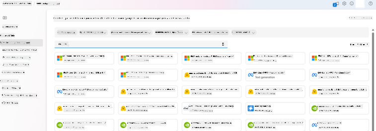
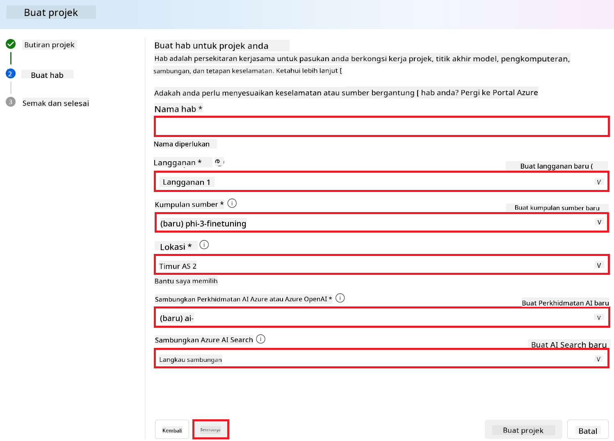
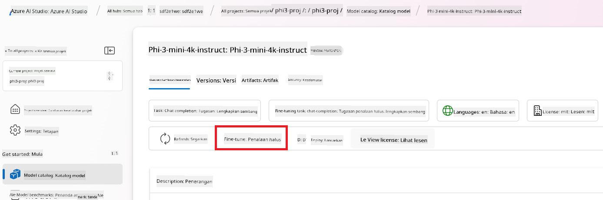
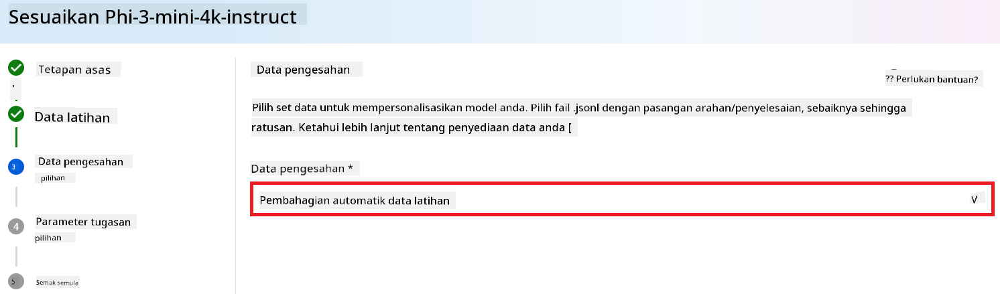

<!--
CO_OP_TRANSLATOR_METADATA:
{
  "original_hash": "c1559c5af6caccf6f623fd43a6b3a9a3",
  "translation_date": "2025-07-17T06:10:07+00:00",
  "source_file": "md/03.FineTuning/FineTuning_AIFoundry.md",
  "language_code": "ms"
}
-->
# Penalaan Halus Phi-3 dengan Azure AI Foundry

Mari kita terokai cara untuk menala halus model bahasa Phi-3 Mini Microsoft menggunakan Azure AI Foundry. Penalaan halus membolehkan anda menyesuaikan Phi-3 Mini untuk tugasan tertentu, menjadikannya lebih berkuasa dan peka konteks.

## Pertimbangan

- **Keupayaan:** Model mana yang boleh ditala halus? Apakah yang boleh dilakukan oleh model asas selepas ditala halus?
- **Kos:** Apakah model harga untuk penalaan halus
- **Kebolehsuaian:** Sejauh mana saya boleh mengubah model asas – dan dalam cara apa?
- **Kemudahan:** Bagaimana penalaan halus sebenarnya dilakukan – adakah saya perlu menulis kod tersuai? Adakah saya perlu menyediakan pengkomputeran sendiri?
- **Keselamatan:** Model yang ditala halus diketahui mempunyai risiko keselamatan – adakah terdapat langkah-langkah perlindungan untuk mengelakkan kemudaratan yang tidak disengajakan?



## Persediaan untuk penalaan halus

### Prasyarat

> [!NOTE]
> Untuk model keluarga Phi-3, tawaran penalaan halus model bayar ikut guna hanya tersedia dengan hab yang dibuat di rantau **East US 2**.

- Langganan Azure. Jika anda belum mempunyai langganan Azure, buat [akaun Azure berbayar](https://azure.microsoft.com/pricing/purchase-options/pay-as-you-go) untuk memulakan.

- Projek [AI Foundry](https://ai.azure.com?WT.mc_id=aiml-138114-kinfeylo).
- Kawalan akses berasaskan peranan Azure (Azure RBAC) digunakan untuk memberikan akses kepada operasi dalam Azure AI Foundry. Untuk melaksanakan langkah dalam artikel ini, akaun pengguna anda mesti diberikan __peranan Azure AI Developer__ pada kumpulan sumber.

### Pendaftaran penyedia langganan

Sahkan langganan didaftarkan kepada penyedia sumber `Microsoft.Network`.

1. Log masuk ke [portal Azure](https://portal.azure.com).
1. Pilih **Subscriptions** dari menu kiri.
1. Pilih langganan yang ingin anda gunakan.
1. Pilih **AI project settings** > **Resource providers** dari menu kiri.
1. Sahkan bahawa **Microsoft.Network** ada dalam senarai penyedia sumber. Jika tidak, tambahkan ia.

### Persediaan data

Sediakan data latihan dan pengesahan anda untuk menala halus model anda. Set data latihan dan pengesahan anda terdiri daripada contoh input dan output bagi cara anda mahu model berfungsi.

Pastikan semua contoh latihan anda mengikuti format yang dijangka untuk inferens. Untuk menala halus model dengan berkesan, pastikan dataset seimbang dan pelbagai.

Ini melibatkan mengekalkan keseimbangan data, memasukkan pelbagai senario, dan secara berkala memperbaiki data latihan agar selaras dengan jangkaan dunia sebenar, yang akhirnya menghasilkan respons model yang lebih tepat dan seimbang.

Jenis model yang berbeza memerlukan format data latihan yang berbeza.

### Penyempurnaan Perbualan

Data latihan dan pengesahan yang anda gunakan **mesti** diformatkan sebagai dokumen JSON Lines (JSONL). Untuk `Phi-3-mini-128k-instruct`, set data penalaan halus mesti diformat dalam format perbualan yang digunakan oleh API Penyempurnaan Perbualan.

### Contoh format fail

```json
    {"messages": [{"role": "system", "content": "You are an Xbox customer support agent whose primary goal is to help users with issues they are experiencing with their Xbox devices. You are friendly and concise. You only provide factual answers to queries, and do not provide answers that are not related to Xbox."}, {"role": "user", "content": "Is Xbox better than PlayStation?"}, {"role": "assistant", "content": "I apologize, but I cannot provide personal opinions. My primary job is to assist you with any issues related to your Xbox device. Do you have any Xbox-related issues that need addressing?"}]}
    {"messages": [{"role": "system", "content": "You are an Xbox customer support agent whose primary goal is to help users with issues they are experiencing with their Xbox devices. You are friendly and concise. You only provide factual answers to queries, and do not provide answers that are not related to Xbox."}, {"role": "user", "content": "Can I play PC games on my Xbox?"}, {"role": "assistant", "content": "While Xbox consoles don't natively support PC games, they can play an array of Xbox games, many of which are also available on PC. Can I assist you with finding games compatible with your Xbox device?"}]}
    {"messages": [{"role": "system", "content": "You are an Xbox customer support agent whose primary goal is to help users with issues they are experiencing with their Xbox devices. You are friendly and concise. You only provide factual answers to queries, and do not provide answers that are not related to Xbox."}, {"role": "user", "content": "I'm having trouble connecting my Xbox to the Wi-Fi."}, {"role": "assistant", "content": "No worries, let's go through the network settings on your Xbox. Can you please tell me what happens when you try to connect it to the Wi-Fi?"}]}
```

Jenis fail yang disokong adalah JSON Lines. Fail dimuat naik ke stor data lalai dan disediakan dalam projek anda.

## Penalaan Halus Phi-3 dengan Azure AI Foundry

Azure AI Foundry membolehkan anda menyesuaikan model bahasa besar kepada dataset peribadi anda melalui proses yang dikenali sebagai penalaan halus. Penalaan halus memberikan nilai yang besar dengan membolehkan penyesuaian dan pengoptimuman untuk tugasan dan aplikasi tertentu. Ia membawa kepada prestasi yang lebih baik, kecekapan kos, pengurangan kelewatan, dan output yang disesuaikan.


### Cipta Projek Baru

1. Log masuk ke [Azure AI Foundry](https://ai.azure.com).

1. Pilih **+New project** untuk mencipta projek baru dalam Azure AI Foundry.

    

1. Lakukan tugasan berikut:

    - Nama **Hub** projek. Ia mesti nilai unik.
    - Pilih **Hub** yang ingin digunakan (cipta baru jika perlu).

    

1. Lakukan tugasan berikut untuk mencipta hab baru:

    - Masukkan **Nama Hub**. Ia mesti nilai unik.
    - Pilih **Langganan** Azure anda.
    - Pilih **Kumpulan sumber** yang ingin digunakan (cipta baru jika perlu).
    - Pilih **Lokasi** yang anda ingin gunakan.
    - Pilih **Sambungkan Perkhidmatan Azure AI** yang ingin digunakan (cipta baru jika perlu).
    - Pilih **Sambungkan Azure AI Search** untuk **Langkau sambungan**.

    

1. Pilih **Next**.
1. Pilih **Create a project**.

### Persediaan Data

Sebelum menala halus, kumpul atau cipta dataset yang berkaitan dengan tugasan anda, seperti arahan perbualan, pasangan soalan-jawapan, atau mana-mana data teks yang relevan. Bersihkan dan pra-proses data ini dengan membuang gangguan, mengendalikan nilai hilang, dan menokennya.

### Menala Halus model Phi-3 dalam Azure AI Foundry

> [!NOTE]
> Penalaan halus model Phi-3 kini disokong dalam projek yang terletak di East US 2.

1. Pilih **Model catalog** dari tab sebelah kiri.

1. Taip *phi-3* dalam **bar carian** dan pilih model phi-3 yang anda ingin gunakan.

    

1. Pilih **Fine-tune**.

    

1. Masukkan **Nama model yang ditala halus**.

    

1. Pilih **Next**.

1. Lakukan tugasan berikut:

    - Pilih **jenis tugasan** kepada **Chat completion**.
    - Pilih **Data latihan** yang anda ingin gunakan. Anda boleh memuat naiknya melalui data Azure AI Foundry atau dari persekitaran tempatan anda.

    

1. Pilih **Next**.

1. Muat naik **Data pengesahan** yang anda ingin gunakan, atau anda boleh pilih **Pembahagian automatik data latihan**.

    

1. Pilih **Next**.

1. Lakukan tugasan berikut:

    - Pilih **Pendaraban saiz kumpulan** yang anda ingin gunakan.
    - Pilih **Kadar pembelajaran** yang anda ingin gunakan.
    - Pilih **Epochs** yang anda ingin gunakan.

    

1. Pilih **Submit** untuk memulakan proses penalaan halus.

    

1. Setelah model anda ditala halus, status akan dipaparkan sebagai **Completed**, seperti dalam imej di bawah. Kini anda boleh melaksanakan model dan menggunakannya dalam aplikasi anda sendiri, di playground, atau dalam prompt flow. Untuk maklumat lanjut, lihat [Cara melaksanakan keluarga model bahasa kecil Phi-3 dengan Azure AI Foundry](https://learn.microsoft.com/azure/ai-studio/how-to/deploy-models-phi-3?tabs=phi-3-5&pivots=programming-language-python).

    

> [!NOTE]
> Untuk maklumat lebih terperinci mengenai penalaan halus Phi-3, sila lawati [Fine-tune Phi-3 models in Azure AI Foundry](https://learn.microsoft.com/azure/ai-studio/how-to/fine-tune-phi-3?tabs=phi-3-mini).

## Membersihkan model yang telah ditala halus

Anda boleh memadam model yang telah ditala halus dari senarai model penalaan halus dalam [Azure AI Foundry](https://ai.azure.com) atau dari halaman butiran model. Pilih model yang telah ditala halus untuk dipadam dari halaman Penalaan Halus, kemudian pilih butang Padam untuk memadam model tersebut.

> [!NOTE]
> Anda tidak boleh memadam model tersuai jika ia mempunyai pelaksanaan sedia ada. Anda mesti memadam pelaksanaan model terlebih dahulu sebelum boleh memadam model tersuai anda.

## Kos dan kuota

### Pertimbangan kos dan kuota untuk model Phi-3 yang ditala halus sebagai perkhidmatan

Model Phi yang ditala halus sebagai perkhidmatan ditawarkan oleh Microsoft dan diintegrasikan dengan Azure AI Foundry untuk kegunaan. Anda boleh mendapatkan harga semasa [melaksanakan](https://learn.microsoft.com/azure/ai-studio/how-to/deploy-models-phi-3?tabs=phi-3-5&pivots=programming-language-python) atau menala halus model di bawah tab Harga dan terma pada wizard pelaksanaan.

## Penapisan kandungan

Model yang dilaksanakan sebagai perkhidmatan dengan bayar ikut guna dilindungi oleh Azure AI Content Safety. Apabila dilaksanakan ke titik akhir masa nyata, anda boleh memilih untuk tidak menggunakan keupayaan ini. Dengan keselamatan kandungan Azure AI diaktifkan, kedua-dua prompt dan penyempurnaan melalui satu set model klasifikasi yang bertujuan mengesan dan menghalang output kandungan berbahaya. Sistem penapisan kandungan mengesan dan mengambil tindakan terhadap kategori kandungan berpotensi berbahaya dalam kedua-dua prompt input dan penyempurnaan output. Ketahui lebih lanjut tentang [Azure AI Content Safety](https://learn.microsoft.com/azure/ai-studio/concepts/content-filtering).

**Konfigurasi Penalaan Halus**

Hyperparameter: Tetapkan hyperparameter seperti kadar pembelajaran, saiz kumpulan, dan bilangan epoch latihan.

**Fungsi Kerugian**

Pilih fungsi kerugian yang sesuai untuk tugasan anda (contoh: cross-entropy).

**Pengoptimum**

Pilih pengoptimum (contoh: Adam) untuk kemas kini kecerunan semasa latihan.

**Proses Penalaan Halus**

- Muat Model Pra-Latih: Muatkan checkpoint Phi-3 Mini.
- Tambah Lapisan Tersuai: Tambah lapisan khusus tugasan (contoh: kepala klasifikasi untuk arahan perbualan).

**Latih Model**
Tala halus model menggunakan dataset yang telah disediakan. Pantau kemajuan latihan dan laraskan hyperparameter jika perlu.

**Penilaian dan Pengesahan**

Set Pengesahan: Bahagikan data anda kepada set latihan dan pengesahan.

**Nilai Prestasi**

Gunakan metrik seperti ketepatan, skor F1, atau perplexity untuk menilai prestasi model.

## Simpan Model yang Ditala Halus

**Checkpoint**
Simpan checkpoint model yang telah ditala halus untuk kegunaan masa depan.

## Pelaksanaan

- Laksanakan sebagai Perkhidmatan Web: Laksanakan model yang telah ditala halus sebagai perkhidmatan web dalam Azure AI Foundry.
- Uji Titik Akhir: Hantar pertanyaan ujian ke titik akhir yang dilaksanakan untuk mengesahkan fungsinya.

## Ulang dan Perbaiki

Ulang: Jika prestasi tidak memuaskan, ulang dengan melaraskan hyperparameter, menambah lebih banyak data, atau menala halus untuk epoch tambahan.

## Pantau dan Perhalusi

Pantau tingkah laku model secara berterusan dan perhalusi jika perlu.

## Sesuaikan dan Kembangkan

Tugasan Tersuai: Phi-3 Mini boleh ditala halus untuk pelbagai tugasan selain arahan perbualan. Terokai kegunaan lain!
Eksperimen: Cuba seni bina, gabungan lapisan, dan teknik berbeza untuk meningkatkan prestasi.

> [!NOTE]
> Penalaan halus adalah proses berulang. Eksperimen, belajar, dan sesuaikan model anda untuk mencapai hasil terbaik bagi tugasan khusus anda!

**Penafian**:  
Dokumen ini telah diterjemahkan menggunakan perkhidmatan terjemahan AI [Co-op Translator](https://github.com/Azure/co-op-translator). Walaupun kami berusaha untuk ketepatan, sila ambil maklum bahawa terjemahan automatik mungkin mengandungi kesilapan atau ketidaktepatan. Dokumen asal dalam bahasa asalnya harus dianggap sebagai sumber yang sahih. Untuk maklumat penting, terjemahan profesional oleh manusia adalah disyorkan. Kami tidak bertanggungjawab atas sebarang salah faham atau salah tafsir yang timbul daripada penggunaan terjemahan ini.