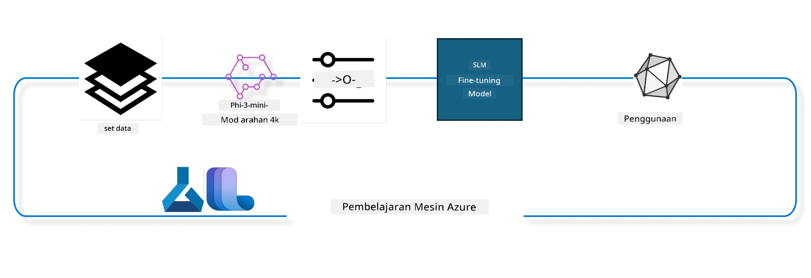

## Cara menggunakan komponen chat-completion dari Azure ML system registry untuk melatih model dengan lebih tepat

Dalam contoh ini, kita akan melakukan fine tuning model Phi-3-mini-4k-instruct untuk melengkapkan perbualan antara 2 orang menggunakan dataset ultrachat_200k.



Contoh ini akan menunjukkan cara melakukan fine tuning menggunakan Azure ML SDK dan Python, kemudian menyebarkan model yang telah dilatih ke endpoint dalam talian untuk inferens masa nyata.

### Data latihan

Kita akan menggunakan dataset ultrachat_200k. Ini adalah versi yang telah ditapis dengan ketat daripada dataset UltraChat dan digunakan untuk melatih Zephyr-7B-β, model chat 7b terkini.

### Model

Kita akan menggunakan model Phi-3-mini-4k-instruct untuk menunjukkan bagaimana pengguna boleh melakukan fine tuning model untuk tugasan chat-completion. Jika anda membuka notebook ini dari kad model tertentu, ingat untuk menggantikan nama model tersebut.

### Tugasan

- Pilih model untuk fine tune.
- Pilih dan terokai data latihan.
- Konfigurasikan tugasan fine tuning.
- Jalankan tugasan fine tuning.
- Semak metrik latihan dan penilaian.
- Daftarkan model yang telah dilatih.
- Sebarkan model yang telah dilatih untuk inferens masa nyata.
- Bersihkan sumber.

## 1. Sediakan keperluan awal

- Pasang kebergantungan
- Sambung ke AzureML Workspace. Ketahui lebih lanjut di set up SDK authentication. Gantikan <WORKSPACE_NAME>, <RESOURCE_GROUP> dan <SUBSCRIPTION_ID> di bawah.
- Sambung ke azureml system registry
- Tetapkan nama eksperimen pilihan
- Semak atau cipta compute.

> [!NOTE]
> Keperluan adalah satu nod GPU boleh mempunyai beberapa kad GPU. Contohnya, dalam satu nod Standard_NC24rs_v3 terdapat 4 NVIDIA V100 GPUs manakala dalam Standard_NC12s_v3, terdapat 2 NVIDIA V100 GPUs. Rujuk dokumentasi untuk maklumat ini. Bilangan kad GPU setiap nod ditetapkan dalam parameter gpus_per_node di bawah. Menetapkan nilai ini dengan betul akan memastikan penggunaan semua GPU dalam nod. SKU compute GPU yang disyorkan boleh didapati di sini dan di sini.

### Perpustakaan Python

Pasang kebergantungan dengan menjalankan sel di bawah. Ini bukan langkah pilihan jika menjalankan dalam persekitaran baru.

```bash
pip install azure-ai-ml
pip install azure-identity
pip install datasets==2.9.0
pip install mlflow
pip install azureml-mlflow
```

### Berinteraksi dengan Azure ML

1. Skrip Python ini digunakan untuk berinteraksi dengan perkhidmatan Azure Machine Learning (Azure ML). Berikut adalah ringkasan apa yang dilakukan:

    - Ia mengimport modul yang diperlukan dari pakej azure.ai.ml, azure.identity, dan azure.ai.ml.entities. Ia juga mengimport modul time.

    - Ia cuba mengesahkan menggunakan DefaultAzureCredential(), yang menyediakan pengalaman pengesahan yang mudah untuk memulakan pembangunan aplikasi yang dijalankan di awan Azure. Jika gagal, ia beralih ke InteractiveBrowserCredential(), yang menyediakan prompt log masuk interaktif.

    - Kemudian ia cuba mencipta instans MLClient menggunakan kaedah from_config, yang membaca konfigurasi dari fail config lalai (config.json). Jika gagal, ia mencipta instans MLClient dengan menyediakan subscription_id, resource_group_name, dan workspace_name secara manual.

    - Ia mencipta satu lagi instans MLClient, kali ini untuk Azure ML registry bernama "azureml". Registry ini adalah tempat model, pipeline fine-tuning, dan persekitaran disimpan.

    - Ia menetapkan experiment_name kepada "chat_completion_Phi-3-mini-4k-instruct".

    - Ia menjana cap masa unik dengan menukar masa semasa (dalam saat sejak epoch, sebagai nombor titik terapung) kepada integer dan kemudian kepada string. Cap masa ini boleh digunakan untuk mencipta nama dan versi unik.

    ```python
    # Import necessary modules from Azure ML and Azure Identity
    from azure.ai.ml import MLClient
    from azure.identity import (
        DefaultAzureCredential,
        InteractiveBrowserCredential,
    )
    from azure.ai.ml.entities import AmlCompute
    import time  # Import time module
    
    # Try to authenticate using DefaultAzureCredential
    try:
        credential = DefaultAzureCredential()
        credential.get_token("https://management.azure.com/.default")
    except Exception as ex:  # If DefaultAzureCredential fails, use InteractiveBrowserCredential
        credential = InteractiveBrowserCredential()
    
    # Try to create an MLClient instance using the default config file
    try:
        workspace_ml_client = MLClient.from_config(credential=credential)
    except:  # If that fails, create an MLClient instance by manually providing the details
        workspace_ml_client = MLClient(
            credential,
            subscription_id="<SUBSCRIPTION_ID>",
            resource_group_name="<RESOURCE_GROUP>",
            workspace_name="<WORKSPACE_NAME>",
        )
    
    # Create another MLClient instance for the Azure ML registry named "azureml"
    # This registry is where models, fine-tuning pipelines, and environments are stored
    registry_ml_client = MLClient(credential, registry_name="azureml")
    
    # Set the experiment name
    experiment_name = "chat_completion_Phi-3-mini-4k-instruct"
    
    # Generate a unique timestamp that can be used for names and versions that need to be unique
    timestamp = str(int(time.time()))
    ```

## 2. Pilih model asas untuk fine tune

1. Phi-3-mini-4k-instruct adalah model ringan dengan 3.8B parameter, model terbuka terkini yang dibina berdasarkan dataset yang digunakan untuk Phi-2. Model ini tergolong dalam keluarga model Phi-3, dan versi Mini datang dalam dua varian 4K dan 128K yang merujuk kepada panjang konteks (dalam token) yang boleh disokong. Kita perlu melakukan fine tuning model ini untuk tujuan khusus kita sebelum menggunakannya. Anda boleh melayari model-model ini dalam Model Catalog di AzureML Studio, menapis mengikut tugasan chat-completion. Dalam contoh ini, kita menggunakan model Phi-3-mini-4k-instruct. Jika anda membuka notebook ini untuk model lain, gantikan nama dan versi model mengikut keperluan.

    > [!NOTE]
    > id model adalah sifat model. Ini akan digunakan sebagai input kepada tugasan fine tuning. Ia juga boleh didapati sebagai medan Asset ID dalam halaman butiran model di AzureML Studio Model Catalog.

2. Skrip Python ini berinteraksi dengan perkhidmatan Azure Machine Learning (Azure ML). Berikut adalah ringkasan apa yang dilakukan:

    - Ia menetapkan model_name kepada "Phi-3-mini-4k-instruct".

    - Ia menggunakan kaedah get pada sifat models objek registry_ml_client untuk mendapatkan versi terkini model dengan nama yang ditetapkan dari Azure ML registry. Kaedah get dipanggil dengan dua argumen: nama model dan label yang menunjukkan versi terkini model yang hendak diambil.

    - Ia mencetak mesej ke konsol yang menunjukkan nama, versi, dan id model yang akan digunakan untuk fine tuning. Kaedah format pada string digunakan untuk memasukkan nama, versi, dan id model ke dalam mesej. Nama, versi, dan id model diakses sebagai sifat objek foundation_model.

    ```python
    # Set the model name
    model_name = "Phi-3-mini-4k-instruct"
    
    # Get the latest version of the model from the Azure ML registry
    foundation_model = registry_ml_client.models.get(model_name, label="latest")
    
    # Print the model name, version, and id
    # This information is useful for tracking and debugging
    print(
        "\n\nUsing model name: {0}, version: {1}, id: {2} for fine tuning".format(
            foundation_model.name, foundation_model.version, foundation_model.id
        )
    )
    ```

## 3. Cipta compute yang akan digunakan untuk tugasan

Tugasan fine tune hanya berfungsi dengan compute GPU. Saiz compute bergantung pada saiz model dan dalam kebanyakan kes agak sukar untuk mengenal pasti compute yang sesuai untuk tugasan. Dalam sel ini, kami membimbing pengguna memilih compute yang sesuai untuk tugasan.

> [!NOTE]
> Compute yang disenaraikan di bawah berfungsi dengan konfigurasi yang paling dioptimumkan. Sebarang perubahan pada konfigurasi mungkin menyebabkan ralat Cuda Out Of Memory. Dalam kes sedemikian, cuba naik taraf compute ke saiz yang lebih besar.

> [!NOTE]
> Semasa memilih compute_cluster_size di bawah, pastikan compute tersebut tersedia dalam kumpulan sumber anda. Jika compute tertentu tidak tersedia, anda boleh membuat permintaan untuk mendapatkan akses ke sumber compute tersebut.

### Semak Sokongan Model untuk Fine Tuning

1. Skrip Python ini berinteraksi dengan model Azure Machine Learning (Azure ML). Berikut adalah ringkasan apa yang dilakukan:

    - Ia mengimport modul ast, yang menyediakan fungsi untuk memproses pokok tatabahasa abstrak Python.

    - Ia memeriksa sama ada objek foundation_model (yang mewakili model dalam Azure ML) mempunyai tag bernama finetune_compute_allow_list. Tag dalam Azure ML adalah pasangan kunci-nilai yang boleh anda cipta dan gunakan untuk menapis dan menyusun model.

    - Jika tag finetune_compute_allow_list wujud, ia menggunakan fungsi ast.literal_eval untuk menafsirkan nilai tag (sebagai string) dengan selamat ke dalam senarai Python. Senarai ini kemudian diberikan kepada pembolehubah computes_allow_list. Ia kemudian mencetak mesej yang menunjukkan compute perlu dicipta dari senarai tersebut.

    - Jika tag finetune_compute_allow_list tidak wujud, ia menetapkan computes_allow_list kepada None dan mencetak mesej yang menunjukkan tag tersebut tidak terdapat dalam tag model.

    - Secara ringkas, skrip ini memeriksa tag tertentu dalam metadata model, menukar nilai tag kepada senarai jika wujud, dan memberikan maklum balas kepada pengguna.

    ```python
    # Import the ast module, which provides functions to process trees of the Python abstract syntax grammar
    import ast
    
    # Check if the 'finetune_compute_allow_list' tag is present in the model's tags
    if "finetune_compute_allow_list" in foundation_model.tags:
        # If the tag is present, use ast.literal_eval to safely parse the tag's value (a string) into a Python list
        computes_allow_list = ast.literal_eval(
            foundation_model.tags["finetune_compute_allow_list"]
        )  # convert string to python list
        # Print a message indicating that a compute should be created from the list
        print(f"Please create a compute from the above list - {computes_allow_list}")
    else:
        # If the tag is not present, set computes_allow_list to None
        computes_allow_list = None
        # Print a message indicating that the 'finetune_compute_allow_list' tag is not part of the model's tags
        print("`finetune_compute_allow_list` is not part of model tags")
    ```

### Semak Compute Instance

1. Skrip Python ini berinteraksi dengan perkhidmatan Azure Machine Learning (Azure ML) dan melakukan beberapa pemeriksaan pada compute instance. Berikut adalah ringkasan apa yang dilakukan:

    - Ia cuba mendapatkan compute instance dengan nama yang disimpan dalam compute_cluster dari workspace Azure ML. Jika status penyediaan compute instance adalah "failed", ia membangkitkan ValueError.

    - Ia memeriksa jika computes_allow_list bukan None. Jika ya, ia menukar semua saiz compute dalam senarai kepada huruf kecil dan memeriksa sama ada saiz compute instance semasa ada dalam senarai. Jika tidak, ia membangkitkan ValueError.

    - Jika computes_allow_list adalah None, ia memeriksa sama ada saiz compute instance ada dalam senarai saiz VM GPU yang tidak disokong. Jika ya, ia membangkitkan ValueError.

    - Ia mendapatkan senarai semua saiz compute yang tersedia dalam workspace. Kemudian ia mengulangi senarai ini, dan untuk setiap saiz compute, ia memeriksa sama ada namanya sepadan dengan saiz compute instance semasa. Jika ya, ia mendapatkan bilangan GPU untuk saiz compute tersebut dan menetapkan gpu_count_found kepada True.

    - Jika gpu_count_found adalah True, ia mencetak bilangan GPU dalam compute instance. Jika tidak, ia membangkitkan ValueError.

    - Secara ringkas, skrip ini melakukan beberapa pemeriksaan pada compute instance dalam workspace Azure ML, termasuk memeriksa status penyediaan, saiz berbanding senarai dibenarkan atau dilarang, dan bilangan GPU yang ada.

    ```python
    # Print the exception message
    print(e)
    # Raise a ValueError if the compute size is not available in the workspace
    raise ValueError(
        f"WARNING! Compute size {compute_cluster_size} not available in workspace"
    )
    
    # Retrieve the compute instance from the Azure ML workspace
    compute = workspace_ml_client.compute.get(compute_cluster)
    # Check if the provisioning state of the compute instance is "failed"
    if compute.provisioning_state.lower() == "failed":
        # Raise a ValueError if the provisioning state is "failed"
        raise ValueError(
            f"Provisioning failed, Compute '{compute_cluster}' is in failed state. "
            f"please try creating a different compute"
        )
    
    # Check if computes_allow_list is not None
    if computes_allow_list is not None:
        # Convert all compute sizes in computes_allow_list to lowercase
        computes_allow_list_lower_case = [x.lower() for x in computes_allow_list]
        # Check if the size of the compute instance is in computes_allow_list_lower_case
        if compute.size.lower() not in computes_allow_list_lower_case:
            # Raise a ValueError if the size of the compute instance is not in computes_allow_list_lower_case
            raise ValueError(
                f"VM size {compute.size} is not in the allow-listed computes for finetuning"
            )
    else:
        # Define a list of unsupported GPU VM sizes
        unsupported_gpu_vm_list = [
            "standard_nc6",
            "standard_nc12",
            "standard_nc24",
            "standard_nc24r",
        ]
        # Check if the size of the compute instance is in unsupported_gpu_vm_list
        if compute.size.lower() in unsupported_gpu_vm_list:
            # Raise a ValueError if the size of the compute instance is in unsupported_gpu_vm_list
            raise ValueError(
                f"VM size {compute.size} is currently not supported for finetuning"
            )
    
    # Initialize a flag to check if the number of GPUs in the compute instance has been found
    gpu_count_found = False
    # Retrieve a list of all available compute sizes in the workspace
    workspace_compute_sku_list = workspace_ml_client.compute.list_sizes()
    available_sku_sizes = []
    # Iterate over the list of available compute sizes
    for compute_sku in workspace_compute_sku_list:
        available_sku_sizes.append(compute_sku.name)
        # Check if the name of the compute size matches the size of the compute instance
        if compute_sku.name.lower() == compute.size.lower():
            # If it does, retrieve the number of GPUs for that compute size and set gpu_count_found to True
            gpus_per_node = compute_sku.gpus
            gpu_count_found = True
    # If gpu_count_found is True, print the number of GPUs in the compute instance
    if gpu_count_found:
        print(f"Number of GPU's in compute {compute.size}: {gpus_per_node}")
    else:
        # If gpu_count_found is False, raise a ValueError
        raise ValueError(
            f"Number of GPU's in compute {compute.size} not found. Available skus are: {available_sku_sizes}."
            f"This should not happen. Please check the selected compute cluster: {compute_cluster} and try again."
        )
    ```

## 4. Pilih dataset untuk fine tuning model

1. Kita menggunakan dataset ultrachat_200k. Dataset ini mempunyai empat bahagian, sesuai untuk Supervised fine-tuning (sft).
Penilaian generasi (gen). Bilangan contoh bagi setiap bahagian ditunjukkan seperti berikut:

    ```bash
    train_sft test_sft  train_gen  test_gen
    207865  23110  256032  28304
    ```

1. Beberapa sel berikut menunjukkan persediaan data asas untuk fine tuning:

### Visualisasikan beberapa baris data

Kita mahu sampel ini berjalan dengan cepat, jadi simpan fail train_sft, test_sft yang mengandungi 5% daripada baris yang telah dipotong. Ini bermakna model yang telah dilatih akan mempunyai ketepatan yang lebih rendah, jadi ia tidak sesuai digunakan dalam situasi sebenar.
download-dataset.py digunakan untuk memuat turun dataset ultrachat_200k dan menukar dataset ke format yang boleh digunakan oleh komponen pipeline fine tune. Oleh kerana dataset ini besar, kita hanya mempunyai sebahagian dataset di sini.

1. Menjalankan skrip di bawah hanya memuat turun 5% data. Ini boleh ditingkatkan dengan menukar parameter dataset_split_pc kepada peratusan yang dikehendaki.

    > [!NOTE]
    > Sesetengah model bahasa mempunyai kod bahasa yang berbeza dan oleh itu nama lajur dalam dataset harus mencerminkan perkara yang sama.

1. Berikut adalah contoh bagaimana data sepatutnya kelihatan
Dataset chat-completion disimpan dalam format parquet dengan setiap entri menggunakan skema berikut:

    - Ini adalah dokumen JSON (JavaScript Object Notation), format pertukaran data yang popular. Ia bukan kod yang boleh dijalankan, tetapi cara untuk menyimpan dan mengangkut data. Berikut adalah pecahan strukturnya:

    - "prompt": Kunci ini memegang nilai rentetan yang mewakili tugasan atau soalan yang diajukan kepada pembantu AI.

    - "messages": Kunci ini memegang array objek. Setiap objek mewakili mesej dalam perbualan antara pengguna dan pembantu AI. Setiap objek mesej mempunyai dua kunci:

    - "content": Kunci ini memegang nilai rentetan yang mewakili kandungan mesej.
    - "role": Kunci ini memegang nilai rentetan yang mewakili peranan entiti yang menghantar mesej. Ia boleh sama ada "user" atau "assistant".
    - "prompt_id": Kunci ini memegang nilai rentetan yang mewakili pengecam unik untuk prompt tersebut.

1. Dalam dokumen JSON khusus ini, satu perbualan diwakili di mana pengguna meminta pembantu AI untuk mencipta protagonis bagi cerita distopia. Pembantu AI memberi respons, dan pengguna kemudian meminta maklumat lanjut. Pembantu AI bersetuju untuk memberikan maklumat lanjut. Keseluruhan perbualan dikaitkan dengan id prompt tertentu.

    ```python
    {
        // The task or question posed to an AI assistant
        "prompt": "Create a fully-developed protagonist who is challenged to survive within a dystopian society under the rule of a tyrant. ...",
        
        // An array of objects, each representing a message in a conversation between a user and an AI assistant
        "messages":[
            {
                // The content of the user's message
                "content": "Create a fully-developed protagonist who is challenged to survive within a dystopian society under the rule of a tyrant. ...",
                // The role of the entity that sent the message
                "role": "user"
            },
            {
                // The content of the assistant's message
                "content": "Name: Ava\n\n Ava was just 16 years old when the world as she knew it came crashing down. The government had collapsed, leaving behind a chaotic and lawless society. ...",
                // The role of the entity that sent the message
                "role": "assistant"
            },
            {
                // The content of the user's message
                "content": "Wow, Ava's story is so intense and inspiring! Can you provide me with more details.  ...",
                // The role of the entity that sent the message
                "role": "user"
            }, 
            {
                // The content of the assistant's message
                "content": "Certainly! ....",
                // The role of the entity that sent the message
                "role": "assistant"
            }
        ],
        
        // A unique identifier for the prompt
        "prompt_id": "d938b65dfe31f05f80eb8572964c6673eddbd68eff3db6bd234d7f1e3b86c2af"
    }
    ```

### Muat turun Data

1. Skrip Python ini digunakan untuk memuat turun dataset menggunakan skrip bantuan bernama download-dataset.py. Berikut adalah ringkasan apa yang dilakukan:

    - Ia mengimport modul os, yang menyediakan cara mudah menggunakan fungsi bergantung sistem operasi.

    - Ia menggunakan fungsi os.system untuk menjalankan skrip download-dataset.py dalam shell dengan argumen baris perintah tertentu. Argumen tersebut menentukan dataset yang hendak dimuat turun (HuggingFaceH4/ultrachat_200k), direktori untuk memuat turun (ultrachat_200k_dataset), dan peratusan dataset untuk dibahagikan (5). Fungsi os.system mengembalikan status keluar perintah yang dijalankan; status ini disimpan dalam pembolehubah exit_status.

    - Ia memeriksa jika exit_status bukan 0. Dalam sistem operasi seperti Unix, status keluar 0 biasanya menunjukkan perintah berjaya, manakala nombor lain menunjukkan ralat. Jika exit_status bukan 0, ia membangkitkan Exception dengan mesej yang menunjukkan terdapat ralat semasa memuat turun dataset.

    - Secara ringkas, skrip ini menjalankan perintah untuk memuat turun dataset menggunakan skrip bantuan, dan membangkitkan pengecualian jika perintah gagal.

    ```python
    # Import the os module, which provides a way of using operating system dependent functionality
    import os
    
    # Use the os.system function to run the download-dataset.py script in the shell with specific command-line arguments
    # The arguments specify the dataset to download (HuggingFaceH4/ultrachat_200k), the directory to download it to (ultrachat_200k_dataset), and the percentage of the dataset to split (5)
    # The os.system function returns the exit status of the command it executed; this status is stored in the exit_status variable
    exit_status = os.system(
        "python ./download-dataset.py --dataset HuggingFaceH4/ultrachat_200k --download_dir ultrachat_200k_dataset --dataset_split_pc 5"
    )
    
    # Check if exit_status is not 0
    # In Unix-like operating systems, an exit status of 0 usually indicates that a command has succeeded, while any other number indicates an error
    # If exit_status is not 0, raise an Exception with a message indicating that there was an error downloading the dataset
    if exit_status != 0:
        raise Exception("Error downloading dataset")
    ```

### Memuatkan Data ke dalam DataFrame

1. Skrip Python ini memuatkan fail JSON Lines ke dalam pandas DataFrame dan memaparkan 5 baris pertama. Berikut adalah ringkasan apa yang dilakukan:

    - Ia mengimport perpustakaan pandas, yang merupakan perpustakaan kuat untuk manipulasi dan analisis data.

    - Ia menetapkan lebar maksimum lajur untuk paparan pandas kepada 0. Ini bermakna teks penuh setiap lajur akan dipaparkan tanpa dipotong apabila DataFrame dicetak. 

    - Ia menggunakan fungsi pd.read_json untuk memuatkan fail train_sft.jsonl dari direktori ultrachat_200k_dataset ke dalam DataFrame. Argumen lines=True menunjukkan fail tersebut dalam format JSON Lines, di mana setiap baris adalah objek JSON berasingan.
- Ia menggunakan kaedah head untuk memaparkan 5 baris pertama DataFrame. Jika DataFrame mempunyai kurang daripada 5 baris, ia akan memaparkan kesemuanya.

- Secara ringkas, skrip ini memuatkan fail JSON Lines ke dalam DataFrame dan memaparkan 5 baris pertama dengan teks penuh lajur.

```python
    # Import the pandas library, which is a powerful data manipulation and analysis library
    import pandas as pd
    
    # Set the maximum column width for pandas' display options to 0
    # This means that the full text of each column will be displayed without truncation when the DataFrame is printed
    pd.set_option("display.max_colwidth", 0)
    
    # Use the pd.read_json function to load the train_sft.jsonl file from the ultrachat_200k_dataset directory into a DataFrame
    # The lines=True argument indicates that the file is in JSON Lines format, where each line is a separate JSON object
    df = pd.read_json("./ultrachat_200k_dataset/train_sft.jsonl", lines=True)
    
    # Use the head method to display the first 5 rows of the DataFrame
    # If the DataFrame has less than 5 rows, it will display all of them
    df.head()
    ```

## 5. Hantar tugasan fine tuning menggunakan model dan data sebagai input

Cipta tugasan yang menggunakan komponen pipeline chat-completion. Ketahui lebih lanjut tentang semua parameter yang disokong untuk fine tuning.

### Tetapkan parameter finetune

1. Parameter finetune boleh dikelaskan kepada 2 kategori - parameter latihan, parameter pengoptimuman

1. Parameter latihan menentukan aspek latihan seperti -

    - Optimizer, scheduler yang digunakan
    - Metrik untuk mengoptimumkan finetune
    - Bilangan langkah latihan dan saiz batch dan sebagainya
    - Parameter pengoptimuman membantu mengoptimumkan memori GPU dan menggunakan sumber pengkomputeran dengan berkesan.

1. Berikut adalah beberapa parameter yang tergolong dalam kategori ini. Parameter pengoptimuman berbeza untuk setiap model dan disertakan bersama model untuk mengendalikan variasi ini.

    - Aktifkan deepspeed dan LoRA
    - Aktifkan latihan ketepatan bercampur
    - Aktifkan latihan multi-node


> [!NOTE]
> Fine tuning yang diawasi mungkin menyebabkan kehilangan penjajaran atau lupa secara katastrofik. Kami mengesyorkan untuk memeriksa isu ini dan menjalankan peringkat penjajaran selepas anda melakukan fine tune.

### Parameter Fine Tuning

1. Skrip Python ini menetapkan parameter untuk fine-tuning model pembelajaran mesin. Berikut adalah ringkasan apa yang dilakukan:

    - Ia menetapkan parameter latihan lalai seperti bilangan epoch latihan, saiz batch untuk latihan dan penilaian, kadar pembelajaran, dan jenis scheduler kadar pembelajaran.

    - Ia menetapkan parameter pengoptimuman lalai seperti sama ada untuk menggunakan Layer-wise Relevance Propagation (LoRa) dan DeepSpeed, serta tahap DeepSpeed.

    - Ia menggabungkan parameter latihan dan pengoptimuman ke dalam satu kamus yang dipanggil finetune_parameters.

    - Ia memeriksa jika foundation_model mempunyai parameter lalai khusus model. Jika ada, ia mencetak mesej amaran dan mengemas kini kamus finetune_parameters dengan parameter lalai khusus model tersebut. Fungsi ast.literal_eval digunakan untuk menukar parameter lalai khusus model dari string ke kamus Python.

    - Ia mencetak set akhir parameter fine-tuning yang akan digunakan untuk sesi tersebut.

    - Secara ringkas, skrip ini menyediakan dan memaparkan parameter untuk fine-tuning model pembelajaran mesin, dengan keupayaan untuk menimpa parameter lalai dengan parameter khusus model.

```python
    # Set up default training parameters such as the number of training epochs, batch sizes for training and evaluation, learning rate, and learning rate scheduler type
    training_parameters = dict(
        num_train_epochs=3,
        per_device_train_batch_size=1,
        per_device_eval_batch_size=1,
        learning_rate=5e-6,
        lr_scheduler_type="cosine",
    )
    
    # Set up default optimization parameters such as whether to apply Layer-wise Relevance Propagation (LoRa) and DeepSpeed, and the DeepSpeed stage
    optimization_parameters = dict(
        apply_lora="true",
        apply_deepspeed="true",
        deepspeed_stage=2,
    )
    
    # Combine the training and optimization parameters into a single dictionary called finetune_parameters
    finetune_parameters = {**training_parameters, **optimization_parameters}
    
    # Check if the foundation_model has any model-specific default parameters
    # If it does, print a warning message and update the finetune_parameters dictionary with these model-specific defaults
    # The ast.literal_eval function is used to convert the model-specific defaults from a string to a Python dictionary
    if "model_specific_defaults" in foundation_model.tags:
        print("Warning! Model specific defaults exist. The defaults could be overridden.")
        finetune_parameters.update(
            ast.literal_eval(  # convert string to python dict
                foundation_model.tags["model_specific_defaults"]
            )
        )
    
    # Print the final set of fine-tuning parameters that will be used for the run
    print(
        f"The following finetune parameters are going to be set for the run: {finetune_parameters}"
    )
    ```

### Pipeline Latihan

1. Skrip Python ini mentakrifkan fungsi untuk menjana nama paparan bagi pipeline latihan pembelajaran mesin, dan kemudian memanggil fungsi ini untuk menjana dan mencetak nama paparan. Berikut adalah ringkasan apa yang dilakukan:

1. Fungsi get_pipeline_display_name ditakrifkan. Fungsi ini menjana nama paparan berdasarkan pelbagai parameter berkaitan pipeline latihan.

1. Dalam fungsi, ia mengira jumlah saiz batch dengan mendarabkan saiz batch per peranti, bilangan langkah pengumpulan gradien, bilangan GPU per node, dan bilangan node yang digunakan untuk fine-tuning.

1. Ia mendapatkan pelbagai parameter lain seperti jenis scheduler kadar pembelajaran, sama ada DeepSpeed digunakan, tahap DeepSpeed, sama ada Layer-wise Relevance Propagation (LoRa) digunakan, had bilangan checkpoint model yang disimpan, dan panjang urutan maksimum.

1. Ia membina satu rentetan yang merangkumi semua parameter ini, dipisahkan dengan tanda sempang. Jika DeepSpeed atau LoRa digunakan, rentetan itu termasuk "ds" diikuti tahap DeepSpeed, atau "lora", masing-masing. Jika tidak, ia termasuk "nods" atau "nolora", masing-masing.

1. Fungsi ini memulangkan rentetan tersebut, yang berfungsi sebagai nama paparan untuk pipeline latihan.

1. Selepas fungsi ditakrifkan, ia dipanggil untuk menjana nama paparan, yang kemudian dicetak.

1. Secara ringkas, skrip ini menjana nama paparan untuk pipeline latihan pembelajaran mesin berdasarkan pelbagai parameter, dan kemudian mencetak nama paparan tersebut.

```python
    # Define a function to generate a display name for the training pipeline
    def get_pipeline_display_name():
        # Calculate the total batch size by multiplying the per-device batch size, the number of gradient accumulation steps, the number of GPUs per node, and the number of nodes used for fine-tuning
        batch_size = (
            int(finetune_parameters.get("per_device_train_batch_size", 1))
            * int(finetune_parameters.get("gradient_accumulation_steps", 1))
            * int(gpus_per_node)
            * int(finetune_parameters.get("num_nodes_finetune", 1))
        )
        # Retrieve the learning rate scheduler type
        scheduler = finetune_parameters.get("lr_scheduler_type", "linear")
        # Retrieve whether DeepSpeed is applied
        deepspeed = finetune_parameters.get("apply_deepspeed", "false")
        # Retrieve the DeepSpeed stage
        ds_stage = finetune_parameters.get("deepspeed_stage", "2")
        # If DeepSpeed is applied, include "ds" followed by the DeepSpeed stage in the display name; if not, include "nods"
        if deepspeed == "true":
            ds_string = f"ds{ds_stage}"
        else:
            ds_string = "nods"
        # Retrieve whether Layer-wise Relevance Propagation (LoRa) is applied
        lora = finetune_parameters.get("apply_lora", "false")
        # If LoRa is applied, include "lora" in the display name; if not, include "nolora"
        if lora == "true":
            lora_string = "lora"
        else:
            lora_string = "nolora"
        # Retrieve the limit on the number of model checkpoints to keep
        save_limit = finetune_parameters.get("save_total_limit", -1)
        # Retrieve the maximum sequence length
        seq_len = finetune_parameters.get("max_seq_length", -1)
        # Construct the display name by concatenating all these parameters, separated by hyphens
        return (
            model_name
            + "-"
            + "ultrachat"
            + "-"
            + f"bs{batch_size}"
            + "-"
            + f"{scheduler}"
            + "-"
            + ds_string
            + "-"
            + lora_string
            + f"-save_limit{save_limit}"
            + f"-seqlen{seq_len}"
        )
    
    # Call the function to generate the display name
    pipeline_display_name = get_pipeline_display_name()
    # Print the display name
    print(f"Display name used for the run: {pipeline_display_name}")
    ```

### Konfigurasi Pipeline

Skrip Python ini mentakrif dan mengkonfigurasi pipeline pembelajaran mesin menggunakan Azure Machine Learning SDK. Berikut adalah ringkasan apa yang dilakukan:

1. Ia mengimport modul yang diperlukan dari Azure AI ML SDK.

1. Ia mendapatkan komponen pipeline bernama "chat_completion_pipeline" dari registry.

1. Ia mentakrifkan tugasan pipeline menggunakan dekorator `@pipeline` dan fungsi `create_pipeline`. Nama pipeline ditetapkan kepada `pipeline_display_name`.

1. Dalam fungsi `create_pipeline`, ia menginisialisasi komponen pipeline yang diperoleh dengan pelbagai parameter, termasuk laluan model, kluster pengkomputeran untuk pelbagai peringkat, pembahagian dataset untuk latihan dan ujian, bilangan GPU yang digunakan untuk fine-tuning, dan parameter fine-tuning lain.

1. Ia memetakan output tugasan fine-tuning kepada output tugasan pipeline. Ini dilakukan supaya model yang telah di-fine-tune boleh didaftarkan dengan mudah, yang diperlukan untuk menyebarkan model ke endpoint dalam talian atau batch.

1. Ia mencipta satu instans pipeline dengan memanggil fungsi `create_pipeline`.

1. Ia menetapkan tetapan `force_rerun` pipeline kepada `True`, bermakna keputusan cache dari tugasan sebelumnya tidak akan digunakan.

1. Ia menetapkan tetapan `continue_on_step_failure` pipeline kepada `False`, bermakna pipeline akan berhenti jika mana-mana langkah gagal.

1. Secara ringkas, skrip ini mentakrif dan mengkonfigurasi pipeline pembelajaran mesin untuk tugasan chat completion menggunakan Azure Machine Learning SDK.

```python
    # Import necessary modules from the Azure AI ML SDK
    from azure.ai.ml.dsl import pipeline
    from azure.ai.ml import Input
    
    # Fetch the pipeline component named "chat_completion_pipeline" from the registry
    pipeline_component_func = registry_ml_client.components.get(
        name="chat_completion_pipeline", label="latest"
    )
    
    # Define the pipeline job using the @pipeline decorator and the function create_pipeline
    # The name of the pipeline is set to pipeline_display_name
    @pipeline(name=pipeline_display_name)
    def create_pipeline():
        # Initialize the fetched pipeline component with various parameters
        # These include the model path, compute clusters for different stages, dataset splits for training and testing, the number of GPUs to use for fine-tuning, and other fine-tuning parameters
        chat_completion_pipeline = pipeline_component_func(
            mlflow_model_path=foundation_model.id,
            compute_model_import=compute_cluster,
            compute_preprocess=compute_cluster,
            compute_finetune=compute_cluster,
            compute_model_evaluation=compute_cluster,
            # Map the dataset splits to parameters
            train_file_path=Input(
                type="uri_file", path="./ultrachat_200k_dataset/train_sft.jsonl"
            ),
            test_file_path=Input(
                type="uri_file", path="./ultrachat_200k_dataset/test_sft.jsonl"
            ),
            # Training settings
            number_of_gpu_to_use_finetuning=gpus_per_node,  # Set to the number of GPUs available in the compute
            **finetune_parameters
        )
        return {
            # Map the output of the fine tuning job to the output of pipeline job
            # This is done so that we can easily register the fine tuned model
            # Registering the model is required to deploy the model to an online or batch endpoint
            "trained_model": chat_completion_pipeline.outputs.mlflow_model_folder
        }
    
    # Create an instance of the pipeline by calling the create_pipeline function
    pipeline_object = create_pipeline()
    
    # Don't use cached results from previous jobs
    pipeline_object.settings.force_rerun = True
    
    # Set continue on step failure to False
    # This means that the pipeline will stop if any step fails
    pipeline_object.settings.continue_on_step_failure = False
    ```

### Hantar Tugasan

1. Skrip Python ini menghantar tugasan pipeline pembelajaran mesin ke workspace Azure Machine Learning dan kemudian menunggu tugasan selesai. Berikut adalah ringkasan apa yang dilakukan:

    - Ia memanggil kaedah create_or_update objek jobs dalam workspace_ml_client untuk menghantar tugasan pipeline. Pipeline yang akan dijalankan ditentukan oleh pipeline_object, dan eksperimen di bawah mana tugasan dijalankan ditentukan oleh experiment_name.

    - Ia kemudian memanggil kaedah stream objek jobs dalam workspace_ml_client untuk menunggu tugasan pipeline selesai. Tugasan yang ditunggu ditentukan oleh atribut name objek pipeline_job.

    - Secara ringkas, skrip ini menghantar tugasan pipeline pembelajaran mesin ke workspace Azure Machine Learning, dan kemudian menunggu tugasan selesai.

```python
    # Submit the pipeline job to the Azure Machine Learning workspace
    # The pipeline to be run is specified by pipeline_object
    # The experiment under which the job is run is specified by experiment_name
    pipeline_job = workspace_ml_client.jobs.create_or_update(
        pipeline_object, experiment_name=experiment_name
    )
    
    # Wait for the pipeline job to complete
    # The job to wait for is specified by the name attribute of the pipeline_job object
    workspace_ml_client.jobs.stream(pipeline_job.name)
    ```

## 6. Daftarkan model yang telah di-fine tune dengan workspace

Kita akan mendaftarkan model dari output tugasan fine tuning. Ini akan menjejaki hubungan antara model yang telah di-fine tune dan tugasan fine tuning. Tugasan fine tuning pula menjejaki hubungan kepada foundation model, data dan kod latihan.

### Mendaftarkan Model ML

1. Skrip Python ini mendaftarkan model pembelajaran mesin yang telah dilatih dalam pipeline Azure Machine Learning. Berikut adalah ringkasan apa yang dilakukan:

    - Ia mengimport modul yang diperlukan dari Azure AI ML SDK.

    - Ia memeriksa jika output trained_model tersedia dari tugasan pipeline dengan memanggil kaedah get objek jobs dalam workspace_ml_client dan mengakses atribut outputs.

    - Ia membina laluan ke model terlatih dengan memformat rentetan menggunakan nama tugasan pipeline dan nama output ("trained_model").

    - Ia mentakrifkan nama untuk model yang telah di-fine tune dengan menambah "-ultrachat-200k" kepada nama model asal dan menggantikan sebarang garis miring dengan tanda sempang.

    - Ia bersedia untuk mendaftarkan model dengan mencipta objek Model dengan pelbagai parameter, termasuk laluan ke model, jenis model (model MLflow), nama dan versi model, dan penerangan model.

    - Ia mendaftarkan model dengan memanggil kaedah create_or_update objek models dalam workspace_ml_client dengan objek Model sebagai argumen.

    - Ia mencetak model yang telah didaftarkan.

1. Secara ringkas, skrip ini mendaftarkan model pembelajaran mesin yang telah dilatih dalam pipeline Azure Machine Learning.

```python
    # Import necessary modules from the Azure AI ML SDK
    from azure.ai.ml.entities import Model
    from azure.ai.ml.constants import AssetTypes
    
    # Check if the `trained_model` output is available from the pipeline job
    print("pipeline job outputs: ", workspace_ml_client.jobs.get(pipeline_job.name).outputs)
    
    # Construct a path to the trained model by formatting a string with the name of the pipeline job and the name of the output ("trained_model")
    model_path_from_job = "azureml://jobs/{0}/outputs/{1}".format(
        pipeline_job.name, "trained_model"
    )
    
    # Define a name for the fine-tuned model by appending "-ultrachat-200k" to the original model name and replacing any slashes with hyphens
    finetuned_model_name = model_name + "-ultrachat-200k"
    finetuned_model_name = finetuned_model_name.replace("/", "-")
    
    print("path to register model: ", model_path_from_job)
    
    # Prepare to register the model by creating a Model object with various parameters
    # These include the path to the model, the type of the model (MLflow model), the name and version of the model, and a description of the model
    prepare_to_register_model = Model(
        path=model_path_from_job,
        type=AssetTypes.MLFLOW_MODEL,
        name=finetuned_model_name,
        version=timestamp,  # Use timestamp as version to avoid version conflict
        description=model_name + " fine tuned model for ultrachat 200k chat-completion",
    )
    
    print("prepare to register model: \n", prepare_to_register_model)
    
    # Register the model by calling the create_or_update method of the models object in the workspace_ml_client with the Model object as the argument
    registered_model = workspace_ml_client.models.create_or_update(
        prepare_to_register_model
    )
    
    # Print the registered model
    print("registered model: \n", registered_model)
    ```

## 7. Sebarkan model yang telah di-fine tune ke endpoint dalam talian

Endpoint dalam talian menyediakan API REST yang tahan lama yang boleh digunakan untuk integrasi dengan aplikasi yang memerlukan penggunaan model.

### Urus Endpoint

1. Skrip Python ini mencipta endpoint dalam talian yang diuruskan dalam Azure Machine Learning untuk model yang telah didaftarkan. Berikut adalah ringkasan apa yang dilakukan:

    - Ia mengimport modul yang diperlukan dari Azure AI ML SDK.

    - Ia mentakrifkan nama unik untuk endpoint dalam talian dengan menambah cap masa kepada rentetan "ultrachat-completion-".

    - Ia bersedia untuk mencipta endpoint dalam talian dengan mencipta objek ManagedOnlineEndpoint dengan pelbagai parameter, termasuk nama endpoint, penerangan endpoint, dan mod pengesahan ("key").

    - Ia mencipta endpoint dalam talian dengan memanggil kaedah begin_create_or_update workspace_ml_client dengan objek ManagedOnlineEndpoint sebagai argumen. Kemudian ia menunggu operasi penciptaan selesai dengan memanggil kaedah wait.

1. Secara ringkas, skrip ini mencipta endpoint dalam talian yang diuruskan dalam Azure Machine Learning untuk model yang telah didaftarkan.

```python
    # Import necessary modules from the Azure AI ML SDK
    from azure.ai.ml.entities import (
        ManagedOnlineEndpoint,
        ManagedOnlineDeployment,
        ProbeSettings,
        OnlineRequestSettings,
    )
    
    # Define a unique name for the online endpoint by appending a timestamp to the string "ultrachat-completion-"
    online_endpoint_name = "ultrachat-completion-" + timestamp
    
    # Prepare to create the online endpoint by creating a ManagedOnlineEndpoint object with various parameters
    # These include the name of the endpoint, a description of the endpoint, and the authentication mode ("key")
    endpoint = ManagedOnlineEndpoint(
        name=online_endpoint_name,
        description="Online endpoint for "
        + registered_model.name
        + ", fine tuned model for ultrachat-200k-chat-completion",
        auth_mode="key",
    )
    
    # Create the online endpoint by calling the begin_create_or_update method of the workspace_ml_client with the ManagedOnlineEndpoint object as the argument
    # Then wait for the creation operation to complete by calling the wait method
    workspace_ml_client.begin_create_or_update(endpoint).wait()
    ```

> [!NOTE]
> Anda boleh dapati senarai SKU yang disokong untuk penyebaran di sini - [Managed online endpoints SKU list](https://learn.microsoft.com/azure/machine-learning/reference-managed-online-endpoints-vm-sku-list)

### Menyebarkan Model ML

1. Skrip Python ini menyebarkan model pembelajaran mesin yang telah didaftarkan ke endpoint dalam talian yang diuruskan dalam Azure Machine Learning. Berikut adalah ringkasan apa yang dilakukan:

    - Ia mengimport modul ast, yang menyediakan fungsi untuk memproses pokok tatabahasa abstrak Python.

    - Ia menetapkan jenis instans untuk penyebaran kepada "Standard_NC6s_v3".

    - Ia memeriksa jika tag inference_compute_allow_list ada dalam foundation model. Jika ada, ia menukar nilai tag dari string ke senarai Python dan menetapkannya kepada inference_computes_allow_list. Jika tidak, ia menetapkan inference_computes_allow_list kepada None.

    - Ia memeriksa jika jenis instans yang ditetapkan ada dalam senarai dibenarkan. Jika tidak, ia mencetak mesej meminta pengguna memilih jenis instans dari senarai dibenarkan.

    - Ia bersedia untuk mencipta penyebaran dengan mencipta objek ManagedOnlineDeployment dengan pelbagai parameter, termasuk nama penyebaran, nama endpoint, ID model, jenis dan bilangan instans, tetapan liveness probe, dan tetapan permintaan.

    - Ia mencipta penyebaran dengan memanggil kaedah begin_create_or_update workspace_ml_client dengan objek ManagedOnlineDeployment sebagai argumen. Kemudian ia menunggu operasi penciptaan selesai dengan memanggil kaedah wait.

    - Ia menetapkan trafik endpoint untuk mengarahkan 100% trafik ke penyebaran "demo".

    - Ia mengemas kini endpoint dengan memanggil kaedah begin_create_or_update workspace_ml_client dengan objek endpoint sebagai argumen. Kemudian ia menunggu operasi kemas kini selesai dengan memanggil kaedah result.

1. Secara ringkas, skrip ini menyebarkan model pembelajaran mesin yang telah didaftarkan ke endpoint dalam talian yang diuruskan dalam Azure Machine Learning.

```python
    # Import the ast module, which provides functions to process trees of the Python abstract syntax grammar
    import ast
    
    # Set the instance type for the deployment
    instance_type = "Standard_NC6s_v3"
    
    # Check if the `inference_compute_allow_list` tag is present in the foundation model
    if "inference_compute_allow_list" in foundation_model.tags:
        # If it is, convert the tag value from a string to a Python list and assign it to `inference_computes_allow_list`
        inference_computes_allow_list = ast.literal_eval(
            foundation_model.tags["inference_compute_allow_list"]
        )
        print(f"Please create a compute from the above list - {computes_allow_list}")
    else:
        # If it's not, set `inference_computes_allow_list` to `None`
        inference_computes_allow_list = None
        print("`inference_compute_allow_list` is not part of model tags")
    
    # Check if the specified instance type is in the allow list
    if (
        inference_computes_allow_list is not None
        and instance_type not in inference_computes_allow_list
    ):
        print(
            f"`instance_type` is not in the allow listed compute. Please select a value from {inference_computes_allow_list}"
        )
    
    # Prepare to create the deployment by creating a `ManagedOnlineDeployment` object with various parameters
    demo_deployment = ManagedOnlineDeployment(
        name="demo",
        endpoint_name=online_endpoint_name,
        model=registered_model.id,
        instance_type=instance_type,
        instance_count=1,
        liveness_probe=ProbeSettings(initial_delay=600),
        request_settings=OnlineRequestSettings(request_timeout_ms=90000),
    )
    
    # Create the deployment by calling the `begin_create_or_update` method of the `workspace_ml_client` with the `ManagedOnlineDeployment` object as the argument
    # Then wait for the creation operation to complete by calling the `wait` method
    workspace_ml_client.online_deployments.begin_create_or_update(demo_deployment).wait()
    
    # Set the traffic of the endpoint to direct 100% of the traffic to the "demo" deployment
    endpoint.traffic = {"demo": 100}
    
    # Update the endpoint by calling the `begin_create_or_update` method of the `workspace_ml_client` with the `endpoint` object as the argument
    # Then wait for the update operation to complete by calling the `result` method
    workspace_ml_client.begin_create_or_update(endpoint).result()
    ```

## 8. Uji endpoint dengan data contoh

Kita akan mengambil beberapa data contoh dari dataset ujian dan menghantarnya ke endpoint dalam talian untuk inferens. Kemudian kita akan memaparkan label yang dijangka bersama label sebenar.

### Membaca keputusan

1. Skrip Python ini membaca fail JSON Lines ke dalam DataFrame pandas, mengambil sampel rawak, dan menetapkan semula indeks. Berikut adalah ringkasan apa yang dilakukan:

    - Ia membaca fail ./ultrachat_200k_dataset/test_gen.jsonl ke dalam DataFrame pandas. Fungsi read_json digunakan dengan argumen lines=True kerana fail ini dalam format JSON Lines, di mana setiap baris adalah objek JSON berasingan.

    - Ia mengambil sampel rawak 1 baris dari DataFrame. Fungsi sample digunakan dengan argumen n=1 untuk menentukan bilangan baris rawak yang dipilih.

    - Ia menetapkan semula indeks DataFrame. Fungsi reset_index digunakan dengan argumen drop=True untuk membuang indeks asal dan menggantikannya dengan indeks baru yang bernilai integer lalai.

    - Ia memaparkan 2 baris pertama DataFrame menggunakan fungsi head dengan argumen 2. Namun, kerana DataFrame hanya mengandungi satu baris selepas pengambilan sampel, ini hanya akan memaparkan satu baris tersebut.

1. Secara ringkas, skrip ini membaca fail JSON Lines ke dalam DataFrame pandas, mengambil sampel rawak 1 baris, menetapkan semula indeks, dan memaparkan baris pertama.

```python
    # Import pandas library
    import pandas as pd
    
    # Read the JSON Lines file './ultrachat_200k_dataset/test_gen.jsonl' into a pandas DataFrame
    # The 'lines=True' argument indicates that the file is in JSON Lines format, where each line is a separate JSON object
    test_df = pd.read_json("./ultrachat_200k_dataset/test_gen.jsonl", lines=True)
    
    # Take a random sample of 1 row from the DataFrame
    # The 'n=1' argument specifies the number of random rows to select
    test_df = test_df.sample(n=1)
    
    # Reset the index of the DataFrame
    # The 'drop=True' argument indicates that the original index should be dropped and replaced with a new index of default integer values
    # The 'inplace=True' argument indicates that the DataFrame should be modified in place (without creating a new object)
    test_df.reset_index(drop=True, inplace=True)
    
    # Display the first 2 rows of the DataFrame
    # However, since the DataFrame only contains one row after the sampling, this will only display that one row
    test_df.head(2)
    ```

### Cipta Objek JSON

1. Skrip Python ini mencipta objek JSON dengan parameter tertentu dan menyimpannya ke dalam fail. Berikut adalah ringkasan apa yang dilakukan:

    - Ia mengimport modul json, yang menyediakan fungsi untuk bekerja dengan data JSON.

    - Ia mencipta kamus parameters dengan kunci dan nilai yang mewakili parameter untuk model pembelajaran mesin. Kunci adalah "temperature", "top_p", "do_sample", dan "max_new_tokens", dengan nilai masing-masing 0.6, 0.9, True, dan 200.

    - Ia mencipta satu lagi kamus test_json dengan dua kunci: "input_data" dan "params". Nilai "input_data" adalah kamus lain dengan kunci "input_string" dan "parameters". Nilai "input_string" adalah senarai yang mengandungi mesej pertama dari DataFrame test_df. Nilai "parameters" adalah kamus parameters yang dicipta tadi. Nilai "params" adalah kamus kosong.
- Ia membuka fail bernama sample_score.json

```python
    # Import the json module, which provides functions to work with JSON data
    import json
    
    # Create a dictionary `parameters` with keys and values that represent parameters for a machine learning model
    # The keys are "temperature", "top_p", "do_sample", and "max_new_tokens", and their corresponding values are 0.6, 0.9, True, and 200 respectively
    parameters = {
        "temperature": 0.6,
        "top_p": 0.9,
        "do_sample": True,
        "max_new_tokens": 200,
    }
    
    # Create another dictionary `test_json` with two keys: "input_data" and "params"
    # The value of "input_data" is another dictionary with keys "input_string" and "parameters"
    # The value of "input_string" is a list containing the first message from the `test_df` DataFrame
    # The value of "parameters" is the `parameters` dictionary created earlier
    # The value of "params" is an empty dictionary
    test_json = {
        "input_data": {
            "input_string": [test_df["messages"][0]],
            "parameters": parameters,
        },
        "params": {},
    }
    
    # Open a file named `sample_score.json` in the `./ultrachat_200k_dataset` directory in write mode
    with open("./ultrachat_200k_dataset/sample_score.json", "w") as f:
        # Write the `test_json` dictionary to the file in JSON format using the `json.dump` function
        json.dump(test_json, f)
    ```

### Memanggil Endpoint

1. Skrip Python ini memanggil endpoint dalam talian di Azure Machine Learning untuk menilai fail JSON. Berikut adalah penjelasan tentang apa yang dilakukan:

    - Ia memanggil kaedah invoke daripada sifat online_endpoints objek workspace_ml_client. Kaedah ini digunakan untuk menghantar permintaan ke endpoint dalam talian dan mendapatkan respons.

    - Ia menentukan nama endpoint dan deployment dengan argumen endpoint_name dan deployment_name. Dalam kes ini, nama endpoint disimpan dalam pembolehubah online_endpoint_name dan nama deployment adalah "demo".

    - Ia menentukan laluan ke fail JSON yang akan dinilai dengan argumen request_file. Dalam kes ini, fail tersebut ialah ./ultrachat_200k_dataset/sample_score.json.

    - Ia menyimpan respons daripada endpoint dalam pembolehubah response.

    - Ia mencetak respons mentah.

1. Ringkasnya, skrip ini memanggil endpoint dalam talian di Azure Machine Learning untuk menilai fail JSON dan mencetak respons tersebut.

```python
    # Invoke the online endpoint in Azure Machine Learning to score the `sample_score.json` file
    # The `invoke` method of the `online_endpoints` property of the `workspace_ml_client` object is used to send a request to an online endpoint and get a response
    # The `endpoint_name` argument specifies the name of the endpoint, which is stored in the `online_endpoint_name` variable
    # The `deployment_name` argument specifies the name of the deployment, which is "demo"
    # The `request_file` argument specifies the path to the JSON file to be scored, which is `./ultrachat_200k_dataset/sample_score.json`
    response = workspace_ml_client.online_endpoints.invoke(
        endpoint_name=online_endpoint_name,
        deployment_name="demo",
        request_file="./ultrachat_200k_dataset/sample_score.json",
    )
    
    # Print the raw response from the endpoint
    print("raw response: \n", response, "\n")
    ```

## 9. Padamkan endpoint dalam talian

1. Jangan lupa untuk memadamkan endpoint dalam talian, jika tidak anda akan membiarkan meter bil berjalan untuk pengiraan yang digunakan oleh endpoint tersebut. Baris kod Python ini memadamkan endpoint dalam talian di Azure Machine Learning. Berikut adalah penjelasan tentang apa yang dilakukan:

    - Ia memanggil kaedah begin_delete daripada sifat online_endpoints objek workspace_ml_client. Kaedah ini digunakan untuk memulakan pemadaman endpoint dalam talian.

    - Ia menentukan nama endpoint yang akan dipadam dengan argumen name. Dalam kes ini, nama endpoint disimpan dalam pembolehubah online_endpoint_name.

    - Ia memanggil kaedah wait untuk menunggu operasi pemadaman selesai. Ini adalah operasi yang menghalang, bermakna ia akan menghalang skrip daripada meneruskan sehingga pemadaman selesai.

    - Ringkasnya, baris kod ini memulakan pemadaman endpoint dalam talian di Azure Machine Learning dan menunggu operasi tersebut selesai.

```python
    # Delete the online endpoint in Azure Machine Learning
    # The `begin_delete` method of the `online_endpoints` property of the `workspace_ml_client` object is used to start the deletion of an online endpoint
    # The `name` argument specifies the name of the endpoint to be deleted, which is stored in the `online_endpoint_name` variable
    # The `wait` method is called to wait for the deletion operation to complete. This is a blocking operation, meaning that it will prevent the script from continuing until the deletion is finished
    workspace_ml_client.online_endpoints.begin_delete(name=online_endpoint_name).wait()
    ```

**Penafian**:  
Dokumen ini telah diterjemahkan menggunakan perkhidmatan terjemahan AI [Co-op Translator](https://github.com/Azure/co-op-translator). Walaupun kami berusaha untuk ketepatan, sila ambil perhatian bahawa terjemahan automatik mungkin mengandungi kesilapan atau ketidaktepatan. Dokumen asal dalam bahasa asalnya harus dianggap sebagai sumber yang sahih. Untuk maklumat penting, terjemahan profesional oleh manusia adalah disyorkan. Kami tidak bertanggungjawab atas sebarang salah faham atau salah tafsir yang timbul daripada penggunaan terjemahan ini.