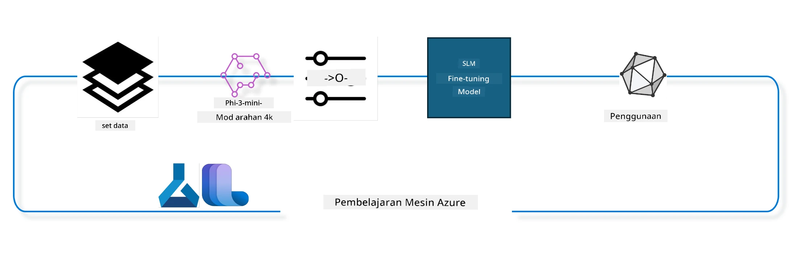

## Cara menggunakan komponen chat-completion dari daftar sistem Azure ML untuk melatih model dengan lebih tepat

Dalam contoh ini kami akan menjalankan fine tuning model Phi-3-mini-4k-instruct untuk menyelesaikan perbualan antara 2 orang menggunakan dataset ultrachat_200k.



Contoh ini akan menunjukkan cara menjalankan fine tuning menggunakan Azure ML SDK dan Python serta kemudian menyebarkan model yang telah difine tune ke titik hujung dalam talian untuk inferens masa nyata.

### Data latihan

Kami akan menggunakan dataset ultrachat_200k. Ini adalah versi yang telah disaring dengan ketat daripada dataset UltraChat dan digunakan untuk melatih Zephyr-7B-β, model chat terkini 7b.

### Model

Kami akan menggunakan model Phi-3-mini-4k-instruct untuk menunjukkan cara pengguna boleh fine tune model untuk tugas chat-completion. Jika anda membuka buku nota ini dari kad model tertentu, ingat untuk menggantikan nama model tersebut.

### Tugas

- Pilih model untuk fine tune.
- Pilih dan terokai data latihan.
- Konfigurasikan kerja fine tuning.
- Jalankan kerja fine tuning.
- Semak metrik latihan dan penilaian.
- Daftar model yang telah difine tune.
- Deploy model yang telah difine tune untuk inferens masa nyata.
- Bersihkan sumber.

## 1. Sediakan prasyarat

- Pasang kebergantungan
- Sambungkan ke AzureML Workspace. Ketahui lebih lanjut di tetapan pengesahan SDK. Gantikan <WORKSPACE_NAME>, <RESOURCE_GROUP> dan <SUBSCRIPTION_ID> di bawah.
- Sambungkan ke daftar sistem azureml
- Tetapkan nama eksperimen pilihan
- Periksa atau buat compute.

> [!NOTE]
> Keperluan satu nod GPU boleh mempunyai pelbagai kad GPU. Contohnya, dalam satu nod Standard_NC24rs_v3 terdapat 4 NVIDIA V100 GPU manakala dalam Standard_NC12s_v3, terdapat 2 NVIDIA V100 GPU. Rujuk dokumentasi untuk maklumat ini. Bilangan kad GPU setiap nod ditetapkan dalam parameter gpus_per_node di bawah. Menetapkan nilai ini dengan betul akan memastikan penggunaan semua GPU dalam nod. SKU pengkomputeran GPU yang disyorkan boleh didapati di sini dan di sini.

### Pustaka Python

Pasang kebergantungan dengan menjalankan sel di bawah. Ini bukan langkah pilihan jika dijalankan dalam persekitaran baru.

```bash
pip install azure-ai-ml
pip install azure-identity
pip install datasets==2.9.0
pip install mlflow
pip install azureml-mlflow
```

### Berinteraksi dengan Azure ML

1. Skrip Python ini digunakan untuk berinteraksi dengan perkhidmatan Azure Machine Learning (Azure ML). Berikut adalah pecahan tugasnya:

    - Ia mengimport modul yang diperlukan dari pakej azure.ai.ml, azure.identity, dan azure.ai.ml.entities. Ia juga mengimport modul time.

    - Ia cuba mengesahkan menggunakan DefaultAzureCredential(), yang menyediakan pengalaman pengesahan yang dipermudahkan untuk memulakan pembangunan aplikasi yang dijalankan di awan Azure dengan cepat. Jika gagal, ia beralih ke InteractiveBrowserCredential(), yang menyediakan prompt log masuk interaktif.

    - Ia kemudian cuba mencipta instance MLClient menggunakan kaedah from_config, yang membaca konfigurasi dari fail konfigurasi lalai (config.json). Jika gagal, ia mencipta instance MLClient dengan secara manual menyediakan subscription_id, resource_group_name, dan workspace_name.

    - Ia mencipta satu lagi instance MLClient, kali ini untuk daftar Azure ML yang dinamakan "azureml". Daftar ini adalah tempat model, pipeline fine-tuning, dan persekitaran disimpan.

    - Ia menetapkan experiment_name kepada "chat_completion_Phi-3-mini-4k-instruct".

    - Ia menjana cap masa unik dengan menukar masa semasa (dalam saat sejak epoch, sebagai nombor titik terapung) kepada integer dan kemudian kepada rentetan. Cap masa ini boleh digunakan untuk mencipta nama dan versi yang unik.

    ```python
    # Import modul yang diperlukan dari Azure ML dan Azure Identity
    from azure.ai.ml import MLClient
    from azure.identity import (
        DefaultAzureCredential,
        InteractiveBrowserCredential,
    )
    from azure.ai.ml.entities import AmlCompute
    import time  # Import modul masa
    
    # Cuba untuk mengesahkan menggunakan DefaultAzureCredential
    try:
        credential = DefaultAzureCredential()
        credential.get_token("https://management.azure.com/.default")
    except Exception as ex:  # Jika DefaultAzureCredential gagal, gunakan InteractiveBrowserCredential
        credential = InteractiveBrowserCredential()
    
    # Cuba untuk membuat instance MLClient menggunakan fail konfigurasi lalai
    try:
        workspace_ml_client = MLClient.from_config(credential=credential)
    except:  # Jika itu gagal, buat instance MLClient dengan menyediakan butiran secara manual
        workspace_ml_client = MLClient(
            credential,
            subscription_id="<SUBSCRIPTION_ID>",
            resource_group_name="<RESOURCE_GROUP>",
            workspace_name="<WORKSPACE_NAME>",
        )
    
    # Buat satu lagi instance MLClient untuk registri Azure ML bernama "azureml"
    # Registri ini adalah tempat model, saluran penalaan halus, dan persekitaran disimpan
    registry_ml_client = MLClient(credential, registry_name="azureml")
    
    # Tetapkan nama eksperimen
    experiment_name = "chat_completion_Phi-3-mini-4k-instruct"
    
    # Hasilkan cap masa unik yang boleh digunakan untuk nama dan versi yang perlu unik
    timestamp = str(int(time.time()))
    ```

## 2. Pilih model asas untuk fine tune

1. Phi-3-mini-4k-instruct adalah model ringan dengan 3.8B parameter, model terbuka terkini yang dibina berdasarkan set data yang digunakan untuk Phi-2. Model ini tergolong dalam keluarga model Phi-3, dan versi Mini terdapat dalam dua varian 4K dan 128K yang merupakan panjang konteks (dalam token) yang dapat disokong. Kita perlu fine tune model untuk tujuan khusus kita agar dapat menggunakannya. Anda boleh melayari model-model ini dalam Katalog Model di AzureML Studio, dengan penapis tugas chat-completion. Dalam contoh ini, kami menggunakan model Phi-3-mini-4k-instruct. Jika anda membuka buku nota ini untuk model yang berbeza, gantikan nama model dan versi mengikut keperluan.

> [!NOTE]
> id model adalah sifat model. Ia akan dihantar sebagai input kepada kerja fine tuning. Ini juga boleh didapati sebagai medan Asset ID dalam halaman perincian model di AzureML Studio Katalog Model.

2. Skrip Python ini berinteraksi dengan perkhidmatan Azure Machine Learning (Azure ML). Berikut pecahan tugasnya:

    - Ia menetapkan model_name kepada "Phi-3-mini-4k-instruct".

    - Ia menggunakan kaedah get bagi property models objek registry_ml_client untuk mengambil versi terkini model dengan nama yang ditentukan dari daftar Azure ML. Kaedah get dipanggil dengan dua argumen: nama model dan label yang menyatakan bahawa versi terkini model hendak diambil.

    - Ia mencetak mesej ke konsol yang menunjukkan nama, versi, dan id model yang akan digunakan untuk fine-tuning. Kaedah format rentetan digunakan untuk memasukkan nama, versi, dan id model ke dalam mesej. Nama, versi, dan id model diakses sebagai sifat objek foundation_model.

    ```python
    # Tetapkan nama model
    model_name = "Phi-3-mini-4k-instruct"
    
    # Dapatkan versi terkini model dari pendaftar Azure ML
    foundation_model = registry_ml_client.models.get(model_name, label="latest")
    
    # Cetak nama model, versi, dan id
    # Maklumat ini berguna untuk penjejakan dan penyahpepijatan
    print(
        "\n\nUsing model name: {0}, version: {1}, id: {2} for fine tuning".format(
            foundation_model.name, foundation_model.version, foundation_model.id
        )
    )
    ```

## 3. Cipta compute yang akan digunakan dengan kerja ini

Kerja fine tune berfungsi HANYA dengan pengkomputeran GPU. Saiz compute bergantung pada saiz model dan dalam kebanyakan kes sukar untuk mengenal pasti compute yang betul untuk kerja tersebut. Dalam sel ini, kami membimbing pengguna untuk memilih compute yang sesuai.

> [!NOTE]
> Compute yang disenaraikan di bawah berfungsi dengan konfigurasi paling optimum. Sebarang perubahan kepada konfigurasi mungkin menyebabkan ralat Cuda Out Of Memory. Dalam kes seperti itu, cuba naik taraf compute ke saiz compute yang lebih besar.

> [!NOTE]
> Semasa memilih compute_cluster_size di bawah, pastikan compute tersedia dalam kumpulan sumber anda. Jika compute tertentu tidak tersedia, anda boleh buat permohonan untuk mendapatkan akses ke sumber compute.

### Memeriksa Model untuk Sokongan Fine Tuning

1. Skrip Python ini berinteraksi dengan model Azure Machine Learning (Azure ML). Berikut adalah pecahan tugasnya:

    - Ia mengimport modul ast, yang menyediakan fungsi untuk memproses struktur sintaks abstrak Python.

    - Ia menyemak jika objek foundation_model (yang mewakili model dalam Azure ML) mempunyai tag bernama finetune_compute_allow_list. Tag dalam Azure ML adalah pasangan kunci-nilai yang boleh anda cipta dan gunakan untuk menapis dan menyusun model.

    - Jika tag finetune_compute_allow_list ada, ia menggunakan fungsi ast.literal_eval untuk mengurai nilai tag (rentetan) dengan selamat ke dalam senarai Python. Senarai ini kemudian diberikan kepada pembolehubah computes_allow_list. Ia kemudian mencetak mesej yang menunjukkan compute harus dicipta dari senarai itu.

    - Jika tag finetune_compute_allow_list tidak ada, ia menetapkan computes_allow_list kepada None dan mencetak mesej yang menyatakan tag finetune_compute_allow_list bukan sebahagian daripada tag model.

    - Secara ringkas, skrip ini memeriksa tag tertentu dalam metadata model, menukar nilai tag menjadi senarai jika ada, dan memberi maklumat kepada pengguna.

    ```python
    # Import modul ast, yang menyediakan fungsi untuk memproses pokok tatabahasa abstrak Python
    import ast
    
    # Periksa jika tag 'finetune_compute_allow_list' hadir dalam tag model
    if "finetune_compute_allow_list" in foundation_model.tags:
        # Jika tag hadir, gunakan ast.literal_eval untuk menafsirkan nilai tag (sebuah string) dengan selamat ke dalam senarai Python
        computes_allow_list = ast.literal_eval(
            foundation_model.tags["finetune_compute_allow_list"]
        )  # tukar string kepada senarai python
        # Cetak mesej yang menunjukkan bahawa pengiraan harus dibuat dari senarai
        print(f"Please create a compute from the above list - {computes_allow_list}")
    else:
        # Jika tag tidak hadir, tetapkan computes_allow_list kepada None
        computes_allow_list = None
        # Cetak mesej yang menunjukkan bahawa tag 'finetune_compute_allow_list' bukan sebahagian daripada tag model
        print("`finetune_compute_allow_list` is not part of model tags")
    ```

### Memeriksa Compute Instance

1. Skrip Python ini berinteraksi dengan perkhidmatan Azure Machine Learning (Azure ML) dan melakukan beberapa pemeriksaan ke atas instance compute. Berikut pecahan tugasnya:

    - Ia cuba mendapatkan instance compute dengan nama yang disimpan dalam compute_cluster dari Azure ML workspace. Jika status penyediaan instance compute adalah "failed", ia mengangkat ValueError.

    - Ia memeriksa jika computes_allow_list bukan None. Jika bukan, ia menukar semua saiz compute dalam senarai ke huruf kecil dan memeriksa jika saiz instance compute semasa ada dalam senarai itu. Jika tidak, ia mengangkat ValueError.

    - Jika computes_allow_list adalah None, ia memeriksa jika saiz instance compute ada dalam senarai saiz VM GPU yang tidak disokong. Jika ada, ia mengangkat ValueError.

    - Ia mendapatkan senarai semua saiz compute yang tersedia dalam workspace. Kemudian ia mengulangi senarai ini, dan untuk setiap saiz compute, ia memeriksa jika namanya sepadan dengan saiz instance compute semasa. Jika ya, ia mengambil bilangan GPU untuk saiz compute itu dan menetapkan gpu_count_found kepada True.

    - Jika gpu_count_found adalah True, ia mencetak bilangan GPU dalam instance compute. Jika False, ia mengangkat ValueError.

    - Secara ringkas, skrip ini melakukan beberapa pemeriksaan ke atas instance compute dalam Azure ML workspace, termasuk memeriksa status penyediaan, saiznya berbanding senarai dibenarkan atau disekat, dan bilangan GPU yang ada.

    ```python
    # Cetak mesej pengecualian
    print(e)
    # Bangkitkan ValueError jika saiz pengiraan tidak tersedia dalam ruang kerja
    raise ValueError(
        f"WARNING! Compute size {compute_cluster_size} not available in workspace"
    )
    
    # Dapatkan contoh pengiraan dari ruang kerja Azure ML
    compute = workspace_ml_client.compute.get(compute_cluster)
    # Semak jika keadaan penyediaan contoh pengiraan adalah "gagal"
    if compute.provisioning_state.lower() == "failed":
        # Bangkitkan ValueError jika keadaan penyediaan adalah "gagal"
        raise ValueError(
            f"Provisioning failed, Compute '{compute_cluster}' is in failed state. "
            f"please try creating a different compute"
        )
    
    # Semak jika computes_allow_list bukan None
    if computes_allow_list is not None:
        # Tukar semua saiz pengiraan dalam computes_allow_list kepada huruf kecil
        computes_allow_list_lower_case = [x.lower() for x in computes_allow_list]
        # Semak jika saiz contoh pengiraan terdapat dalam computes_allow_list_lower_case
        if compute.size.lower() not in computes_allow_list_lower_case:
            # Bangkitkan ValueError jika saiz contoh pengiraan tidak terdapat dalam computes_allow_list_lower_case
            raise ValueError(
                f"VM size {compute.size} is not in the allow-listed computes for finetuning"
            )
    else:
        # Tetapkan senarai saiz VM GPU yang tidak disokong
        unsupported_gpu_vm_list = [
            "standard_nc6",
            "standard_nc12",
            "standard_nc24",
            "standard_nc24r",
        ]
        # Semak jika saiz contoh pengiraan terdapat dalam unsupported_gpu_vm_list
        if compute.size.lower() in unsupported_gpu_vm_list:
            # Bangkitkan ValueError jika saiz contoh pengiraan terdapat dalam unsupported_gpu_vm_list
            raise ValueError(
                f"VM size {compute.size} is currently not supported for finetuning"
            )
    
    # Inisialisasi penanda untuk memeriksa jika bilangan GPU dalam contoh pengiraan telah ditemui
    gpu_count_found = False
    # Dapatkan senarai semua saiz pengiraan yang tersedia dalam ruang kerja
    workspace_compute_sku_list = workspace_ml_client.compute.list_sizes()
    available_sku_sizes = []
    # Ulang senarai saiz pengiraan yang tersedia
    for compute_sku in workspace_compute_sku_list:
        available_sku_sizes.append(compute_sku.name)
        # Semak jika nama saiz pengiraan sepadan dengan saiz contoh pengiraan
        if compute_sku.name.lower() == compute.size.lower():
            # Jika ya, dapatkan bilangan GPU untuk saiz pengiraan itu dan tetapkan gpu_count_found kepada True
            gpus_per_node = compute_sku.gpus
            gpu_count_found = True
    # Jika gpu_count_found adalah True, cetak bilangan GPU dalam contoh pengiraan
    if gpu_count_found:
        print(f"Number of GPU's in compute {compute.size}: {gpus_per_node}")
    else:
        # Jika gpu_count_found adalah False, bangkitkan ValueError
        raise ValueError(
            f"Number of GPU's in compute {compute.size} not found. Available skus are: {available_sku_sizes}."
            f"This should not happen. Please check the selected compute cluster: {compute_cluster} and try again."
        )
    ```

## 4. Pilih dataset untuk fine tuning model

1. Kami menggunakan dataset ultrachat_200k. Dataset ini mempunyai empat pecahan, sesuai untuk Supervised fine-tuning (sft).
Penentuan generasi (gen). Bilangan contoh bagi setiap pecahan ditunjukkan seperti berikut:

    ```bash
    train_sft test_sft  train_gen  test_gen
    207865  23110  256032  28304
    ```

1. Beberapa sel seterusnya menunjukkan penyediaan data asas untuk fine tuning:

### Visualisasikan beberapa baris data

Kami mahu contoh ini berjalan dengan cepat, jadi simpan fail train_sft, test_sft mengandungi 5% daripada baris yang sudah dipotong. Ini bermakna model fine tune akan mempunyai ketepatan yang lebih rendah, justeru tidak harus digunakan dalam situasi dunia sebenar.
download-dataset.py digunakan untuk memuat turun dataset ultrachat_200k dan menukar dataset ke format komponen pipeline fine tune yang boleh digunakan. Juga kerana dataset ini besar, kami di sini hanya mempunyai sebahagian daripada dataset.

1. Menjalankan skrip di bawah hanya memuat turun 5% data. Ini boleh ditingkatkan dengan menukar parameter dataset_split_pc kepada peratusan yang dikehendaki.

> [!NOTE]
> Sesetengah model bahasa mempunyai kod bahasa yang berbeza dan kolum dalam dataset haruslah mencerminkan perkara yang sama.

1. Berikut adalah contoh bagaimana data tersebut harus kelihatan
Dataset chat-completion disimpan dalam format parquet dengan setiap entri menggunakan skema berikut:

    - Ini adalah dokumen JSON (JavaScript Object Notation), format pertukaran data yang popular. Ia bukan kod yang boleh dijalankan, tetapi cara untuk menyimpan dan mengangkut data. Berikut adalah pecahan struktur dokumen:

    - "prompt": Kunci ini mengandungi nilai rentetan yang mewakili tugasan atau soalan yang diajukan kepada pembantu AI.

    - "messages": Kunci ini mengandungi susunan objek. Setiap objek mewakili mesej dalam perbualan antara pengguna dan pembantu AI. Setiap objek mesej mempunyai dua kunci:

    - "content": Kunci ini mengandungi nilai rentetan yang mewakili kandungan mesej.
    - "role": Kunci ini mengandungi nilai rentetan yang mewakili peranan entiti yang menghantar mesej. Ia boleh "user" atau "assistant".
    - "prompt_id": Kunci ini mengandungi nilai rentetan yang mewakili pengecam unik untuk prompt tersebut.

1. Dalam dokumen JSON khusus ini, perbualan ditunjukkan di mana seorang pengguna meminta pembantu AI untuk mencipta protagonis untuk cerita distopia. Pembantu bertindak balas, dan pengguna kemudian meminta butiran lanjut. Pembantu bersetuju untuk memberikan butiran lanjut. Keseluruhan perbualan dikaitkan dengan id prompt tertentu.

    ```python
    {
        // The task or question posed to an AI assistant
        "prompt": "Create a fully-developed protagonist who is challenged to survive within a dystopian society under the rule of a tyrant. ...",
        
        // An array of objects, each representing a message in a conversation between a user and an AI assistant
        "messages":[
            {
                // The content of the user's message
                "content": "Create a fully-developed protagonist who is challenged to survive within a dystopian society under the rule of a tyrant. ...",
                // The role of the entity that sent the message
                "role": "user"
            },
            {
                // The content of the assistant's message
                "content": "Name: Ava\n\n Ava was just 16 years old when the world as she knew it came crashing down. The government had collapsed, leaving behind a chaotic and lawless society. ...",
                // The role of the entity that sent the message
                "role": "assistant"
            },
            {
                // The content of the user's message
                "content": "Wow, Ava's story is so intense and inspiring! Can you provide me with more details.  ...",
                // The role of the entity that sent the message
                "role": "user"
            }, 
            {
                // The content of the assistant's message
                "content": "Certainly! ....",
                // The role of the entity that sent the message
                "role": "assistant"
            }
        ],
        
        // A unique identifier for the prompt
        "prompt_id": "d938b65dfe31f05f80eb8572964c6673eddbd68eff3db6bd234d7f1e3b86c2af"
    }
    ```

### Muat turun Data

1. Skrip Python ini digunakan untuk memuat turun dataset menggunakan skrip pembantu bernama download-dataset.py. Berikut adalah pecahan tugasnya:

    - Ia mengimport modul os, yang menyediakan cara boleh alih untuk menggunakan fungsi bergantung sistem operasi.

    - Ia menggunakan fungsi os.system untuk menjalankan skrip download-dataset.py di shell dengan argumen baris perintah tertentu. Argumen menentukan dataset yang ingin dimuat turun (HuggingFaceH4/ultrachat_200k), direktori untuk muat turun (ultrachat_200k_dataset), dan peratus pemisahan dataset (5). Fungsi os.system mengembalikan status keluar perintah yang dijalankan; status ini disimpan dalam pembolehubah exit_status.

    - Ia memeriksa jika exit_status bukan 0. Dalam sistem operasi seperti Unix, status keluar 0 biasanya menandakan perintah berjaya, manakala nombor lain menandakan ralat. Jika exit_status bukan 0, ia melemparkan Exception dengan mesej yang menunjukkan terdapat ralat semasa memuat turun dataset.

    - Secara ringkas, skrip ini menjalankan perintah memuat turun dataset menggunakan skrip pembantu, dan melemparkan exception jika perintah gagal.

    ```python
    # Import modul os, yang menyediakan cara untuk menggunakan fungsi bergantung kepada sistem operasi
    import os
    
    # Gunakan fungsi os.system untuk menjalankan skrip download-dataset.py dalam shell dengan argumen baris perintah tertentu
    # Argumen menentukan dataset yang akan dimuat turun (HuggingFaceH4/ultrachat_200k), direktori untuk memuat turunnya (ultrachat_200k_dataset), dan peratusan dataset untuk dipisahkan (5)
    # Fungsi os.system mengembalikan status keluar perintah yang dilaksanakannya; status ini disimpan dalam pembolehubah exit_status
    exit_status = os.system(
        "python ./download-dataset.py --dataset HuggingFaceH4/ultrachat_200k --download_dir ultrachat_200k_dataset --dataset_split_pc 5"
    )
    
    # Periksa jika exit_status bukan 0
    # Dalam sistem operasi seperti Unix, status keluar 0 biasanya menunjukkan perintah berjaya, sementara nombor lain menunjukkan ralat
    # Jika exit_status bukan 0, timbulkan Exception dengan mesej yang menunjukkan terdapat ralat semasa memuat turun dataset
    if exit_status != 0:
        raise Exception("Error downloading dataset")
    ```

### Memuatkan Data ke dalam DataFrame
1. Skrip Python ini memuatkan fail JSON Lines ke dalam DataFrame pandas dan memaparkan 5 baris pertama. Berikut adalah pecahan apa yang ia lakukan:

    - Ia mengimport perpustakaan pandas, yang merupakan perpustakaan manipulasi dan analisis data yang kuat.

    - Ia menetapkan lebar maksimum lajur untuk pilihan paparan pandas kepada 0. Ini bermakna teks penuh setiap lajur akan dipaparkan tanpa pemendekan apabila DataFrame dicetak.

    - Ia menggunakan fungsi pd.read_json untuk memuatkan fail train_sft.jsonl dari direktori ultrachat_200k_dataset ke dalam DataFrame. Argumen lines=True menunjukkan bahawa fail tersebut dalam format JSON Lines, di mana setiap baris adalah objek JSON yang berasingan.

    - Ia menggunakan kaedah head untuk memaparkan 5 baris pertama DataFrame. Jika DataFrame mempunyai kurang daripada 5 baris, ia akan memaparkan semuanya.

    - Secara ringkas, skrip ini memuatkan fail JSON Lines ke dalam DataFrame dan memaparkan 5 baris pertama dengan teks lajur penuh.
    
    ```python
    # Import perpustakaan pandas, yang merupakan perpustakaan manipulasi dan analisis data yang kuat
    import pandas as pd
    
    # Tetapkan lebar lajur maksimum untuk pilihan paparan pandas kepada 0
    # Ini bermakna teks penuh setiap lajur akan dipaparkan tanpa pemotongan apabila DataFrame dicetak
    pd.set_option("display.max_colwidth", 0)
    
    # Gunakan fungsi pd.read_json untuk memuatkan fail train_sft.jsonl dari direktori ultrachat_200k_dataset ke dalam DataFrame
    # Argumen lines=True menunjukkan bahawa fail itu dalam format JSON Lines, di mana setiap baris adalah objek JSON yang berasingan
    df = pd.read_json("./ultrachat_200k_dataset/train_sft.jsonl", lines=True)
    
    # Gunakan kaedah head untuk memaparkan 5 baris pertama DataFrame
    # Jika DataFrame mempunyai kurang daripada 5 baris, ia akan memaparkan semuanya
    df.head()
    ```

## 5. Hantar kerja penalaan halus menggunakan model dan data sebagai input

Buat kerja yang menggunakan komponen saluran paip chat-completion. Ketahui lebih lanjut tentang semua parameter yang disokong untuk penalaan halus.

### Tetapkan parameter penalaan halus

1. Parameter penalaan halus boleh dikelompokkan kepada 2 kategori - parameter latihan, parameter pengoptimuman

1. Parameter latihan menentukan aspek latihan seperti -

    - Pengoptimum, penjadual untuk digunakan
    - Metri yang dioptimumkan untuk penalaan halus
    - Bilangan langkah latihan dan saiz kelompok dan sebagainya
    - Parameter pengoptimuman membantu dalam mengoptimumkan memori GPU dan menggunakan sumber pengiraan dengan berkesan.

1. Berikut adalah beberapa parameter yang tergolong dalam kategori ini. Parameter pengoptimuman berbeza untuk setiap model dan dibungkus dengan model untuk mengendalikan variasi ini.

    - Aktifkan deepspeed dan LoRA
    - Aktifkan latihan presisi campuran
    - Aktifkan latihan multi-node

> [!NOTE]
> Penalaan halus berpantau mungkin menyebabkan kehilangan penjajaran atau pelupusan bencana. Kami mengesyorkan memeriksa isu ini dan menjalankan tahap penjajaran selepas anda menala halus.

### Parameter Penalaan Halus

1. Skrip Python ini menetapkan parameter untuk menala halus model pembelajaran mesin. Berikut adalah pecahan apa yang ia lakukan:

    - Ia menetapkan parameter latihan lalai seperti bilangan epoch latihan, saiz kelompok untuk latihan dan penilaian, kadar pembelajaran, dan jenis penjadual kadar pembelajaran.

    - Ia menetapkan parameter pengoptimuman lalai seperti sama ada untuk menggunakan Layer-wise Relevance Propagation (LoRa) dan DeepSpeed, serta tahap DeepSpeed.

    - Ia menggabungkan parameter latihan dan parameter pengoptimuman ke dalam satu kamus yang dipanggil finetune_parameters.

    - Ia memeriksa sama ada foundation_model mempunyai sebarang parameter lalai khusus model. Jika ada, ia mencetak mesej amaran dan mengemas kini kamus finetune_parameters dengan parameter lalai khusus model ini. Fungsi ast.literal_eval digunakan untuk menukar parameter lalai khusus model dari rentetan kepada kamus Python.

    - Ia mencetak set akhir parameter penalaan halus yang akan digunakan untuk larian.

    - Secara ringkas, skrip ini menetapkan dan memaparkan parameter untuk menala halus model pembelajaran mesin, dengan kemampuan untuk menggantikan parameter lalai dengan parameter khusus model.

    ```python
    # Tetapkan parameter latihan lalai seperti bilangan epoch latihan, saiz batch untuk latihan dan penilaian, kadar pembelajaran, dan jenis penjadual kadar pembelajaran
    training_parameters = dict(
        num_train_epochs=3,
        per_device_train_batch_size=1,
        per_device_eval_batch_size=1,
        learning_rate=5e-6,
        lr_scheduler_type="cosine",
    )
    
    # Tetapkan parameter pengoptimuman lalai seperti sama ada untuk menggunakan Layer-wise Relevance Propagation (LoRa) dan DeepSpeed, serta peringkat DeepSpeed
    optimization_parameters = dict(
        apply_lora="true",
        apply_deepspeed="true",
        deepspeed_stage=2,
    )
    
    # Gabungkan parameter latihan dan pengoptimuman ke dalam satu kamus yang dipanggil finetune_parameters
    finetune_parameters = {**training_parameters, **optimization_parameters}
    
    # Semak jika foundation_model mempunyai sebarang parameter lalai khusus model
    # Jika ada, cetak mesej amaran dan kemaskini kamus finetune_parameters dengan nilai lalai khusus model ini
    # Fungsi ast.literal_eval digunakan untuk menukar nilai lalai khusus model daripada string ke kamus Python
    if "model_specific_defaults" in foundation_model.tags:
        print("Warning! Model specific defaults exist. The defaults could be overridden.")
        finetune_parameters.update(
            ast.literal_eval(  # tukar string kepada kamus python
                foundation_model.tags["model_specific_defaults"]
            )
        )
    
    # Cetak set parameter penalaan akhir yang akan digunakan untuk larian tersebut
    print(
        f"The following finetune parameters are going to be set for the run: {finetune_parameters}"
    )
    ```

### Saluran Latihan

1. Skrip Python ini mentakrifkan fungsi untuk menjana nama paparan bagi saluran paip latihan pembelajaran mesin, dan kemudian memanggil fungsi ini untuk menjana dan mencetak nama paparan. Berikut adalah pecahan apa yang ia lakukan:

1. Fungsi get_pipeline_display_name ditakrifkan. Fungsi ini menjana nama paparan berdasarkan pelbagai parameter berkaitan saluran paip latihan.

1. Di dalam fungsi, ia mengira jumlah saiz kelompok dengan mendarabkan saiz kelompok setiap peranti, bilangan langkah pengumpulan kecerunan, bilangan GPU setiap nod, dan bilangan nod yang digunakan untuk penalaan halus.

1. Ia mendapatkan pelbagai parameter lain seperti jenis penjadual kadar pembelajaran, sama ada DeepSpeed digunakan, tahap DeepSpeed, sama ada Layer-wise Relevance Propagation (LoRa) digunakan, had bilangan titik pemeriksaan model yang disimpan, dan panjang urutan maksimum.

1. Ia membina satu rentetan yang merangkumi semua parameter ini, dipisahkan oleh tanda sempang. Jika DeepSpeed atau LoRa digunakan, rentetan termasuk "ds" diikuti oleh tahap DeepSpeed, atau "lora", masing-masing. Jika tidak, ia termasuk "nods" atau "nolora", masing-masing.

1. Fungsi mengembalikan rentetan ini, yang berfungsi sebagai nama paparan untuk saluran paip latihan.

1. Selepas fungsi ditakrifkan, ia dipanggil untuk menjana nama paparan, yang kemudian dicetak.

1. Secara ringkas, skrip ini menjana nama paparan untuk saluran paip latihan pembelajaran mesin berdasarkan pelbagai parameter, dan kemudian mencetak nama paparan ini.

    ```python
    # Takrifkan fungsi untuk menjana nama paparan bagi laluan latihan
    def get_pipeline_display_name():
        # Kira jumlah saiz batch dengan mendarab saiz batch setiap peranti, bilangan langkah pengumpulan kecerunan, bilangan GPU setiap nod, dan bilangan nod yang digunakan untuk penalaan halus
        batch_size = (
            int(finetune_parameters.get("per_device_train_batch_size", 1))
            * int(finetune_parameters.get("gradient_accumulation_steps", 1))
            * int(gpus_per_node)
            * int(finetune_parameters.get("num_nodes_finetune", 1))
        )
        # Dapatkan jenis penjadual kadar pembelajaran
        scheduler = finetune_parameters.get("lr_scheduler_type", "linear")
        # Dapatkan sama ada DeepSpeed digunakan
        deepspeed = finetune_parameters.get("apply_deepspeed", "false")
        # Dapatkan tahap DeepSpeed
        ds_stage = finetune_parameters.get("deepspeed_stage", "2")
        # Jika DeepSpeed digunakan, sertakan "ds" diikuti tahap DeepSpeed dalam nama paparan; jika tidak, sertakan "nods"
        if deepspeed == "true":
            ds_string = f"ds{ds_stage}"
        else:
            ds_string = "nods"
        # Dapatkan sama ada Layer-wise Relevance Propagation (LoRa) digunakan
        lora = finetune_parameters.get("apply_lora", "false")
        # Jika LoRa digunakan, sertakan "lora" dalam nama paparan; jika tidak, sertakan "nolora"
        if lora == "true":
            lora_string = "lora"
        else:
            lora_string = "nolora"
        # Dapatkan had pada bilangan titik semakan model yang disimpan
        save_limit = finetune_parameters.get("save_total_limit", -1)
        # Dapatkan panjang urutan maksimum
        seq_len = finetune_parameters.get("max_seq_length", -1)
        # Bina nama paparan dengan menggabungkan semua parameter ini, dipisahkan oleh tanda sengkang
        return (
            model_name
            + "-"
            + "ultrachat"
            + "-"
            + f"bs{batch_size}"
            + "-"
            + f"{scheduler}"
            + "-"
            + ds_string
            + "-"
            + lora_string
            + f"-save_limit{save_limit}"
            + f"-seqlen{seq_len}"
        )
    
    # Panggil fungsi untuk menjana nama paparan
    pipeline_display_name = get_pipeline_display_name()
    # Cetak nama paparan
    print(f"Display name used for the run: {pipeline_display_name}")
    ```

### Mengkonfigurasi Saluran Paip

Skrip Python ini mentakrif dan mengkonfigurasi saluran paip pembelajaran mesin menggunakan Azure Machine Learning SDK. Berikut adalah pecahan apa yang ia lakukan:

1. Ia mengimport modul yang diperlukan dari Azure AI ML SDK.

1. Ia mengambil komponen saluran paip yang dinamakan "chat_completion_pipeline" dari registri.

1. Ia mentakrifkan kerja saluran paip menggunakan dekorator `@pipeline` dan fungsi `create_pipeline`. Nama saluran paip ditetapkan kepada `pipeline_display_name`.

1. Di dalam fungsi `create_pipeline`, ia menginisialisasi komponen saluran paip yang diambil dengan pelbagai parameter, termasuk laluan model, kluster pengiraan untuk pelbagai peringkat, pecahan set data untuk latihan dan ujian, bilangan GPU untuk digunakan bagi penalaan halus, dan parameter penalaan halus lain.

1. Ia memetakan output kerja penalaan halus kepada output kerja saluran paip. Ini dilakukan supaya model yang telah ditala halus boleh didaftarkan dengan mudah, yang diperlukan untuk menghantar model ke titik akhir dalam talian atau batch.

1. Ia mencipta contoh saluran paip dengan memanggil fungsi `create_pipeline`.

1. Ia menetapkan tetapan `force_rerun` saluran paip kepada `True`, bermakna keputusan yang disimpan dari kerja sebelumnya tidak akan digunakan.

1. Ia menetapkan tetapan `continue_on_step_failure` saluran paip kepada `False`, bermakna saluran paip akan berhenti jika mana-mana langkah gagal.

1. Secara ringkas, skrip ini mentakrif dan mengkonfigurasi saluran paip pembelajaran mesin untuk tugas chat completion menggunakan Azure Machine Learning SDK.

    ```python
    # Import modul yang diperlukan daripada Azure AI ML SDK
    from azure.ai.ml.dsl import pipeline
    from azure.ai.ml import Input
    
    # Dapatkan komponen pipeline bernama "chat_completion_pipeline" daripada registri
    pipeline_component_func = registry_ml_client.components.get(
        name="chat_completion_pipeline", label="latest"
    )
    
    # Takrifkan kerja pipeline menggunakan dekorator @pipeline dan fungsi create_pipeline
    # Nama pipeline ditetapkan kepada pipeline_display_name
    @pipeline(name=pipeline_display_name)
    def create_pipeline():
        # Inisialisasi komponen pipeline yang diperoleh dengan pelbagai parameter
        # Ini termasuk laluan model, kluster pengkomputeran untuk peringkat berbeza, pembahagian set data untuk latihan dan ujian, bilangan GPU yang digunakan untuk penalaan halus, dan parameter penalaan halus lain
        chat_completion_pipeline = pipeline_component_func(
            mlflow_model_path=foundation_model.id,
            compute_model_import=compute_cluster,
            compute_preprocess=compute_cluster,
            compute_finetune=compute_cluster,
            compute_model_evaluation=compute_cluster,
            # Peta bahagian set data kepada parameter
            train_file_path=Input(
                type="uri_file", path="./ultrachat_200k_dataset/train_sft.jsonl"
            ),
            test_file_path=Input(
                type="uri_file", path="./ultrachat_200k_dataset/test_sft.jsonl"
            ),
            # Tetapan latihan
            number_of_gpu_to_use_finetuning=gpus_per_node,  # Ditetapkan kepada bilangan GPU yang tersedia dalam pengkomputeran
            **finetune_parameters
        )
        return {
            # Peta output kerja penalaan halus kepada output kerja pipeline
            # Ini dilakukan supaya kita boleh mendaftarkan model yang telah ditala dengan mudah
            # Pendaftaran model diperlukan untuk menyebarkan model ke endpoint dalam talian atau batch
            "trained_model": chat_completion_pipeline.outputs.mlflow_model_folder
        }
    
    # Buat contoh pipeline dengan memanggil fungsi create_pipeline
    pipeline_object = create_pipeline()
    
    # Jangan guna keputusan cache daripada kerja sebelumnya
    pipeline_object.settings.force_rerun = True
    
    # Tetapkan teruskan jika langkah gagal kepada False
    # Ini bermakna pipeline akan berhenti jika mana-mana langkah gagal
    pipeline_object.settings.continue_on_step_failure = False
    ```

### Hantar Kerja

1. Skrip Python ini menghantar kerja saluran paip pembelajaran mesin ke ruang kerja Azure Machine Learning dan kemudian menunggu kerja tersebut selesai. Berikut adalah pecahan apa yang ia lakukan:

    - Ia memanggil kaedah create_or_update objek jobs dalam workspace_ml_client untuk menghantar kerja saluran paip. Saluran paip untuk dijalankan ditentukan oleh pipeline_object, dan eksperimen di bawah mana kerja dijalankan ditentukan oleh experiment_name.

    - Ia kemudian memanggil kaedah stream objek jobs dalam workspace_ml_client untuk menunggu kerja saluran paip selesai. Kerja yang ditunggu ditentukan oleh atribut nama objek pipeline_job.

    - Secara ringkas, skrip ini menghantar kerja saluran paip pembelajaran mesin ke ruang kerja Azure Machine Learning, dan kemudian menunggu kerja tersebut selesai.

    ```python
    # Hantar kerja pipeline ke ruang kerja Azure Machine Learning
    # Pipeline yang akan dijalankan ditentukan oleh pipeline_object
    # Eksperimen di bawah kerja dijalankan ditentukan oleh experiment_name
    pipeline_job = workspace_ml_client.jobs.create_or_update(
        pipeline_object, experiment_name=experiment_name
    )
    
    # Tunggu kerja pipeline selesai
    # Kerja untuk ditunggu ditentukan oleh atribut nama objek pipeline_job
    workspace_ml_client.jobs.stream(pipeline_job.name)
    ```

## 6. Daftarkan model yang telah ditala halus dengan ruang kerja

Kita akan mendaftarkan model dari output kerja penalaan halus. Ini akan menjejaki keturunan antara model yang telah ditala halus dan kerja penalaan halus. Kerja penalaan halus pula menjejaki keturunan ke model asas, data dan kod latihan.

### Mendaftarkan Model ML

1. Skrip Python ini mendaftarkan model pembelajaran mesin yang telah dilatih dalam saluran paip Azure Machine Learning. Berikut adalah pecahan apa yang ia lakukan:

    - Ia mengimport modul yang diperlukan dari Azure AI ML SDK.

    - Ia memeriksa sama ada output trained_model tersedia dari kerja saluran paip dengan memanggil kaedah get objek jobs dalam workspace_ml_client dan mengakses atribut outputsnya.

    - Ia membina laluan ke model terlatih dengan memformat rentetan menggunakan nama kerja saluran paip dan nama output ("trained_model").

    - Ia mentakrifkan nama untuk model yang telah ditala halus dengan menambahkan "-ultrachat-200k" ke nama asal model dan menggantikan sebarang garisan miring dengan tanda sempang.

    - Ia bersedia untuk mendaftarkan model dengan mencipta objek Model dengan pelbagai parameter, termasuk laluan ke model, jenis model (model MLflow), nama dan versi model, dan penerangan model.

    - Ia mendaftarkan model dengan memanggil kaedah create_or_update objek models dalam workspace_ml_client dengan objek Model sebagai argumen.

    - Ia mencetak model yang telah didaftarkan.

1. Secara ringkas, skrip ini mendaftarkan model pembelajaran mesin yang telah dilatih dalam saluran paip Azure Machine Learning.
    
    ```python
    # Import modul yang diperlukan dari Azure AI ML SDK
    from azure.ai.ml.entities import Model
    from azure.ai.ml.constants import AssetTypes
    
    # Semak jika output `trained_model` tersedia dari kerja pipeline
    print("pipeline job outputs: ", workspace_ml_client.jobs.get(pipeline_job.name).outputs)
    
    # Bina laluan ke model terlatih dengan memformat string dengan nama kerja pipeline dan nama output ("trained_model")
    model_path_from_job = "azureml://jobs/{0}/outputs/{1}".format(
        pipeline_job.name, "trained_model"
    )
    
    # Tetapkan nama untuk model yang telah disesuaikan dengan menambah "-ultrachat-200k" ke nama model asal dan menggantikan sebarang garis miring dengan sempang
    finetuned_model_name = model_name + "-ultrachat-200k"
    finetuned_model_name = finetuned_model_name.replace("/", "-")
    
    print("path to register model: ", model_path_from_job)
    
    # Sediakan untuk mendaftar model dengan mencipta objek Model dengan pelbagai parameter
    # Ini termasuk laluan ke model, jenis model (model MLflow), nama dan versi model, serta penerangan model
    prepare_to_register_model = Model(
        path=model_path_from_job,
        type=AssetTypes.MLFLOW_MODEL,
        name=finetuned_model_name,
        version=timestamp,  # Gunakan cap masa sebagai versi untuk mengelakkan konflik versi
        description=model_name + " fine tuned model for ultrachat 200k chat-completion",
    )
    
    print("prepare to register model: \n", prepare_to_register_model)
    
    # Daftar model dengan memanggil kaedah create_or_update objek models dalam workspace_ml_client dengan objek Model sebagai argumen
    registered_model = workspace_ml_client.models.create_or_update(
        prepare_to_register_model
    )
    
    # Cetak model yang didaftarkan
    print("registered model: \n", registered_model)
    ```

## 7. Hantar model yang telah ditala halus ke titik akhir dalam talian

Titik akhir dalam talian memberikan API REST yang tahan lama yang boleh digunakan untuk diintegrasikan dengan aplikasi yang perlu menggunakan model tersebut.

### Urus Titik Akhir

1. Skrip Python ini mencipta titik akhir dalam talian terurus di Azure Machine Learning untuk model yang telah didaftarkan. Berikut adalah pecahan apa yang ia lakukan:

    - Ia mengimport modul yang diperlukan dari Azure AI ML SDK.

    - Ia mentakrifkan nama unik untuk titik akhir dalam talian dengan menambah cap masa ke rentetan "ultrachat-completion-".

    - Ia bersedia untuk mencipta titik akhir dalam talian dengan mencipta objek ManagedOnlineEndpoint dengan pelbagai parameter, termasuk nama titik akhir, penerangan titik akhir, dan mod pengesahan ("key").

    - Ia mencipta titik akhir dalam talian dengan memanggil kaedah begin_create_or_update workspace_ml_client dengan objek ManagedOnlineEndpoint sebagai argumen. Ia kemudian menunggu operasi penciptaan selesai dengan memanggil kaedah wait.

1. Secara ringkas, skrip ini mencipta titik akhir dalam talian terurus di Azure Machine Learning untuk model yang telah didaftarkan.

    ```python
    # Import modul yang diperlukan dari Azure AI ML SDK
    from azure.ai.ml.entities import (
        ManagedOnlineEndpoint,
        ManagedOnlineDeployment,
        ProbeSettings,
        OnlineRequestSettings,
    )
    
    # Tetapkan nama unik untuk titik hujung dalam talian dengan menambah cap masa pada rentetan "ultrachat-completion-"
    online_endpoint_name = "ultrachat-completion-" + timestamp
    
    # Sediakan untuk mencipta titik hujung dalam talian dengan membuat objek ManagedOnlineEndpoint dengan pelbagai parameter
    # Ini termasuk nama titik hujung, penerangan mengenai titik hujung, dan mod pengesahan ("key")
    endpoint = ManagedOnlineEndpoint(
        name=online_endpoint_name,
        description="Online endpoint for "
        + registered_model.name
        + ", fine tuned model for ultrachat-200k-chat-completion",
        auth_mode="key",
    )
    
    # Cipta titik hujung dalam talian dengan memanggil kaedah begin_create_or_update pada workspace_ml_client dengan objek ManagedOnlineEndpoint sebagai argumen
    # Kemudian tunggu operasi penciptaan selesai dengan memanggil kaedah wait
    workspace_ml_client.begin_create_or_update(endpoint).wait()
    ```

> [!NOTE]
> Anda boleh menemui senarai SKU yang disokong untuk penghantaran di sini - [Senarai SKU titik akhir dalam talian terurus](https://learn.microsoft.com/azure/machine-learning/reference-managed-online-endpoints-vm-sku-list)

### Menghantar Model ML

1. Skrip Python ini menghantar model pembelajaran mesin yang didaftarkan ke titik akhir dalam talian terurus di Azure Machine Learning. Berikut adalah pecahan apa yang ia lakukan:

    - Ia mengimport modul ast, yang menyediakan fungsi untuk memproses pokok sintaks abstrak Python.

    - Ia menetapkan jenis instans untuk penghantaran kepada "Standard_NC6s_v3".

    - Ia memeriksa sama ada tag inference_compute_allow_list wujud dalam model asas. Jika ada, ia menukar nilai tag dari rentetan kepada senarai Python dan menetapkannya kepada inference_computes_allow_list. Jika tidak, ia menetapkannya kepada None.

    - Ia memeriksa sama ada jenis instans yang ditetapkan ada dalam senarai dibenarkan. Jika tidak, ia mencetak mesej meminta pengguna memilih jenis instans dari senarai dibenarkan.

    - Ia bersedia untuk mencipta penghantaran dengan mencipta objek ManagedOnlineDeployment dengan pelbagai parameter, termasuk nama penghantaran, nama titik akhir, ID model, jenis dan bilangan instans, tetapan pemeriksaan hidup, dan tetapan permintaan.

    - Ia mencipta penghantaran dengan memanggil kaedah begin_create_or_update workspace_ml_client dengan objek ManagedOnlineDeployment sebagai argumen. Ia kemudian menunggu operasi penciptaan selesai dengan memanggil kaedah wait.

    - Ia menetapkan trafik titik akhir untuk mengarahkan 100% trafik ke penghantaran "demo".

    - Ia mengemas kini titik akhir dengan memanggil kaedah begin_create_or_update workspace_ml_client dengan objek titik akhir sebagai argumen. Ia kemudian menunggu operasi kemas kini selesai dengan memanggil kaedah result.

1. Secara ringkas, skrip ini menghantar model pembelajaran mesin yang didaftarkan ke titik akhir dalam talian terurus di Azure Machine Learning.

    ```python
    # Import modul ast, yang menyediakan fungsi untuk memproses pokok tatabahasa sintaks abstrak Python
    import ast
    
    # Tetapkan jenis instans untuk penempatan
    instance_type = "Standard_NC6s_v3"
    
    # Periksa jika tag `inference_compute_allow_list` wujud dalam model asas
    if "inference_compute_allow_list" in foundation_model.tags:
        # Jika ada, tukar nilai tag dari string kepada senarai Python dan tetapkan kepada `inference_computes_allow_list`
        inference_computes_allow_list = ast.literal_eval(
            foundation_model.tags["inference_compute_allow_list"]
        )
        print(f"Please create a compute from the above list - {computes_allow_list}")
    else:
        # Jika tidak, tetapkan `inference_computes_allow_list` kepada `None`
        inference_computes_allow_list = None
        print("`inference_compute_allow_list` is not part of model tags")
    
    # Periksa jika jenis instans yang ditetapkan ada dalam senarai dibenarkan
    if (
        inference_computes_allow_list is not None
        and instance_type not in inference_computes_allow_list
    ):
        print(
            f"`instance_type` is not in the allow listed compute. Please select a value from {inference_computes_allow_list}"
        )
    
    # Sediakan untuk membuat penempatan dengan mencipta objek `ManagedOnlineDeployment` dengan pelbagai parameter
    demo_deployment = ManagedOnlineDeployment(
        name="demo",
        endpoint_name=online_endpoint_name,
        model=registered_model.id,
        instance_type=instance_type,
        instance_count=1,
        liveness_probe=ProbeSettings(initial_delay=600),
        request_settings=OnlineRequestSettings(request_timeout_ms=90000),
    )
    
    # Cipta penempatan dengan memanggil kaedah `begin_create_or_update` daripada `workspace_ml_client` dengan objek `ManagedOnlineDeployment` sebagai hujah
    # Kemudian tunggu operasi penciptaan selesai dengan memanggil kaedah `wait`
    workspace_ml_client.online_deployments.begin_create_or_update(demo_deployment).wait()
    
    # Tetapkan trafik titik akhir untuk mengarahkan 100% trafik ke penempatan "demo"
    endpoint.traffic = {"demo": 100}
    
    # Kemas kini titik akhir dengan memanggil kaedah `begin_create_or_update` daripada `workspace_ml_client` dengan objek `endpoint` sebagai hujah
    # Kemudian tunggu operasi kemas kini selesai dengan memanggil kaedah `result`
    workspace_ml_client.begin_create_or_update(endpoint).result()
    ```

## 8. Uji titik akhir dengan data contoh

Kita akan mengambil beberapa data contoh dari set data ujian dan menghantarnya ke titik akhir dalam talian untuk inferens. Kemudian kita akan memaparkan label yang dijangka berserta label kebenaran asas.

### Membaca keputusan

1. Skrip Python ini membaca fail JSON Lines ke dalam DataFrame pandas, mengambil sampel rawak, dan menetapkan semula indeks. Berikut adalah pecahan apa yang ia lakukan:

    - Ia membaca fail ./ultrachat_200k_dataset/test_gen.jsonl ke dalam DataFrame pandas. Fungsi read_json digunakan dengan argumen lines=True kerana fail tersebut dalam format JSON Lines, di mana setiap baris adalah objek JSON yang berasingan.

    - Ia mengambil satu sampel rawak baris dari DataFrame. Fungsi sample digunakan dengan argumen n=1 untuk menentukan bilangan baris rawak yang dipilih.

    - Ia menetapkan semula indeks DataFrame. Fungsi reset_index digunakan dengan argumen drop=True untuk membuang indeks asal dan menggantikannya dengan indeks baru yang bernilai integer lalai.

    - Ia memaparkan 2 baris pertama DataFrame menggunakan fungsi head dengan argumen 2. Namun, kerana DataFrame hanya mengandungi satu baris selepas pensampelan, ini hanya akan memaparkan baris tersebut.

1. Secara ringkas, skrip ini membaca fail JSON Lines ke dalam DataFrame pandas, mengambil sampel rawak satu baris, menetapkan semula indeks, dan memaparkan baris pertama.
    
    ```python
    # Import perpustakaan pandas
    import pandas as pd
    
    # Baca fail JSON Lines './ultrachat_200k_dataset/test_gen.jsonl' ke dalam DataFrame pandas
    # Argumen 'lines=True' menunjukkan bahawa fail adalah dalam format JSON Lines, di mana setiap baris adalah objek JSON berasingan
    test_df = pd.read_json("./ultrachat_200k_dataset/test_gen.jsonl", lines=True)
    
    # Ambil sampel rawak sebanyak 1 baris dari DataFrame
    # Argumen 'n=1' menentukan bilangan baris rawak yang akan dipilih
    test_df = test_df.sample(n=1)
    
    # Tetapkan semula indeks DataFrame
    # Argumen 'drop=True' menunjukkan bahawa indeks asal harus dibuang dan digantikan dengan indeks baru yang bernilai integer lalai
    # Argumen 'inplace=True' menunjukkan bahawa DataFrame harus diubah suai di tempat (tanpa mencipta objek baru)
    test_df.reset_index(drop=True, inplace=True)
    
    # Paparkan 2 baris pertama DataFrame
    # Walau bagaimanapun, kerana DataFrame hanya mengandungi satu baris selepas pensampelan, ini hanya akan memaparkan satu baris itu sahaja
    test_df.head(2)
    ```

### Cipta Objek JSON
1. Skrip Python ini mencipta objek JSON dengan parameter tertentu dan menyimpannya ke dalam fail. Berikut adalah pecahan apa yang dilakukan:

    - Ia mengimport modul json, yang menyediakan fungsi untuk bekerja dengan data JSON.

    - Ia mencipta kamus parameters dengan kekunci dan nilai yang mewakili parameter untuk model pembelajaran mesin. Kekunci-kekuncinya ialah "temperature", "top_p", "do_sample", dan "max_new_tokens", dan nilai yang sepadan adalah 0.6, 0.9, True, dan 200 masing-masing.

    - Ia mencipta satu lagi kamus test_json dengan dua kekunci: "input_data" dan "params". Nilai "input_data" adalah satu kamus lain dengan kekunci "input_string" dan "parameters". Nilai "input_string" adalah satu senarai yang mengandungi mesej pertama dari DataFrame test_df. Nilai "parameters" adalah kamus parameters yang telah dicipta sebelum ini. Nilai "params" adalah kamus kosong.

    - Ia membuka fail bernama sample_score.json
    
    ```python
    # Import modul json, yang menyediakan fungsi untuk bekerja dengan data JSON
    import json
    
    # Buat sebuah kamus `parameters` dengan kunci dan nilai yang mewakili parameter untuk model pembelajaran mesin
    # Kekunci adalah "temperature", "top_p", "do_sample", dan "max_new_tokens", dan nilai yang sepadan adalah 0.6, 0.9, True, dan 200 masing-masing
    parameters = {
        "temperature": 0.6,
        "top_p": 0.9,
        "do_sample": True,
        "max_new_tokens": 200,
    }
    
    # Buat satu lagi kamus `test_json` dengan dua kekunci: "input_data" dan "params"
    # Nilai bagi "input_data" adalah sebuah kamus lain dengan kekunci "input_string" dan "parameters"
    # Nilai bagi "input_string" adalah satu senarai yang mengandungi mesej pertama dari DataFrame `test_df`
    # Nilai bagi "parameters" adalah kamus `parameters` yang dibuat sebelum ini
    # Nilai bagi "params" adalah kamus kosong
    test_json = {
        "input_data": {
            "input_string": [test_df["messages"][0]],
            "parameters": parameters,
        },
        "params": {},
    }
    
    # Buka fail bernama `sample_score.json` dalam direktori `./ultrachat_200k_dataset` dalam mod tulis
    with open("./ultrachat_200k_dataset/sample_score.json", "w") as f:
        # Tulis kamus `test_json` ke fail dalam format JSON menggunakan fungsi `json.dump`
        json.dump(test_json, f)
    ```

### Memanggil Endpoint

1. Skrip Python ini memanggil endpoint dalam talian di Azure Machine Learning untuk menilai fail JSON. Berikut adalah pecahan apa yang dilakukan:

    - Ia memanggil kaedah invoke dari sifat online_endpoints objek workspace_ml_client. Kaedah ini digunakan untuk menghantar permintaan ke endpoint dalam talian dan mendapatkan respons.

    - Ia menentukan nama endpoint dan penempatan dengan argumen endpoint_name dan deployment_name. Dalam kes ini, nama endpoint disimpan dalam pembolehubah online_endpoint_name dan nama penempatan adalah "demo".

    - Ia menentukan laluan ke fail JSON yang akan dinilai dengan argumen request_file. Dalam kes ini, fail tersebut adalah ./ultrachat_200k_dataset/sample_score.json.

    - Ia menyimpan respons dari endpoint ke dalam pembolehubah response.

    - Ia mencetak respons mentah.

1. Secara ringkas, skrip ini memanggil endpoint dalam talian di Azure Machine Learning untuk menilai fail JSON dan mencetak respons tersebut.

    ```python
    # Panggil titik akhir dalam talian di Azure Machine Learning untuk menilai fail `sample_score.json`
    # Kaedah `invoke` dari sifat `online_endpoints` objek `workspace_ml_client` digunakan untuk menghantar permintaan ke titik akhir dalam talian dan mendapatkan respons
    # Argumen `endpoint_name` menentukan nama titik akhir, yang disimpan dalam pembolehubah `online_endpoint_name`
    # Argumen `deployment_name` menentukan nama penerapan, yang merupakan "demo"
    # Argumen `request_file` menentukan laluan ke fail JSON yang hendak dinilai, iaitu `./ultrachat_200k_dataset/sample_score.json`
    response = workspace_ml_client.online_endpoints.invoke(
        endpoint_name=online_endpoint_name,
        deployment_name="demo",
        request_file="./ultrachat_200k_dataset/sample_score.json",
    )
    
    # Cetak respons mentah dari titik akhir
    print("raw response: \n", response, "\n")
    ```

## 9. Padam endpoint dalam talian

1. Jangan lupa untuk memadam endpoint dalam talian, kalau tidak anda akan membiarkan meter pengebilan berjalan untuk pengiraan yang digunakan oleh endpoint tersebut. Baris kod Python ini memadam endpoint dalam talian di Azure Machine Learning. Berikut adalah pecahan apa yang dilakukan:

    - Ia memanggil kaedah begin_delete dari sifat online_endpoints objek workspace_ml_client. Kaedah ini digunakan untuk memulakan penghapusan endpoint dalam talian.

    - Ia menentukan nama endpoint yang akan dipadamkan dengan argumen name. Dalam kes ini, nama endpoint disimpan dalam pembolehubah online_endpoint_name.

    - Ia memanggil kaedah wait untuk menunggu operasi penghapusan selesai. Ini adalah operasi yang menghalang, bermakna ia akan menghalang skrip daripada diteruskan sehingga penghapusan selesai.

    - Secara ringkas, baris kod ini memulakan penghapusan endpoint dalam talian di Azure Machine Learning dan menunggu operasi tersebut selesai.

    ```python
    # Padam titik akhir dalam talian di Azure Machine Learning
    # Kaedah `begin_delete` bagi sifat `online_endpoints` dalam objek `workspace_ml_client` digunakan untuk memulakan pemadaman titik akhir dalam talian
    # Argumen `name` menentukan nama titik akhir yang akan dipadam, yang disimpan dalam pembolehubah `online_endpoint_name`
    # Kaedah `wait` dipanggil untuk menunggu operasi pemadaman selesai. Ini adalah operasi menghalang, bermakna ia akan menghalang skrip daripada diteruskan sehingga pemadaman selesai
    workspace_ml_client.online_endpoints.begin_delete(name=online_endpoint_name).wait()
    ```

---

<!-- CO-OP TRANSLATOR DISCLAIMER START -->
**Penafian**:
Dokumen ini telah diterjemahkan menggunakan perkhidmatan terjemahan AI [Co-op Translator](https://github.com/Azure/co-op-translator). Walaupun kami berusaha untuk mencapai ketepatan, sila maklum bahawa terjemahan automatik mungkin mengandungi kesilapan atau ketidaktepatan. Dokumen asal dalam bahasa asalnya harus dianggap sebagai sumber yang sahih. Untuk maklumat yang penting, terjemahan profesional oleh manusia adalah disyorkan. Kami tidak bertanggungjawab atas sebarang salah faham atau salah tafsir yang timbul daripada penggunaan terjemahan ini.
<!-- CO-OP TRANSLATOR DISCLAIMER END -->