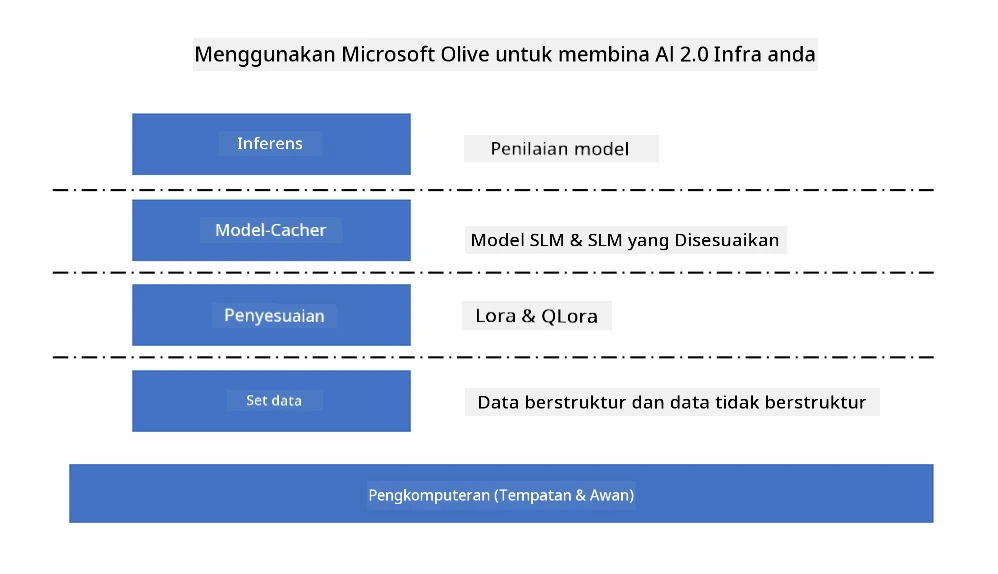

# **Penalaan Halus Phi-3 dengan Microsoft Olive**

[Olive](https://github.com/microsoft/OLive?WT.mc_id=aiml-138114-kinfeylo) adalah alat pengoptimuman model yang peka kepada perkakasan dan mudah digunakan yang menggabungkan teknik terkemuka dalam industri merangkumi pemampatan model, pengoptimuman, dan penyusunan.

Ia direka untuk memudahkan proses mengoptimumkan model pembelajaran mesin, memastikan penggunaan yang paling cekap bagi seni bina perkakasan tertentu.

Sama ada anda bekerja pada aplikasi berasaskan awan atau peranti edge, Olive membolehkan anda mengoptimumkan model anda dengan mudah dan berkesan.

## Ciri-ciri Utama:
- Olive mengumpul dan mengautomasikan teknik pengoptimuman untuk sasaran perkakasan yang dikehendaki.
- Tiada satu teknik pengoptimuman yang sesuai untuk semua senario, jadi Olive membenarkan kebolehsambungan dengan membolehkan pakar industri menyambungkan inovasi pengoptimuman mereka.

## Kurangkan Usaha Kejuruteraan:
- Pembangun sering perlu mempelajari dan menggunakan pelbagai rantaian alat khusus vendor perkakasan untuk menyediakan dan mengoptimumkan model terlatih bagi pengeluaran.
- Olive memudahkan pengalaman ini dengan mengautomasikan teknik pengoptimuman untuk perkakasan yang dikehendaki.

## Penyelesaian Pengoptimuman E2E Sedia Digunakan:

Dengan menggabungkan dan melaras teknik bersepadu, Olive menawarkan penyelesaian sehenti untuk pengoptimuman hujung ke hujung.
Ia mengambil kira kekangan seperti ketepatan dan kelewatan semasa mengoptimumkan model.

## Menggunakan Microsoft Olive untuk Penalaan Halus

Microsoft Olive adalah alat pengoptimuman model sumber terbuka yang sangat mudah digunakan yang boleh merangkumi kedua-dua penalaan halus dan rujukan dalam bidang kecerdasan buatan generatif. Ia hanya memerlukan konfigurasi ringkas, digabungkan dengan penggunaan model bahasa kecil sumber terbuka dan persekitaran runtime berkaitan (AzureML / GPU tempatan, CPU, DirectML), anda boleh menyelesaikan penalaan halus atau rujukan model melalui pengoptimuman automatik, dan mencari model terbaik untuk dikerahkan ke awan atau pada peranti edge. Membolehkan perusahaan membina model vertikal industri mereka sendiri secara on-premises dan di awan.



## Penalaan Halus Phi-3 dengan Microsoft Olive


## Contoh Kod dan Contoh Phi-3 Olive
Dalam contoh ini anda akan menggunakan Olive untuk:

- Menala halus penyesuai LoRA untuk mengklasifikasikan frasa ke dalam kategori Sedih, Gembira, Takut, Terkejut.
- Menggabungkan berat penyesuai ke dalam model asas.
- Mengoptimumkan dan Mengkuantisasi model ke dalam int4.

[Sample Code](../../code/03.Finetuning/olive-ort-example/README.md)

### Pasang Microsoft Olive

Pemasangan Microsoft Olive sangat mudah, dan juga boleh dipasang untuk CPU, GPU, DirectML, dan Azure ML

```bash
pip install olive-ai
```

Jika anda ingin menjalankan model ONNX dengan CPU, anda boleh menggunakan

```bash
pip install olive-ai[cpu]
```

Jika anda ingin menjalankan model ONNX dengan GPU, anda boleh menggunakan

```python
pip install olive-ai[gpu]
```

Jika anda ingin menggunakan Azure ML, gunakan

```python
pip install git+https://github.com/microsoft/Olive#egg=olive-ai[azureml]
```

**Perhatian**  
Keperluan OS: Ubuntu 20.04 / 22.04

### **Config.json Microsoft Olive**

Selepas pemasangan, anda boleh mengkonfigurasi tetapan khusus model yang berbeza melalui fail Config, termasuk data, pengkomputeran, latihan, pengeluaran, dan penjanaan model.

**1. Data**

Pada Microsoft Olive, latihan pada data tempatan dan data awan boleh disokong, dan boleh dikonfigurasi dalam tetapan.

*Tetapan data tempatan*

Anda boleh dengan mudah menyediakan set data yang perlu dilatih untuk penalaan halus, biasanya dalam format json, dan sesuaikan dengan templat data. Ini perlu disesuaikan berdasarkan keperluan model (contohnya, sesuaikan dengan format yang diperlukan oleh Microsoft Phi-3-mini. Jika anda mempunyai model lain, sila rujuk format penalaan halus yang diperlukan oleh model lain untuk pemprosesan)

```json

    "data_configs": [
        {
            "name": "dataset_default_train",
            "type": "HuggingfaceContainer",
            "load_dataset_config": {
                "params": {
                    "data_name": "json", 
                    "data_files":"dataset/dataset-classification.json",
                    "split": "train"
                }
            },
            "pre_process_data_config": {
                "params": {
                    "dataset_type": "corpus",
                    "text_cols": [
                            "phrase",
                            "tone"
                    ],
                    "text_template": "### Text: {phrase}\n### The tone is:\n{tone}",
                    "corpus_strategy": "join",
                    "source_max_len": 2048,
                    "pad_to_max_len": false,
                    "use_attention_mask": false
                }
            }
        }
    ],
```

**Tetapan sumber data awan**

Dengan menghubungkan stor data Azure AI Studio/Azure Machine Learning Service untuk mengakses data di awan, anda boleh memilih untuk memperkenalkan pelbagai sumber data ke Azure AI Studio/Azure Machine Learning Service melalui Microsoft Fabric dan Azure Data sebagai sokongan untuk penalaan halus data.

```json

    "data_configs": [
        {
            "name": "dataset_default_train",
            "type": "HuggingfaceContainer",
            "load_dataset_config": {
                "params": {
                    "data_name": "json", 
                    "data_files": {
                        "type": "azureml_datastore",
                        "config": {
                            "azureml_client": {
                                "subscription_id": "Your Azure Subscrition ID",
                                "resource_group": "Your Azure Resource Group",
                                "workspace_name": "Your Azure ML Workspaces name"
                            },
                            "datastore_name": "workspaceblobstore",
                            "relative_path": "Your train_data.json Azure ML Location"
                        }
                    },
                    "split": "train"
                }
            },
            "pre_process_data_config": {
                "params": {
                    "dataset_type": "corpus",
                    "text_cols": [
                            "Question",
                            "Best Answer"
                    ],
                    "text_template": "<|user|>\n{Question}<|end|>\n<|assistant|>\n{Best Answer}\n<|end|>",
                    "corpus_strategy": "join",
                    "source_max_len": 2048,
                    "pad_to_max_len": false,
                    "use_attention_mask": false
                }
            }
        }
    ],
    
```

**2. Konfigurasi Pengkomputeran**

Jika anda perlu menggunakan sumber tempatan, anda boleh terus menggunakan sumber data tempatan. Jika anda perlu menggunakan sumber Azure AI Studio / Azure Machine Learning Service, anda perlu mengkonfigurasi parameter Azure yang berkaitan, nama kuasa pengkomputeran, dan lain-lain.

```json

    "systems": {
        "aml": {
            "type": "AzureML",
            "config": {
                "accelerators": ["gpu"],
                "hf_token": true,
                "aml_compute": "Your Azure AI Studio / Azure Machine Learning Service Compute Name",
                "aml_docker_config": {
                    "base_image": "Your Azure AI Studio / Azure Machine Learning Service docker",
                    "conda_file_path": "conda.yaml"
                }
            }
        },
        "azure_arc": {
            "type": "AzureML",
            "config": {
                "accelerators": ["gpu"],
                "aml_compute": "Your Azure AI Studio / Azure Machine Learning Service Compute Name",
                "aml_docker_config": {
                    "base_image": "Your Azure AI Studio / Azure Machine Learning Service docker",
                    "conda_file_path": "conda.yaml"
                }
            }
        }
    },
```

***Perhatian***

Kerana ia dijalankan melalui kontena di Azure AI Studio/Azure Machine Learning Service, persekitaran yang diperlukan perlu dikonfigurasi. Ini dikonfigurasi dalam persekitaran conda.yaml.

```yaml

name: project_environment
channels:
  - defaults
dependencies:
  - python=3.8.13
  - pip=22.3.1
  - pip:
      - einops
      - accelerate
      - azure-keyvault-secrets
      - azure-identity
      - bitsandbytes
      - datasets
      - huggingface_hub
      - peft
      - scipy
      - sentencepiece
      - torch>=2.2.0
      - transformers
      - git+https://github.com/microsoft/Olive@jiapli/mlflow_loading_fix#egg=olive-ai[gpu]
      - --extra-index-url https://aiinfra.pkgs.visualstudio.com/PublicPackages/_packaging/ORT-Nightly/pypi/simple/ 
      - ort-nightly-gpu==1.18.0.dev20240307004
      - --extra-index-url https://aiinfra.pkgs.visualstudio.com/PublicPackages/_packaging/onnxruntime-genai/pypi/simple/
      - onnxruntime-genai-cuda

    

```

**3. Pilih SLM anda**

Anda boleh menggunakan model terus dari Hugging face, atau anda boleh menggabungkannya terus dengan Katalog Model Azure AI Studio / Azure Machine Learning untuk memilih model yang hendak digunakan. Dalam contoh kod di bawah, kami akan menggunakan Microsoft Phi-3-mini sebagai contoh.

Jika anda mempunyai model secara tempatan, anda boleh menggunakan kaedah ini

```json

    "input_model":{
        "type": "PyTorchModel",
        "config": {
            "hf_config": {
                "model_name": "model-cache/microsoft/phi-3-mini",
                "task": "text-generation",
                "model_loading_args": {
                    "trust_remote_code": true
                }
            }
        }
    },
```

Jika anda ingin menggunakan model dari Azure AI Studio / Azure Machine Learning Service, anda boleh menggunakan kaedah ini

```json

    "input_model":{
        "type": "PyTorchModel",
        "config": {
            "model_path": {
                "type": "azureml_registry_model",
                "config": {
                    "name": "microsoft/Phi-3-mini-4k-instruct",
                    "registry_name": "azureml-msr",
                    "version": "11"
                }
            },
             "model_file_format": "PyTorch.MLflow",
             "hf_config": {
                "model_name": "microsoft/Phi-3-mini-4k-instruct",
                "task": "text-generation",
                "from_pretrained_args": {
                    "trust_remote_code": true
                }
            }
        }
    },
```

**Perhatian:**  
Kita perlu berintegrasi dengan Azure AI Studio / Azure Machine Learning Service, jadi semasa menyediakan model, sila rujuk nombor versi dan penamaan berkaitan.

Semua model di Azure perlu ditetapkan kepada PyTorch.MLflow

Anda perlu mempunyai akaun Hugging face dan mengikat kunci kepada nilai Kunci Azure AI Studio / Azure Machine Learning

**4. Algoritma**

Microsoft Olive membungkus algoritma penalaan halus Lora dan QLora dengan sangat baik. Apa yang anda perlu konfigurasi hanyalah beberapa parameter berkaitan. Di sini saya ambil QLora sebagai contoh.

```json
        "lora": {
            "type": "LoRA",
            "config": {
                "target_modules": [
                    "o_proj",
                    "qkv_proj"
                ],
                "double_quant": true,
                "lora_r": 64,
                "lora_alpha": 64,
                "lora_dropout": 0.1,
                "train_data_config": "dataset_default_train",
                "eval_dataset_size": 0.3,
                "training_args": {
                    "seed": 0,
                    "data_seed": 42,
                    "per_device_train_batch_size": 1,
                    "per_device_eval_batch_size": 1,
                    "gradient_accumulation_steps": 4,
                    "gradient_checkpointing": false,
                    "learning_rate": 0.0001,
                    "num_train_epochs": 3,
                    "max_steps": 10,
                    "logging_steps": 10,
                    "evaluation_strategy": "steps",
                    "eval_steps": 187,
                    "group_by_length": true,
                    "adam_beta2": 0.999,
                    "max_grad_norm": 0.3
                }
            }
        },
```

Jika anda ingin penukaran kuantisasi, cawangan utama Microsoft Olive sudah menyokong kaedah onnxruntime-genai. Anda boleh menetapkannya mengikut keperluan anda:

1. gabungkan berat penyesuai ke dalam model asas  
2. Tukar model kepada model onnx dengan ketepatan yang diperlukan oleh ModelBuilder

contohnya menukar kepada kuantisasi INT4

```json

        "merge_adapter_weights": {
            "type": "MergeAdapterWeights"
        },
        "builder": {
            "type": "ModelBuilder",
            "config": {
                "precision": "int4"
            }
        }
```

**Perhatian**  
- Jika anda menggunakan QLoRA, penukaran kuantisasi ONNXRuntime-genai buat masa ini tidak disokong.

- Perlu dinyatakan di sini bahawa anda boleh menetapkan langkah-langkah di atas mengikut keperluan sendiri. Tidak perlu mengkonfigurasi sepenuhnya semua langkah di atas. Bergantung pada keperluan anda, anda boleh terus menggunakan langkah algoritma tanpa penalaan halus. Akhir sekali, anda perlu mengkonfigurasi enjin yang berkaitan.

```json

    "engine": {
        "log_severity_level": 0,
        "host": "aml",
        "target": "aml",
        "search_strategy": false,
        "execution_providers": ["CUDAExecutionProvider"],
        "cache_dir": "../model-cache/models/phi3-finetuned/cache",
        "output_dir" : "../model-cache/models/phi3-finetuned"
    }
```

**5. Penalaan halus selesai**

Di baris arahan, jalankan dalam direktori olive-config.json

```bash
olive run --config olive-config.json  
```

**Penafian**:  
Dokumen ini telah diterjemahkan menggunakan perkhidmatan terjemahan AI [Co-op Translator](https://github.com/Azure/co-op-translator). Walaupun kami berusaha untuk ketepatan, sila ambil maklum bahawa terjemahan automatik mungkin mengandungi kesilapan atau ketidaktepatan. Dokumen asal dalam bahasa asalnya harus dianggap sebagai sumber yang sahih. Untuk maklumat penting, terjemahan profesional oleh manusia adalah disyorkan. Kami tidak bertanggungjawab atas sebarang salah faham atau salah tafsir yang timbul daripada penggunaan terjemahan ini.