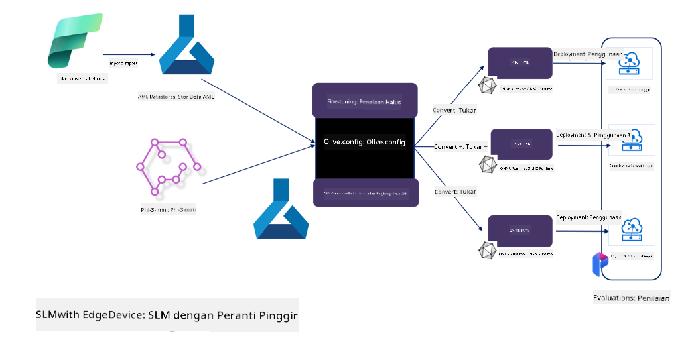

<!--
CO_OP_TRANSLATOR_METADATA:
{
  "original_hash": "5764be88ad2eb4f341e742eb8f14fab1",
  "translation_date": "2025-05-09T20:53:47+00:00",
  "source_file": "md/03.FineTuning/FineTuning_MicrosoftOlive.md",
  "language_code": "ms"
}
-->
# **כיוונון עדין של Phi-3 עם Microsoft Olive**

[Olive](https://github.com/microsoft/OLive?WT.mc_id=aiml-138114-kinfeylo) היא כלי אופטימיזציה מודלי המודע לחומרה, שקל לשימוש, שמאגד טכניקות מובילות בתעשייה לדחיסה, אופטימיזציה וקומפילציה של מודלים.

היא נועדה לפשט את תהליך אופטימיזציית מודלי למידת מכונה, ולהבטיח שימוש יעיל ככל האפשר בארכיטקטורות חומרה ספציפיות.

בין אם אתם עובדים על יישומים בענן או במכשירי קצה, Olive מאפשרת לכם לבצע אופטימיזציה למודלים שלכם בקלות וביעילות.

## תכונות עיקריות:
- Olive מאחדת ומאוטומטת טכניקות אופטימיזציה עבור יעדי חומרה ספציפיים.
- אין טכניקת אופטימיזציה אחת שמתאימה לכל התרחישים, לכן Olive מאפשרת הרחבה על ידי חיבור חידושים אופטימיזציה של מומחים בתעשייה.

## צמצום מאמץ ההנדסה:
- מפתחים לעיתים צריכים ללמוד ולהשתמש במספר ערכות כלים ייחודיות לספקי חומרה שונים כדי להכין ולאופטם מודלים מאומנים לפריסה.
- Olive מפשטת את החוויה הזו על ידי אוטומציה של טכניקות האופטימיזציה עבור החומרה הרצויה.

## פתרון אופטימיזציה מקצה-לקצה מוכן לשימוש:

באמצעות קומפוזיציה וכיוונון של טכניקות משולבות, Olive מציעה פתרון מאוחד לאופטימיזציה מקצה-לקצה.
היא מתחשבת במגבלות כמו דיוק ושהייה בזמן האופטימיזציה של המודלים.

## שימוש ב-Microsoft Olive לכיוונון עדין

Microsoft Olive היא כלי קוד פתוח לאופטימיזציית מודלים, קל מאוד לשימוש, שיכול לכסות גם כיוונון עדין וגם רפרנס בתחום הבינה המלאכותית הגנרטיבית. נדרשת רק קונפיגורציה פשוטה, בשילוב עם שימוש במודלים קטנים של שפה בקוד פתוח וסביבות ריצה קשורות (AzureML / GPU מקומי, CPU, DirectML), כך שניתן להשלים את הכיוונון העדין או הרפרנס של המודל דרך אופטימיזציה אוטומטית, ולמצוא את המודל הטוב ביותר לפריסה בענן או במכשירי קצה. מאפשר לארגונים לבנות מודלים אנכיים תעשייתיים משלהם הן מקומית והן בענן.


## כיוונון עדין של Phi-3 עם Microsoft Olive



## קוד לדוגמה ודוגמה ל-Phi-3 Olive
בדוגמה זו תשתמשו ב-Olive כדי:

- לכוונן עדין מתאם LoRA לסיווג ביטויים ל-Sad, Joy, Fear, Surprise.
- למזג את משקלי המתאם לתוך המודל הבסיסי.
- לאופטם וכוונן את המודל ל-int4.

[Sample Code](../../code/03.Finetuning/olive-ort-example/README.md)

### התקנת Microsoft Olive

התקנת Microsoft Olive פשוטה מאוד, וניתן להתקין אותה עבור CPU, GPU, DirectML ו-Azure ML

```bash
pip install olive-ai
```

אם ברצונכם להריץ מודל ONNX על CPU, ניתן להשתמש ב

```bash
pip install olive-ai[cpu]
```

אם ברצונכם להריץ מודל ONNX על GPU, ניתן להשתמש ב

```python
pip install olive-ai[gpu]
```

אם ברצונכם להשתמש ב-Azure ML, השתמשו ב

```python
pip install git+https://github.com/microsoft/Olive#egg=olive-ai[azureml]
```

**הערה**
דרישות מערכת הפעלה: Ubuntu 20.04 / 22.04

### **קובץ Config.json של Microsoft Olive**

לאחר ההתקנה, ניתן להגדיר הגדרות ספציפיות למודל דרך קובץ הקונפיגורציה, כולל נתונים, חישוב, אימון, פריסה ויצירת מודל.

**1. נתונים**

ב-Microsoft Olive, ניתן לתמוך באימון על נתונים מקומיים ונתוני ענן, וניתן להגדיר זאת בהגדרות.

*הגדרות נתונים מקומיים*

ניתן להגדיר בקלות את מערך הנתונים שיש לאמן לכיוונון עדין, בדרך כלל בפורמט json, ולהתאים אותו לתבנית הנתונים. יש להתאים זאת בהתאם לדרישות המודל (לדוגמה, להתאים לפורמט הדרוש ל-Microsoft Phi-3-mini. אם יש לכם מודלים אחרים, יש לעיין בדרישות הכיוונון העדין של אותם מודלים לעיבוד)

```json

    "data_configs": [
        {
            "name": "dataset_default_train",
            "type": "HuggingfaceContainer",
            "load_dataset_config": {
                "params": {
                    "data_name": "json", 
                    "data_files":"dataset/dataset-classification.json",
                    "split": "train"
                }
            },
            "pre_process_data_config": {
                "params": {
                    "dataset_type": "corpus",
                    "text_cols": [
                            "phrase",
                            "tone"
                    ],
                    "text_template": "### Text: {phrase}\n### The tone is:\n{tone}",
                    "corpus_strategy": "join",
                    "source_max_len": 2048,
                    "pad_to_max_len": false,
                    "use_attention_mask": false
                }
            }
        }
    ],
```

**הגדרות מקור נתוני ענן**

על ידי קישור מחסן הנתונים של Azure AI Studio/Azure Machine Learning Service לנתונים בענן, ניתן לבחור להכניס מקורות נתונים שונים ל-Azure AI Studio/Azure Machine Learning Service דרך Microsoft Fabric ו-Azure Data כתמיכה לכיוונון הנתונים.

```json

    "data_configs": [
        {
            "name": "dataset_default_train",
            "type": "HuggingfaceContainer",
            "load_dataset_config": {
                "params": {
                    "data_name": "json", 
                    "data_files": {
                        "type": "azureml_datastore",
                        "config": {
                            "azureml_client": {
                                "subscription_id": "Your Azure Subscrition ID",
                                "resource_group": "Your Azure Resource Group",
                                "workspace_name": "Your Azure ML Workspaces name"
                            },
                            "datastore_name": "workspaceblobstore",
                            "relative_path": "Your train_data.json Azure ML Location"
                        }
                    },
                    "split": "train"
                }
            },
            "pre_process_data_config": {
                "params": {
                    "dataset_type": "corpus",
                    "text_cols": [
                            "Question",
                            "Best Answer"
                    ],
                    "text_template": "<|user|>\n{Question}<|end|>\n<|assistant|>\n{Best Answer}\n<|end|>",
                    "corpus_strategy": "join",
                    "source_max_len": 2048,
                    "pad_to_max_len": false,
                    "use_attention_mask": false
                }
            }
        }
    ],
    
```

**2. הגדרת חישוב**

אם יש צורך להריץ מקומית, ניתן להשתמש ישירות במשאבי הנתונים המקומיים. אם רוצים להשתמש במשאבי Azure AI Studio / Azure Machine Learning Service, יש להגדיר את הפרמטרים הרלוונטיים של Azure, שם החישוב וכו'.

```json

    "systems": {
        "aml": {
            "type": "AzureML",
            "config": {
                "accelerators": ["gpu"],
                "hf_token": true,
                "aml_compute": "Your Azure AI Studio / Azure Machine Learning Service Compute Name",
                "aml_docker_config": {
                    "base_image": "Your Azure AI Studio / Azure Machine Learning Service docker",
                    "conda_file_path": "conda.yaml"
                }
            }
        },
        "azure_arc": {
            "type": "AzureML",
            "config": {
                "accelerators": ["gpu"],
                "aml_compute": "Your Azure AI Studio / Azure Machine Learning Service Compute Name",
                "aml_docker_config": {
                    "base_image": "Your Azure AI Studio / Azure Machine Learning Service docker",
                    "conda_file_path": "conda.yaml"
                }
            }
        }
    },
```

***הערה***

מאחר שההרצה מתבצעת דרך מכולה ב-Azure AI Studio/Azure Machine Learning Service, יש להגדיר את סביבת העבודה הדרושה. הגדרה זו מתבצעת בקובץ conda.yaml.

```yaml

name: project_environment
channels:
  - defaults
dependencies:
  - python=3.8.13
  - pip=22.3.1
  - pip:
      - einops
      - accelerate
      - azure-keyvault-secrets
      - azure-identity
      - bitsandbytes
      - datasets
      - huggingface_hub
      - peft
      - scipy
      - sentencepiece
      - torch>=2.2.0
      - transformers
      - git+https://github.com/microsoft/Olive@jiapli/mlflow_loading_fix#egg=olive-ai[gpu]
      - --extra-index-url https://aiinfra.pkgs.visualstudio.com/PublicPackages/_packaging/ORT-Nightly/pypi/simple/ 
      - ort-nightly-gpu==1.18.0.dev20240307004
      - --extra-index-url https://aiinfra.pkgs.visualstudio.com/PublicPackages/_packaging/onnxruntime-genai/pypi/simple/
      - onnxruntime-genai-cuda

    

```

**3. בחירת SLM**

ניתן להשתמש במודל ישירות מ-Hugging face, או לשלב אותו עם קטלוג המודלים של Azure AI Studio / Azure Machine Learning כדי לבחור את המודל הרצוי. בדוגמת הקוד למטה נשתמש ב-Microsoft Phi-3-mini כדוגמה.

אם יש לכם את המודל מקומית, ניתן להשתמש בשיטה זו

```json

    "input_model":{
        "type": "PyTorchModel",
        "config": {
            "hf_config": {
                "model_name": "model-cache/microsoft/phi-3-mini",
                "task": "text-generation",
                "model_loading_args": {
                    "trust_remote_code": true
                }
            }
        }
    },
```

אם רוצים להשתמש במודל מ-Azure AI Studio / Azure Machine Learning Service, ניתן להשתמש בשיטה זו

```json

    "input_model":{
        "type": "PyTorchModel",
        "config": {
            "model_path": {
                "type": "azureml_registry_model",
                "config": {
                    "name": "microsoft/Phi-3-mini-4k-instruct",
                    "registry_name": "azureml-msr",
                    "version": "11"
                }
            },
             "model_file_format": "PyTorch.MLflow",
             "hf_config": {
                "model_name": "microsoft/Phi-3-mini-4k-instruct",
                "task": "text-generation",
                "from_pretrained_args": {
                    "trust_remote_code": true
                }
            }
        }
    },
```

**הערה:**
יש אינטגרציה עם Azure AI Studio / Azure Machine Learning Service, לכן בעת הגדרת המודל יש לעיין במספר הגרסה והשמות הרלוונטיים.

כל המודלים ב-Azure צריכים להיות מוגדרים כ-PyTorch.MLflow

יש צורך בחשבון Hugging face ולחבר את המפתח לערך המפתח של Azure AI Studio / Azure Machine Learning

**4. אלגוריתם**

Microsoft Olive מכילה היטב את אלגוריתמי כיוונון LoRA ו-QLora. כל מה שצריך להגדיר הם כמה פרמטרים רלוונטיים. כאן נשתמש ב-QLora כדוגמה.

```json
        "lora": {
            "type": "LoRA",
            "config": {
                "target_modules": [
                    "o_proj",
                    "qkv_proj"
                ],
                "double_quant": true,
                "lora_r": 64,
                "lora_alpha": 64,
                "lora_dropout": 0.1,
                "train_data_config": "dataset_default_train",
                "eval_dataset_size": 0.3,
                "training_args": {
                    "seed": 0,
                    "data_seed": 42,
                    "per_device_train_batch_size": 1,
                    "per_device_eval_batch_size": 1,
                    "gradient_accumulation_steps": 4,
                    "gradient_checkpointing": false,
                    "learning_rate": 0.0001,
                    "num_train_epochs": 3,
                    "max_steps": 10,
                    "logging_steps": 10,
                    "evaluation_strategy": "steps",
                    "eval_steps": 187,
                    "group_by_length": true,
                    "adam_beta2": 0.999,
                    "max_grad_norm": 0.3
                }
            }
        },
```

אם רוצים המרת כימות, הסניף הראשי של Microsoft Olive כבר תומך בשיטת onnxruntime-genai. ניתן להגדיר זאת לפי הצורך:

1. למזג את משקלי המתאם לתוך המודל הבסיסי
2. להמיר את המודל למודל onnx עם הדיוק הנדרש באמצעות ModelBuilder

כמו המרה ל-INT4 מכוונן

```json

        "merge_adapter_weights": {
            "type": "MergeAdapterWeights"
        },
        "builder": {
            "type": "ModelBuilder",
            "config": {
                "precision": "int4"
            }
        }
```

**הערה**
- אם משתמשים ב-QLoRA, המרת הכימות של ONNXRuntime-genai אינה נתמכת כרגע.

- יש לציין שניתן להגדיר את השלבים שלמעלה לפי הצורך. אין חובה להגדיר את כל השלבים במלואם. בהתאם לצורך, ניתן להשתמש ישירות בשלבי האלגוריתם ללא כיוונון עדין. בסופו של דבר יש להגדיר את המנועים הרלוונטיים.

```json

    "engine": {
        "log_severity_level": 0,
        "host": "aml",
        "target": "aml",
        "search_strategy": false,
        "execution_providers": ["CUDAExecutionProvider"],
        "cache_dir": "../model-cache/models/phi3-finetuned/cache",
        "output_dir" : "../model-cache/models/phi3-finetuned"
    }
```

**5. סיום הכיוונון העדין**

בשורת הפקודה, להריץ בתיקיית olive-config.json

```bash
olive run --config olive-config.json  
```

**Penafian**:  
Dokumen ini telah diterjemahkan menggunakan perkhidmatan terjemahan AI [Co-op Translator](https://github.com/Azure/co-op-translator). Walaupun kami berusaha untuk ketepatan, sila ambil perhatian bahawa terjemahan automatik mungkin mengandungi kesilapan atau ketidaktepatan. Dokumen asal dalam bahasa asalnya harus dianggap sebagai sumber yang sahih. Untuk maklumat penting, terjemahan profesional oleh manusia adalah disyorkan. Kami tidak bertanggungjawab atas sebarang salah faham atau salah tafsir yang timbul daripada penggunaan terjemahan ini.