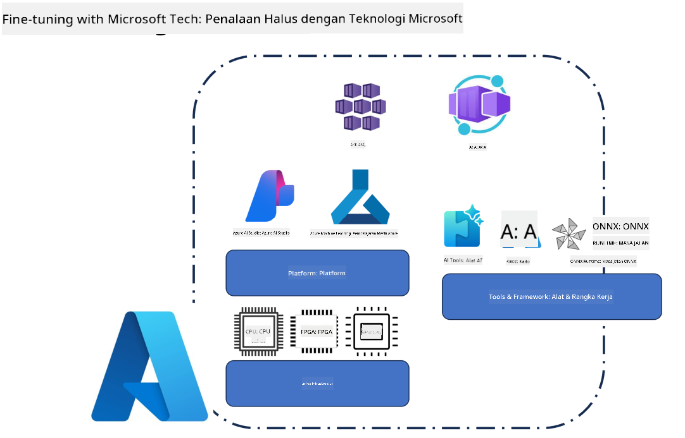
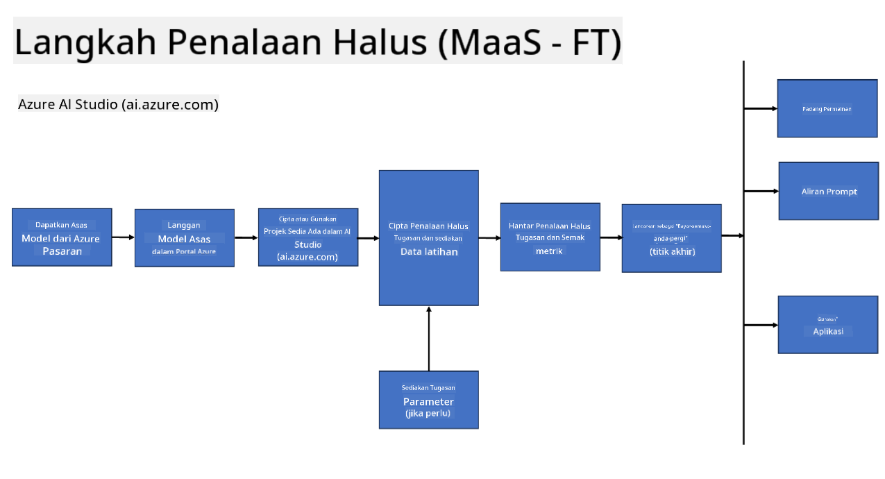

<!--
CO_OP_TRANSLATOR_METADATA:
{
  "original_hash": "cb5648935f63edc17e95ce38f23adc32",
  "translation_date": "2025-07-17T08:29:04+00:00",
  "source_file": "md/03.FineTuning/FineTuning_Scenarios.md",
  "language_code": "ms"
}
-->
## Senario Penalaan Halus

**Platform** Ini merangkumi pelbagai teknologi seperti Azure AI Foundry, Azure Machine Learning, AI Tools, Kaito, dan ONNX Runtime.

**Infrastruktur** Ini merangkumi CPU dan FPGA, yang penting untuk proses penalaan halus. Saya akan tunjukkan ikon untuk setiap teknologi ini.

**Alat & Rangka Kerja** Ini merangkumi ONNX Runtime dan ONNX Runtime. Saya akan tunjukkan ikon untuk setiap teknologi ini.  
[Masukkan ikon untuk ONNX Runtime dan ONNX Runtime]

Proses penalaan halus dengan teknologi Microsoft melibatkan pelbagai komponen dan alat. Dengan memahami dan menggunakan teknologi ini, kita dapat menala aplikasi dengan berkesan dan mencipta penyelesaian yang lebih baik.

## Model sebagai Perkhidmatan

Tala halus model menggunakan penalaan halus yang dihoskan, tanpa perlu mencipta dan menguruskan pengkomputeran.

Penalaan halus tanpa pelayan tersedia untuk model Phi-3-mini dan Phi-3-medium, membolehkan pembangun menyesuaikan model dengan cepat dan mudah untuk senario awan dan edge tanpa perlu mengatur pengkomputeran. Kami juga telah mengumumkan bahawa Phi-3-small kini tersedia melalui tawaran Models-as-a-Service kami supaya pembangun dapat memulakan pembangunan AI dengan cepat dan mudah tanpa perlu menguruskan infrastruktur asas.

## Model sebagai Platform

Pengguna menguruskan pengkomputeran mereka sendiri untuk menala halus model mereka.

[Contoh Penalaan Halus](https://github.com/Azure/azureml-examples/blob/main/sdk/python/foundation-models/system/finetune/chat-completion/chat-completion.ipynb)

## Senario Penalaan Halus

| | | | | | | |
|-|-|-|-|-|-|-|
|Senario|LoRA|QLoRA|PEFT|DeepSpeed|ZeRO|DORA|
|Menyesuaikan LLM yang telah dilatih untuk tugasan atau domain tertentu|Ya|Ya|Ya|Ya|Ya|Ya|
|Penalaan halus untuk tugasan NLP seperti klasifikasi teks, pengecaman entiti bernama, dan terjemahan mesin|Ya|Ya|Ya|Ya|Ya|Ya|
|Penalaan halus untuk tugasan QA|Ya|Ya|Ya|Ya|Ya|Ya|
|Penalaan halus untuk menghasilkan respons seperti manusia dalam chatbot|Ya|Ya|Ya|Ya|Ya|Ya|
|Penalaan halus untuk menghasilkan muzik, seni, atau bentuk kreativiti lain|Ya|Ya|Ya|Ya|Ya|Ya|
|Mengurangkan kos pengkomputeran dan kewangan|Ya|Ya|Tidak|Ya|Ya|Tidak|
|Mengurangkan penggunaan memori|Tidak|Ya|Tidak|Ya|Ya|Ya|
|Menggunakan parameter yang lebih sedikit untuk penalaan halus yang cekap|Tidak|Ya|Ya|Tidak|Tidak|Ya|
|Bentuk paralelisme data yang cekap memori yang memberikan akses kepada jumlah memori GPU bagi semua peranti GPU yang tersedia|Tidak|Tidak|Tidak|Ya|Ya|Ya|

## Contoh Prestasi Penalaan Halus

**Penafian**:  
Dokumen ini telah diterjemahkan menggunakan perkhidmatan terjemahan AI [Co-op Translator](https://github.com/Azure/co-op-translator). Walaupun kami berusaha untuk ketepatan, sila ambil maklum bahawa terjemahan automatik mungkin mengandungi kesilapan atau ketidaktepatan. Dokumen asal dalam bahasa asalnya harus dianggap sebagai sumber yang sahih. Untuk maklumat penting, terjemahan profesional oleh manusia adalah disyorkan. Kami tidak bertanggungjawab atas sebarang salah faham atau salah tafsir yang timbul daripada penggunaan terjemahan ini.