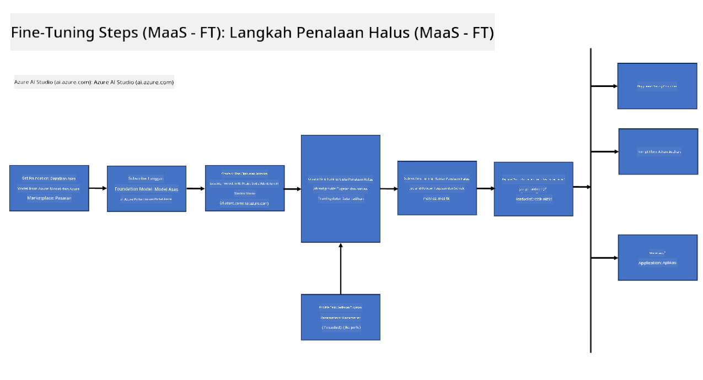
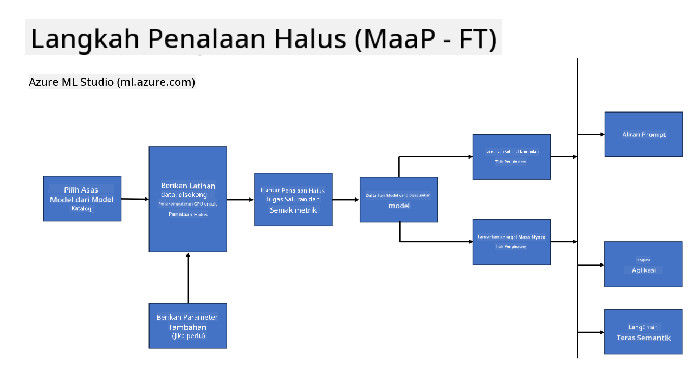
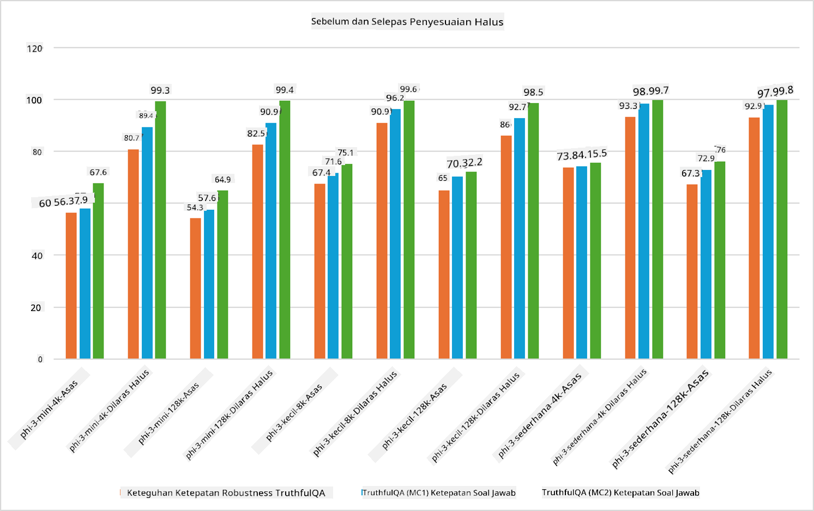

<!--
CO_OP_TRANSLATOR_METADATA:
{
  "original_hash": "cb5648935f63edc17e95ce38f23adc32",
  "translation_date": "2025-05-09T21:56:54+00:00",
  "source_file": "md/03.FineTuning/FineTuning_Scenarios.md",
  "language_code": "ms"
}
-->
## سيناريوهات التخصيص الدقيق

**المنصة** تشمل تقنيات مختلفة مثل Azure AI Foundry وAzure Machine Learning وأدوات الذكاء الاصطناعي وKaito وONNX Runtime.

**البنية التحتية** تشمل المعالج المركزي (CPU) وFPGA، وهما ضروريان لعملية التخصيص الدقيق. دعني أريك الرموز الخاصة بكل من هذه التقنيات.

**الأدوات والأُطُر** تشمل ONNX Runtime وONNX Runtime. دعني أريك الرموز الخاصة بكل من هذه التقنيات.  
[Insert icons for ONNX Runtime and ONNX Runtime]

تتضمن عملية التخصيص الدقيق باستخدام تقنيات Microsoft مكونات وأدوات مختلفة. من خلال فهم هذه التقنيات واستخدامها، يمكننا تخصيص تطبيقاتنا بشكل فعال وابتكار حلول أفضل.

## النموذج كخدمة

قم بتخصيص النموذج باستخدام التخصيص المستضاف، دون الحاجة إلى إنشاء وإدارة الحوسبة.

التخصيص بدون خادم متاح لنماذج Phi-3-mini وPhi-3-medium، مما يمكّن المطورين من تخصيص النماذج بسرعة وسهولة لسيناريوهات السحابة والحافة دون الحاجة لترتيب الحوسبة. كما أعلنا أن Phi-3-small متوفر الآن من خلال عرض Models-as-a-Service لدينا، مما يتيح للمطورين البدء بسرعة وسهولة في تطوير الذكاء الاصطناعي دون الحاجة لإدارة البنية التحتية الأساسية.

## النموذج كمنصة

يقوم المستخدمون بإدارة الحوسبة الخاصة بهم من أجل تخصيص نماذجهم.

[Fine Tuning Sample](https://github.com/Azure/azureml-examples/blob/main/sdk/python/foundation-models/system/finetune/chat-completion/chat-completion.ipynb)

## سيناريوهات التخصيص الدقيق

| | | | | | | |
|-|-|-|-|-|-|-|
|السيناريو|LoRA|QLoRA|PEFT|DeepSpeed|ZeRO|DORA|
|تكييف نماذج LLM المدربة مسبقًا لمهام أو مجالات محددة|نعم|نعم|نعم|نعم|نعم|نعم|
|التخصيص لمهام معالجة اللغة الطبيعية مثل تصنيف النص، التعرف على الكيانات المسماة، والترجمة الآلية|نعم|نعم|نعم|نعم|نعم|نعم|
|التخصيص لمهام الأسئلة والأجوبة|نعم|نعم|نعم|نعم|نعم|نعم|
|التخصيص لتوليد ردود شبيهة بالبشر في الدردشة الآلية|نعم|نعم|نعم|نعم|نعم|نعم|
|التخصيص لتوليد الموسيقى، الفن، أو أشكال أخرى من الإبداع|نعم|نعم|نعم|نعم|نعم|نعم|
|تقليل التكاليف الحسابية والمالية|نعم|نعم|لا|نعم|نعم|لا|
|تقليل استخدام الذاكرة|لا|نعم|لا|نعم|نعم|نعم|
|استخدام عدد أقل من المعاملات لتخصيص فعال|لا|نعم|نعم|لا|لا|نعم|
|شكل فعال من حيث الذاكرة لتوازي البيانات يسمح بالوصول إلى الذاكرة المجمعة لجميع أجهزة GPU المتاحة|لا|لا|لا|نعم|نعم|نعم|

## أمثلة على أداء التخصيص الدقيق

**Penafian**:  
Dokumen ini telah diterjemahkan menggunakan perkhidmatan terjemahan AI [Co-op Translator](https://github.com/Azure/co-op-translator). Walaupun kami berusaha untuk ketepatan, sila maklum bahawa terjemahan automatik mungkin mengandungi kesilapan atau ketidaktepatan. Dokumen asal dalam bahasa asalnya harus dianggap sebagai sumber yang sahih. Untuk maklumat kritikal, terjemahan profesional oleh manusia adalah disyorkan. Kami tidak bertanggungjawab terhadap sebarang salah faham atau salah tafsir yang timbul daripada penggunaan terjemahan ini.