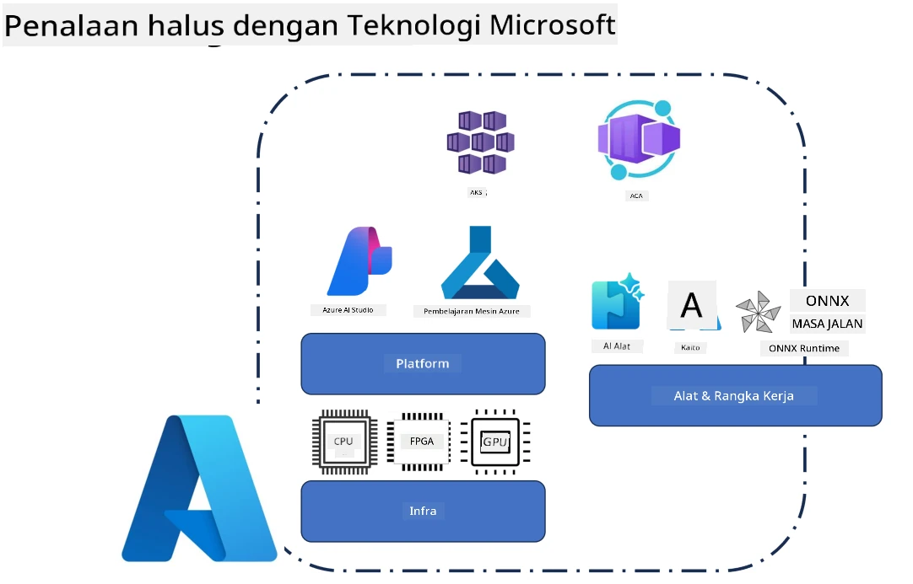
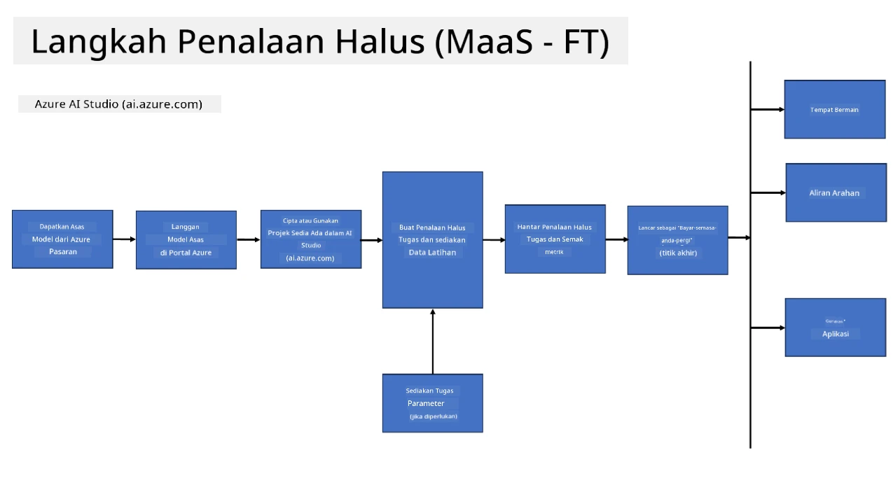
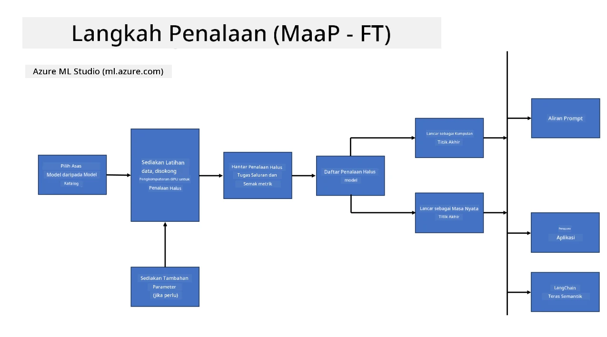
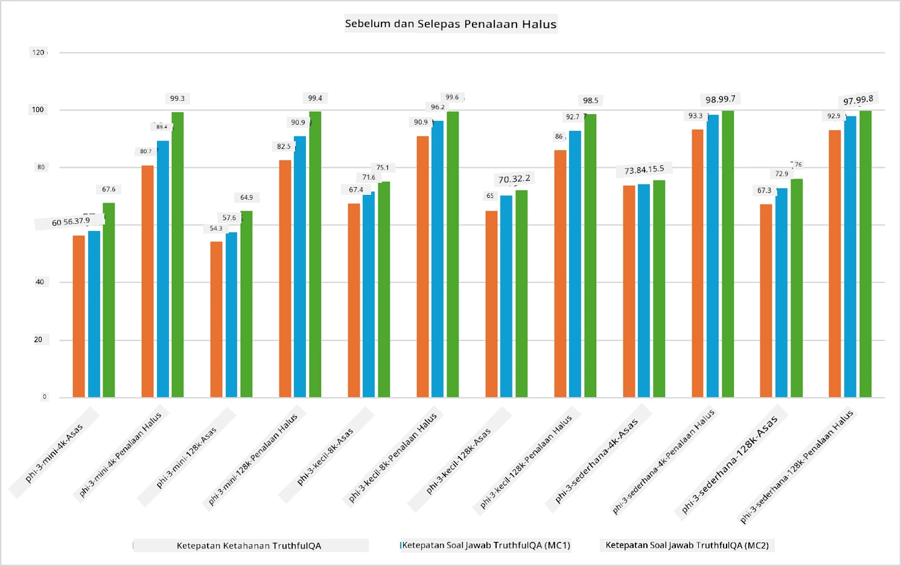

## Senario Penalaan Halus

Bahagian ini memberikan gambaran keseluruhan mengenai senario penalaan halus dalam persekitaran Microsoft Foundry dan Azure, termasuk model penyebaran, lapisan infrastruktur, dan teknik pengoptimuman yang biasa digunakan.

**Platform**  
Ini termasuk perkhidmatan terurus seperti Microsoft Foundry (sebelumnya Azure AI Foundry) dan Azure Machine Learning, yang menyediakan pengurusan model, orkestrasi, penjejakan eksperimen, dan aliran kerja penyebaran.

**Infrastruktur**  
Penalaan halus memerlukan sumber pengkomputeran yang boleh diskalakan. Dalam persekitaran Azure, ini biasanya termasuk mesin maya berasaskan GPU dan sumber CPU untuk beban kerja ringan, bersama dengan penyimpanan skala untuk set data dan titik semak.

**Alat & Rangka Kerja**  
Aliran kerja penalaan halus biasanya bergantung pada rangka kerja dan perpustakaan pengoptimuman seperti Hugging Face Transformers, DeepSpeed, dan PEFT (Parameter-Efficient Fine-Tuning).

Proses penalaan halus dengan teknologi Microsoft meliputi perkhidmatan platform, infrastruktur pengkomputeran, dan rangka kerja latihan. Dengan memahami bagaimana komponen ini bekerja bersama, pembangun dapat menyesuaikan model asas dengan cekap untuk tugas dan senario produksi tertentu.

## Model sebagai Perkhidmatan

Lakukan penalaan halus model menggunakan penalaan halus yang dihoskan, tanpa perlu membuat dan mengurus pengkomputeran.

Penalaan halus tanpa pelayan kini tersedia untuk keluarga model Phi-3, Phi-3.5, dan Phi-4, membolehkan pembangun dengan cepat dan mudah menyesuaikan model untuk senario awan dan tepi tanpa perlu mengatur pengkomputeran.

## Model sebagai Platform

Pengguna menguruskan pengkomputeran sendiri untuk melakukan penalaan halus model mereka.

[Contoh Penalaan Halus](https://github.com/Azure/azureml-examples/blob/main/sdk/python/foundation-models/system/finetune/chat-completion/chat-completion.ipynb)

## Perbandingan Teknik Penalaan Halus

|Senario|LoRA|QLoRA|PEFT|DeepSpeed|ZeRO|DoRA|
|---|---|---|---|---|---|---|
|Menyesuaikan LLM yang telah dilatih terlebih dahulu kepada tugas atau domain tertentu|Ya|Ya|Ya|Ya|Ya|Ya|
|Penalaan halus untuk tugas NLP seperti klasifikasi teks, pengecaman entiti bernama, dan penterjemahan mesin|Ya|Ya|Ya|Ya|Ya|Ya|
|Penalaan halus untuk tugas QA|Ya|Ya|Ya|Ya|Ya|Ya|
|Penalaan halus untuk menghasilkan respons seperti manusia dalam chatbot|Ya|Ya|Ya|Ya|Ya|Ya|
|Penalaan halus untuk menghasilkan muzik, seni, atau bentuk kreativiti lain|Ya|Ya|Ya|Ya|Ya|Ya|
|Mengurangkan kos pengkomputeran dan kewangan|Ya|Ya|Ya|Ya|Ya|Ya|
|Mengurangkan penggunaan memori|Ya|Ya|Ya|Ya|Ya|Ya|
|Menggunakan parameter lebih sedikit untuk penalaan halus yang cekap|Ya|Ya|Ya|Tidak|Tidak|Ya|
|Bentuk paralelisme data yang memori-cekapt yang memberi akses kepada keseluruhan memori GPU semua peranti GPU yang tersedia|Tidak|Tidak|Tidak|Ya|Ya|Tidak|

> [!NOTE]
> LoRA, QLoRA, PEFT, dan DoRA adalah kaedah penalaan halus cekap-parameter, manakala DeepSpeed dan ZeRO memfokuskan pada latihan teragih dan pengoptimuman memori.

## Contoh Prestasi Penalaan Halus

---

<!-- CO-OP TRANSLATOR DISCLAIMER START -->
**Penafian**:  
Dokumen ini telah diterjemahkan menggunakan perkhidmatan terjemahan AI [Co-op Translator](https://github.com/Azure/co-op-translator). Walaupun kami berusaha untuk ketepatan, sila ambil perhatian bahawa terjemahan automatik mungkin mengandungi kesilapan atau ketidakakuratan. Dokumen asal dalam bahasa asalnya hendaklah dianggap sebagai sumber yang sah. Untuk maklumat yang penting, terjemahan profesional oleh manusia adalah disyorkan. Kami tidak bertanggungjawab atas sebarang salah faham atau salah tafsir yang timbul daripada penggunaan terjemahan ini.
<!-- CO-OP TRANSLATOR DISCLAIMER END -->