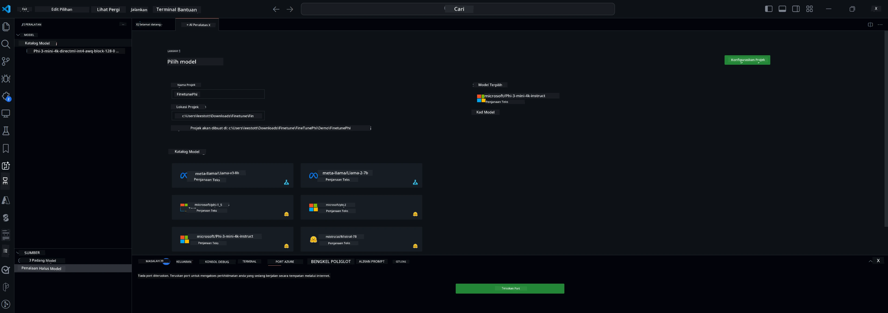

## Selamat Datang ke AI Toolkit untuk VS Code

[AI Toolkit untuk VS Code](https://github.com/microsoft/vscode-ai-toolkit/tree/main) menggabungkan pelbagai model dari Azure AI Studio Catalog dan katalog lain seperti Hugging Face. Toolkit ini memudahkan tugasan pembangunan biasa untuk membina aplikasi AI dengan alat dan model AI generatif melalui:
- Mula dengan penemuan model dan playground.
- Penalaan halus model dan inferens menggunakan sumber pengkomputeran tempatan.
- Penalaan halus dan inferens jauh menggunakan sumber Azure

[Pasang AI Toolkit untuk VSCode](https://marketplace.visualstudio.com/items?itemName=ms-windows-ai-studio.windows-ai-studio)




**[Private Preview]** Penyediaan satu klik untuk Azure Container Apps bagi menjalankan penalaan halus model dan inferens di awan.

Sekarang mari kita mulakan pembangunan aplikasi AI anda:

- [Selamat Datang ke AI Toolkit untuk VS Code](../../../../md/03.FineTuning)
- [Pembangunan Tempatan](../../../../md/03.FineTuning)
  - [Persediaan](../../../../md/03.FineTuning)
  - [Aktifkan Conda](../../../../md/03.FineTuning)
  - [Penalaan halus model asas sahaja](../../../../md/03.FineTuning)
  - [Penalaan halus model dan inferens](../../../../md/03.FineTuning)
  - [Penalaan Halus Model](../../../../md/03.FineTuning)
  - [Microsoft Olive](../../../../md/03.FineTuning)
  - [Contoh dan Sumber Penalaan Halus](../../../../md/03.FineTuning)
- [**\[Private Preview\]** Pembangunan Jauh](../../../../md/03.FineTuning)
  - [Prasyarat](../../../../md/03.FineTuning)
  - [Menyediakan Projek Pembangunan Jauh](../../../../md/03.FineTuning)
  - [Sediakan Sumber Azure](../../../../md/03.FineTuning)
  - [\[Pilihan\] Tambah Token Huggingface ke Azure Container App Secret](../../../../md/03.FineTuning)
  - [Jalankan Penalaan Halus](../../../../md/03.FineTuning)
  - [Sediakan Titik Akhir Inferens](../../../../md/03.FineTuning)
  - [Sebarkan Titik Akhir Inferens](../../../../md/03.FineTuning)
  - [Penggunaan Lanjutan](../../../../md/03.FineTuning)

## Pembangunan Tempatan
### Persediaan

1. Pastikan pemacu NVIDIA dipasang pada hos.
2. Jalankan `huggingface-cli login`, jika anda menggunakan HF untuk penggunaan dataset
3. Penjelasan tetapan kunci `Olive` untuk apa-apa yang mengubah penggunaan memori.

### Aktifkan Conda
Oleh kerana kita menggunakan persekitaran WSL yang dikongsi, anda perlu mengaktifkan persekitaran conda secara manual. Selepas langkah ini, anda boleh menjalankan penalaan halus atau inferens.

```bash
conda activate [conda-env-name] 
```

### Penalaan halus model asas sahaja
Untuk mencuba model asas tanpa penalaan halus, anda boleh jalankan arahan ini selepas mengaktifkan conda.

```bash
cd inference

# Web browser interface allows to adjust a few parameters like max new token length, temperature and so on.
# User has to manually open the link (e.g. http://0.0.0.0:7860) in a browser after gradio initiates the connections.
python gradio_chat.py --baseonly
```

### Penalaan halus model dan inferens

Setelah ruang kerja dibuka dalam dev container, buka terminal (laluan lalai adalah akar projek), kemudian jalankan arahan di bawah untuk menala halus LLM pada dataset yang dipilih.

```bash
python finetuning/invoke_olive.py 
```

Checkpoint dan model akhir akan disimpan dalam folder `models`.

Seterusnya jalankan inferens dengan model yang telah ditala halus melalui chat dalam `console`, `web browser` atau `prompt flow`.

```bash
cd inference

# Console interface.
python console_chat.py

# Web browser interface allows to adjust a few parameters like max new token length, temperature and so on.
# User has to manually open the link (e.g. http://127.0.0.1:7860) in a browser after gradio initiates the connections.
python gradio_chat.py
```

Untuk menggunakan `prompt flow` dalam VS Code, sila rujuk [Quick Start](https://microsoft.github.io/promptflow/how-to-guides/quick-start.html) ini.

### Penalaan Halus Model

Seterusnya, muat turun model berikut bergantung pada ketersediaan GPU pada peranti anda.

Untuk memulakan sesi penalaan halus tempatan menggunakan QLoRA, pilih model yang anda ingin tala halus dari katalog kami.
| Platform | GPU tersedia | Nama model | Saiz (GB) |
|---------|--------------|------------|-----------|
| Windows | Ya           | Phi-3-mini-4k-**directml**-int4-awq-block-128-onnx | 2.13GB |
| Linux   | Ya           | Phi-3-mini-4k-**cuda**-int4-onnx | 2.30GB |
| Windows<br>Linux | Tidak | Phi-3-mini-4k-**cpu**-int4-rtn-block-32-acc-level-4-onnx | 2.72GB |

**_Nota_** Anda tidak memerlukan Akaun Azure untuk memuat turun model

Model Phi3-mini (int4) bersaiz kira-kira 2GB-3GB. Bergantung pada kelajuan rangkaian anda, ia mungkin mengambil masa beberapa minit untuk dimuat turun.

Mulakan dengan memilih nama projek dan lokasi.
Seterusnya, pilih model dari katalog model. Anda akan diminta untuk memuat turun templat projek. Kemudian anda boleh klik "Configure Project" untuk melaraskan pelbagai tetapan.

### Microsoft Olive

Kami menggunakan [Olive](https://microsoft.github.io/Olive/why-olive.html) untuk menjalankan penalaan halus QLoRA pada model PyTorch dari katalog kami. Semua tetapan telah ditetapkan dengan nilai lalai untuk mengoptimumkan proses penalaan halus secara tempatan dengan penggunaan memori yang dioptimumkan, tetapi ia boleh disesuaikan mengikut senario anda.

### Contoh dan Sumber Penalaan Halus

- [Panduan Memulakan Penalaan Halus](https://learn.microsoft.com/windows/ai/toolkit/toolkit-fine-tune)
- [Penalaan Halus dengan Dataset HuggingFace](https://github.com/microsoft/vscode-ai-toolkit/blob/main/archive/walkthrough-hf-dataset.md)
- [Penalaan Halus dengan Dataset Mudah](https://github.com/microsoft/vscode-ai-toolkit/blob/main/archive/walkthrough-simple-dataset.md)

## **[Private Preview]** Pembangunan Jauh

### Prasyarat

1. Untuk menjalankan penalaan halus model dalam Persekitaran Azure Container App jauh anda, pastikan langganan anda mempunyai kapasiti GPU yang mencukupi. Hantar [tiket sokongan](https://azure.microsoft.com/support/create-ticket/) untuk memohon kapasiti yang diperlukan bagi aplikasi anda. [Dapatkan Maklumat Lanjut tentang kapasiti GPU](https://learn.microsoft.com/azure/container-apps/workload-profiles-overview)
2. Jika anda menggunakan dataset peribadi di HuggingFace, pastikan anda mempunyai [akaun HuggingFace](https://huggingface.co/?WT.mc_id=aiml-137032-kinfeylo) dan [hasilkan token akses](https://huggingface.co/docs/hub/security-tokens?WT.mc_id=aiml-137032-kinfeylo)
3. Aktifkan ciri Remote Fine-tuning and Inference dalam AI Toolkit untuk VS Code
   1. Buka Tetapan VS Code dengan memilih *File -> Preferences -> Settings*.
   2. Navigasi ke *Extensions* dan pilih *AI Toolkit*.
   3. Pilih pilihan *"Enable Remote Fine-tuning And Inference"*.
   4. Muat semula VS Code untuk berkuat kuasa.

- [Penalaan Halus Jauh](https://github.com/microsoft/vscode-ai-toolkit/blob/main/archive/remote-finetuning.md)

### Menyediakan Projek Pembangunan Jauh
1. Jalankan palet arahan `AI Toolkit: Focus on Resource View`.
2. Navigasi ke *Model Fine-tuning* untuk mengakses katalog model. Tetapkan nama projek anda dan pilih lokasinya pada mesin anda. Kemudian, tekan butang *"Configure Project"*.
3. Konfigurasi Projek
    1. Elakkan mengaktifkan pilihan *"Fine-tune locally"*.
    2. Tetapan konfigurasi Olive akan muncul dengan nilai lalai yang telah ditetapkan. Sila laraskan dan isi konfigurasi ini mengikut keperluan.
    3. Teruskan ke *Generate Project*. Tahap ini menggunakan WSL dan melibatkan penyediaan persekitaran Conda baru, bersedia untuk kemas kini masa depan yang termasuk Dev Containers.
4. Klik pada *"Relaunch Window In Workspace"* untuk membuka projek pembangunan jauh anda.

> **Nota:** Projek ini kini berfungsi sama ada secara tempatan atau jauh dalam AI Toolkit untuk VS Code. Jika anda memilih *"Fine-tune locally"* semasa penciptaan projek, ia hanya akan beroperasi dalam WSL tanpa keupayaan pembangunan jauh. Sebaliknya, jika anda tidak mengaktifkan *"Fine-tune locally"*, projek akan terhad kepada persekitaran Azure Container App jauh.

### Sediakan Sumber Azure
Untuk memulakan, anda perlu menyediakan Sumber Azure untuk penalaan halus jauh. Lakukan ini dengan menjalankan `AI Toolkit: Provision Azure Container Apps job for fine-tuning` dari palet arahan.

Pantau kemajuan penyediaan melalui pautan yang dipaparkan dalam saluran output.

### [Pilihan] Tambah Token Huggingface ke Azure Container App Secret
Jika anda menggunakan dataset HuggingFace peribadi, tetapkan token HuggingFace anda sebagai pembolehubah persekitaran untuk mengelakkan keperluan log masuk manual di Hugging Face Hub.
Anda boleh melakukan ini menggunakan arahan `AI Toolkit: Add Azure Container Apps Job secret for fine-tuning`. Dengan arahan ini, anda boleh menetapkan nama rahsia sebagai [`HF_TOKEN`](https://huggingface.co/docs/huggingface_hub/package_reference/environment_variables#hftoken) dan menggunakan token Hugging Face anda sebagai nilai rahsia.

### Jalankan Penalaan Halus
Untuk memulakan tugasan penalaan halus jauh, jalankan arahan `AI Toolkit: Run fine-tuning`.

Untuk melihat log sistem dan konsol, anda boleh melawat portal Azure menggunakan pautan dalam panel output (langkah lanjut di [Lihat dan Kuiri Log di Azure](https://aka.ms/ai-toolkit/remote-provision#view-and-query-logs-on-azure)). Atau, anda boleh melihat log konsol terus dalam panel output VSCode dengan menjalankan arahan `AI Toolkit: Show the running fine-tuning job streaming logs`.
> **Nota:** Tugasan mungkin beratur kerana kekurangan sumber. Jika log tidak dipaparkan, jalankan arahan `AI Toolkit: Show the running fine-tuning job streaming logs`, tunggu sebentar dan jalankan semula arahan untuk menyambung semula ke log streaming.

Semasa proses ini, QLoRA akan digunakan untuk penalaan halus, dan akan mencipta penyesuai LoRA untuk model digunakan semasa inferens.
Keputusan penalaan halus akan disimpan dalam Azure Files.

### Sediakan Titik Akhir Inferens
Selepas penyesuai dilatih dalam persekitaran jauh, gunakan aplikasi Gradio mudah untuk berinteraksi dengan model.
Sama seperti proses penalaan halus, anda perlu menyediakan Sumber Azure untuk inferens jauh dengan menjalankan `AI Toolkit: Provision Azure Container Apps for inference` dari palet arahan.

Secara lalai, langganan dan kumpulan sumber untuk inferens harus sama dengan yang digunakan untuk penalaan halus. Inferens akan menggunakan Persekitaran Azure Container App yang sama dan mengakses model serta penyesuai model yang disimpan dalam Azure Files, yang dihasilkan semasa langkah penalaan halus.

### Sebarkan Titik Akhir Inferens
Jika anda ingin mengubah kod inferens atau memuat semula model inferens, sila jalankan arahan `AI Toolkit: Deploy for inference`. Ini akan menyelaraskan kod terkini anda dengan Azure Container App dan memulakan semula replika.

Setelah penyebaran berjaya, anda boleh mengakses API inferens dengan mengklik butang "*Go to Inference Endpoint*" yang dipaparkan dalam notifikasi VSCode. Atau, titik akhir API web boleh didapati di bawah `ACA_APP_ENDPOINT` dalam `./infra/inference.config.json` dan dalam panel output. Anda kini bersedia untuk menilai model menggunakan titik akhir ini.

### Penggunaan Lanjutan
Untuk maklumat lanjut mengenai pembangunan jauh dengan AI Toolkit, rujuk dokumentasi [Penalaan Halus model secara jauh](https://aka.ms/ai-toolkit/remote-provision) dan [Inferens dengan model yang telah ditala halus](https://aka.ms/ai-toolkit/remote-inference).

**Penafian**:  
Dokumen ini telah diterjemahkan menggunakan perkhidmatan terjemahan AI [Co-op Translator](https://github.com/Azure/co-op-translator). Walaupun kami berusaha untuk ketepatan, sila ambil maklum bahawa terjemahan automatik mungkin mengandungi kesilapan atau ketidaktepatan. Dokumen asal dalam bahasa asalnya harus dianggap sebagai sumber yang sahih. Untuk maklumat penting, terjemahan profesional oleh manusia adalah disyorkan. Kami tidak bertanggungjawab atas sebarang salah faham atau salah tafsir yang timbul daripada penggunaan terjemahan ini.