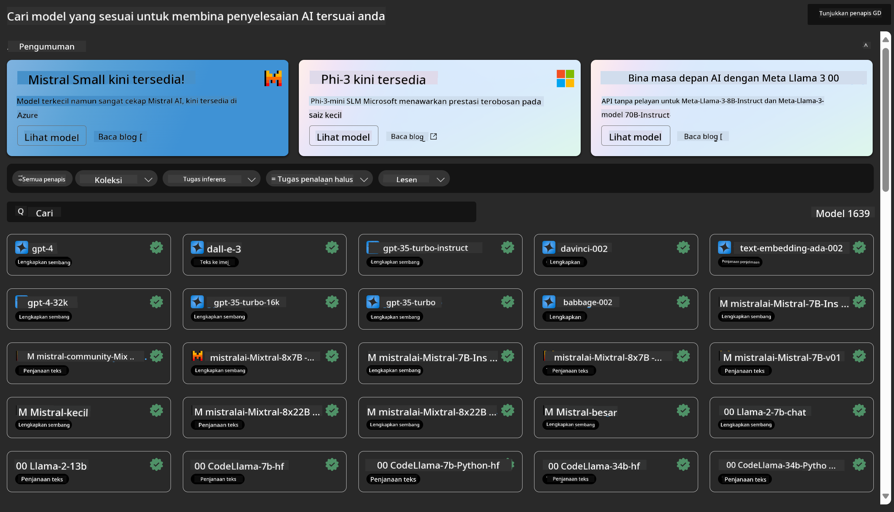
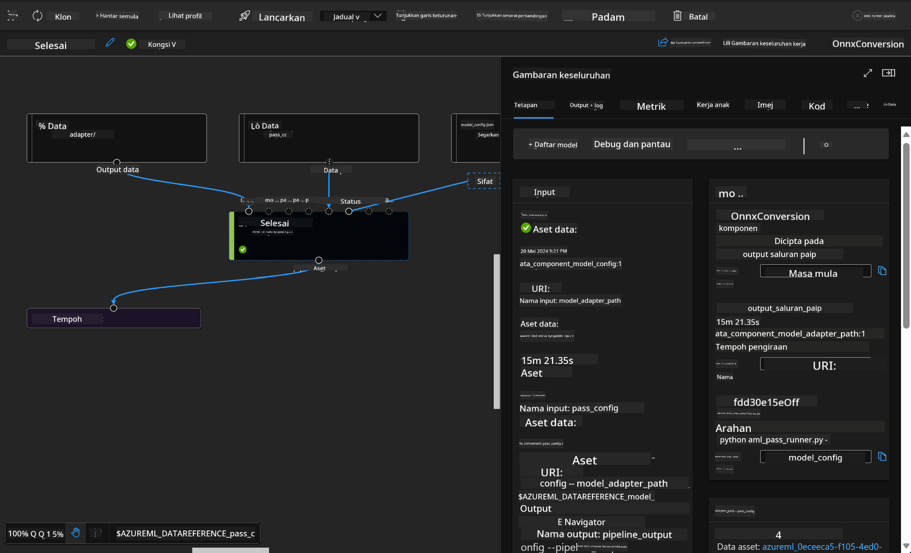

<!--
CO_OP_TRANSLATOR_METADATA:
{
  "original_hash": "7fe541373802e33568e94e13226d463c",
  "translation_date": "2025-07-17T09:45:46+00:00",
  "source_file": "md/03.FineTuning/Introduce_AzureML.md",
  "language_code": "ms"
}
-->
# **Memperkenalkan Perkhidmatan Pembelajaran Mesin Azure**

[Azure Machine Learning](https://ml.azure.com?WT.mc_id=aiml-138114-kinfeylo) adalah perkhidmatan awan untuk mempercepat dan mengurus kitar hayat projek pembelajaran mesin (ML).

Profesional ML, saintis data, dan jurutera boleh menggunakannya dalam aliran kerja harian mereka untuk:

- Melatih dan menyebarkan model.
- Mengurus operasi pembelajaran mesin (MLOps).
- Anda boleh mencipta model dalam Azure Machine Learning atau menggunakan model yang dibina dari platform sumber terbuka, seperti PyTorch, TensorFlow, atau scikit-learn.
- Alat MLOps membantu anda memantau, melatih semula, dan menyebarkan semula model.

## Siapa yang sesuai menggunakan Azure Machine Learning?

**Saintis Data dan Jurutera ML**

Mereka boleh menggunakan alat untuk mempercepat dan mengautomasikan aliran kerja harian mereka.  
Azure ML menyediakan ciri untuk keadilan, penjelasan, penjejakan, dan audit.

**Pembangun Aplikasi:**  
Mereka boleh mengintegrasikan model ke dalam aplikasi atau perkhidmatan dengan lancar.

**Pembangun Platform**

Mereka mempunyai akses kepada set alat yang kukuh disokong oleh API Azure Resource Manager yang tahan lama.  
Alat ini membolehkan pembinaan alat ML yang canggih.

**Perusahaan**

Bekerja dalam awan Microsoft Azure, perusahaan mendapat manfaat daripada keselamatan yang dikenali dan kawalan akses berasaskan peranan.  
Sediakan projek untuk mengawal akses kepada data yang dilindungi dan operasi tertentu.

## Produktiviti untuk Semua Ahli Pasukan  
Projek ML sering memerlukan pasukan dengan pelbagai kemahiran untuk membina dan menyelenggara.

Azure ML menyediakan alat yang membolehkan anda:  
- Bekerjasama dengan pasukan anda melalui buku nota berkongsi, sumber pengkomputeran, pengkomputeran tanpa pelayan, data, dan persekitaran.  
- Membangunkan model dengan keadilan, penjelasan, penjejakan, dan audit untuk memenuhi keperluan keturunan dan pematuhan audit.  
- Menyebarkan model ML dengan cepat dan mudah pada skala besar, serta mengurus dan mengawalnya dengan cekap menggunakan MLOps.  
- Menjalankan beban kerja pembelajaran mesin di mana-mana dengan tadbir urus, keselamatan, dan pematuhan terbina dalam.

## Alat Platform Serasi Silang

Sesiapa sahaja dalam pasukan ML boleh menggunakan alat pilihan mereka untuk menyelesaikan tugasan.  
Sama ada anda menjalankan eksperimen pantas, penyetelan hiperparameter, membina saluran paip, atau mengurus inferens, anda boleh menggunakan antara muka yang biasa termasuk:  
- Azure Machine Learning Studio  
- Python SDK (v2)  
- Azure CLI (v2)  
- Azure Resource Manager REST APIs

Semasa anda memperhalusi model dan bekerjasama sepanjang kitaran pembangunan, anda boleh berkongsi dan mencari aset, sumber, dan metrik dalam antara muka Azure Machine Learning studio.

## **LLM/SLM dalam Azure ML**

Azure ML telah menambah banyak fungsi berkaitan LLM/SLM, menggabungkan LLMOps dan SLMOps untuk mewujudkan platform teknologi kecerdasan buatan generatif di seluruh perusahaan.

### **Katalog Model**

Pengguna perusahaan boleh menyebarkan model yang berbeza mengikut senario perniagaan yang berbeza melalui Katalog Model, dan menyediakan perkhidmatan sebagai Model sebagai Perkhidmatan untuk pembangun atau pengguna perusahaan mengakses.

Katalog Model dalam Azure Machine Learning studio adalah pusat untuk menemui dan menggunakan pelbagai model yang membolehkan anda membina aplikasi AI Generatif. Katalog model menampilkan ratusan model dari penyedia model seperti perkhidmatan Azure OpenAI, Mistral, Meta, Cohere, Nvidia, Hugging Face, termasuk model yang dilatih oleh Microsoft. Model dari penyedia selain Microsoft adalah Produk Bukan Microsoft, seperti yang ditakrifkan dalam Terma Produk Microsoft, dan tertakluk kepada terma yang disediakan bersama model tersebut.

### **Saluran Paip Tugasan**

Teras saluran paip pembelajaran mesin adalah untuk memecahkan tugasan pembelajaran mesin lengkap kepada aliran kerja berbilang langkah. Setiap langkah adalah komponen yang boleh diurus yang boleh dibangunkan, dioptimumkan, dikonfigurasikan, dan diautomasi secara berasingan. Langkah-langkah disambungkan melalui antara muka yang ditakrifkan dengan jelas. Perkhidmatan saluran paip Azure Machine Learning secara automatik mengatur semua kebergantungan antara langkah saluran paip.

Dalam penyetelan halus SLM / LLM, kita boleh mengurus data, latihan, dan proses penjanaan melalui Saluran Paip.

### **Aliran Prompt**

Kelebihan menggunakan aliran prompt Azure Machine Learning  
Aliran prompt Azure Machine Learning menawarkan pelbagai manfaat yang membantu pengguna beralih dari idea kepada eksperimen dan akhirnya, aplikasi LLM yang sedia untuk pengeluaran:

**Kelincahan kejuruteraan prompt**

Pengalaman penulisan interaktif: Aliran prompt Azure Machine Learning menyediakan representasi visual struktur aliran, membolehkan pengguna memahami dan menavigasi projek mereka dengan mudah. Ia juga menawarkan pengalaman pengkodan seperti buku nota untuk pembangunan dan penyahpepijatan aliran yang cekap.  
Variasi untuk penyetelan prompt: Pengguna boleh mencipta dan membandingkan pelbagai variasi prompt, memudahkan proses penambahbaikan berulang.

Penilaian: Aliran penilaian terbina dalam membolehkan pengguna menilai kualiti dan keberkesanan prompt dan aliran mereka.

Sumber komprehensif: Aliran prompt Azure Machine Learning termasuk perpustakaan alat terbina dalam, contoh, dan templat yang berfungsi sebagai titik permulaan pembangunan, memberi inspirasi kreativiti dan mempercepat proses.

**Kesediaan perusahaan untuk aplikasi berasaskan LLM**

Kerjasama: Aliran prompt Azure Machine Learning menyokong kerjasama pasukan, membolehkan pelbagai pengguna bekerja bersama dalam projek kejuruteraan prompt, berkongsi pengetahuan, dan mengekalkan kawalan versi.

Platform sehenti: Aliran prompt Azure Machine Learning memudahkan keseluruhan proses kejuruteraan prompt, dari pembangunan dan penilaian hingga penyebaran dan pemantauan. Pengguna boleh menyebarkan aliran mereka sebagai titik akhir Azure Machine Learning dan memantau prestasi secara masa nyata, memastikan operasi optimum dan penambahbaikan berterusan.

Penyelesaian Kesediaan Perusahaan Azure Machine Learning: Aliran prompt memanfaatkan penyelesaian kesediaan perusahaan Azure Machine Learning yang kukuh, menyediakan asas yang selamat, boleh skala, dan boleh dipercayai untuk pembangunan, eksperimen, dan penyebaran aliran.

Dengan aliran prompt Azure Machine Learning, pengguna boleh melepaskan kelincahan kejuruteraan prompt mereka, bekerjasama dengan berkesan, dan memanfaatkan penyelesaian bertaraf perusahaan untuk pembangunan dan penyebaran aplikasi berasaskan LLM yang berjaya.

Menggabungkan kuasa pengkomputeran, data, dan komponen berbeza Azure ML, pembangun perusahaan boleh dengan mudah membina aplikasi kecerdasan buatan mereka sendiri.

**Penafian**:  
Dokumen ini telah diterjemahkan menggunakan perkhidmatan terjemahan AI [Co-op Translator](https://github.com/Azure/co-op-translator). Walaupun kami berusaha untuk ketepatan, sila ambil maklum bahawa terjemahan automatik mungkin mengandungi kesilapan atau ketidaktepatan. Dokumen asal dalam bahasa asalnya harus dianggap sebagai sumber yang sahih. Untuk maklumat penting, terjemahan profesional oleh manusia adalah disyorkan. Kami tidak bertanggungjawab atas sebarang salah faham atau salah tafsir yang timbul daripada penggunaan terjemahan ini.