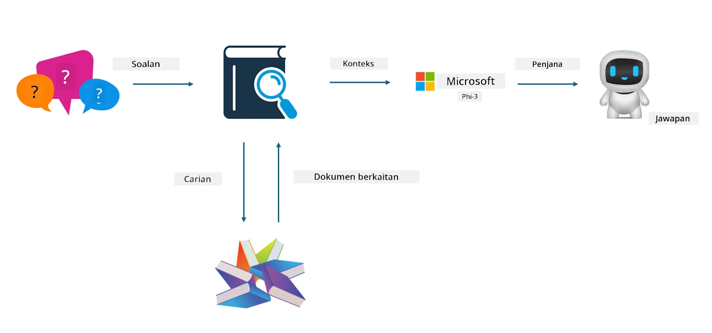
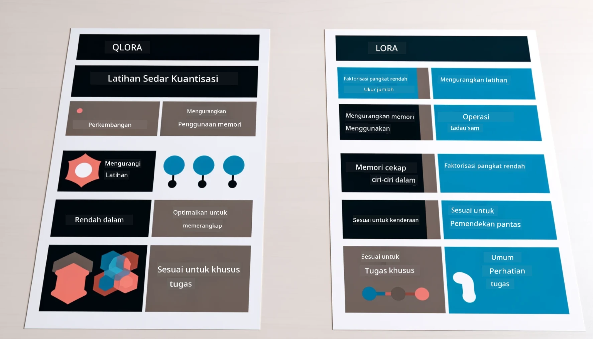

<!--
CO_OP_TRANSLATOR_METADATA:
{
  "original_hash": "743d7e9cb9c4e8ea642d77bee657a7fa",
  "translation_date": "2025-07-17T09:59:19+00:00",
  "source_file": "md/03.FineTuning/LetPhi3gotoIndustriy.md",
  "language_code": "ms"
}
-->
# **Biarkan Phi-3 menjadi pakar industri**

Untuk memasukkan model Phi-3 ke dalam industri, anda perlu menambah data perniagaan industri ke dalam model Phi-3. Kami mempunyai dua pilihan berbeza, yang pertama ialah RAG (Retrieval Augmented Generation) dan yang kedua ialah Fine Tuning.

## **RAG vs Fine-Tuning**

### **Retrieval Augmented Generation**

RAG adalah gabungan pengambilan data + penjanaan teks. Data berstruktur dan tidak berstruktur dalam perusahaan disimpan dalam pangkalan data vektor. Apabila mencari kandungan yang relevan, ringkasan dan kandungan yang berkaitan ditemui untuk membentuk konteks, dan keupayaan pelengkap teks LLM/SLM digabungkan untuk menjana kandungan.

### **Fine-tuning**

Fine-tuning adalah berdasarkan penambahbaikan model tertentu. Ia tidak perlu bermula dengan algoritma model, tetapi data perlu dikumpul secara berterusan. Jika anda mahukan istilah dan ungkapan bahasa yang lebih tepat dalam aplikasi industri, fine-tuning adalah pilihan yang lebih baik. Tetapi jika data anda sering berubah, fine-tuning boleh menjadi rumit.

### **Cara memilih**

1. Jika jawapan kita memerlukan pengenalan data luaran, RAG adalah pilihan terbaik

2. Jika anda perlu menghasilkan pengetahuan industri yang stabil dan tepat, fine-tuning akan menjadi pilihan yang baik. RAG mengutamakan menarik kandungan yang relevan tetapi mungkin tidak selalu tepat dalam nuansa khusus.

3. Fine-tuning memerlukan set data berkualiti tinggi, dan jika hanya data dalam skop kecil, ia tidak akan memberi banyak perbezaan. RAG lebih fleksibel

4. Fine-tuning adalah kotak hitam, suatu metafizik, dan sukar untuk memahami mekanisme dalaman. Tetapi RAG boleh memudahkan pencarian sumber data, dengan itu berkesan menyesuaikan halusinasi atau kesilapan kandungan dan memberikan ketelusan yang lebih baik.

### **Senario**

1. Industri menegak memerlukan kosa kata dan ungkapan profesional khusus, ***Fine-tuning*** adalah pilihan terbaik

2. Sistem QA, yang melibatkan sintesis pelbagai titik pengetahuan, ***RAG*** adalah pilihan terbaik

3. Gabungan aliran perniagaan automatik ***RAG + Fine-tuning*** adalah pilihan terbaik

## **Cara menggunakan RAG**

Pangkalan data vektor adalah koleksi data yang disimpan dalam bentuk matematik. Pangkalan data vektor memudahkan model pembelajaran mesin mengingati input sebelumnya, membolehkan pembelajaran mesin digunakan untuk menyokong kes penggunaan seperti carian, cadangan, dan penjanaan teks. Data boleh dikenal pasti berdasarkan metrik kesamaan dan bukan padanan tepat, membolehkan model komputer memahami konteks data.

Pangkalan data vektor adalah kunci untuk merealisasikan RAG. Kita boleh menukar data ke dalam penyimpanan vektor melalui model vektor seperti text-embedding-3, jina-ai-embedding, dan lain-lain.

Ketahui lebih lanjut tentang cara membuat aplikasi RAG di [https://github.com/microsoft/Phi-3CookBook](https://github.com/microsoft/Phi-3CookBook?WT.mc_id=aiml-138114-kinfeylo) 

## **Cara menggunakan Fine-tuning**

Algoritma yang biasa digunakan dalam Fine-tuning adalah Lora dan QLora. Bagaimana untuk memilih?
- [Ketahui Lebih Lanjut dengan notebook contoh ini](../../../../code/04.Finetuning/Phi_3_Inference_Finetuning.ipynb)
- [Contoh Skrip Python FineTuning](../../../../code/04.Finetuning/FineTrainingScript.py)

### **Lora dan QLora**

LoRA (Low-Rank Adaptation) dan QLoRA (Quantized Low-Rank Adaptation) adalah teknik yang digunakan untuk fine-tune model bahasa besar (LLM) menggunakan Parameter Efficient Fine Tuning (PEFT). Teknik PEFT direka untuk melatih model dengan lebih cekap berbanding kaedah tradisional.  
LoRA adalah teknik fine-tuning berdiri sendiri yang mengurangkan penggunaan memori dengan menggunakan anggaran pangkat rendah pada matriks kemas kini berat. Ia menawarkan masa latihan yang pantas dan mengekalkan prestasi hampir sama dengan kaedah fine-tuning tradisional.

QLoRA adalah versi lanjutan LoRA yang menggabungkan teknik kuantisasi untuk mengurangkan penggunaan memori dengan lebih lanjut. QLoRA mengkuantisasi ketepatan parameter berat dalam LLM yang telah dilatih kepada ketepatan 4-bit, yang lebih cekap memori berbanding LoRA. Walau bagaimanapun, latihan QLoRA adalah kira-kira 30% lebih perlahan daripada latihan LoRA disebabkan langkah tambahan kuantisasi dan dekuantisasi.

QLoRA menggunakan LoRA sebagai aksesori untuk membetulkan kesilapan yang diperkenalkan semasa kuantisasi. QLoRA membolehkan fine-tuning model besar dengan bilangan parameter berbilion pada GPU yang agak kecil dan mudah didapati. Contohnya, QLoRA boleh fine-tune model 70B parameter yang memerlukan 36 GPU dengan hanya 2

**Penafian**:  
Dokumen ini telah diterjemahkan menggunakan perkhidmatan terjemahan AI [Co-op Translator](https://github.com/Azure/co-op-translator). Walaupun kami berusaha untuk ketepatan, sila ambil maklum bahawa terjemahan automatik mungkin mengandungi kesilapan atau ketidaktepatan. Dokumen asal dalam bahasa asalnya harus dianggap sebagai sumber yang sahih. Untuk maklumat penting, terjemahan profesional oleh manusia adalah disyorkan. Kami tidak bertanggungjawab atas sebarang salah faham atau salah tafsir yang timbul daripada penggunaan terjemahan ini.