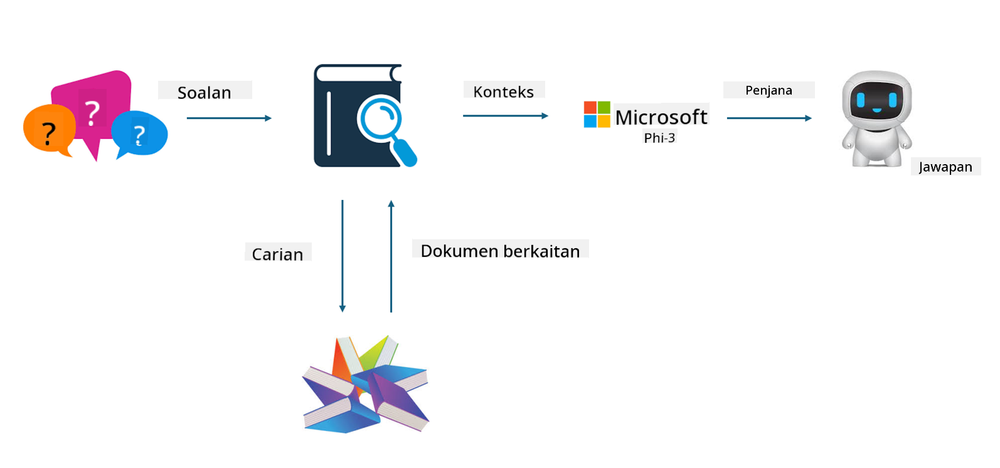

<!--
CO_OP_TRANSLATOR_METADATA:
{
  "original_hash": "743d7e9cb9c4e8ea642d77bee657a7fa",
  "translation_date": "2025-05-09T22:28:38+00:00",
  "source_file": "md/03.FineTuning/LetPhi3gotoIndustriy.md",
  "language_code": "ms"
}
-->
# **让 Phi-3 成为行业专家**

要将 Phi-3 模型应用到某个行业，需要向 Phi-3 模型中添加行业业务数据。我们有两种不同的方案，第一种是 RAG（检索增强生成），第二种是微调（Fine Tuning）。

## **RAG 与微调的对比**

### **检索增强生成**

RAG 是数据检索 + 文本生成。企业的结构化数据和非结构化数据存储在向量数据库中。搜索相关内容时，会找到相关的摘要和内容形成上下文，并结合 LLM/SLM 的文本补全能力生成内容。

### **微调**

微调是在已有模型基础上的改进。它不需要从模型算法开始，但需要不断积累数据。如果你希望行业应用中的术语和语言表达更精准，微调是更好的选择。但如果数据频繁变化，微调会变得复杂。

### **如何选择**

1. 如果答案需要引入外部数据，RAG 是最佳选择

2. 如果需要输出稳定且精准的行业知识，微调会是不错的选择。RAG 优先拉取相关内容，但可能无法完全捕捉专业细节。

3. 微调需要高质量的数据集，如果数据范围较小，效果不会明显。RAG 更灵活。

4. 微调是一个黑盒，机制难以理解。但 RAG 可以更容易追溯数据来源，有效调整幻觉或内容错误，提供更好的透明度。

### **适用场景**

1. 垂直行业需要特定专业词汇和表达，***微调*** 是最佳选择

2. QA 系统，涉及不同知识点综合，***RAG*** 是最佳选择

3. 自动化业务流程结合，***RAG + 微调*** 是最佳选择

## **如何使用 RAG**

向量数据库是以数学形式存储数据的集合。向量数据库让机器学习模型更容易记住之前的输入，从而支持搜索、推荐和文本生成等应用。数据可以基于相似度指标识别，而非完全匹配，使计算机模型能理解数据的上下文。

向量数据库是实现 RAG 的关键。我们可以通过 text-embedding-3、jina-ai-embedding 等向量模型将数据转换为向量存储。

了解更多关于创建 RAG 应用的信息请访问 [https://github.com/microsoft/Phi-3CookBook](https://github.com/microsoft/Phi-3CookBook?WT.mc_id=aiml-138114-kinfeylo)

## **如何使用微调**

微调中常用的算法有 Lora 和 QLora。如何选择？
- [通过此示例笔记本了解更多](../../../../code/04.Finetuning/Phi_3_Inference_Finetuning.ipynb)
- [Python 微调示例](../../../../code/04.Finetuning/FineTrainingScript.py)

### **Lora 和 QLora**

LoRA（低秩适配）和 QLoRA（量化低秩适配）都是用于微调大型语言模型（LLM）的参数高效微调（PEFT）技术。PEFT 技术旨在比传统方法更高效地训练模型。

LoRA 是一种独立的微调技术，通过对权重更新矩阵进行低秩近似，减少内存占用。它训练速度快，性能接近传统微调方法。

QLoRA 是 LoRA 的扩展版本，结合了量化技术进一步降低内存使用。QLoRA 将预训练 LLM 中权重参数的精度量化到 4 位，比 LoRA 更节省内存。但由于额外的量化和反量化步骤，QLoRA 训练速度比 LoRA 慢约 30%。

QLoRA 使用 LoRA 来修正量化过程中引入的误差。QLoRA 使得在相对小型且易获取的 GPU 上微调数十亿参数的大模型成为可能。例如，QLoRA 可以在只需 2 张 GPU 的条件下微调一个需要 36 张 GPU 的 70B 参数模型。

**Penafian**:  
Dokumen ini telah diterjemahkan menggunakan perkhidmatan terjemahan AI [Co-op Translator](https://github.com/Azure/co-op-translator). Walaupun kami berusaha untuk ketepatan, sila ambil perhatian bahawa terjemahan automatik mungkin mengandungi kesilapan atau ketidaktepatan. Dokumen asal dalam bahasa asalnya harus dianggap sebagai sumber yang sahih. Untuk maklumat penting, terjemahan profesional oleh manusia adalah disyorkan. Kami tidak bertanggungjawab atas sebarang salah faham atau salah tafsir yang timbul daripada penggunaan terjemahan ini.